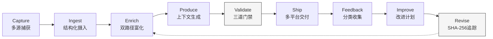
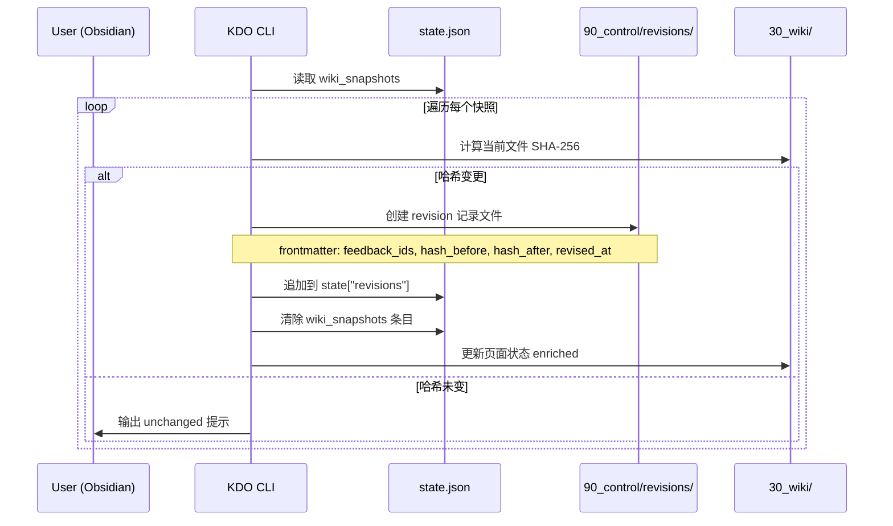
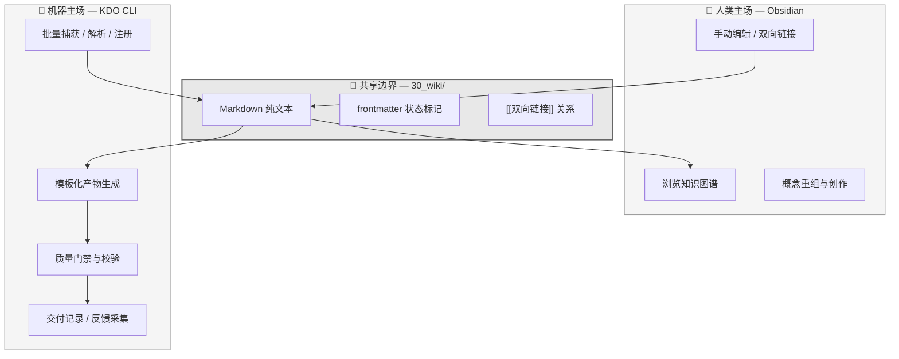
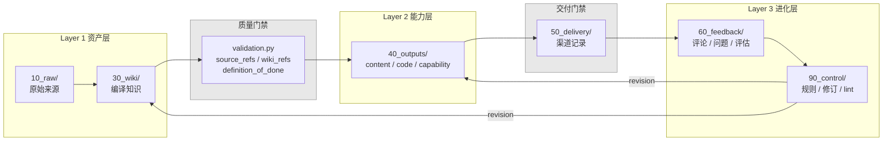
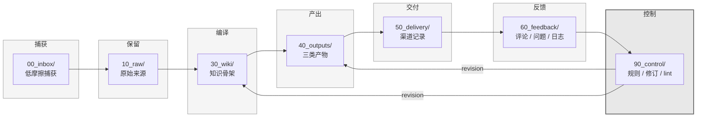
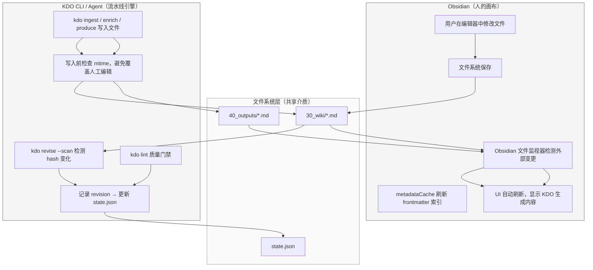
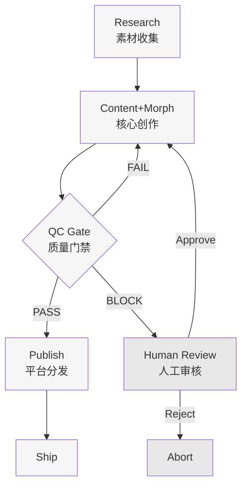
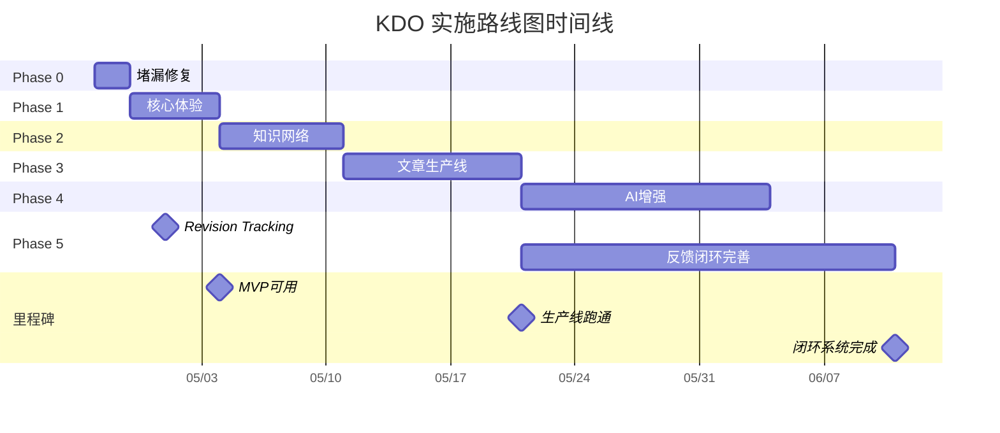

# Obsidian + KDO 内容产出工作流 — 产品设计大纲

> 版本：v1.0
> 日期：2026-05-01
> 文档类型：产品设计大纲

---

# 执行摘要

## 产品愿景

KDO（Knowledge Delivery Orchestrator）是一款面向内容创作者和知识工作者的"画布+流水线"双模态内容生产操作系统。它以 Obsidian 为自由创作前台，以 KDO 为结构化产出管理后台，两者共享同一本地优先的知识库，形成人机协作的"外挂大脑"。这一设计的核心假设是：创作需要无序的自由（画布），而产出需要有序的纪律（流水线），现有工具要么偏重前者导致产出效率低下，要么偏重后者压制创作灵性，KDO 首次将两者无缝衔接于同一知识基座之上。

## 核心差异化

KDO 的差异化能力建立在三个相互支撑的支柱之上：**流程纪律（Pipeline Discipline）**、**反馈闭环（Feedback Loop）** 与 **人机共享 Wiki（Human-AI Shared Knowledge）**。流程纪律通过八阶段工作流（Capture→Ingest→Enrich→Produce→Validate→Ship→Feedback→Improve）和三道质量门禁（完整性检查、内容校验、发布前审查）确保每一个素材都能被追踪至最终交付物；反馈闭环通过 Feedback 与 Revision 实体将发布后的读者反馈自动回流至知识库，驱动下一轮迭代，填补了当前知识管理工具在"从素材到可交付成品再到迭代优化"完整闭环上的系统性空白；人机共享 Wiki 则通过统一的 JSON+YAML 双轨状态管理和标准化的 briefing 上下文传递协议，使人类创作者与 AI Agent 在同一知识库上协作而不产生语义断层。

## 目标用户与场景

产品瞄准三类核心用户：Obsidian 深度用户（已积累大量笔记但缺乏产出管道）、AI 辅助创作者（使用 LLM 生成内容但难以管理版本与质量）、以及小型内容团队（需要协作流程但拒绝 SaaS 锁定）。对应的三大核心场景分别是文章生产线（从灵感到发布的全自动化管道）、视频内容生产（脚本分镜与素材管理的结构化流程）、以及知识库演化（将个人笔记体系升级为可对外输出的知识产品）。

## 架构与实现路径

系统采用双模态架构：Obsidian 作为前台画布负责非结构化创作与可视化浏览，KDO 作为后台流水线负责状态管理、质量门禁与自动化编排，两者通过目录级共享与双向同步机制实现零摩擦协作。后台由四层模块构成——核心引擎层管理实体生命周期，智能层驱动 Content/Morph、QC 与 Publish 三 Agent 协作，流程层编排八阶段状态转换，数据层以本地文件系统为唯一事实来源。执行层提供 15 余条 CLI 命令覆盖从 capture 到 revise 的完整工具链，并与 AI 服务通过四级集成协议（Ingest/Enrich/Produce/Lint）对接，单机月运行成本控制在约 0.6 美元。技术实现上，项目遵循八周渐进路线图：首周堵漏建立可运行基础，随后两周构建核心体验与知识网络，第三至四周交付文章生产线，第五至六周引入 AI 增强，第七周起打通反馈闭环，第八周后进入持续优化与生态扩展阶段。主要风险包括版本同步冲突、LLM 输出不确定性、文件竞态条件等技术挑战，以及学习曲线陡峭、生态竞争激烈、商业模式待验证等产品挑战。

---

# 1. 产品定位与价值主张

## 1.1 市场定位

### 1.1.1 KDO的产品本体论：画布与流水线的互补结构

KDO（Knowledge Delivery OS）不是笔记工具，而是一个**知识产出物流程管理系统**（Knowledge Production Pipeline System）。它不替代用户记录想法的界面，而是管理"从原始素材到可交付产物"的完整转化过程。Obsidian是人的笔记层——一块可以自由书写、链接、发散的画布；KDO是流程管理层——一条具有阶段推进、质量门禁和状态追踪能力的流水线[^17^]。两者通过共享同一套基于Markdown的wiki目录实现数据层面的无缝衔接：用户在Obsidian中自由捕获的思考碎片，经由KDO的管道机制被逐步转化为结构化的可交付内容，而产出的成品又能反向沉淀为知识库中的参考节点，形成持续积累的资产。

这种"画布+流水线"的互补结构回应了一个被长期忽视的需求：知识工作者既需要自由探索的空间，也需要纪律性产出的机制。当前工具往往在这两个极端之间做单选题——要么像Mem.ai那样彻底放弃结构控制[^138^]，要么像Notion那样要求用户在捕获之前就设计好完整的数据库架构[^139^]。KDO的架构哲学是：让Obsidian承担探索性思考（divergent thinking），让KDO承担收敛性产出（convergent production），两者各司其职、数据互通。

### 1.1.2 目标市场：系统型内容生产者的未满足地带

KDO的目标用户包括三类群体。**个人创作者**——独立写作者、newsletter编辑者——需要持续产出内容，但现有工具要么过于松散（纯笔记工具无法推进内容阶段），要么过于笨重（Notion的数据库工作流需要大量前期配置[^142^]）。**小型内容团队**——3至10人的内容运营小组、研究型咨询公司——需要轻量级协作管道，但不愿承担企业级SaaS的订阅成本和数据迁移风险[^95^]。**AI辅助知识工作者**——已在使用Obsidian + AI插件栈的技术型用户[^17^]，拥有检索、生成、代理层面的AI能力，但缺少将这些能力编排为可重复流程的系统层。

这三类用户的共同特征是：已意识到"有好的笔记不等于有好的产出"，并主动寻求将知识转化为可交付产物的方法论和工具支撑。根据2025-2026年的市场观察，这类用户通常已尝试过Notion、Tana或Obsidian插件组合，但最终停留在"工具很好，流程很乱"的状态——这正是KDO试图填补的空白。

### 1.1.3 竞品空白分析："画布+流水线+本地优先"三角中的唯一位置

通过对当前市场主要竞品的深度分析，可以发现一个明显的定位盲区。Notion AI在2026年推出的Custom Agents代表了云端AI工作流自动化的最高水平[^82^][^85^]，但其企业级定价（$20+/月）和纯云原生架构[^95^]将大量个人用户和小团队排除在外；Mem.ai以AI-at-core的语义组织引擎实现了零摩擦的知识管理[^135^]，但代价是用户完全放弃对结构的控制权[^138^]，且不存在显式的阶段推进机制；Tana的Supertag系统提供了类型化的内容管道能力[^16^]，是纯云原生工具中最接近KDO理念的设计，但其2-3周的学习曲线[^54^]和离线不可用性[^54^]构成了显著的使用门槛。

| 维度 | Notion AI | Mem.ai | Tana | Obsidian+AI插件 | KDO |
|------|-----------|--------|------|-----------------|-----|
| 核心定位 | 协作型AI工作空间 | AI原生记忆引擎 | Supertag知识图谱 | 本地优先AI知识栈 | 知识产出物流程管理 |
| 数据主权 | 云端托管 | 云端托管 | 云端托管 | 本地文件[^8^] | 本地文件 |
| 离线能力 | 无 | 部分[^9^] | 无[^54^] | 完全离线[^17^] | 完全离线 |
| 阶段管理 | 数据库属性变更 | 无显式阶段 | Supertag继承链[^16^] | 无原生概念 | 可配置、可强制执行 |
| 笔记自由度 | 块级编辑 | 完全自由 | 节点/Supertag混合 | 完整画布自由 | 与Obsidian共享画布 |
| 反馈闭环 | 版本历史[^85^] | 无 | 节点版本 | 无系统级支持 | SHA-256快照+修订链 |
| AI角色 | 生成+代理[^97^] | 黑盒组织者[^135^] | 类型化助手[^1^] | 插件层叠加[^18^] | 协作维护者 |
| 订阅成本 | $10-25/月[^8^] | $12-15/月[^138^] | $10/月起[^54^] | 免费+API费用 | 零订阅（本地运行） |

上表揭示了KDO在市场格局中的结构性位置。现有产品沿着"云端协作"与"本地自由"、"强结构"与"弱结构"两个轴分布，但没有任何一款产品同时满足以下三个条件：**保持笔记层的完全自由**（Obsidian的画布体验）、**提供产出层的流程纪律**（阶段推进与质量控制）、**确保数据的本地所有权**（零运行时云端依赖）。KDO正是这一三角地带中唯一占据全部三个坐标的解决方案。KDO并不试图替代Obsidian的AI插件生态——Copilot、Smart Connections、Khoj AI等五层栈[^17^]可以作为KDO管道中的具体执行器被调用，KDO提供的是将这些离散能力编排为连贯工作流的编排层（Orchestration Layer）。

## 1.2 核心价值主张

KDO的价值主张建立在四个相互支撑的支柱之上，围绕"知识如何从原始状态转化为可靠交付物"这一核心问题提供系统性回答。

### 1.2.1 流程纪律价值：从混沌到有序的八阶段流水线

KDO的核心运转机制是一个完整的八阶段流水线：Capture（捕获）→ Ingest（摄入）→ Enrich（充实）→ Produce（产出）→ Validate（验证）→ Ship（发布）→ Feedback（反馈）→ Improve（改进）。每个阶段都配备状态追踪和质量门禁两项机制：状态追踪意味着任何内容在管道中的位置随时可见，用户和AI都能准确判断"这条笔记处于哪个阶段、需要何种处理"；质量门禁意味着阶段之间的晋升不是任意的，而需要满足预设的检查条件——例如从Produce进入Validate需要通过可读性评分和事实一致性检查，从Validate进入Ship需要人工确认或AI生成的发布清单。

这种流程纪律（Pipeline Discipline）是KDO区别于所有竞品的根本特征[^27^]。Tana的Supertag系统允许内容在类型之间晋升[^16^]，但晋升本身依赖用户手动操作，系统不强制执行前置条件；Notion的数据库触发器可以实现状态变更时的自动化[^82^]，但前提是用户已经设计出合理的数据库结构，且AI只能优化已有内容而无法自动创建缺失环节[^27^]。KDO的流程纪律是自上而下设计的：管道结构定义了"什么类型的内容必须经过哪些阶段才能发布"，AI和人类操作者在这一框架内协作，而非各自为政。

### 1.2.2 反馈闭环价值：去伪存真的知识迭代机制

现有知识管理工具在"反馈→修订→知识迭代"闭环上存在系统性缺口[^56^]。Notion提供页面级版本历史[^85^]，但不将外部读者反馈关联到具体内容的修订决策；Mem.ai通过Mem Chat收集用户对AI回答的评价[^135^]，但缺乏从"发布后的读者反应"到"知识库修正"的回流路径；Obsidian的五层AI栈覆盖了检索到编辑的全部层级[^17^]，但没有系统级机制将内容表现数据反哺给知识本体。这意味着用户产出的内容越多，知识库反而可能越混乱——旧笔记与新发现之间的一致性从未被系统性检验。

KDO通过两项设计实现真正的反馈闭环。第一，**SHA-256快照机制**：每次内容进入Validate阶段时，系统生成内容的密码学哈希快照，后续任何修订都基于这一不可篡改的基线进行diff比对，确保"改了什么、为什么改"全程可追溯。第二，**修订记录链**：Feedback阶段收集的读者反馈（如评论、纠错、引用数据）被结构化地链接到对应内容的修订记录中，形成"原始内容→读者反馈→修订决策→新版本"的完整因果链。这一设计使知识库随使用时间的推移越来越准确——即"去伪存真"效应。在教育AI领域的研究中，双向锚定+同步滚动、修订对比+先前反馈上下文等机制已被证明能显著提升修订质量[^56^]；KDO将这些经过验证的设计模式从学术场景迁移到个人和团队的知识生产环境中。

### 1.2.3 人机共享价值：人与AI共同维护同一套wiki

KDO的第三项核心价值在于构建了人机共享的知识空间。传统AI工具的交互模式是单向的：AI要么作为黑盒组织者替用户整理内容（Mem.ai模式[^135^]），要么作为生成器根据用户提示输出内容（Notion AI模式[^10^]）。在这两种模式中，人和AI操作的是不同的认知层——人维护笔记，AI消费并重组这些笔记，但两者的输出不会自动融合到同一套知识本体中。

KDO打破了这一隔离。在KDO架构中，人和AI共同读写同一套基于Markdown的wiki目录：人类用户在Obsidian中自由编辑的笔记自动进入AI的上下文视野，AI在管道各阶段生成的补充内容、摘要、修订建议又以Markdown文件的形式写回知识库。每次AI启动时，它通过查询wiki恢复上下文——这意味着AI不仅记得上一轮对话说了什么，还能访问用户在Obsidian中昨天写下的新想法。这种共享wiki架构使AI从"外部工具"转变为"协作维护者"——不是替代人类思考，而是与人类共同维护一个持续演进的知识本体。

| 价值支柱 | 竞品对标能力 | KDO的实现方式 | 用户收益 |
|---------|------------|-------------|---------|
| 流程纪律 | Tana Supertag阶段晋升[^16^]；Notion数据库触发器[^82^] | 八阶段强制管道+可配置质量门禁 | 每篇内容都有明确的阶段位置和质量标准，消除"写了但没完成"的状态黑洞 |
| 反馈闭环 | Notion版本历史[^85^]；Fabric `rate_content`[^170^] | SHA-256快照+修订记录链+反馈回流 | 知识库随使用愈发准确，旧笔记与新发现的一致性可被系统性检验 |
| 人机共享 | Mem.ai AI-at-core[^135^]；Logseq MCP Server[^137^] | 共享Markdown wiki+AI上下文恢复 | AI每次启动都具备完整知识库上下文，人的新笔记即时进入AI视野 |
| 本地优先 | Obsidian本地文件[^8^]；Logseq隐私优先[^22^] | 纯Markdown文件+零运行时依赖+Git版本化 | 数据完全可控，无需订阅即可长期使用，支持离线AI推理（Ollama）[^17^] |

上表将KDO的四项核心价值与竞品中最接近的对标能力进行并置比较，以揭示KDO在实现深度上的差异。流程纪律方面，Tana允许内容在Supertag之间手动晋升，但缺乏强制执行机制——用户可以随时绕过阶段；KDO的质量门禁是不可绕过的管道结构组成部分。反馈闭环方面，Notion的版本历史停留在"时间回溯"层面，没有将外部反馈与修订决策结构化关联；KDO的修订记录链则构建了完整的因果追溯能力。人机共享方面，Mem.ai的AI确实深度融入知识组织，但组织逻辑对用户是黑盒不可控的[^138^]；KDO的共享wiki完全透明，每一行AI生成的内容都以可读的Markdown形式存在于用户文件系统中。本地优先方面，Obsidian已经实现了数据本地所有权，但其AI插件生态中的多数组件仍需联网调用API[^17^]；KDO的设计目标是在本地完成完整功能闭环，仅在与外部工具交互时才需要网络连接。

### 1.2.4 本地优先价值：数据主权与长期可迁移性

KDO的第四项价值支柱是本地优先（Local-First）架构。所有数据以纯Markdown文件形式存储于用户本地文件系统，零运行时依赖，不依赖任何云端服务即可完整运行。这意味着三个层面的保障：首先是数据主权——用户对自己的内容拥有完整的物理控制权，不存在服务商锁定或数据无法导出的风险；其次是离线能力——配合Ollama等本地大模型运行方案，KDO的完整内容管道可以在完全断网的环境中运转[^17^]；再次是版本化能力——由于数据格式是标准化的纯文本，用户可以使用Git对知识库进行分支管理、差异对比和历史回溯，这是云端闭源工具无法提供的工程级控制能力。

本地优先并非KDO独有的特性——Obsidian和Logseq已经证明了这一架构的可行性[^8^][^22^]。KDO的独特贡献在于：它将本地优先原则从"笔记存储层"扩展到了"流程管理层"。竞品中的流程管理功能（如Notion的Custom Agents[^82^]、Tana的Supertag查询[^16^]）本质上是云端服务提供的计算能力，一旦脱离网络就无法运作；KDO将管道状态、阶段元数据、质量门禁规则同样以本地文件（Markdown frontmatter和独立JSON配置）的形式持久化，确保流程管理的完整数据结构与内容数据一样，对用户完全透明、可审计、可迁移。这一设计使KDO不仅是一个工具，更是一套可以在用户设备上持续运行数十年的知识基础设施。

---

## 2. 目标用户与使用场景

### 2.1 用户画像

KDO 的设计并非面向泛化的"笔记用户"或"内容创作者"，而是精准定位于三类在知识管理与内容产出之间存在结构性断裂的群体。这三类用户的共同特征是：他们已经建立了某种形式的知识积累系统，但在将积累转化为可发布、可传播的成果时遭遇瓶颈。

#### 2.1.1 核心用户：深度 Obsidian 用户

核心用户是已在 Obsidian 中运行个人知识管理系统（Personal Knowledge Management, PKM）超过一年、笔记数量超过 500 条、且活跃使用双向链接与标签体系的用户。这类用户的典型困境是"知识囤积"——他们的 vault 中沉淀了大量经过整理的概念卡片、阅读笔记和项目素材，但产出端严重滞后。一篇公众号文章从选题到发布可能需要反复在数十个笔记间跳转、复制、重组，缺乏系统化的流水线支撑。

KDO 对这类用户的价值在于将 Obsidian 从"知识仓库"升级为"内容工厂"。通过 00_inbox → 10_sources → 30_wiki → 40_artifacts 的目录结构与 Obsidian vault 的物理绑定，KDO 在 Obsidian 的编辑界面之上叠加了一套完整的生产状态机。用户在 Obsidian 中编辑 wiki 页面和文章草稿的习惯无需改变，但每一步编辑都被纳入 capture→ingest→enrich→produce→validate→ship→feedback→improve 的闭环追踪中。这意味着，用户不必离开熟悉的 Obsidian 环境，就能获得传统 CMS（Content Management System，内容管理系统）才有的流水线管理能力。

根据 KDO 在街顺 APP 文章生产线的实测反馈，这类用户对"人机协作"有明确期待：人负责判断选题价值、把控审美方向和最终审核，AI 负责调研辅助、结构整理和骨架生成[^9^]。KDO 的设计正是围绕这一分工展开的。

#### 2.1.2 扩展用户：AI 辅助创作者

扩展用户群体大量使用 Claude、Cursor、ChatGPT 等 AI 工具进行内容创作，但面临两个系统性问题：一是 AI 生成的内容草稿散落在各个对话线程中，缺乏版本管理与结构沉淀；二是从 AI 输出到可发布的成品之间存在大量的手工搬运、格式调整和事实核查工作，这一过程无法被追踪和复用。

这类用户的工作流通常呈现出"碎片化"特征：同一篇文章可能在 Claude 中生成了三个不同版本的提纲，在 Cursor 中写了代码示例，在飞书文档中做了协作批注，最终发布到公众号时又手动调整了一遍格式。KDO 的 capture 机制支持将多种来源（网页、文档、AI 对话导出、飞书页面）统一纳入 inbox，并通过 ingest 提取可复用的知识单元（Reusable Knowledge），从而将 AI 生成的中间产物转化为可检索、可引用的知识资产。

实测发现的一个重要痛点是：当 enrich 阶段没有接入 LLM 时，wiki 页面几乎无法自动充实，produce 生成的骨架沦为"空壳"——所有核心内容位都是 TODO 占位符[^9^]。这提示扩展用户群体对 KDO 的 enrich 能力有更高依赖，因为他们在日常工作中已经习惯由 AI 辅助填充内容骨架。为此，KDO 的 enrich 设计需要支持分级策略：Level 1 在无 LLM 时完成结构化提取（保留表格、列表、引用块），Level 2 在有 LLM 时实现智能补全[^9^]。

#### 2.1.3 团队用户：2-5 人内容小组

团队用户主要指自媒体工作室、垂直领域内容团队或企业内部的知识传播小组。这类团队的典型规模是 2-5 人，包含选题策划、内容撰写、视觉设计和发布运营等角色，但通常没有专职的技术或项目管理岗位。

这类用户的痛点不在于个人知识管理，而在于协作状态的同步与质量把控。在实测中发现，当"老板"（即选题决策者）判断某个话题值得做时，这一判断只存在于人脑中，未被记录为系统资产，导致"一个月后查这个文件，不知道当时为什么判断值得做"[^9^]。团队成员之间的交接依赖于口头沟通或微信留言，无法形成可追溯的决策链条。

KDO 为团队场景提供的核心能力是：通过状态机（draft → review → shipped）实现文章进度的可视化，通过 source lineage（素材血缘）实现素材来源的可追溯，通过 wiki health 检查实现知识库的集体维护。团队成员可以在 Obsidian 中通过[[双向链接]]共享 wiki 页面，也可以通过 CLI 命令（如 `kdo artifact <id> --set-status review`）推进文章状态[^5^]。

| 维度 | 核心用户：深度 Obsidian 用户 | 扩展用户：AI 辅助创作者 | 团队用户：2-5 人内容小组 |
|:---|:---|:---|:---|
| **知识积累状态** | Obsidian vault 中 500+ 笔记，双向链接活跃 | AI 对话线程、草稿文件、剪贴板碎片 | 共享文件夹、飞书文档、微信群聊 |
| **核心痛点** | 知识丰富但产出效率低，缺乏流水线 | AI 产出分散，无法沉淀为可复用资产 | 决策过程不可追溯，协作状态不透明 |
| **KDO 核心价值** | 将 Obsidian 从仓库升级为内容工厂 | 统一 AI 产出的管理与引用 | 状态同步 + 质量把控 + 分工追踪 |
| **对 enrich 的依赖程度** | 中等（可手动补充） | 高（习惯 AI 辅助填充） | 中等（可人工分工完成） |
| **典型产出物** | 公众号文章、行业分析 | 技术博客、教程文档 | 品牌内容、运营物料 |
| **关键功能需求** | wiki 合并、双向链接、article brief | LLM 集成、结构化 capture、版本管理 | 状态看板、review gate、source lineage |

上表揭示了一个关键设计洞察：三类用户虽然背景差异显著，但他们对 KDO 的需求并非三套独立的功能集，而是同一套核心工作流在不同深度上的应用。深度 Obsidian 用户关注知识网络的连通性，AI 辅助创作者关注 enrich 的自动化程度，团队用户关注协作状态的可视化。KDO 的模块化架构允许这三类用户按需激活不同深度的功能，而无需面对不相关的复杂配置。

### 2.2 核心使用场景

KDO 的价值主张不是提供一个"更好的笔记工具"，而是建立一条从素材捕获到成品发布再到反馈迭代的完整内容生产线。基于实测验证，以下三个场景构成了 KDO 的核心使用场景矩阵。

#### 2.2.1 场景 A：文章生产线——从调研素材到公众号文章

文章生产线是 KDO 的核心验证场景，以街顺 APP 公众号的内容产出为典型。该场景的完整流程覆盖 KDO 八步循环的每一步：

**Capture 阶段**：运营人员将竞品调研网页、用户反馈截图、行业报告 PDF 等素材通过 `kdo capture` 命令录入 inbox。实测发现的关键改进点是：capture 时人的判断必须被记录为系统资产。例如，选题决策者判断"企业 AI 认知是蓝海，一篇好文章能建立影响力"时，应通过 `--research-verdict` 参数将判断理由、判断人和判断日期写入素材的 frontmatter[^9^]，使这一决策在整个流水线中全程可追溯。

**Ingest 阶段**：系统将 inbox 中的素材转化为结构化的 wiki 页面。实测暴露的一个严重问题是：extractors.py 的正则抽取逻辑过于简陋，169 行的原文被压缩为 38 行，表格、分层论点结构和列表全部丢失[^9^]。改进方向是在 ingest 阶段引入结构化提取：识别并保留 markdown 表格（`|` 分隔）、列表（`-` 或数字序号）和引用块（`>`），而非简单地将文档扁平化为纯文本。

**Enrich 阶段**：系统检查 wiki 页面是否需要充实。当前 enrich 在无 LLM 时完全失效——所有 TODO 占位符原样保留[^9^]。改进后的 enrich 应支持分级策略：Level 1 在无 LLM 时完成结构化提取和基础字段填充，Level 2 在有 LLM 时读取 wiki、memory 和相关 wiki 上下文，补充 Reusable Knowledge 的实质内容。

**Produce 阶段**：基于充实后的 wiki 页面生成文章骨架。针对文章场景，KDO 提供了专门的 article 模板，包含核心命题（Core Thesis）、背景（Context）、关键发现（Key Findings）、受众行动指引（Call to Action）、素材溯源和审核记录等结构化区块[^5^]。骨架生成后，内容撰写者在 Obsidian 中人工填充各区块内容。

**Validate 阶段**：运行文章质量 lint 检查，包括 Core Thesis 是否包含可验证的断言而非模糊表述、每个关键发现是否有 source_id 引用、字数是否在合理范围（500-3000 字）、是否有清晰的 CTA 等[^5^]。

**Ship 阶段**：审核通过后，文章标记为 shipped 状态，并记录发布渠道和 URL。

**Feedback 阶段**：发布后收集读者评论、阅读数据和事实修正，存入 `60_feedback/comments/` 和 `60_feedback/corrections/`。

**Improve 阶段**：根据 feedback 修订 wiki 页面，修订记录由 revise 扫描并记录 revision，知识库在迭代中持续准确。

#### 2.2.2 场景 B：视频内容生产——从飞书文档到 HyperFrames 视频

视频内容生产场景源于一个实测验证：将飞书文档转换为结构化视频产出的完整流程[^11^]。该场景展示了 KDO 从文本内容向多媒体产出的扩展潜力。

**Capture 阶段**：HyperFrames 的 `capture` 命令抓取飞书文档内容，输出 `visible-text.txt`。实测发现的核心瓶颈是：文档的标题层级（`# / ## / ###`）、章节顺序、重点标注、列表/步骤结构、文档类型（教程/概念/报告）在 capture 后全部丢失[^11^]。这提示 KDO 的 capture 层需要引入 DocumentType 检测能力——在 enrich 阶段判断文档是教程（TUTORIAL）、概念说明（CONCEPT）还是分析报告（REPORT），并据此决定后续的 format routing。

**Ingest + Enrich 阶段**：检测到文档类型为 TUTORIAL 后，系统建议格式（suggested_format）为 VIDEO，并将文档的层级结构重建为带有时间轴信息的场景脚本。例如，飞书文档中的"第一步 / 第二步 / 第三步"被转换为视频的第 1-5 秒、第 5-10 秒、第 10-15 秒等场景序列。

**Produce 阶段**：生成视频骨架，包含场景序列、每场景的文案、视觉元素（品牌色 `#58A6FF`、背景 `#0d1117`）和动画指令（GSAP timeline 定义）[^11^]。该骨架输出为 HyperFrames 的 `src/composition/index.html` 格式，可直接进入渲染流程。

**Ship 阶段**：HyperFrames `render` 命令生成 MP4 文件（1920×1080, 30fps, h264），输出大小约 830KB/20 秒[^11^]。视频文件被复制到用户工作区，完成发布。

该场景验证了 KDO 作为"知识产出物流程管理"系统的扩展性：同一套 capture→ingest→enrich→produce 流水线，在接入不同的渲染后端（文字渲染器 vs 视频渲染器）后，可以产出不同类型的 artifacts。

#### 2.2.3 场景 C：知识库自我演化——发现矛盾→标记→修订→迭代

知识库自我演化是 KDO 区别于传统内容管理系统的独特场景，体现了"知识即活资产"的设计理念。该场景不直接产生面向外部受众的 artifact，而是确保 wiki 知识库本身的准确性和时效性。

流程起点是 KDO 的 wiki health 检查。系统在定期扫描中发现两种异常：一是矛盾页面——两个 wiki 页面在相同主题上给出了不一致的断言，矛盾记录被写入 `contradictions.md`；二是过时页面——超过 30 天未更新的 wiki 页面，其 Reusable Knowledge 可能已失去时效性。

当矛盾被标记后，用户在 Obsidian 中打开相关 wiki 页面进行人工编辑，确定哪个断言更准确，或更新两个页面以消除矛盾。修订完成后，revise 扫描记录 revision，更新 `updated_at` 时间戳和版本信息。经过多轮迭代，wiki 知识库在持续的自我校验中维持准确状态，为 produce 阶段提供可靠的知识基础。

| 场景 | 起始素材 | 核心产出 | 关键瓶颈 | KDO 解决策略 |
|:---|:---|:---|:---|:---|
| **A：文章生产线** | 网页、PDF、调研报告 | 公众号/博客文章 | Ingest 结构丢失；Enrich 无 LLM 失效 | 结构化提取 + 分级 enrich + article 模板 |
| **B：视频生产** | 飞书文档、教程页面 | HyperFrames MP4 | Capture 丢失文档结构 | DocumentType 检测 + Format Routing |
| **C：知识库演化** | wiki 页面自身 | 更新后的 wiki | 矛盾无人发现；过时无人更新 | Wiki health 检查 + 矛盾标记 + revise 扫描 |

三个场景的关系并非平行独立，而是构成了 KDO 用户工作的完整频谱。场景 A 是高频的日常产出，场景 B 是低频但高价值的多媒体扩展，场景 C 是后台运行的知识库维护机制。场景 C 的健康度直接决定了场景 A 和 B 的产出质量——如果 wiki 中积累了未解决的矛盾，produce 生成的文章骨架就可能包含自相矛盾的论点。

**案例 1：街顺 APP 竞品分析文章生产线**

街顺 APP 是一款面向货运行业的移动端应用，其内容团队需要每周产出 2-3 篇行业分析文章。在使用 KDO 之前，团队的工作流是：策划人员在浏览器中打开 5-8 个竞品页面，逐一手动复制内容到飞书文档，撰写者在飞书文档中整理素材、编写文章，审核人员通过微信沟通提出修改意见。整个过程无版本管理、无素材溯源、无状态追踪。

引入 KDO 后，工作流被重构为：策划人员运行 `kdo capture <url> --research-verdict "值得做：竞品功能对比是读者高频需求"` 将调研素材录入 inbox；`kdo ingest` 自动提取 Reusable Knowledge 到 30_wiki，生成 `jieshun-app.md` 和 `competitor-analysis.md`；`kdo enrich` 充实 wiki 页面，补充 Open Questions 和 Output Opportunities；撰写者运行 `kdo article-brief --topic "街顺APP竞品分析"` 获取完整上下文包，然后 `kdo produce content/article` 生成带 Core Thesis 和 Key Findings 结构的文章骨架；在 Obsidian 中填充内容后，`kdo validate` 检查事实引用和字数；审核通过后 `kdo artifact --set-status review`，最终 `kdo ship` 记录发布。发布后，读者评论通过 feedback 路径回流，触发 wiki 的下一轮 improve。

**案例 2：KDO 快速体验指南视频制作**

团队需要将一份飞书文档"KDO 快速体验指南"转换为 20 秒的产品介绍视频。HyperFrames 实践验证了这一流程的可行性[^11^]。

`hyperframes capture` 抓取飞书文档后，系统检测到文档类型为 TUTORIAL（教程），suggested_format 自动路由为 VIDEO。Ingest 阶段保留文档的核心描述——"不是笔记工具，是知识产出物流程管理"——以及三类产出物（Content / Code / Capability）和八步核心循环的结构。Produce 阶段生成视频骨架，定义四个场景：标题页（0-5s）、三类产出物展示（5-10s）、核心循环动画（10-15s）、行动号召（15-20s），并注入 KDO 品牌色和 GSAP 动画指令。人工在 `src/composition/index.html` 中微调文案后，`hyperframes lint` 和 `hyperframes inspect` 分别检查语法和布局，最终 `hyperframes render` 生成 1920×1080 MP4 文件，整个流程从文档到视频约需 30 分钟。

### 2.3 用户旅程地图

用户旅程地图将上述用户画像和使用场景编织为两个典型的体验叙事：新用户从安装到跑通完整流水线的冷启动旅程，以及老用户的日常循环作业。

#### 2.3.1 新用户旅程：从零到第一次发布

新用户的旅程设计遵循"渐进式承诺"原则——每一步只引入一个核心概念，避免在初始化阶段暴露全部复杂性。

旅程起点是安装 KDO CLI 并运行 `kdo init` 初始化工作空间。工作空间包含标准目录结构：00_inbox、10_sources、20_memory、30_wiki、40_artifacts、50_content、60_feedback、90_control。用户将已有 Obsidian vault 的路径绑定到 KDO 工作空间的根目录，KDO 在 vault 内部创建上述目录，而非要求用户迁移现有笔记。

绑定完成后，用户执行第一次 `kdo capture`——将任意一篇浏览器中的网页或本地 markdown 文件录入 inbox。这一步验证了 capture 链路正常，素材在 inbox 中以带 frontmatter 的 markdown 文件呈现。

接下来，用户运行 `kdo ingest` 将 inbox 中的素材转化为 wiki 页面。此时用户首次接触 KDO 的核心数据结构：wiki 页面的 frontmatter 包含 title、source_id、captured_at、trust_level，正文包含 Summary、Reusable Knowledge、Open Questions、Output Opportunities 四个标准区块[^1^]。

`kdo enrich` 步骤让用户体验到 KDO 的"人机协作"本质：系统检查 wiki 页面中的 TODO 占位符，判断哪些区块需要充实，然后由用户（或在配置 LLM 后由 AI）补充内容。实测表明，enrich 是用户从"文件管理"过渡到"知识加工"的关键认知转折[^9^]。

`kdo produce` 步骤生成第一个 artifact。用户选择一个 topic，系统查询相关 wiki 页面和 source，生成带结构的骨架文件。用户在 Obsidian 中打开该文件，开始人工填充内容——这是 KDO 设计中最重要的人机边界：AI（或系统）负责骨架和上下文，人负责判断、审美和实质性内容。

填充完成后，`kdo validate` 运行质量检查，`kdo artifact --set-status review` 提交审核，`kdo ship` 记录发布。发布后，用户通过 feedback 机制收集第一次外部反馈，体验知识迭代的闭环。

#### 2.3.2 老用户旅程：日常循环与知识积累

老用户的旅程呈现为高频的"捕获-消化-产出"循环，而非新用户的线性探索。

日常起点是持续的 capture：老用户在阅读、调研、会议过程中，随时将值得记录的素材录入 inbox。由于 KDO 支持 `--research-verdict` 等参数，老用户的每次 capture 都携带判断上下文，使得 inbox 不仅是素材堆，而是带有决策印记的知识原料库。

每周或每两周，老用户运行一次 `kdo ingest`，将积压的 inbox 素材批量转化为 wiki 页面。此时 wiki 合并功能（`kdo ingest --merge`）成为关键效率工具：相同 topic 的新 source 不再创建 `slug-2.md`，而是将 Reusable Knowledge 追加到已有 wiki 页面，去重后保留历史来源[^1^]。

在产出前，老用户运行 `kdo query <topic>` 检查知识积累状态。query 命令扫描 wiki 页面和 source，输出相关知识的摘要、信任度和可用性评估。这帮助用户在选题阶段做出数据驱动的判断——某个 topic 是否已有足够的知识积累支撑一篇文章，还是需要先补充调研。

选题确定后，老用户运行 `kdo article-brief` 生成完整的写作上下文包，然后 `kdo produce` 生成骨架。与新手不同，老用户的 produce 步骤通常能生成更充实的骨架，因为他们的 wiki 经过多轮 enrich，Reusable Knowledge 已经较为丰富。

人工填充和审核后，ship 发布并收集 feedback。老用户还会定期运行 `kdo wiki-health`，检查孤立页面、过时页面和矛盾页面，将知识库的维护纳入日常节奏。

| 阶段 | 新用户旅程 | 老用户旅程 | 设计差异 |
|:---|:---|:---|:---|
| **触发频率** | 一次性（安装后 1-3 天） | 每日/每周循环 | 新用户需引导，老用户需效率 |
| **Capture** | 首次体验，录入单条素材 | 持续进行，多来源批量录入 | 老用户用 `--research-verdict` 记录判断 |
| **Ingest** | 首次理解 wiki 数据结构 | 批量处理，依赖 `--merge` 去重 | 老用户关注 wiki 合并而非新建 |
| **Enrich** | 关键认知转折，理解人机边界 | 分级策略：Level 1 自动，Level 2 按需触发 | 老用户 wiki 已充实，enrich 频率降低 |
| **Produce 前** | 直接选择 topic | 先 `kdo query` 评估知识积累 | 老用户增加"知识审计"环节 |
| **产出后** | 完整体验 validate→ship→feedback→improve | 跳过部分 validate（熟悉规则后） | 老用户更信任自身判断，lint 作为辅助 |
| **维护** | 未涉及 | 定期 `kdo wiki-health` | 老用户承担知识库维护职责 |

新用户旅程与老用户旅程的差异揭示了 KDO 的"学习曲线"设计哲学：新用户在前几次完整跑通流水线后，逐渐将注意力从"理解系统结构"转向"提升产出效率"。系统通过 CLI 全局参数记忆（如自动填充上次的 `--target-user` 和 `--channel`）[^1^]、article brief 生成器和 wiki health 自动化检查，降低老用户的重复操作负担，使其聚焦于不可替代的人类判断和创造性填充。这种人机职责的渐进式划分——新用户学习系统、老用户驾驭系统——确保了 KDO 在不同使用深度上都能提供持续的价值增量。

---

## 3. 核心工作流设计：生产→生成→反馈→迭代

KDO 的核心工作流是带反馈环路的迭代系统：Capture → Ingest → Enrich → Produce → Validate → Ship → Feedback → Improve，并在 Improve 之后通过 Revise 闭环回到 wiki 层。这一设计回应了业界对 AI 内容生产的核心诉求——"分离生成与评估"[^2^]，并在每个阶段建立人机协作的清晰边界[^7^]。

与典型的 9 步 AI 内容生产流水线[^1^]相比，KDO 将 Feedback → Improve → Revise 作为与主流程同等权重的正式阶段。Obsidian 作为画布层提供自由编辑能力，KDO 作为流水线层施加结构约束和质量验证，两者的叠加让知识管理从"静态存储"进化为"可追溯的迭代演化系统"。

### 3.1 生产阶段（Capture→Ingest→Enrich）

#### 3.1.1 Capture 设计：多源捕获与判断锚定

Capture 阶段的目标是在最小打断用户工作流的前提下，将原始输入转化为结构化原料。系统支持五类输入源：纯文本片段、URL、本地文件、AI 对话导出（JSON 格式）以及会议记录转录。每种输入在 `00_inbox/` 中生成独立的 Markdown 文件，附带 YAML frontmatter 记录捕获元数据。

一项关键设计创新是 `--research-verdict` 字段。用户捕获输入时可附加一段判断，说明"为什么这个素材值得进入后续流程"。这段判断以 `verdict:` 键值写入 frontmatter，跟随文件经过 Ingest、Enrich 直至 Produce 阶段。其设计意图在于保留人类的价值判断信号——AI 可以解析内容，但"什么值得投入时间"始终是人类的主权决策[^7^]。业界最有效的 AI 写作实践是"Skeleton Method"（骨架法）[^3^]——先由人类定义核心观点，再由 AI 展开。`--research-verdict` 正是这一原则在捕获阶段的形式化实现。

| 输入源类型 | CLI 命令 | 默认 kind 值 | 特殊处理 | verdict 适用场景 |
|-----------|---------|-------------|---------|---------------|
| 纯文本片段 | `capture <text>` | `text` | 自动提取首句为标题 | 快速灵感、论点草稿 |
| URL | `fetch-url <url>` | `url` | 拉取正文，可选保留 HTML | 参考资料、竞品分析 |
| 本地文件 | `capture --kind file <path>` | `file` | 复制到 `10_raw/sources/` | PDF 报告、白皮书 |
| AI 对话 | `import-chat <path>` | `ai-chat` | 解析 JSON 角色字段 | 深度讨论、方案推导 |
| 会议记录 | `capture --kind meeting` | `meeting` | 转录文本分段 | 决策过程、需求对齐 |

上表展示了 Capture 对五类输入源的处理策略差异。`kind` 值不仅是分类标签，更决定了 Ingest 阶段的解析路径——`ai-chat` 保留对话轮次结构，`url` 提取正文并清理导航栏噪音，`meeting` 按发言者分段。`verdict` 字段在知识管理系统中引入了"人类意图"作为一等公民数据，确保素材进入流水线前已有明确的价值锚定。

#### 3.1.2 Ingest 设计：结构化解析与类型检测

Ingest 阶段将 `00_inbox/` 中的素材转化为 `10_raw/sources/` 的规范化存储，并生成 `30_wiki/` 的概念骨架。核心设计原则是"保留原文的结构完整性"——不将表格、列表、引用块、层级标题扁平化为纯文本，而是原样迁移到 wiki 骨架中。很多知识管理工具在摄入时将丰富格式退化为段落文本，导致 Produce 阶段需要重新推断原文的逻辑层级和证据链，KDO 的结构保留策略避免了这一信息损耗。

Ingest 的另一项核心能力是 DocumentType 自动检测。系统基于 frontmatter 内容、文件结构特征和关键词匹配，将素材归类为四种类型：TUTORIAL（教程/步骤型）、CONCEPT（概念/理论型）、API_DOC（接口/规范型）、REPORT（报告/分析型）。检测算法优先检查显式标记（如文件路径含 `/api/`），其次基于结构特征（列表密集型为 TUTORIAL，章节层级深且含数据表格的为 REPORT），最后回退到关键词规则。检测结果写入 wiki 骨架的 frontmatter 作为 `doc_type` 和 `suggested_format`——前者指导 Enrich 阶段处理策略，后者为 Produce 阶段提供输出格式建议（article、video-script、code-template、infographic 等）。v0.0.1 的正则驱动提取对中文支持较弱，v0.1.0 的改进方向是引入 LLM 作为可选 Ingest 引擎，高价值素材启用语义级理解，批量素材保留正则快速通道。

#### 3.1.3 Enrich 设计：双路径策略与知识富化

Enrich 阶段是知识层从"原始素材"跃迁到"可复用知识"的关键环节，采用双路径策略根据素材价值和资源可用性选择处理级别。

| 维度 | Level 1：结构化提取（无 LLM） | Level 2：智能补全（有 LLM） |
|------|---------------------------|---------------------------|
| 触发条件 | 批量处理、低价值素材、LLM 不可用 | 高价值素材、verdict 明确、人工指定 |
| 核心动作 | 正则提取：关键句、列表项、代码块、TODO 占位 | 语义理解：生成 Reusable Knowledge、Open Questions、Output Opportunities |
| TODO 处理 | 提取已有内容填充部分 TODO，剩余留空 | 基于语义智能补全 TODO，生成关联建议 |
| 输出质量 | 结构化但深度有限 | 深度关联、跨素材推理、发现隐含机会 |
| 成本与速度 | 零 API 成本，毫秒级 | 有 token 成本，秒至分钟级 |
| 适用场景 | 日常捕获清理、批量归档 | 核心知识页面、待产出主题 |

双路径策略体现了 KDO 的实用主义哲学：并非所有素材都值得 LLM 深度处理。Level 1 基于规则提取器完成形式结构化，将原文的标题层级、表格、引用块映射到 wiki 骨架。Level 2 引入 LLM 语义理解，主动生成三类高价值元数据：Reusable Knowledge（可跨项目复用的稳定概念）、Open Questions（未解决但值得追踪的问题）、Output Opportunities（基于素材可衍生的产出方向）。这三类元数据直接服务于 Produce 阶段，使生成器获得超越单条素材的上下文支撑。双路径设计与 Martin Fowler Feedback Flywheel 模型中"纪律在于提问，而非开销"的理念一致[^43^]：Enrich 的本质不是在所有场景追求"智能化"，而是在合适的时机以合适的成本提出正确的问题。

### 3.2 生成阶段（Produce→Validate）

#### 3.2.1 Produce 设计：模板选择与上下文注入

Produce 阶段将 wiki 知识资产转化为可交付的产出物骨架。核心设计是"基于 suggested_format 的模板自动路由"——系统读取 wiki 页面 frontmatter 中的 `suggested_format` 字段，从 `90_control/templates/` 中选择匹配的骨架模板。模板不是空壳，而是包含章节结构、占位符说明和默认检查项的半成品。

上下文注入是 Produce 阶段的质量关键。生成器接收三类上下文：相关 wiki 页面（基于主题相似度和引用关系检索）、memory 层内容（`20_memory/` 中的历史决策和约束）、以及 raw 素材摘要（`10_raw/sources/` 的压缩表示）。这一设计避免"AI 自己和自己说话"——生成器在已有知识资产的基础上重组和适配[^7^]，而非从零创作。上下文注入遵循"相关性优先、时效性加权"原则：最近更新的 wiki 页面和高 `trust_level` 的 memory 条目获得更高权重。Produce 的输出要求是"非空骨架而非全 TODO"——artifact 的 Core Thesis、Key Points 等核心 section 必须包含实质内容，仅在辅助 section 保留 TODO 占位符，直接针对 v0.0.1 中 "所有内容都是 TODO"的缺陷。

#### 3.2.2 Validate 设计：三道质量门禁

Validate 阶段借鉴软件工程中的 Quality Gate 概念[^2^]，强调用独立的评估步骤检查生成输出，确保评估逻辑与生成逻辑分离。KDO 设置三道质量门禁，按严格程度递进：

| 门禁 | 名称 | 类型 | 检查内容 | 失败行为 | 人工介入点 |
|-----|------|------|---------|---------|-----------|
| Gate 1 | Skeleton Detection | 硬阻断 | Core Thesis 非空、Draft 含实质内容、TODO 比例低于阈值 | 阻断 ship，状态锁定 `draft` | 作者补充后重新触发 |
| Gate 2 | Reference Integrity | 警告 | frontmatter 声明的 wiki_refs/source_refs 在正文中被实际引用 | 输出 WARN，不阻断但要求确认 | 编辑阶段修复引用 |
| Gate 3 | Simulated Reader | 人工审核 | artifact 经人工阅读（`reviewed_by` 确认）、done 条件满足 | 状态无法推进至 `shipped` | Reviewer 审批或打回 |

三道门禁构成 KDO 的核心质量约束体系。Gate 1（Skeleton Detection）是最硬的阻断机制，拒绝"空壳"artifact 进入后续流程。其设计基于"Information Gain"原则[^4^]：Google 搜索质量评估指南指出，缺乏原创性和附加价值的内容应获最低评级。Gate 1 强制要求 Core Thesis 和 Draft section 包含实质内容，确保 artifact 进入审阅前已具备最低信息价值。Gate 2（Reference Integrity）保护知识图谱可信度——frontmatter 声明了 wiki 引用但正文从未提及的"引用断裂"会削弱跨文档关联可靠性，系统发出警告要求修复。Gate 3（Simulated Reader）是 human-in-the-loop 的最低实现，要求每份 artifact 在 ship 前经人工阅读确认，与 Owner-Reviewer-Assistant 三角色模型中的 Reviewer 职责对应[^7^]。

#### 3.2.3 Review Gate 状态机：draft→review→shipped

Artifact 生命周期由三种状态驱动：`draft`（草稿）、`review`（审阅中）、`shipped`（已交付）。Produce 输出默认为 `draft`；Gate 1 通过后进入 `review`；Gate 2 和 Gate 3 完成是 `review`→`shipped` 的必要条件。状态机支持"打回"操作——Reviewer 可将 `review` 状态的 artifact 退回 `draft` 并附加修改意见。人工审核是必经环节，AI 负责生成选项、标记问题、总结差异，但"是否适合发布"的最终措辞权始终属于人类 Owner[^7^]。状态实现依赖于 `state.json` 中的 `artifacts` 列表，每个条目携带 `status`、`reviewed_by` 及各 gate 的布尔字段，确保状态转换可被审计和追踪。

### 3.3 反馈阶段（Ship→Feedback）

#### 3.3.1 Ship 设计：交付记录与多平台追踪

Ship 阶段的目标不是替代发布平台功能，而是建立"交付的审计追踪"。当 artifact 通过全部三道门禁后，用户执行 `kdo ship <artifact_id> --channel <channel> --url <url>`，系统在 `50_delivery/` 中生成交付记录，包含 artifact_id、渠道标识、发布 URL、时间戳和交付备注。渠道支持公众号、飞书文档、公司网站、GitHub Release 等多平台，记录结构一致，便于后续多平台效果对比。ship 操作自动将 artifact 状态从 `review` 推进至 `shipped`，并在 `state.json` 中更新 `deliveries` 列表，将外部平台的黑箱发布动作转化为工作流中的可追踪事件。

#### 3.3.2 Feedback 设计：分类收集与外部导入

Feedback 阶段是 KDO 从"单向流水线"进化为"迭代演化系统"的转折点。系统内置五类反馈收集通道，每类在 `60_feedback/` 下拥有独立的子目录结构和统一的 frontmatter schema。

| 反馈类型 | 存储路径 | 核心字段 | 典型来源 | 处理优先级 |
|---------|---------|---------|---------|-----------|
| comments | `60_feedback/comments/` | sentiment、topic_tag、reader_persona | 公众号留言、飞书评论、社交媒体 | 高（影响内容方向） |
| issues | `60_feedback/issues/` | severity、repro_steps、expected_behavior | GitHub Issues、内部 Bug 报告 | 最高（阻断性缺陷） |
| usage-logs | `60_feedback/usage-logs/` | access_count、dwell_time、exit_page、referrer | 网站分析、文档访问量 | 中（趋势分析输入） |
| eval-results | `60_feedback/eval-results/` | pass/fail、score、eval_criteria、diff_description | 能力测试、A/B 测试、人工评估 | 高（直接驱动改进） |
| corrections | `60_feedback/corrections/` | correction_type、original_text、proposed_text、source_verdict | 读者勘误、专家审核、事实核查 | 最高（知识准确性） |

五类反馈通道覆盖了从定性评论到定量指标、从外部输入到内部评估的完整光谱。comments 和 issues 承载外部受众的显式信号；usage-logs 提供行为层面的隐式反馈；eval-results 和 corrections 来自专业审阅，直接关联内容质量的精确测量。这种分类的意义在于让不同反馈进入不同处理路径：corrections 和 critical issues 触发即时 wiki 修订 workflow；comments 和 usage-logs 汇入周期性分析，驱动季度级别的内容策略调整。这与 Feedback Flywheel 的四节奏模型[^43^]形成映射——即时反思对应 corrections/issues，每日 stand-up 对应 comments 汇总，每 Sprint retrospective 对应 eval-results 分析，每季度系统审查对应 usage-logs 趋势解读。Feedback connector 机制支持从外部源自动导入反馈，当前已实现 GitHub Issues connector，通过 `kdo connector conn_... --run` 将符合条件的 issues 转换为 KDO 标准格式并写入 `60_feedback/issues/`，降低反馈收集摩擦。

#### 3.3.3 Feedback 与 wiki 关联：防止反馈沉没

Feedback 的价值在于驱动知识资产迭代，而非仅仅存档。KDO 强制要求每条 feedback 绑定两个锚点：`artifact_id`（反馈针对的产出物）和 `wiki_ref`（该产出物依赖的 wiki 页面）。绑定关系写入 frontmatter，并在 `state.json` 中建立反向索引——每个 wiki 页面可查询到所有关联 feedback 列表。这一设计解决了知识管理系统中最常见的问题：反馈沉没。在没有强制关联的系统中，有价值的评论或勘误散落在邮件、聊天工具或平台后台，无法追溯到应修正的知识源。KDO 通过 `wiki_ref` 和 `artifact_id` 字段确保每条反馈都有明确的"影响路径"：feedback → wiki 页面 → 下一轮 Produce 的改进输入。这种关联是 feedback 记录的必填字段，系统在 `kdo feedback` 命令中要求用户显式指定关联对象。

### 3.4 迭代阶段（Improve→Revise）

#### 3.4.1 Improve 设计：改进计划与 needs-review 标记

Improve 阶段基于 `60_feedback/` 中的反馈数据生成结构化改进计划。`kdo improve` 扫描所有未处理 feedback，按关联的 wiki 页面聚类，为每个受影响页面生成 `improvement plan`，包含问题摘要、建议修改方向、优先级和预计工作量。改进计划以 Markdown 文件写入 `70_product/tasks/` 或作为内联注释附加到对应 wiki 页面。

关键动作是 flag wiki 页面为 `needs-review` 状态并 snapshot 当前 SHA-256 哈希。当改进计划被应用（`kdo improve --apply`）时，系统将 wiki 页面状态从 `enriched` 更新为 `needs-review`，同时计算 SHA-256 哈希值存入 `state.json` 的 `wiki_snapshots` 字典。这一快照机制建立"已知状态"的基准点——后续通过哈希比对检测用户在 Obsidian 中是否完成修订，无需引入 git 的完整依赖。快照同时记录触发 flag 的 `feedback_ids`，使修订与反馈之间的因果关系可追溯。

#### 3.4.2 Revise 设计：SHA-256 检测与修订记录

Revise 阶段是 Revision Tracking 系统的核心，将反馈闭环从"计划层"推进到"记录层"。用户在 Obsidian 中编辑被标记为 `needs-review` 的 wiki 页面后，执行 `kdo revise --scan`，系统遍历 `wiki_snapshots` 重新计算哈希并与快照值比对。

当检测到哈希变更时，系统执行三个动作：生成修订记录文件存入 `90_control/revisions/`（命名格式 `rev_<id>-<page_slug>.md`，frontmatter 含 `wiki_page`、`feedback_ids`、`hash_before`、`hash_after`、`revised_at`）；在 `state.json` 的 `revisions` 列表中追加入口；清除该页面的 `needs-review` 状态并删除对应快照条目。修订记录文件兼顾机器可读性和人类可读性——`hash_before`/`hash_after` 提供可验证的变更证据，`feedback_ids` 维持因果链，`wiki_page` 和 `page_title` 使人类可直接定位影响范围。当前 `change_summary` 为占位文本，未来演进方向是引入 LLM 自动比对差异并生成语义级变更摘要。

#### 3.4.3 闭环验证：verify 与 reconcile 的双层保障

Revision Tracking 的可靠性依赖于两层验证机制。第一层 `kdo verify` 从"时间维度"检查改进闭环健康度：遍历所有 `needs-review` 状态的 wiki 页面，计算自 flag 以来的经过天数，对超过阈值（默认 7 天，可配置）的条目输出阻塞警告。这一命令可集成到 CI 流水线或定时任务中，形成对知识资产维护纪律的自动化 enforcement，对应 Feedback Flywheel 中的"周期性审查"节奏[^43^]。

第二层 `kdo reconcile` 从"数据一致性维度"检查物理完整性：比对 `state.json` 中 `revisions` 列表与 `90_control/revisions/` 目录中的实际文件，检测两类不一致——"orphan state"（state 有记录但文件缺失）和"orphan file"（文件存在但 state 无对应条目），输出差异报告。Reconcile 不是日常命令，而是在系统维护、数据迁移或异常排查时使用的对账工具。`kdo revise --scan` 和 `--list` 分别负责变更检测和历史查询，构成修订记录的生命周期管理。两层验证结合 Improve 阶段的改进计划生成、Revise 阶段的哈希变更检测，KDO 完成了从 feedback → wiki revision → 记录 → 验证的完整闭环，使知识资产成为真正"活的、可追溯的、可问责的"演化系统。

---

# 4. 系统架构设计

KDO 的架构围绕"文件即数据库"的本地优先哲学展开，由两条主线驱动：一是 Obsidian 与 KDO CLI 之间的**双模态人机协作界面**；二是目录结构中知识资产从捕获到交付的**单向数据流**。两条主线在 `30_wiki/` 交汇——人通过 Obsidian 读写、建立概念关联，AI 通过 KDO CLI 批量生成、校验、更新知识骨架，Markdown 纯文本是两者唯一的共享介质。

## 4.1 整体架构

### 4.1.1 双模态架构：前台画布与后台流水线

双模态架构的核心是**人机分工明确、共享同一工作空间**。Obsidian 作为前台画布承担"人类主场"：浏览知识图谱、手动编写长文、创建双向链接。KDO CLI 作为后台流水线承担"机器主场"：批量捕获来源、解析格式、生成多形态产物、执行质量门禁、记录交付与反馈。两者在 `30_wiki/` 上"接力"——通过 frontmatter 的 `status` 和 `source_refs` 字段标示内容归属和血缘。[^1^]

这种设计的工程意义在于**零集成复杂度**——不需要 Obsidian 插件，不需要 WebSocket，不需要冲突解决算法，唯一的"同步协议"是文件系统读写锁和 frontmatter 字段。KDO 的写入采用**建议优先（suggestion-first）** 策略：除非显式传递 `--write`，AI 输出以 TODO 占位符形式存在，由人类确认后才成为正式内容，避免机器无监督覆盖人类编辑。[^1^][^2^]

### 4.1.2 分层架构：资产层→能力层→进化层

KDO 的目录结构对应知识产出的三个递进层级。Layer 1 资产层保存**可复用的事实与概念**；Layer 2 能力层将资产**组装为特定场景的产物**；Layer 3 进化层通过反馈驱动资产的**持续修正与版本迭代**。[^2^]

| 层级 | 目录 | 核心职责 | 写入主体 | 读取主体 |
|:---|:---|:---|:---|:---|
| Layer 1 资产层 | `10_raw/` + `30_wiki/` | 原始来源和编译后的知识骨架 | KDO CLI（自动） | 人 + AI 共同读取 |
| Layer 2 能力层 | `40_outputs/` | 内容、代码、能力三类产物 | KDO CLI（`produce`） | 人审校后发布 |
| Layer 3 进化层 | `60_feedback/` + `90_control/` | 收集反馈，驱动改进和修订 | KDO CLI（`feedback`/`improve`） | 人审阅 + AI 执行 `revision` |

三个层级的边界由**质量门禁**严格把控。`40_outputs/` 的产物必须通过 `validation.py` 的 `source_refs`、`wiki_refs`、`definition_of_done`、`feedback_path`、`TODO placeholders` 检查，才能从 `draft` 推进到 `shipped`。`60_feedback/` 的记录只有被 `improvement.py` 处理并生成改进计划后，才能触发 `revision.py` 回写。这种"层间隔离"确保上游修改不会瞬间污染下游产物。[^2^]

Layer 3 向 Layer 1 和 Layer 2 的反向箭头构成系统的**进化闭环**。`90_control/revisions/` 保存修订记录，每条关联具体的 `fb_` 或 `art_` ID，通过 `state.json` 维护血缘，使 KDO 能根据环境反馈不断修正知识库。[^2^]

### 4.1.3 技术栈

KDO 的核心系统只依赖 Python 标准库，零额外依赖即可完成从捕获到交付的全流程。LLM 能力、PDF 解析、YAML 配置作为可选 extras 接入，不阻塞核心路径。[^1^][^3^]

| 技术层 | 核心选型 | 设计理由 | 依赖类型 |
|:---|:---|:---|:---|
| 运行时环境 | Python 3.8+ 标准库 | 零运行时依赖，任何有 Python 的机器均可运行 | 必需 |
| 数据存储 | Markdown + JSON + YAML | 纯文本可 Git 版本化、人类可读、Obsidian 兼容 | 必需（YAML 为可选） |
| CLI 框架 | `argparse`（stdlib） | 不引入 `click`/`typer` 等框架，减少依赖和启动开销 | 必需 |
| LLM 接入 | `urllib.request` + 环境变量 / `config.yaml` | 不依赖 `openai` SDK，HTTP POST JSON 即可 | 可选 |
| 文档转换 | `zipfile` + `xml.etree`（docx）；多级 fallback（pdf） | 不依赖 `pandoc` 等外部转换器 | 可选 |
| 搜索索引 | CJK bigram + BM25（纯 Python） | 无需分词词典、无需向量数据库，本地文件索引 | 必需 |

Markdown 作为**唯一内容载体**，承载全部文本数据。JSON 负责机器状态，YAML 负责人类可读的配置与注册表。`llm.py` 的**配置双通道**机制体现前瞻性：环境变量实现完全零依赖的 LLM 接入，`~/.kdo/config.yaml` 提供更复杂配置。两者都未配置时，LLM 命令明确报错，不静默降级。[^2^][^3^][^4^]

## 4.2 模块架构

### 4.2.1 核心引擎

核心引擎由 `workspace.py`、`cli.py`、`state.json` 三者构成系统骨架。`workspace.py` 是**叶节点模块（leaf module）**——不依赖任何其他 KDO 内部模块，只调用 Python 标准库。这使它成为最稳定的基础设施层，`revision.py`、`improvement.py` 等高阶模块都建立在其原子操作之上。[^4^]

`workspace.py` 封装文件系统的**原子操作**：目录初始化、安全文件读写、frontmatter 解析、全局状态加载。其 `search_documents()` 函数在四个目录中扫描 `.md` 文件，按词频计分排序，并对 `20_memory/` 施加 5x 权重——这是 KDO 的"轻量 RAG"实现，无需向量数据库即可优先浮现用户记忆。[^3^]

`cli.py` 是**命令注册表**和门面（Facade），所有 CLI 命令通过 `argparse` 注册于此，将用户输入路由到 `commands/` 下的子模块。KDO 采用命令式架构，`cli.py` 是唯一外部接口——无 REST API、无 gRPC、无 WebSocket，一切通过命令行完成。[^1^]

`state.json` 是机器状态的**唯一真相源**，位于 `.kdo/` 下，包含所有核心实体的元数据和关联关系。每个实体都有标准化 ID 前缀：`src_`、`art_`、`del_`、`fb_`、`proj_`、`task_`、`rev_`。更新遵循"追加优先、覆盖谨慎"原则，已有实体的字段更新采用增量合并而非全量替换。[^2^]

### 4.2.2 智能层

智能层是 KDO 从"正则驱动的文件管理器"升级为"AI 增强的知识流水线"的关键，包含四个模块。[^3^]

`llm.py` 是 LLM 抽象层，纯标准库 `urllib.request` 实现 HTTP POST 调用，不引入 `openai`、`requests` 等第三方库。提供 `fill_template()` 函数接收带 TODO 占位符的模板和源文本，调用 LLM 填充，temperature 固定 0.3（追求准确而非创意）。未配置时明确报错，不静默降级。[^3^][^4^]

`runner.py` 是 ReAct Agent 执行引擎，解决 `40_outputs/capabilities/` 下 Skills 和 Workflows"有定义无运行时"的问题。Agent 采用 ReAct 循环（think → act → observe → repeat），每轮 LLM 输出推理和工具调用声明（MCP 风格 JSON 代码块），引擎解析后执行内置工具（`read_file`、`write_file`、`search_workspace`、`run_kdo_command`），再将结果喂回 LLM。Agent 定义从 Markdown 文件加载（`Agent.from_markdown()`），复用 frontmatter 习惯。安全边界包括 60 秒超时和工作空间目录限制。[^3^][^4^]

`extractors.py` 是结构化提取模块，支撑 `curation.py` 的正则 enrich 路径。改进后同时支持中英文断言动词提取（14 个中文动词）、编号列表项提取和命名实体识别。在离线环境下提供可靠的降级能力——`--llm` flag 显式开启 LLM 路径，默认行为不变，符合"零破坏性变更"原则。[^3^]

`search_index.py` 是 CJK 感知的 BM25 搜索索引。针对中文采用**重叠 bigram 分词**（"知识管理"切分为"知识"、"识管"、"管理"），无需分词词典或外部模型。BM25 评分考虑文档长度归一化，确保短文档不被长文档淹没。索引持久化到 `.kdo/search_index.json`，`kdo index` 命令手动触发重建。[^3^][^4^]

### 4.2.3 流程层

流程层对应 KDO 核心工作流 `capture → register → compile → route → produce → validate → deliver → feedback → improve`，由七个命令模块组成。[^1^][^2^]

| 模块 | 对应 CLI 命令 | 上游输入 | 下游输出 | 核心设计要点 |
|:---|:---|:---|:---|:---|
| `ingestion.py` | `kdo ingest` | `00_inbox/*.md` | `10_raw/sources/` + `30_wiki/concepts/` | docx/pdf 预转换、memory 链接提示、auto_update_index |
| `curation.py` | `kdo enrich` | `30_wiki/*.md` + `10_raw/sources/` | 填充后的 `30_wiki/*.md` | 正则默认，`--llm` 显式开启；全量重建 index |
| `artifacts.py` | `kdo produce` | `30_wiki/` 主题 + 模板 | `40_outputs/` 三类产物 | 硬编码骨架模板 |
| `validation.py` | `kdo validate` | `40_outputs/*.md` | 校验报告 | 最精密模块，type-specific 质量门禁 |
| `delivery.py` | `kdo ship` | `art_` ID | `50_delivery/*.md` | 记录渠道、URL、时间戳 |
| `improvement.py` | `kdo improve` | `60_feedback/` | 改进计划 Markdown | 依赖 `workspace.py` 聚合 feedback |
| `revision.py` | — | 改进计划 + `30_wiki/` / `40_outputs/` | 修订后的文件 | 依赖 `workspace.py`，记录入 `90_control/revisions/` |

`validation.py` 被评审者评价为"整个系统中设计最精密的部分"。它不仅检查通用的 `source_refs`、`wiki_refs`、`definition_of_done`、`feedback_path`、`TODO placeholders`，还为 content、code、capability 三类产物定义了差异化的质量门禁——code 产物额外检查 `setup/install` 说明，capability 产物检查 `eval` 路径。这种"通用检查 + 类型特化检查"的双层架构使 validation 在新增产物类型时具有良好的扩展性。[^2^][^4^]

`ingestion.py` 和 `curation.py` 共同构成"知识编译器"。`ingestion.py` 解析 `00_inbox/` 的 frontmatter、复制到 `10_raw/sources/`、生成 `30_wiki/concepts/` 骨架。`curation.py` 对 wiki 页面进行富化，对比 source 原文填充 TODO。改进后支持两种 enrich 路径：默认正则路径和显式 `--llm` 开启的 LLM 路径，完成后自动调用 `auto_update_index()` 全量重建 `30_wiki/index.md`。[^3^]

### 4.2.4 数据层

数据层负责 KDO 与外部格式的互操作、链接关系管理和记忆存储。[^3^]

`converters.py` 实现 docx 和 pdf 到 Markdown 的转换。docx 采用纯标准库方案：`.docx` 本质是 ZIP 包，用 `zipfile` 提取 `word/document.xml`，`xml.etree.ElementTree` 遍历 `<w:t>` 元素按 `<w:p>` 段落分割。全程不依赖 `pandoc`。pdf 采用四级降级策略：`pdftotext` → `pdfplumber` → `PyPDF2` → `pikepdf`，每级都有错误处理。转换后的 `.md` 与原文件并排存放，自然落入 `ingest` 扫描范围。[^3^]

`links.py` 管理 Obsidian 风格的双向链接（`[[wikilink]]`）。扫描 `30_wiki/` 中所有 `[[...]]` 语法，构建反向链接索引输出到 `30_wiki/links/index.md`。评审指出 `build_backlinks_index()` 未来可复用于 `lint_workspace()` 的孤立页面和断链检测。[^4^]

`memory.py` 是 `20_memory/` 的读写接口，支撑"跨会话连续性"。`kdo remember <内容> --kind user|project|feedback|reference --key <标签>` 将内容路由到对应文件，自动附加时间戳。`kdo context --limit N` 输出 `20_memory/` 全部内容作为 Agent 跨会话上下文。设计上不做增量去重——记忆价值由用户判断，底层保持简单可预测。`search_documents()` 对 `20_memory/` 的 5x 权重使 `kdo query` 优先浮现记忆内容，实现了 KDO 的轻量"向量检索"。[^3^]

## 4.3 数据流架构

### 4.3.1 主数据流

主数据流是 KDO 知识产出的"流水线"，由七个目录依次串联。数据流允许上游修改传播到下游，但不允许下游反馈直接覆盖上游——所有反馈必须经过 `60_feedback/` → `90_control/` → `revision` 的规范化路径才能回写。[^2^]

七个目录的数据流特征如下。前向流（00 → 10 → 30 → 40 → 50 → 60）由 KDO CLI 命令驱动；反向流（60 → 90 → 30/40）是人工审核后的受控回写，由 `revision.py` 执行。`70_product/` 不在主数据流中，是横跨全流的"横向层"，通过 `proj_` 和 `task_` ID 与主数据流实体建立关联。[^1^]

| 目录 | 数据流阶段 | 数据形态 | 写入频率 | 人类介入度 | 对应 CLI 命令 |
|:---|:---|:---|:---|:---|:---|
| `00_inbox/` | 捕获 | 原始文本 / frontmatter | 高 | 高（手工写入） | `capture`、`fetch-url`、`import-chat` |
| `10_raw/` | 保留 | 带元数据的来源副本 | 中 | 低（自动复制） | `ingest` |
| `30_wiki/` | 编译 | 概念骨架 + 双向链接 | 中 | 中高（Obsidian 编辑 + AI 填充） | `ingest`、`enrich` |
| `40_outputs/` | 产出 | 内容 / 代码 / 能力 模板 | 中 | 高（人工审校后 ship） | `produce`、`validate` |
| `50_delivery/` | 交付 | 渠道 + URL + 时间戳 | 低 | 中（确认渠道和链接） | `ship` |
| `60_feedback/` | 反馈 | 评论 / 问题 / 评估失败 | 低-中 | 中（人工录入 / connector 导入） | `feedback`、`connector --run` |
| `90_control/` | 控制 | 规则 / lint 报告 / 修订 | 低 | 中高（审阅改进计划） | `lint`、`improve` |

上表的关键观察是**人类介入度呈 U 型曲线**：捕获端和产出端人类是主要写入者；中间环节机器自动化处理；反馈和控制端又需要人类审阅改进计划。这让 KDO 把"机器擅长的批量操作"交给 CLI，把"人类擅长的判断和创作"留给 Obsidian。

### 4.3.2 状态流

`state.json` 是状态流的枢纽，记录所有实体的生命周期和关联关系。每个实体在 `state.json` 中有一条 JSON 记录，在文件系统中有对应的 Markdown 文件，两者通过标准化 ID 前缀关联。[^2^]

| 实体 | ID 前缀 | 示例 ID | 核心字段 | 关联实体 |
|:---|:---|:---|:---|:---|
| Source | `src_` | `src_20260429_a3f7b2d1` | trust_level、freshness、rights、location | 无（根实体） |
| Artifact | `art_` | `art_20260429_8e2c9a4f` | type/subtype、status | `src_`（source_refs） |
| Delivery | `del_` | `del_20260429_1b5d6e3a` | artifact_id、channel、url | `art_` |
| Feedback | `fb_` | `fb_20260429_4c8f2e9b` | kind、source、artifact_id | `art_`、`del_` |
| Project | `proj_` | `proj_20260429_7a1b3c5d` | stage、status、goal | `art_`、`task_` |
| Task | `task_` | `task_20260429_2e6f4a8c` | project_id、artifact_id、priority | `proj_`、`art_` |
| Revision | `rev_` | `rev_20260429_9d5e1f2b` | target_id、feedback_id | `fb_`、`art_`、`src_` |

`state.json` 采用**扁平化存储**——所有实体记录存放在同一个 JSON 数组中，通过 `id` 和 `*_id` 字段建立关系，而不是嵌套结构。这使得 `workspace.py` 可以用 O(1) 的 ID 查找定位任何实体，也便于 Git diff 追踪变更。评审指出当前的架构缺陷是 `state.json` 和 `90_control/*-registry.yaml` 存在重复存储，后者是 append-only 的人类可读日志，但没有与 `state.json` 的严格同步机制。未来演进方向是采用 `state.json` 为唯一真相源，YAML 注册表由 `workspace.py` 在状态变更时自动重新生成。[^2^][^4^]

状态更新遵循**追加优先、覆盖谨慎**原则。`kdo produce` 生成产物时，先在 `40_outputs/` 创建 Markdown 文件，再在 `state.json` 追加 `art_` 记录。`kdo validate` 后 `status` 变为 `review`，`kdo ship` 后变为 `shipped`。这些变更只修改 `state.json` 中的字段值，不触发 Markdown 重写——frontmatter 中的 `status` 由 `workspace.py` 从 `state.json` 同步加载和合并。[^1^]

### 4.3.3 索引流

索引流是 KDO 的"查询优化层"，由三个并行索引系统组成：`.kdo/search_index.json` 服务关键词搜索，`30_wiki/links/index.md` 服务概念关系导航，`90_control/*-registry.yaml` 服务人类可读的审计日志。[^3^]

`.kdo/search_index.json` 是 BM25 倒排索引的持久化形式，覆盖四个目录下的 Markdown 文件。英文按空白和标点分词并去停用词，中文采用重叠 bigram 切分，建立 term → document list 的倒排表。`kdo index` 手动触发重建，未来规划在 `ingest` 和 `enrich` 后自动增量更新。评审指出当前 `kdo query` 尚未完全切换到 `SearchIndex.search()`，仍主要依赖 `workspace.py` 的暴力扫描路径，两套搜索并存是优先解决的架构债务。[^3^][^4^]

`30_wiki/links/index.md` 是反向链接索引的人类可读形式，由 `links.py` 扫描 `[[wikilink]]` 语法生成。评审指出它未来可复用于 `lint_workspace()` 的孤立页面和断链检测。[^4^]

`90_control/*-registry.yaml` 采用 append-only 的 YAML 列表格式，每条记录包含时间戳、操作类型、实体 ID 和简要描述。设计目标是让非技术用户用文本编辑器快速浏览操作历史。当前问题是 YAML 与 `state.json` 的同步不够严格，修复方案是将 YAML 写入职责集中到 `workspace.py`，在 `save_state()` 成功后自动派生。[^2^]

三个索引系统的分工可概括为：`search_index.json` 是机器对内容的理解（关键词→文档），`links/index.md` 是机器对关系的理解（页面→引用者），`registry.yaml` 是机器对行为的理解（时间→操作）。三者构成 KDO 的"元数据三角"，为 Agent 运行时（`runner.py`）提供充足的上下文信息。[^3^]

---

## 5. 功能模块详设

基于第4章确立的四层架构，本章对每个功能模块的命令接口、参数语义、执行行为和数据结构展开详细设计。KDO系统的21个CLI命令分布在Capture/Ingest、Enrich/Curation、Produce/Artifact、Validation/Quality、Delivery/Feedback、Query/Search、Agent/LLM七大功能域，每个命令都遵循"明确报错优先于静默降级"的设计原则[^1^]。

### 5.1 Capture与Ingest模块

Capture与Ingest模块是知识进入KDO系统的入口层，承担从外部世界摄取原始素材并将其转化为结构化源数据的职责。该模块包含四条核心命令，分别处理不同类型的输入源。

`kdo capture`是最低摩擦的捕获命令，接受任意文本字符串作为`<input>`参数，支持`--title`自定义标题、`--kind`显式声明文档类型（auto/text/url/file/ai-chat/meeting/transcript），以及研究相关元数据字段（`--research-verdict`、`--research-by`、`--research-date`）[^1^]。当`--kind`为auto时，系统调用`detect_document_type()`进行启发式检测，该函数基于SIGNAL_PATTERNS字典统计文本中的类型信号词频率，结合WEIGHT_MAP加权评分后输出DocumentProfile[^6^]。

`kdo fetch-url <url>`专门处理网页抓取，通过`--include-html`选项控制是否保留原始HTML标记。该命令对飞书文档等富文本平台做了特殊适配：识别`.feishu.cn`域名后，优先提取`doc-content`区域的正文，跳过侧边栏和评论[^1^]。`kdo import-chat <path>`处理AI对话导出文件的导入，支持text和json两种格式；对于JSON格式的Claude/ChatGPT导出文件，解析器提取`messages`数组中的`content`字段，按角色拼接为Markdown对话体[^1^]。

`kdo ingest`是批量入库引擎，递归扫描`00_inbox/`及其所有子目录下的`.md`文件，通过`state.json`中的`ingested_inbox_files`集合去重[^2^]。该命令支持`--dry-run`预览、`--limit N`限制处理数量和`--merge`追加模式。当启用`--merge`时，系统不再创建`slug-2.md`碎片文件，而是将新source的Reusable Knowledge追加到已有wiki页面，保留原Summary、追加RK/Open Questions/Source Refs[^3^]。Ingest还包含frontmatter字段映射机制：对非KDO格式的inbox文件，通过FIELD_MAPPING将`author/date/tags`映射到KDO标准schema[^3^]。

| 命令 | 核心参数 | 输入源类型 | 输出位置 | 关键行为 |
|:---|:---|:---|:---|:---|
| `capture` | `<input>`, `--kind`, `--title` | 文本字符串 | `00_inbox/` | auto模式触发DocumentType检测 |
| `fetch-url` | `<url>`, `--include-html` | 网页/飞书文档 | `00_inbox/` | 飞书域名特殊解析，跳过侧边栏 |
| `import-chat` | `<path>`, `--format` | AI对话导出文件 | `00_inbox/` | JSON解析messages数组，按角色拼接 |
| `ingest` | `--dry-run`, `--limit`, `--merge` | `00_inbox/`下的.md文件 | `10_raw/` + `30_wiki/` | 递归扫描、frontmatter映射、merge追加 |

表1呈现了Capture与Ingest层四条命令的核心差异。设计上刻意保持了输入输出位置的确定性：`00_inbox/`作为唯一的待处理缓冲区，`10_raw/`作为Source of Truth持久化层，`30_wiki/`作为编译后的知识层。`--merge`选项的设计动机来自实际痛点——相同topic的多份调研报告原本会生成`slug-2.md`到`slug-N.md`的碎片化文件[^2^]。merge策略选择"保留Summary、追加RK"而非"全文合并"，是因为Summary反映原始source的独立语境，不应被后续source覆盖；而RK（Reusable Knowledge）是原子化的知识断言，天然支持追加和去重。

DocumentType检测层在ingest流程中扮演路由器角色。检测器遍历SIGNAL_PATTERNS中定义的四类文档信号词——Tutorial（步骤词如"第一步"、"how to"）、API_DOC（技术术语如"参数"、"GET/POST"）、REPORT（分析词如"竞品"、"数据显示"）、CONCEPT（定义词如"的定义是"、"本质"）[^6^]。信号命中后，`_score_by_signal()`进行加权计分，API_DOC因特征最明确获得1.5倍权重，TUTORIAL为1.2倍，其余为1.0倍。最终`_decide_type()`以最高分/总分比值计算confidence，若低于0.3则降级为UNKNOWN。检测结果的`suggested_format`字段通过FORMAT_ROUTING_TABLE映射到产出格式：TUTORIAL→VIDEO、API_DOC→CODE、REPORT→ARTICLE、CONCEPT→INFOGRAPHIC[^6^]。

| DocumentType | 核心信号词示例 | 加权系数 | suggested_format | 典型触发场景 |
|:---|:---|:---|:---|:---|
| TUTORIAL | 第一步、how to、下载安装配置 | 1.2 | VIDEO | 操作指南、部署文档 |
| API_DOC | 参数、返回值、GET/POST、endpoint | 1.5 | CODE | API文档、SDK说明 |
| REPORT | 竞品、市场、数据显示、洞察 | 1.0 | ARTICLE | 调研报告、数据分析 |
| CONCEPT | 的定义、本质是、简单来说 | 1.0 | INFOGRAPHIC | 概念解释、原理解读 |
| UNKNOWN | — | — | ARTICLE | 信号不足、混合类型 |

表2展示了DocumentType检测器的路由逻辑。该设计采用"规则优先、AI增强在后"的分层策略：当前版本完全依赖正则信号匹配和加权计分，无需LLM参与，保证零运行时依赖。置信度阈值0.3的设定基于工程经验——当多个类型信号同时存在时，若最高分未能显著拉开差距，降级为UNKNOWN比错误路由更安全[^6^]。未来Phase 4可接入`detect_document_type_ai()`函数，用LLM对前2000字符做语义级分类。

### 5.2 Enrich与Curation模块

Enrich模块负责将原始wiki骨架富化为可用的知识单元。`kdo enrich [--llm] [--wiki-path] [--dry-run]`采用双路径架构：默认路径使用`extractors.py`中的正则提取器，显式传入`--llm`时调用`enrich_wiki_page_llm()`[^5^]。

正则路径的提取器在Round 2改进后已覆盖中英文双语场景。`_ASSERTION_VERBS`扩展了14个中文断言动词（证明、表明、显示、揭示、发现、确认、证实、说明、指出、强调、认为、得出、推断、结论），匹配模式同时捕获中英文动词后的宾语从句[^5^]。此外新增`extract_numbered_items()`提取列表项（过滤<15字和>500字的极端值），以及`extract_named_entities()`识别英文大写专名和中文组织/术语模式[^5^]。LLM路径通过`fill_template()`将带TODO占位符的wiki模板与源文本拼接为prompt，调用LLM填充空白字段；temperature固定为0.3，若LLM未配置或调用失败则自动fallback到正则路径并打印提示，不做静默降级[^5^]。

Enrich的触发决策由`needs_enrichment()`函数控制，该函数在Round 1中从简单的TODO字符串检查升级为三条件矩阵：

| 条件编号 | 检查项 | 判定逻辑 | 设计理由 |
|:---|:---|:---|:---|
| 1 | TODO存在性 | `"TODO:" in body` | 未填充的占位符说明内容不完整 |
| 2 | 时效性 | `days_since(updated_at) > 30` | 知识随时间衰减，30天是经验周期 |
| 3 | 页面成熟度 | `status == "stub"` | stub状态显式声明需要富化 |

表3的三个条件采用"任一满足即触发"的OR逻辑。这种设计保证enrich不会遗漏任何需要关注的页面，同时避免过度复杂的评分模型。条件2的30天阈值来自KDO迭代演化的实践观察——在快速变化的技术领域，一个月前enriched的wiki可能因新source的ingest而过时[^2^]。`days_since()`使用ISO 8601时间戳解析，兼容带时区和不带时区的格式[^3^]。

`auto_update_index()`在enrich和ingest完成后自动重建`30_wiki/index.md`，采用全量重建而非增量追加——从`30_wiki/`扫描所有`.md`文件重新生成索引，排除`decisions/`目录和`index.md`自身[^5^]。全量重建的设计理由在于：enrich会改变页面status（如从draft变为reviewed），手动删除页面会产生死链，增量追加无法处理这两种状态变更。该函数是KDO中唯一自动写入的系统行为，其余结构变更都遵循suggestion-first原则[^5^]。

### 5.3 Produce与Artifact模块

Produce模块将wiki中的编译知识转化为可交付的产出物。`kdo produce content/article --topic <topic> [--target-user] [--channel]`命令是内容生产的主入口：首先通过topic匹配查找相关wiki页面，读取各wiki frontmatter中的`suggested_format`字段并取置信度最高者作为产出格式决策依据[^6^]；然后加载对应模板替换占位符；最终生成artifact到`40_outputs/`。

模板系统采用非硬编码TODO的设计哲学——模板中的TODO不是静态文本，而是注入上下文后的待填充指令。系统定义了四种模板变体，其字段设计直接服务于后续的质量门禁检查：

| 模板名称 | 适用格式 | 核心字段 | 特殊节 | 注入上下文 |
|:---|:---|:---|:---|:---|
| ARTICLE_TEMPLATE | ARTICLE | Core Thesis, Context, Key Findings, CTA | 素材溯源表, 审核清单 | target_user, channel, source_refs |
| VIDEO_TEMPLATE | VIDEO | 同上 + Scene建议 | 视频产出提示节, 制作工具指引 | doc_type, confidence, signals |
| CODE_TEMPLATE | CODE | 功能描述, 接口设计, 使用示例 | 依赖说明, 测试策略 | API参数, 返回值类型 |
| INFOGRAPHIC_TEMPLATE | INFOGRAPHIC | 核心概念, 关键数据, 对比维度 | 视觉层级建议, 配色指引 | 结构化数据点, 命名实体 |

表4的模板系统体现了KDO对三类产出物（content/code/capability）的平等支持[^1^]。ARTICLE_TEMPLATE的Core Thesis节要求"用一句话说明这篇文章要证明什么"，杜绝模糊表述；Key Findings节强制要求每个发现附带`src_xxx`引用；CTA节确保产出物具有明确的行动指引[^4^]。VIDEO_TEMPLATE在ARTICLE基础上追加Scene建议（开场→展开→深入→收尾的四段式结构）和HyperFrames集成指引[^6^]，这是DocumentType检测路由到VIDEO格式的直接下游产物。

`kdo article-brief --topic <topic>`是produce的前置规划工具，其输出是一份完整的文章上下文包。Brief生成器执行以下查询序列：在`30_wiki/`中检索topic相关wiki并提取Reusable Knowledge摘要；在`10_raw/sources/`中列出相关source及其trust_level；查询`contradictions.md`获取矛盾记录；检查`40_outputs/`中已有的同主题artifact避免重复生产；基于wiki的Core Thesis和source分布建议文章类型（深度分析2000-3000字、轻量快讯500-800字、对比测评1500-2500字）[^4^]。

`kdo article-pipeline`一键串联从query到ship的完整工作流，七个步骤依次为：`query`收集相关wiki和source → `article-brief`生成上下文包 → `produce`创建artifact骨架 → 人工填充内容 → `validate`质量检查 → artifact标记review状态 → `ship`发布记录[^4^]。该命令将半自动化内容生产压缩为单一入口，但明确保留"人工填充内容"作为不可跳过的环节——KDO的定位是知识编译器而非全自动内容工厂。

### 5.4 Validation与Quality模块

Validation模块是KDO质量门禁体系的技术实现。`kdo validate [artifact_id] [--advisory] [--write-report]`根据artifact类型执行差异化检查：content类型检查Core Thesis断言性、Source引用覆盖率、模糊表述、字数范围（500-3000字）和CTA清晰度；code类型检查接口完整性、示例可运行性、依赖声明；capability类型检查eval记录存在性、输入输出规格匹配[^1^]。

`kdo lint [--strict]`是工作空间级别的健康检查，覆盖七类结构性问题：目录完整性、ID唯一性、路径存在性、wiki source_refs完整性、孤立页面检测（7天以上且无入链无出链）、断链检测、过时内容（30天未更新）、矛盾记录状态一致性[^2^]。

KDO的交付流程设置了三道质量门禁，其定位和检查策略各不相同：

| 门禁编号 | 名称 | 检查层级 | 失败后果 | 核心检查项 |
|:---|:---|:---|:---|:---|
| Gate 1 | Skeleton Detection | 结构 | Block ship | Core Thesis非空、无TODO占位符、Draft非空壳 |
| Gate 2 | Reference Integrity | 引用 | Warn | wiki_refs在正文中被实际引用、source_id可解析 |
| Gate 3 | Simulated Reader Coverage | 审阅 | Warn | 至少一条模拟读者反馈记录 |

表5的三道门禁构成了KDO从"内容生产"到"质量交付"的核心约束。Gate 1是最硬的结构性检查——直接block `ship`命令的执行，因为带有TODO占位符的artifact意味着"no real work has been done"[^7^]。Gate 2和Gate 3采用WARN级别，因为引用断裂和审阅缺失属于质量缺陷但不构成交付阻断；WARN设计给高频交付场景保留灵活性，同时通过`--advisory`模式强制报告所有警告[^7^]。

### 5.5 Delivery与Feedback模块

Delivery模块记录artifact的发布轨迹。`kdo ship <artifact_id> --channel <channel> [--url <url>]`将artifact的`status`从review更新为shipped，在`50_delivery/`创建交付记录，frontmatter包含`artifact_id`、`channel`、`shipped_at`和可选的`url`[^1^]。该命令在状态流转前触发三道质量门禁的验证，Gate 1未通过时直接拒绝执行。

Feedback模块构建了知识迭代的闭环起点。`kdo feedback <text> [--kind] [--artifact-id]`将反馈分类写入`60_feedback/`下的对应子目录（comments/issues/usage-logs/eval-results/corrections），每条反馈生成独立Markdown文件，frontmatter自动附加`feedback_id`、`created_at`和`kind`字段[^1^]。

`kdo improve [--output] [--print]`基于`60_feedback/`中的未处理反馈生成improvement plan，遍历反馈文件按topic聚合后输出改进建议清单，同时将被影响的wiki页面标记为`needs-review`状态并创建wiki快照（存储当前SHA-256哈希和触发feedback_ids）[^7^]。`flagged_artifact_ids`采用`dict[str, list[str]]`而非`set[str]`，这是Round 3的关键修正——snapshot机制需要知道具体是哪些feedback_ids触发了flag，以便revision记录中建立完整的溯源链[^7^]。

`kdo revise [--scan] [--list] [--dry-run]`是反馈闭环的"检测-记录-清除"中枢。`--scan`模式遍历`state.json`中的`wiki_snapshots`，对每个快照计算当前文件哈希并与存储值比对；若检测到变更，调用`record_wiki_revision()`生成`90_control/revisions/rev_<id>-<slug>.md`记录文件（包含`wiki_page`、`feedback_ids`、`hash_before`、`hash_after`、`revised_at`），将wiki状态从`needs-review`重置为`enriched`，并清理对应snapshot条目[^7^]。设计使用内容哈希而非文件修改时间作为变更检测信号，因为wiki目录不是git仓库且mtime可能被批量操作误触[^7^]。这四条命令（ship/feedback/improve/revise）构成了完整的feedback→flag→edit→detect→record→clear闭环。

### 5.6 Query与Search模块

Query模块提供对工作空间知识资产的检索能力。`kdo query <question>`采用双层搜索架构：优先查询BM25倒排索引，若索引不存在或查询无结果则fallback到`search_documents()`暴力扫描[^5^]。

BM25索引由`kdo index`命令手动重建，将索引结构持久化为`.kdo/search_index.json`。索引构建采用CJK感知的双模式分词策略：英文按whitespace/punctuation切词、去停用词、lowercase归一化；中文使用重叠bigram（"知识管理"→"知识"/"识管"/"管理"），无需词典和模型[^5^]。BM25评分相比TF-IDF增加了文档长度归一化，确保短文档（如wiki概念卡片）不会被长文档（如raw source）在评分中淹没。索引重建由用户显式触发而非自动执行，避免频繁写入污染工作空间[^5^]。

暴力扫描路径在`workspace.py`的`search_documents()`中实现，遍历`20_memory/`、`30_wiki/`、`40_outputs/`和`10_raw/sources/`四个目录，按词频计分排序。关键设计在于memory的5x权重升权——当查询命中`20_memory/`中的关键词时，score乘以5，确保跨会话连续性记忆在结果中优先浮现[^5^]。5x系数是经验值，基于20_memory文件通常仅含数个条目的特性：命中memory意味着该记忆与当前问题高度相关。该策略只升权memory而不对其他目录降权，以保持召回广度[^5^]。

`kdo lineage <artifact_id>`可视化source→wiki→artifact的血缘关系。实现上从artifact的frontmatter提取`source_refs`，递归查询各source对应的wiki页面，再向上溯源到原始inbox文件，最终以树形结构输出[^2^]。Lineage信息同时在`state.json`中以关联数组形式持久化，支持程序化处理。

### 5.7 Agent与LLM模块

Agent与LLM模块构成KDO的智能层运行时。`kdo/runner.py`实现最小化的ReAct循环引擎，每轮迭代包含think（推理）→act（工具调用）→observe（结果反馈）三个步骤，最多执行N轮防止无限循环[^5^]。Agent定义通过`Agent.from_markdown(path)`从Markdown文件加载，解析frontmatter中的`name`和`max_rounds`字段，以及正文中的System Prompt和Tools列表[^5^]。这种设计复用了KDO现有的Markdown+frontmatter约定，不引入新的配置格式。Agent输出JSON代码块声明要调用的工具，引擎解析后执行——该协议与Claude的tool use格式一致，减少跨工具的学习成本[^5^]。

| 工具名称 | 功能 | 权限边界 | 安全约束 |
|:---|:---|:---|:---|
| `read_file` | 读取工作空间内任意文件 | 只读 | 限制200KB防止内存溢出 |
| `write_file` | 向工作空间写入文件 | 写操作 | 仅限于工作空间目录内 |
| `search_workspace` | 调用`search_documents()`检索 | 只读 | 继承搜索的5x memory权重 |
| `run_kdo_command` | 执行任意kdo CLI命令 | 执行 | 60秒超时，禁止shell逃逸 |

表6呈现了Agent引擎的四个内置工具及其权限边界。设计上遵循最小够用原则：Agent可以读取和搜索全部知识资产，但写操作仅限于工作空间内，命令执行受超时和路径双重约束。`run_kdo_command`的安全模型尤为关键——虽然Agent被允许调用kdo CLI的全部能力，但子进程的执行目录被锁定在工作空间内，且60秒超时防止了长时间阻塞[^5^]。

LLM接口在`kdo/llm.py`中实现，采用纯Python标准库的`urllib.request`进行HTTP调用，不依赖`openai`或`requests`等第三方库[^5^]。配置采用双通道设计：优先级最高的`~/.kdo/config.yaml`文件（需要PyYAML，属于`pip install kdo[llm]`的extras依赖）；次优的环境变量通道（`KDO_LLM_ENDPOINT`、`KDO_LLM_MODEL`、`KDO_LLM_API_KEY`），若仅使用环境变量则无需安装PyYAML[^5^]。`fill_template()`接收带TODO占位符的模板和源文本，构造prompt并调用LLM填充空白，temperature固定为0.3。未配置LLM时，LLM相关命令明确报错而非静默降级——这是KDO"明确报错优先"原则在智能层的具体体现[^5^]。

Memory系统由`kdo remember`和`kdo context`两条命令组成。`kdo remember <content> [--kind user|project|feedback|reference] [--key <标签>]`按kind路由到`20_memory/`下的对应文件：`user`→`user-preferences.md`、`project`→`project-continuity.md`、`feedback`→`corrections.md`、`reference`→`operating-principles.md`[^5^]。写入时自动附加ISO时间戳和可选key标签，不做增量去重——记忆的价值由用户判断，底层保持简单可预测。`kdo context [--limit N]`一次性输出`20_memory/`的全部内容，作为Agent跨会话上下文的注入源，这是KDO本地化RAG的实现，memory目录就是系统自带的"向量数据库"[^5^]。查询时的5x权重设计确保memory内容在搜索结果中优先浮现，维护了跨会话的连续性。

---

## 6. Obsidian 集成设计

KDO 与 Obsidian 的集成并非传统的"插件对接"或"数据导入导出"，而是一种更为根本的**目录层共享架构**：两者在同一文件系统目录上协同工作，Obsidian 面向人提供可视化笔记画布，KDO 面向流程提供自动化流水线。这种设计的哲学前提是——知识资产既需要人的自由编辑与双向链接探索，也需要机器的流程驱动与状态追踪，两者不可偏废[^67^]。本章从目录结构兼容、双向同步机制和未来插件扩展三个层面，阐述 KDO 如何在不侵入 Obsidian 原生体验的前提下，实现人与 AI 对同一知识库的无缝协作。

---

### 6.1 目录结构共享

#### 6.1.1 KDO 的 `30_wiki/` 与 Obsidian Vault 共享

KDO 的目录结构以编号前缀组织生命周期阶段：`00_inbox/`（捕获）、`10_raw/`（原始素材）、`20_memory/`（记忆加工）、`30_wiki/`（知识沉淀）、`40_outputs/`（产出物）、`50_system/`（系统配置）。其中 `30_wiki/` 是人与 AI 的共享层——人在 Obsidian 中编辑的 wiki 笔记，与 KDO 通过 `ingest`/`enrich` 命令生成的 wiki 页面，物理上位于同一目录树下[^59^]。

实现共享有两种拓扑方案。**方案一（推荐）**将 Obsidian Vault 的根目录直接指向 KDO 工作区的根目录，Vault 内部完整呈现 KDO 的全部目录层级。Obsidian 对目录命名几乎完全透明[^59^]，仅读取文件内容与 frontmatter，对编号前缀目录不做任何假设。此方案下，人在 Obsidian 中不仅能编辑 `30_wiki/`，还能通过文件夹导航查看 `40_outputs/` 中的产出进度，或利用 QuickAdd 向 `00_inbox/` 快速捕获灵感。**方案二（备选）**使用 Folder Bridge 插件[^144^]将 KDO 的 `30_wiki/` 挂载到现有 Vault 内部作为子目录，适用于用户已有成熟 Vault 且不愿重构根目录的场景。Folder Bridge 将外部文件夹作为原生目录挂载，无需复制文件或维护脆弱的符号链接，可配置忽略列表排除不需要同步的子目录[^144^]。历史上社区曾用 `obsidian-symlinks` 插件实现类似功能，但该方案存在跨设备边界移动文件失败、文件变更检测不完整等问题[^139^]，已被 Folder Bridge 替代。

无论采用何种方案，共享的物理介质均为本地 Markdown 文件，天然满足 KDO "Local-first" 的设计原则——所有数据驻留在用户本地磁盘，不依赖任何云端服务作为同步中枢。

#### 6.1.2 编号目录兼容性验证

KDO 采用编号前缀目录（`00_inbox/`、`10_raw/`、`20_memory/` 等）的核心动机是确保文件资源管理器和 Obsidian 侧边栏中的**确定性排序**——编号强制目录按生命周期顺序排列，而非字母顺序的随机分布。这一设计模式在 Obsidian 社区中已有广泛验证。

PARA 方法（Projects, Areas, Resources, Archives）是 Obsidian 领域最具影响力的知识管理框架之一，其典型目录结构为 `00_Inbox`、`10_Projects`、`20_Areas`、`30_Resources`、`40_Archives`[^51^]。Johnny Decimal 系统则使用更严格的十进制编号（`10-19 Inbox`、`20-29 Projects`）实现跨平台一致的分类定位。两种体系均依赖于与 KDO 完全相同的编号前缀约定，且在 Obsidian 中运行多年，证明 Obsidian 对非标准目录命名具有高度容忍性[^59^]。KDO 的目录结构与 PARA 方法的对比如表 6-1 所示。

**表 6-1：KDO 目录结构与 PARA 方法的兼容性对照**

| 维度 | PARA 方法 | Johnny Decimal | KDO 目录设计 | 兼容性结论 |
|------|-----------|----------------|-------------|-----------|
| 编号前缀 | `00_`、`10_`、`20_`、`30_`、`40_` | `10-19`、`20-29`、`30-39` | `00_`、`10_`、`20_`、`30_`、`40_`、`50_` | 命名模式完全一致，Obsidian 侧边栏排序行为相同[^51^] |
| 目录语义 | Inbox→Projects→Areas→Resources→Archives | 按主题领域分 10 组 | Inbox→Raw→Memory→Wiki→Outputs→System | 语义映射清晰，KDO 更侧重流程阶段而非主题分类 |
| `.obsidian/` 配置 | 单 Vault 单配置 | 单 Vault 单配置 | 单 Vault 共享配置 | 无冲突，KDO 的 `.git/` 和 `node_modules/` 可通过 Obsidian 设置排除 |
| 符号链接 | 社区早期使用，已知有缺陷[^139^] | 较少使用 | 不推荐，首选 Folder Bridge[^144^] | Folder Bridge 消除了符号链接的历史问题 |
| Vault 作为子目录 | 支持子文件夹作为独立 Vault 打开[^147^] | 支持 | 推荐 Vault 根目录对齐 KDO 根目录 | 最佳实践是将 Obsidian Vault 直接指向 KDO 工作区根目录 |

表 6-1 的对比揭示了一个关键洞察：KDO 的目录设计并非发明了一种新的组织范式，而是将经过社区验证的编号目录模式应用于"流程管理"场景。PARA 和 Johnny Decimal 解决的是"知识如何分类"的问题，KDO 解决的是"知识如何流动"的问题——两者的目录语法相同，语义互补。这意味着 KDO 用户在 Obsidian 中看到的目录层级，与社区数百万用户正在使用的 PARA 结构在视觉和行为上完全一致，学习成本趋近于零。同时，KDO 增加的阶段化目录（如 `10_raw/` 到 `20_memory/` 的过渡代表素材进入加工状态）为 Dataview 等查询插件提供了天然的时间轴切片维度——一条 Dataview 查询语句即可聚合 "最近 7 天内从 `10_raw/` 移动到 `20_memory/` 的文件"。

#### 6.1.3 Frontmatter 双向兼容

Frontmatter（YAML 元数据块）是 Markdown 文件顶部的 `---` 包裹区域，是 KDO 状态追踪和 Obsidian 属性系统的共同数据层。Obsidian 自 v1.4 起将 frontmatter 升级为原生 Properties（属性）系统，`metadataCache` 实时索引所有 Vault 文件的 frontmatter 字段[^136^]，支持搜索、筛选、Dataview 查询和 Bases 数据库视图。KDO 在 wiki 文件中写入的 frontmatter 字段（如 `source_id`、`artifact_id`、`trust_level`、`status`）对 Obsidian 而言是普通的 YAML 键值对，Obsidian 会将其索引并展示在右侧属性面板中，用户可手动编辑[^138^]。

KDO 与 Obsidian 的 frontmatter 共存遵循以下原则：

- **字段隔离**：KDO 使用 `kdo_` 前缀命名专有字段（`kdo_stage`、`kdo_pipeline`），避免与 Obsidian 社区通用字段（`tags`、`aliases`、`cssclasses`）冲突。通用字段由人自由编辑，KDO 只读取不覆盖。
- **安全修改**：当 KDO 需要更新 frontmatter 时，优先调用 `app.fileManager.processFrontMatter()`（通过 CLI 或插件 API），该接口由 Obsidian 官方提供，能够安全解析和重写 YAML 结构，避免字符串替换导致的格式损坏[^136^][^138^]。
- **实时索引**：Obsidian 的 `metadataCache` 在文件变更后自动重建索引，KDO 生成的 frontmatter 字段可在 Dataview 查询中即时使用。例如，Dataview 可构建动态仪表板，列出 `30_wiki/` 中所有 `kdo_stage = "enrich"` 的笔记[^71^]。

这一设计使得 frontmatter 成为人与 AI 之间的"协议层"：KDO 写入结构化状态数据，人通过 Obsidian 的属性面板读取和修正，Obsidian 的缓存机制确保双方看到的是同一数据视图。

---

### 6.2 双向同步机制

KDO 与 Obsidian 的同步不依赖网络协议或数据库事务，而是基于**文件系统事件**的原生双向传播。这种"无协议同步"的优势在于极简的耦合度——任何一方无需知晓对方的存在，只需遵循"文件即真相"的约定。

#### 6.2.1 Obsidian → KDO：人的编辑触发流程更新

当用户在 Obsidian 中打开 `30_wiki/` 下的某篇笔记、修改内容并保存时，变化首先落盘到文件系统。KDO 通过 `kdo revise --scan` 命令检测这一变化：命令遍历 KDO 管理的目录树，计算每个文件的 SHA-256 哈希值，与 `state.json` 中记录的上一次哈希进行比对[^67^]。若哈希变化，KDO 判定文件已被修改，执行以下动作序列：

1. **记录 Revision**：在版本历史中追加一条修订记录，包含修改时间戳、新旧哈希值、修改来源标记为 `human`。
2. **更新 State**：将 `state.json` 中对应文件条目的 `last_modified` 和 `content_hash` 字段同步为最新值。
3. **触发 Lint**：若文件位于 `30_wiki/`，KDO 可自动运行 `kdo lint` 检查修改是否引入断链、孤立页面或 frontmatter 缺失。
4. **流水线推进判断**：若文件处于 `enrich` 阶段且用户修改了实质内容，KDO 将该文件的 `kdo_stage` 标记为需重新审查。

这一定时扫描模型（polling）的设计权衡在于：Obsidian 不提供向外部进程推送文件变更事件的机制，KDO 必须通过主动扫描发现变化。扫描频率可配置（默认每 30 秒），在交互式编辑场景下延迟可接受；若需要更低延迟，可通过 Obsidian CLI 的 `obsidian eval` 命令执行自定义脚本，在文件保存时主动通知 KDO[^81^]。

#### 6.2.2 KDO → Obsidian：AI 生成的内容实时可见

当 KDO 执行 `kdo ingest`、`kdo enrich` 或 `kdo produce` 命令时，CLI 直接在文件系统中创建或修改 Markdown 文件。Obsidian 通过 Electron 内置的 `fs.watch` 或 `chokidar` 文件监视器检测这些外部变更[^15^]，自动刷新编辑器缓存并在 UI 中呈现新内容。用户无需手动重新加载 Vault，即可在 Obsidian 中看到 KDO 刚刚生成的 wiki 页面或产出物草稿。

这一方向的同步虽然简单，但存在一个已知的技术细节：**文件写入竞态条件**。2026 年 4 月开发者论坛的讨论确认，当外部工具写入的文件**大于原文件**时，Obsidian 的内部文件监视器可能短暂将磁盘文件截断回之前大小，持续约 1-2 秒后自动修正[^15^]。对 KDO 的影响是：若在写入文件后立即通过 Obsidian API（如 CLI 的 `obsidian read`）读取同一文件，可能获取到截断的半份内容。缓解策略包括：KDO 在写入较大文件后等待 2-3 秒再调用 Obsidian CLI，或使用 `vault.adapter.stat()` 确认磁盘文件大小与预期一致后再进行后续操作[^15^]。

另一个值得注意的机制是 Obsidian 的 `metadataCache` 延迟。批量 frontmatter 更新后，`metadataCache` 可能短暂不同步[^134^]，Dataview 查询结果会滞后 1-2 秒。对 KDO 而言，这意味着在批量写入操作后若立即触发 Obsidian 的数据查询（如通过 CLI 执行 Dataview），应预留缓存重建窗口。

#### 6.2.3 冲突解决策略：人的意志优先

当用户正在 Obsidian 中编辑某文件的同时，KDO 的某个 Agent 也试图写入同一文件时，冲突不可避免。KDO 的冲突解决策略遵循单一原则：**人工编辑为准，AI 不得覆盖人的意志**。

具体实现上，KDO 在写入任何文件前检查文件的最后修改时间（`mtime`）。若 `mtime` 晚于 KDO 上次记录的时间戳，说明文件自 KDO 上次读取后已被外部修改（很可能是人在 Obsidian 中的编辑），KDO 放弃写入并标记该文件为 `conflict: human_override`。用户下次运行 `kdo status` 时会收到冲突提示，需要手动决定如何处理——通常建议用户在 Obsidian 中完成编辑后，再手动触发 `kdo ingest` 或 `kdo revise --scan` 让 KDO 重新读取并继续流程。

这一策略的风险边界如表 6-2 所示。

**表 6-2：KDO-Obsidian 双向同步的冲突场景与应对策略**

| 场景 | 触发条件 | KDO 行为 | Obsidian 行为 | 结果 |
|------|---------|---------|-------------|------|
| 人先编辑，AI 后写入 | 用户保存文件后，KDO Agent 在扫描窗口前发起写入 | KDO 检测到 `mtime` 变化，放弃写入并标记冲突 | 用户编辑完整保留 | 人工编辑优先，AI 等待重新扫描 |
| AI 先写入，人后编辑 | KDO 生成文件后，用户立即打开并编辑 | KDO 在下一次扫描时记录人的修订 | Obsidian 正常保存，无感知 | 正常流程，人的编辑被记录为新 revision |
| 高频交替编辑 | 人与 AI 在数秒内交替写入同一文件 | KDO 采用乐观锁：写入前双重检查 `mtime`，若两次检查之间发生变化则回退 | 可能短暂看到旧版本后刷新为新版本 | 最终一致性，以最后一次人工保存为准 |
| 批量 AI 写入 | `kdo produce` 一次性生成 10+ 产出文件 | KDO 串行写入，每个文件间插入 200ms 延迟，避免触发 Obsidian 的截断竞态[^15^] | Obsidian 文件监视器逐个检测变更 | 无冲突，所有文件正确呈现 |
| Frontmatter 并发修改 | KDO 更新 `kdo_stage`，用户同时在属性面板修改 `tags` | KDO 的 `processFrontMatter()` 与 Obsidian 的属性编辑器都执行安全 YAML 解析，写冲突概率极低[^136^] | Obsidian 保存时合并 YAML 键值，不覆盖未修改的字段 | 字段级隔离，各自修改的键独立生效 |

表 6-2 覆盖了 KDO-Obsidian 协作中最关键的五种冲突模式。其中最后一项（frontmatter 并发修改）值得深入分析：由于 YAML 是键值结构，KDO 修改 `kdo_stage` 而人修改 `tags`，两者的修改作用于不同键，现代 YAML 解析器能够正确合并，实现事实上的字段级并发控制。这进一步验证了 frontmatter 作为"人与 AI 共享协议层"的架构合理性——它比纯文本编辑天然更适合多主体协作。

双向同步的整体架构如图 6-1 所示。

图 6-1 的架构揭示了一个核心设计选择：**文件系统是唯一的状态同步媒介**，KDO 和 Obsidian 之间不建立直接的 API 调用链路（除了 Obsidian CLI 的辅助刷新）。这意味着系统能在极端情况下保持韧性——即使 Obsidian 未运行，KDO 仍可正常执行流水线；即使 KDO 未安装，用户仍可在 Obsidian 中完整编辑 wiki。两者的耦合度被刻意降至最低，仅在共享目录这一物理层交汇。

---

### 6.3 Obsidian 插件扩展（未来）

虽然文件系统层的共享已经实现了 KDO 与 Obsidian 的核心协作，但自定义插件能够提供更深入的集成体验——在 Obsidian 界面内直接展示 KDO 流水线状态，一键触发 KDO 命令，以及在双向链接中嵌入 KDO 元信息。以下三个插件概念代表了从"文件层共享"到"体验层融合"的演进路径。

#### 6.3.1 KDO Status Panel 插件：流水线状态可视化

KDO Status Panel 是一个 Obsidian 侧边栏视图插件，基于 Obsidian API 的 `Plugin.registerView()` 和 Workspace API 构建[^49^]。插件周期性地（每 30 秒）读取 `state.json` 和 `30_wiki/` 目录下的 frontmatter 数据，在侧边栏呈现以下仪表板：

- **Inbox 待处理数**：`00_inbox/` 中未进入 `10_raw/` 的文件数量，点击可跳转至对应目录。
- **Wiki 健康度**：基于 `kdo lint` 的输出摘要，显示孤立页面数、断链数和过时页面比例。
- **Artifact 进度**：`40_outputs/` 中各产出物的 `status` 分布（draft / review / shipped），按项目分组。
- **Feedback 待处理数**：`60_feedback/` 中未标记为已处理的反馈条目数。

插件的实现依赖 Obsidian 的 `app.vault.getMarkdownFiles()` 枚举文件[^14^]、`app.metadataCache.getFileCache()` 读取 frontmatter 缓存[^136^]、以及 `app.workspace.on('active-leaf-change')` 监听标签页切换以更新上下文相关视图[^48^]。由于所有数据均来自本地文件系统，插件无需网络连接即可工作，与 KDO 的 Local-first 原则一致。

#### 6.3.2 KDO Action 插件：一键触发流水线命令

KDO Action 插件在 Obsidian 的命令面板（Command Palette）中注册 KDO CLI 命令映射，使用户无需离开 Obsidian 即可触发 KDO 流水线。插件通过 Node.js 的 `child_process.spawn()` 调用本地安装的 `kdo` 命令[^12^]，并将当前 Vault 路径作为 `--root` 参数传递。

插件提供的核心命令包括：

- **KDO: Ingest** — 触发 `kdo ingest`，将 `00_inbox/` 中的新文件摄入至 `10_raw/` 和 `20_memory/`。
- **KDO: Enrich Current Note** — 对当前活动笔记执行 `kdo enrich --file <path>`，由 LLM 补充缺失的链接和上下文。
- **KDO: Produce** — 触发 `kdo produce`，从 `30_wiki/` 生成产出物草稿至 `40_outputs/`。
- **KDO: Revise Scan** — 手动触发 `kdo revise --scan`，立即同步 Obsidian 中的手动编辑。

命令执行的标准输出通过 Obsidian 的 `Notice` 组件以 Toast 通知形式呈现[^86^]，长时间运行的命令（如 `produce`）可在状态栏显示进度指示器。Windows 平台上使用 `child_process.spawn()` 执行 `.cmd` 批处理时需设置 `shell: true` 选项[^61^]，插件内部已封装跨平台兼容逻辑。

#### 6.3.3 KDO Link 插件：双向链接的元信息增强

Obsidian 的核心交互范式之一是 `[[双向链接]]`（Wikilink），用户通过 `[[页面名]]` 语法在笔记之间建立关联，Obsidian 自动维护反向链接索引。KDO Link 插件在此基础上增强：当鼠标悬停或点击双向链接时，悬浮预览卡片中除 Obsidian 默认的页面摘要外，额外展示 KDO 元信息。

插件通过订阅 `app.metadataCache.on('changed')` 事件监听元数据变更[^50^]，并拦截 `app.workspace.on('hover-link')` 事件（若 Obsidian 提供该钩子，否则通过 DOM 注入实现）。悬浮卡片中展示的 KDO 元信息包括：

- `trust_level` — 该知识点的可信度评级（由 KDO 的验证流程计算）。
- `status` — 页面在 KDO 流水线中的当前阶段（captured / ingested / enriched / produced）。
- `source_refs` — 该页面引用的原始来源列表，点击可跳转至 `10_raw/` 对应素材。

三个插件的功能定位与开发优先级如表 6-3 所示。

**表 6-3：KDO Obsidian 插件扩展路线图**

| 插件 | 核心功能 | 技术依赖 | 用户价值 | 优先级 | 预期开发周期 |
|------|---------|---------|---------|--------|------------|
| KDO Status Panel | 侧边栏流水线仪表板 | `registerView()`、`metadataCache`、文件监视器[^49^][^136^] | 人在 Obsidian 中即可掌握 KDO 全局状态，减少上下文切换 | P1 | 2-3 周 |
| KDO Action | 命令面板集成，一键触发 CLI | `child_process.spawn()`、`addCommand()`[^12^][^81^] | 零摩擦触发 KDO 流程，无需打开终端 | P1 | 1-2 周 |
| KDO Link | 双向链接悬浮卡片增强 | `metadataCache.on('changed')`、DOM 操作或链接事件拦截[^50^] | 在阅读 Obsidian 笔记网络时，实时感知 KDO 对知识点的质量评估 | P2 | 3-4 周 |

表 6-3 的优先级划分体现了"信息展示先于操作增强"的设计逻辑：用户首先需要知道 KDO 在做什么（Status Panel），然后需要便捷地让 KDO 做事（Action），最后才是在日常阅读中融入 KDO 的元信息（Link）。三个插件均通过 BRAT（Beta Reviewer's Auto-update Tool）分发[^52^]，用户只需输入 KDO 插件的 GitHub 仓库地址即可安装，无需等待官方社区插件市场的审核周期。插件的 manifest 文件需声明最低 Obsidian API 版本，使用 `requireApiVersion()` 在加载时做版本兼容性检查[^14^]，确保与 Obsidian 的更新节奏同步。

插件体系的远期扩展方向包括：与 Obsidian 的 **Bases** 原生数据库功能集成，为 `30_wiki/` 创建项目看板视图[^87^]；利用 **Canvas** 功能将 KDO 的知识图谱可视化；通过 **Periodic Notes** 系统将 KDO 的 Feedback → Improve 循环与周回顾自动化结合[^20^]。这些扩展均建立在当前文件系统共享和 frontmatter 协议的基础之上，代表了从"兼容共存"到"深度融合"的渐进路径。

---

# 7. 多Agent协作架构

KDO v0.0.1 的核心定位是**流程编排与状态追踪**，智能层由 Agent 负责而非正则规则。随着 `kdo/runner.py`（ReAct Agent 引擎）和 `kdo/llm.py`（LLM 抽象层）的引入，系统获得了最小化但可扩展的 Agent 运行时。本章将阐述如何在此运行时之上，构建由三个专门化 Agent 组成的内容生产流水线。

## 7.1 Agent 角色设计

在多 Agent 内容工厂的架构选型中，KDO 放弃了"按平台分工"的方案——该方案会导致通用创作能力碎片化、跨平台复用性差，且 Agent 总数膨胀至五个以上，协作复杂度不可控。"按 Pipeline 职能分工"的模式将内容生产视为一条装配线，每个 Agent 负责一个抽象职能，与 KDO 既有流水线天然对齐[^151^]。经过简化合并，最终形成三 Agent 架构。

| Agent | 核心职责 | 关键能力 | 典型输入 | 期望输出 |
|-------|---------|---------|---------|---------|
| **Content+Morph** | 核心创作与多形态适配 | 基于 wiki 与素材起草；将内容转换为文章、视频脚本、小红书/抖音文案等形态 | Research Brief + wiki 页面 + 原始素材 | 目标形态的内容草稿（Markdown） |
| **QC** | 品控与验证 | lint 检查（格式、断链）；语义级矛盾检测；质量评分与 validation | Content+Morph 输出草稿 | 质量报告（通过/需修订/阻断）及修订建议 |
| **Publish** | 平台差异化分发 | 按平台调性调整标题、摘要、标签；调用 connector 推送 | QC 通过的内容 + 平台配置 | 各平台发布物及状态确认 |

Content+Morph Agent 将"内容质量"与"形态表达"置于同一认知主体。行业研究表明最有效的 AI 写作方法是"Skeleton Method"（骨架法）——先生成结构化大纲，再逐段起草，每段单独注入 prompt 控制质量[^3^]。当 Content Agent 同时掌握形态规则时，可在起草阶段即内联考虑平台调性差异。该 Agent 的 system prompt 需固化 KDO 的"Texture"原则：每段草稿后调用 `search_workspace` 检索 20_memory 中的用户偏好，将个人轶事、反直觉观点注入内容，避免 AI 的"长尾漂移"[^3^]。

QC Agent 的设计强调**分离生成与评估**——用独立评估主体审查创作输出，评估遵循组织规则而非生成模型的倾向[^2^]。其 lint 功能分为两层：基础格式 lint（断链、孤立页面）通过正则与文件扫描完成；语义级 lint（矛盾检测、事实一致性）通过 LLM 实现，对应 `lint --llm` 命令。工具集在 runner.py 四个内置工具基础上，需扩展 `memory_read` 和 `lint`，直接读取 20_memory 中的内容标准记录，减少每轮 ReAct 的 subprocess 开销。

Publish Agent 当前为**后置阶段**。Google 的 Spam Policy 明确警告"使用自动化生成主要以操纵搜索排名为目的的内容违反 Spam 政策"[^5^]，在内容未经验证前启动自动分发，合规风险过高。Publish Agent 激活时，根据 `~/.kdo/config.yaml` 中的 `platform_rules` 调整元数据，并通过 connector 的 output 处理器执行推送。该 connector 当前仍为 stub。

## 7.2 Agent 协作流程

### 7.2.1 工作流编排

三 Agent 的协作遵循一条主线流水线，同时在 QC 阶段引入条件分支实现质量门禁。整个流程由编排层驱动，负责任务路由、状态检查点保存以及人工干预节点的调度[^155^]。

上图展示了 KDO 多 Agent 流水线的状态流转。Content+Morph Agent 接收 Research 简报后进入 ReAct 循环，调用 `read_file` 读取 wiki、`search_workspace` 检索素材、`write_file` 输出草稿。QC Agent 对草稿执行两层 lint：基础检查在本地完成，语义检查通过 LLM 完成。若 QC 评分低于阈值，编排层通过条件边将任务路由回 Content+Morph 修订。这一闭环借鉴了 LangGraph 的条件边机制——基于显式状态对象动态决定下一节点[^151^]。每个阶段完成后，当前状态保存至 `.kdo/state/`，使长流程具备故障恢复能力。

### 7.2.2 上下文传递

Agent 之间的上下文交接通过 `briefing.py` 生成的结构化 handoff brief 完成。该机制已在 KDO v0.1.0 中实现，本质是多 Agent 协作的上下文传递协议。

| 字段 | 来源 | 内容说明 | 对下游 Agent 的价值 |
|------|------|---------|------------------|
| **Mission** | 用户输入 + 编排层解析 | 本次任务的明确目标，如"为 wiki 页面生成一篇小红书科普图文" | 约束决策空间，防止目标漂移 |
| **Operating Rules** | `40_outputs/capabilities/` 下 skill 文件 | 标准化守则，如 tone、must_include、forbidden | 将过程性知识编码为可执行规则，实现"知识的复利增长"[^109^] |
| **Local Context** | `20_memory/` + `30_wiki/` + `10_raw/sources/` | 检索到的关联素材、用户偏好、记忆条目 | 提供跨会话连续性 |
| **Expected Output** | 任务模板 + 用户自定义 | 输出格式的结构化定义，如 frontmatter、章节模板、字数范围 | 消除输出歧义，下游直接消费 |

这四个字段对应"约束-上下文-格式"三要素模型：Mission 回答"做什么"，Operating Rules 回答"怎么做"，Local Context 回答"基于什么做"，Expected Output 回答"做成什么样"。Content+Morph 完成草稿后，编排层生成新的 brief 传递给 QC：Operating Rules 替换为 QC 专用的 lint 规则集，Local Context 注入草稿路径及推理日志，Expected Output 明确为"质量报告 JSON"。这种层层递进的 brief 传递确保每个 Agent 接收的上下文恰好是所需的最小充分信息，避免将完整历史对话塞进 prompt 导致的 token 浪费。Brief 以 YAML frontmatter + Markdown 混合格式存储于 `.kdo/handoffs/`，文件名含时间戳与流水号。

### 7.2.3 人机审核节点

关键决策节点保留人类最终判断权，遵循 Owner-Reviewer-Assistant 三角色模型[^7^]：Owner（内容创作者）决定 scope；Reviewer（QC Agent 兼任）检查节奏连贯性；AI Assistant（Content+Morph）负责生成选项与标记问题，但不得决定最终措辞。

| 审核节点 | 触发条件 | 人类决策内容 | AI 支撑内容 | 通过后流向 |
|---------|---------|------------|------------|-----------|
| **选题门控** | Research 完成后 | 选题是否值得做；角度与审美是否符合品牌 | 竞品分析、搜索意图、gaps 摘要 | Content+Morph |
| **大纲审查** | 骨架生成后 | 结构是否合理；逻辑是否连贯；是否有遗漏视角 | 多个大纲变体；每节预期字数与素材需求 | 分段起草 |
| **产出终审** | QC 通过后 | 品牌声音一致性；事实核查最终确认；发布决策 | 可读性评分、SEO 审计、抄袭扫描、多平台预览 | Publish 或退回 |

这三个节点基于行业研究的明确结论设置：人类独占战略简报制定、品牌声音注入、事实核查和最终发布决策；AI 独占大纲结构化、分段起草、格式转换和质量扫描[^1^][^3^]。三者覆盖了内容生产中最昂贵的三类决策错误。在 runner.py 层面，审核节点通过 `on_round` callback 接入：编排层暂停 Agent 执行，输出待审核内容到控制台，等待用户输入 `approve`、`revise <意见>` 或 `abort`。审核意见写入 `.kdo/handoffs/` 作为新 Local Context。

## 7.3 Agent 配置机制

### 7.3.1 Agent 定义格式

KDO 的 Agent 定义复用系统已有的 Markdown + frontmatter 习惯。每个 Agent 对应 `40_outputs/capabilities/agents/` 目录下的一个 `.md` 文件：YAML frontmatter 声明元数据（`name`、`max_rounds`），一级标题 `# System Prompt` 下方为角色定义，二级标题 `## Tools` 下方为可用工具列表。`Agent.from_markdown()` 解析时，frontmatter 提取为实例属性，System Prompt 正文成为 LLM 的 system message，Tools 枚举决定 runner.py 暴露哪些函数。

Content+Morph Agent 的 frontmatter 可能包含 `name: content_morph_agent`、`max_rounds: 12`。Tools 列表声明 `read_file`、`write_file`、`search_workspace`、`memory_read` 四项，不声明 `run_kdo_command`——全部操作通过文件读写和搜索完成。"最小权限工具暴露"原则减少了 Agent 的决策空间，间接提升输出稳定性。

### 7.3.2 配置化触发

`~/.kdo/config.yaml` 中新增 `agents` 段落，声明"什么阶段用什么 Agent"。配置采用 pipeline 映射模式，`pipeline` 键定义各阶段默认 Agent 文件路径；`overrides` 键允许运行时定制，包括追加 system prompt 片段、调整 max_rounds、扩展工具列表。用户可为不同类型内容创建不同 Agent 定义文件，通过 `--profile tech-blog` 切换，无需修改默认配置。

该设计同时解决了 runner.py 的一个已知问题：`40_outputs/capabilities/` 目录在部分工作空间中尚未初始化。通过在 `config.yaml` 中显式声明路径，编排层可在启动时验证文件存在性，若缺失则给出清晰错误提示。

### 7.3.3 安全边界

Agent 执行引擎的安全边界围绕两个核心风险设计：无限循环/资源耗尽，以及工作空间逃逸。`max_rounds` 参数（frontmatter 中定义，典型值 8–12）防止 ReAct 循环无限执行；每轮 LLM 响应必须包含合法 JSON 工具调用声明，若无法解析则标记为无效并消耗一轮额度，迫使 Agent 收敛或触发熔断。`run_kdo_command` 的两个硬性限制同时生效：命令执行超时 60 秒，超时后 subprocess 被强制终止；命令只能在工作空间目录下运行，任何包含 `..` 路径穿越或指向外部的绝对路径均被拒绝。

纵深防御还需补充文件写入限制。当前 `write_file` 允许在工作空间内任意位置写文件，Agent 可能覆盖关键系统文件。建议增加写入保护：`.kdo/` 路径中仅允许写入 `.kdo/handoffs/` 和 `.kdo/agents/` 子目录，禁止直接修改 `.kdo/config.yaml`、`.kdo/state.json` 和搜索索引文件。该限制在 runner.py 工具函数层实现——prompt 级约束可被 LLM 推理漂移绕过，函数层的硬拦截不可逾越。

此外，语义级 lint 通过 LLM 执行时可能涉及发送敏感内容至外部 API。未来可在 `lint --llm` 路径中增加可选的 PII 检测步骤：发送前扫描并替换用户名、邮箱、内部项目代号等敏感字段，LLM 返回后再反向替换还原。该步骤作为 `llm.py` 的预处理钩子，默认开启，用户可显式关闭。

---

## 8. 数据模型与状态管理

KDO 的数据层采用**双轨持久化架构**：`state.json` 承载机器可解析的状态真相源，YAML registry 面向人类审计与 Git 版本化追踪。所有实体遵循统一的 ID 生成规范（`前缀_YYYYMMDD_8位随机`），并通过 `workspace.py` 中的 `generate_id()` 集中分配，确保跨模块一致性[^1^]。设计动机来自卡帕西 LLM Wiki 的"不可变素材 + 可演进知识"分层哲学——原始素材一旦注册便不可修改，而 wiki 页面与 artifact 在生命周期中持续演化[^2^]。

### 8.1 核心实体定义

KDO v0.1.0 精简后的核心实体包括 Source、Artifact、Feedback 与 Revision 四类。Project 与 Task 在第 7 章的多 Agent 协作框架中被视为编排层元数据，不纳入本章数据模型讨论。

**Source 实体**（`src_`）是知识流水线的入口原子。`trust_level`（high/medium/low）标记可信度，`freshness`（current/stale/archived）触发过期预警，`rights`（own/public/restricted）决定可共享范围，`location` 记录物理路径，`doc_type` 与 `suggested_format` 指导 Ingest 阶段的解析策略。`related_wiki` 字段存储衍生 wiki 页面列表，构成血缘追踪的前向链路[^1^]。

**Artifact 实体**（`art_`）代表生产线上的产出物。`status` 采用三态机（draft → review → shipped）：`draft` 表示骨架已生成，`review` 表示通过 Validate 阶段的 Gate 1-3 审核，`shipped` 表示已交付锁定。`source_refs` 与 `wiki_refs` 构成引用完整性约束，Validate 阶段逐条校验引用是否悬空[^3^]。`target_user` 与 `channel` 记录受众画像与输出渠道，支持 Produce 阶段个性化路由。

**Feedback 实体**（`fb_`）是反馈闭环的数据锚点。`kind` 区分反馈类型（事实错误、受众不适、结构建议），`source` 记录反馈来源，`artifact_id` 建立与产出物的关联。Feedback 通过 `improvement.py` 触发 wiki 页面的 `needs-review` 标记与快照记录，再由 `revise --scan` 检测实际编辑并生成 Revision[^4^]。

**Revision 实体**（`rev_`）是 KDO 从"单向流水线"升级为"迭代演化系统"的关键数据结构。每个 revision 记录一次 wiki 修改事件，包含 `wiki_page`、`page_title`、`feedback_ids`、SHA-256 哈希对（`hash_before`/`hash_after`）与 `revised_at` 时间戳。物理存储采用带 frontmatter 的 Markdown 文件（`90_control/revisions/rev_<id>-<slug>.md`），既便于人类审阅，也可被 `state["revisions"]` 直接索引[^4^]。

| 实体 | ID 前缀 | 核心字段 | 字段语义与设计目的 |
|------|---------|--------|-------------------|
| Source | `src_` | `trust_level`, `freshness`, `rights`, `location`, `doc_type`, `suggested_format`, `related_wiki` | 可信度分级指导路由决策；`related_wiki` 前向链接至衍生知识页面 |
| Artifact | `art_` | `type`, `subtype`, `status`, `source_refs`, `wiki_refs`, `target_user`, `channel`, `definition_of_done`, `feedback_path` | 三态机（draft/review/shipped）驱动交付门禁；引用数组支撑完整性校验 |
| Feedback | `fb_` | `kind`, `source`, `artifact_id`, `wiki_page` | 分类标签指导改进策略；`artifact_id` 反向锚定至产出物 |
| Revision | `rev_` | `wiki_page`, `page_title`, `feedback_ids`, `hash_before`, `hash_after`, `revised_at` | 内容哈希实现无 Git 依赖的变更检测；`feedback_ids` 建立反馈→修订因果链 |

上表呈现四个实体的层次递进：Source 负责"原材料登记"，Artifact 负责"生产过程管控"，Feedback 负责"外部信号捕获"，Revision 负责"变更证据固化"。Revision 的引入是数据模型最显著的结构扩展——它将此前游离于系统之外的"用户在 Obsidian 中手动编辑 wiki"行为纳入机器可追踪范围，填补了 feedback 到 improve 之间的数据黑洞[^4^]。

### 8.2 状态管理双轨制

#### 8.2.1 state.json：机器状态唯一真相源

`state.json` 位于 `.kdo/` 下，是运行时状态的集中存储。顶层结构包含 `sources`、`artifacts`、`revisions` 三大实体列表，以及 `wiki_snapshots` 快照字典。`wiki_snapshots` 的数据结构为 `{wiki_rel_path: {"hash": str, "feedback_ids": list[str], "snapshotted_at": str}}`，在 `kdo improve --apply` 时写入，在 `kdo revise --scan` 时比对并清理[^4^]。所有 CLI 命令与 Dashboard 的 7 个 Tab 直接基于该文件渲染[^3^]。纯 JSON 格式可被 Python 标准库快速序列化，无需外部数据库，契合 Local-First 架构[^2^]。

#### 8.2.2 YAML registry：人类可读审计日志

`90_control/source-registry.yaml` 与 `artifact-registry.yaml` 是 append-only 的审计日志，面向人类阅读与 Git diff 审阅。每个 YAML 条目对应一次注册事件或状态变更，包含时间戳、操作类型与摘要信息。source-registry 在 `kdo ingest` 后追加素材捕获记录；artifact-registry 在 `kdo produce` 和 `kdo ship` 时追加"骨架创建"与"状态迁移"条目[^1^]。

| 维度 | state.json | YAML registry |
|------|-----------|---------------|
| 首要消费者 | CLI 命令、Dashboard 渲染引擎、Agent 编排层 | 人类开发者、Git 审计日志、CI/CD 流水线 |
| 更新时机 | 每条 KDO 命令执行期间实时读写 | 关键阶段完成后的 append-only 追加 |
| 格式特性 | 紧凑 JSON，嵌套结构，支持随机访问 | 可读 YAML，线性流式，天然 diff 友好 |
| 存储位置 | `.kdo/state.json` | `90_control/source-registry.yaml` / `artifact-registry.yaml` |
| 信任等级 | 唯一真相源（Single Source of Truth） | 派生日志，仅供审计 |
| 典型风险 | 人工直接编辑导致 JSON 语法错误 | 与 state.json 不同步产生认知偏差 |

上表揭示双轨制的核心张力：state.json 追求机器效率，YAML 追求人类可读性，两者的更新路径并非原子化事务。YAML 的写入由 CLI 命令在完成 state.json 更新后异步触发，存在极短窗口内的不一致可能。这是被明确接受的架构折中——将严格一致性让位于 Local-First 的简洁性与可审计性[^1^]。

#### 8.2.3 同步策略与操作建议

KDO 的同步策略遵循一条铁律：**state.json 优先，YAML 由命令自动更新，禁止人工直接修改 state.json**。用户在 Obsidian 中编辑 wiki 时，KDO 不实时感知，直到 `kdo revise --scan` 触发 SHA-256 比对并生成 revision。这种"乐观检测"策略避免了文件系统监控的跨平台复杂性，代价是编辑事件与系统记录之间存在延迟窗口[^4^]。跨工作区迁移时，state.json 是唯一需要完整复制的文件；YAML registry 可在新环境中由 `kdo lint --rebuild` 重建。未来可引入 `kdo reconcile` 命令，比对 state.json 中的 revision 记录与 `90_control/revisions/` 目录中的物理文件，检测不一致[^4^]。

| 快照/修订结构 | 字段 | 值类型 | 语义说明 |
|-------------|------|--------|---------|
| `wiki_snapshots`（快照） | `hash` | `str` | 快照时刻 wiki 页面内容的 SHA-256 哈希 |
| | `feedback_ids` | `list[str]` | 触发 `needs-review` 标记的反馈 ID 列表 |
| | `snapshotted_at` | `str` | ISO 8601 时间戳，记录快照生成时刻 |
| `revisions`（修订记录） | `wiki_page` | `str` | wiki 文件相对路径，如 `30_wiki/concepts/xxx.md` |
| | `page_title` | `str` | wiki 页面标题，便于人类快速识别 |
| | `hash_before` | `str` | 快照哈希（编辑前已知状态） |
| | `hash_after` | `str` | 编辑后重新计算的当前哈希 |
| | `feedback_ids` | `list[str]` | 与快照关联的反馈 ID 列表，保留因果链 |
| | `revised_at` | `str` | ISO 8601 时间戳，记录修订确认时刻 |

此表详细展开了 8.2.1 中提及的两个关键数据结构。`wiki_snapshots` 与 `revisions` 构成一对"检测-记录"组合：快照存储"已知的上一个好状态"，修订记录"从旧状态到新状态的跃迁事件"。两者通过相同的 `feedback_ids` 字段耦合，确保任何一次 wiki 修改都可以追溯到具体是哪些用户反馈驱动了此次变更。Revision 文件中的 `hash_before`/`hash_after` 设计借鉴了内容寻址存储（Content-Addressed Storage）思想，即使不使用 Git，也能实现精确到字节的内容变更检测[^4^]。

### 8.3 血缘追踪

血缘追踪（Lineage Tracking）回答三个核心问题：素材去了哪里、产出物来自哪里、反馈如何改变了知识。三条血缘链在数据模型层面已有字段支撑（`source_refs`、`wiki_refs`、`related_wiki`、`feedback_ids`），`kdo lineage` 命令将这些隐式关联显式化[^5^]。

#### 8.3.1 Source Lineage：素材流向追踪

`kdo lineage --source <source_id>` 从 Source 出发，前向遍历 `related_wiki` 列出衍生 wiki 页面，再反向索引各 wiki 被哪些 Artifact 的 `wiki_refs` 引用，输出 source → wiki → artifact 的完整链路[^5^]。在素材复用审计中尤为重要：当一份 source 被多个 artifact 引用时，其 `trust_level` 或 `freshness` 变更将级联影响所有下游产出物的可信度评估。

#### 8.3.2 Artifact Lineage：产出物溯源追踪

`kdo lineage <artifact_id>` 执行反向追溯：从 `source_refs` 定位上游素材，从 `wiki_refs` 定位知识依赖图谱，输出 artifact ← source + wiki 的合并视图[^5^]。在 `kdo ship` 执行 Gate 2（引用完整性检查）时，系统内部已遍历相同链路，血缘命令只是将这一过程暴露给用户界面层[^3^]。

#### 8.3.3 Feedback Lineage：反馈因果链追踪

Feedback Lineage 是 KDO 迭代演化系统的"闭合证明"。完整路径为：`fb_<id>` → 触发 `snapshot_wiki_page()` → 用户在 Obsidian 编辑 → `revise --scan` 检测到 hash 变更 → 生成 `rev_<id>` → 记录 `hash_before`/`hash_after` → 清除 `needs-review` 标记 → 下一轮 `kdo produce` 读取更新后的 wiki → 生成改进版 artifact[^4^]。

| 血缘追踪命令 | 追踪方向 | 起点实体 | 遍历链路 | 典型应用场景 |
|------------|---------|--------|---------|------------|
| `kdo lineage --source <id>` | 前向 | Source | source → `related_wiki` → 引用该 wiki 的 artifacts | 素材复用审计、source 变更级联影响分析 |
| `kdo lineage <artifact_id>` | 反向 | Artifact | artifact → `source_refs` + `wiki_refs` → 上游素材与知识 | 交付前溯源审查、引用完整性人工复核 |
| Feedback → Revision → Produce | 双向闭环 | Feedback | feedback → snapshot → 编辑 → revision → 新版 wiki → 下一轮 produce | 反馈闭环验证、演化速率度量、知识质量趋势分析 |

上表汇总三种血缘追踪的设计差异。Source Lineage 与 Artifact Lineage 基于 `kdo/commands/lineage.py` 实现，直接查询 `state.json` 中的实体关系字段，属于静态血缘分析[^5^]。Feedback Lineage 跨越动态时间维度——它依赖 `wiki_snapshots` 的临时性存在（快照在 revision 确认后被清理），无法通过单次 state.json 查询复现，必须结合 revision 历史进行时间序列重构。这种设计取舍体现了 KDO 数据模型的演进方向：从静态实体关系向动态事件溯源扩展，逐步逼近事件溯源架构（Event Sourcing）的完整能力[^4^]。

血缘追踪层的未来扩展包括：在 Dashboard 中嵌入交互式血缘图谱可视化，替代命令行的文本树输出；引入 `derived_outputs` 反向索引——在 Source 实体中预计算引用该 source 的全部 artifact ID 列表，将 lineage 查询的时间复杂度从 O(n·m) 降至 O(1)。后者属于读优化策略，以写时冗余换取读时性能，在 artifact 数量超过百级时收益显著[^5^]。

---

# 9. AI能力集成设计

KDO的核心哲学要求系统在脱离任何外部服务时仍能独立运行。然而，正则表达式（Regular Expression，基于模式匹配的文本处理机制）在中文语义理解场景下存在结构性局限——仅能识别表面语法特征，无法捕捉上下文意图。为解决这一矛盾，KDO将大语言模型（Large Language Model，LLM）设计为可选"extras"模块：不安装时不影响核心功能，安装后获得质量提升。这种"零运行时依赖"策略从接口抽象层开始逐层构建。

## 9.1 AI接口层

### 9.1.1 AIClient协议

KDO的AI接口层由`kdo/ai_client.py`中的`AIClient`协议（Protocol）定义。Protocol是Python的类型系统机制，允许在不强制继承关系的前提下约束对象行为接口。KDO选择Protocol而非抽象基类（ABC），因为降级实现`NoOpAIClient`不需要继承任何基类——它只是一个遵循相同接口约定的普通类，减少了不必要的耦合。

`AIClient`协议声明了四个核心方法，对应知识生产流水线的关键语义操作：

| 方法 | 输入 | 输出 | 语义目的 | 典型降级行为 |
|:---|:---|:---|:---|:---|
| `summarize` | 原始文本，最大句数N | N个核心句子列表 | 压缩冗余信息，保留可复用知识 | 取文本前N句或按段落密度筛选 |
| `extract_claims` | 原始文本 | 可验证断言列表 | 识别文本中的事实性结论 | 正则匹配断言动词（中英文） |
| `extract_questions` | 原始文本 | 开放性问题列表 | 发现文本未解决的研究缺口 | 正则匹配疑问句式 |
| `fill_draft` | 任务简报（brief），wiki上下文 | 文章草稿Markdown | 将结构化知识转化为面向受众的内容 | 返回带TODO占位符的骨架模板 |

上表揭示了KDO AI接口设计的关键原则：**方法命名必须对应语义操作，而非技术实现**。`summarize`不是"调用GPT"，而是"将文本压缩为核心句子"；`fill_draft`不是"生成文章"，而是"根据简报和wiki上下文填充草稿"。这种命名策略确保`NoOpAIClient`的降级行为在语义上自洽——即使没有LLM，系统仍执行"总结"和"提取断言"的操作，只是实现方式从语义理解退化为模式匹配。`NoOpAIClient`调用`kdo/extractors.py`中的正则提取器，保证现有用户在未配置LLM时工作流不中断。对于`fill_draft`，降级返回带明确TODO标记的骨架模板——"诚实的降级"，不假装完成了AI做不到的事情。

`OpenAIAIClient`作为首个完整实现，通过标准库的`urllib.request`模块直接发起HTTP POST请求，有意避开`openai`官方SDK（会引入`httpx`、`pydantic`等依赖树），几百行标准库代码足以完成JSON序列化、请求构造和响应解析。

### 9.1.2 Provider配置

KDO的AI Provider配置采用"双通道"设计，兼顾便捷性与最小依赖原则。配置文件位于工作空间的`90_control/ai-config.yaml`，支持四种Provider模式：

| Provider | 配置方式 | API密钥来源 | 依赖要求 | 适用场景 |
|:---|:---|:---|:---|:---|
| `none` | `provider: none`（默认） | 无 | 无 | 纯正则模式，零外部依赖 |
| `openai` | `provider: openai` + `openai.model` | 环境变量 `OPENAI_API_KEY` | 可选 `pip install kdo[llm]`（PyYAML） | 追求成本效益的日常生产 |
| `claude` | `provider: claude` + `claude.model` | 环境变量 `ANTHROPIC_API_KEY` | 可选 `pip install kdo[llm]` | 需要更强推理能力的深度任务 |
| `local` | `provider: local` + `local.endpoint` | 无（本地服务无需密钥） | Ollama/lm-studio等本地推理服务 | 数据敏感或网络隔离环境 |

双通道意味着用户有两个等价选择：在`ai-config.yaml`中声明Provider和模型参数，或通过环境变量`KDO_AI_PROVIDER`、`KDO_AI_MODEL`、`KDO_AI_API_KEY`配置。环境变量路径完全绕过YAML解析——用户仅设置环境变量时甚至不需要安装PyYAML。这种设计确保"依赖最小化"原则从配置层面生效。当用户显式调用`kdo enrich --llm`但配置缺失时，系统抛出明确错误——`LLM is not configured`——而非静默回退，避免用户因误以为AI在工作而实际只是正则匹配运行所产生的认知偏差。

### 9.1.3 纯stdlib实现

`kdo/llm.py`约140行代码，全部基于Python标准库。HTTP通信使用`urllib.request.Request`和`urllib.request.urlopen`构造POST请求，响应解析使用`json`模块提取`choices[0].message.content`字段。

核心函数`fill_template(source_text: str, template: str, model: str = "gpt-4o-mini") -> str`接收源文本和带TODO占位符的wiki模板，组合成结构化提示词发送给LLM。提示词工程遵循两个约束：temperature固定为0.3——较低的temperature减少输出的随机性，确保填充内容忠实于源文本事实；输出格式严格限定（"每行一个"、"不要解释"），降低后处理复杂度。PyYAML作为唯一的第三方依赖，仅在`pip install kdo[llm]`时引入，核心包`kdo`本身不依赖PyYAML。

## 9.2 AI集成点

KDO的AI能力不是均匀分布，而是按照业务价值与实现复杂度的权衡集中在四个集成点，形成明确的优先级序列：**Ingest > Enrich > Produce > Lint**。该序列依据数据流动方向——AI越早介入，后续环节获得的输入质量越高，复利效应越明显。

### 9.2.1 Ingest（第一优先级）

Ingest是素材进入系统的第一个处理环节，也是AI介入回报最高的位置。实测中，原始正则提取器将169行的源文档压缩为38行wiki，过程中丢失了原文的表格结构、分层论点编号、评论区质疑段落和核心视频章节列表。这些结构性信息的丢失不是压缩比问题，而是提取器无法理解"这是一个表格"、"这是一个引用块"的语义标记。

AI增强的Ingest设计中，`summarize`方法被赋予"结构感知"任务：识别并保留Markdown表格、列表项、引用块和分层标题结构。LLM的上下文窗口（通常为4K-128K tokens）允许其一次性处理整篇源文档，理解各部分之间的逻辑关系，在压缩过程中做出有意识的取舍——保留对比表格而省略过渡铺垫，保留核心论点而弱化背景介绍。将Ingest设为AI第一优先级的架构考量在于：Ingest的输出是Enrich和Produce的共同输入，若Ingest产出的wiki页面本身残缺，后续环节的"智能补全"将变成"在废墟上建房"。

### 9.2.2 Enrich（第二优先级）

Enrich是wiki页面从"素材摘要"升级为"可复用知识资产"的关键环节。原始Enrich的正则路径只能识别表面语法特征——通过断言动词匹配断言句，通过问号匹配疑问句。在中文语境下，14个断言动词的覆盖范围产出稀疏，且无法理解隐含断言（如"这个数据很有意思"实际上暗示了一个需要验证的结论）。

AI增强的Enrich设计引入两级处理能力。第一级是结构化提取，不依赖LLM，通过改进的正则规则保留表格、列表和引用结构，填充部分元数据TODO。第二级是智能补全，需要LLM参与，基于`extract_claims`和`extract_questions`从源文本的完整语义中提炼可验证断言和开放性研究问题，同时读取`20_memory/`中的相关记忆和反馈，使富化结果融合历史上下文。Enrich的AI集成通过`--llm`命令行标志显式触发，默认行为保持正则路径，确保现有用户不会因升级而遭遇意外的API调用成本。

### 9.2.3 Produce（第三优先级）

Produce将富化后的wiki内容转化为面向特定受众和渠道的内容草稿。原始Produce的问题是：当wiki未被充分Enrich时，生成的骨架只能填入TODO占位符。这本质上是上游数据质量问题的下游症状。

AI在Produce中的角色不是"替代写作者"，而是"上下文整合者"。`fill_draft`的输入不仅包括任务简报，还包括通过`load_wiki_context()`加载的相关wiki页面全文。LLM被明确要求：每个关键发现引用来源（`src_xxx`格式），避免模糊表述，字数1000-2000字，按"背景—关键发现—行动指引"结构组织。这些约束通过提示词工程（prompt engineering，即通过精心设计输入提示来引导模型输出的技术）固化在系统提示中，temperature=0.3确保输出一致性。Produce不生成最终成品，而是生成"有质量的骨架"——其中仍需人类写作者调整角度、润色表达和补充案例，体现了KDO"AI做执行和辅助，人做判断和审美"的人机协作模型。

### 9.2.4 Lint（可选）

Lint是流水线的质量守门环节，基于字符串匹配和规则检查识别格式不一致、链接断裂、TODO残留等结构性问题，但无法检测语义级矛盾（如wiki页面A声称"X方案有效"而页面B声称"X方案已被证伪"）。

AI增强的Lint设计引入`kdo lint --llm`命令，调用LLM执行语义级矛盾检测：将待检测页面通过`extract_claims`提取所有断言，然后让LLM识别逻辑冲突、事实不一致或时间线矛盾。Lint的AI集成被明确标记为"可选"，原因有二：一是语义矛盾检测的置信度不如格式检查确定，存在假阳性风险；二是全量语义扫描成本较高。因此，`--llm`标志仅在用户明确要求时激活，常规Lint保持零LLM依赖。

## 9.3 成本与降级策略

### 9.3.1 成本估算

AI能力的引入伴随运营成本。KDO基于典型工作负载估算：每天处理10篇调研报告，每篇约3000字（4000-6000 tokens）。单次AI调用约消耗2K-4K tokens输入和500-1K tokens输出。

| Provider | 单次成本 | 每日成本 | 月成本 | 适用场景 |
|:---|:---|:---|:---|:---|
| GPT-4o-mini | ~$0.002 | ~$0.02 | ~$0.6 | 日常生产的成本最优选择 |
| Claude Sonnet | ~$0.004 | ~$0.04 | ~$1.2 | 需要深度推理的复杂任务 |
| 本地 LLaMA3 | $0（硬件成本） | - | - | 数据敏感或高频调用场景 |

上表显示，GPT-4o-mini月成本约$0.6，对于个人知识工作者和小型团队几乎可忽略不计。Claude Sonnet成本约为两倍，但在需要更强推理能力的场景下提供了可接受的性价比。本地部署消除按量计费，但需承担GPU/CPU硬件和电力成本，适合数据敏感或高频调用场景。KDO的成本估算以透明方式呈现，帮助用户在"质量"与"成本"之间做出知情决策。

### 9.3.2 分级策略

KDO的AI能力采用两级分级策略，匹配不同用户的准备度和成本敏感度。

**Level 1：无LLM的结构化提取**。完全依赖改进的正则提取器和文本结构分析器，不调用任何外部AI服务。能够保留原文的表格、列表和引用结构；通过扩展的中英文断言动词列表提取事实性句子；通过疑问句式识别开放性问题。产出质量受限于正则的表达能力，但胜在零成本、零延迟、零外部依赖。

**Level 2：LLM智能补全**。在Level 1基础上叠加LLM能力，执行语义级操作：理解上下文意图而非字符串匹配；融合memory和feedback的历史上下文；生成有实质内容的草稿而非TODO骨架；检测跨文档的语义矛盾。需要配置有效的AI Provider并承担相应API调用成本。

分级切换点由`ai-config.yaml`中的`provider`字段和`--llm`标志共同控制。`provider`为`none`时锁定Level 1；`provider`为`openai`/`claude`/`local`且用户显式传递`--llm`时进入Level 2。设计将"是否使用AI"的决策权完全交给用户，系统不做隐式自动升级。

### 9.3.3 优雅降级

优雅降级（Graceful Degradation）是KDO AI架构的核心容错策略，实现了两种降级场景的处理逻辑。

**配置缺失降级**：当用户调用`kdo enrich --llm`但LLM尚未配置时，系统立即抛出明确错误——`LLM is not configured. Cannot use --llm flag.`——并返回非零退出码。KDO选择"显式失败"而非"隐式回退"，因为用户在命令行中显式传递了`--llm`，表明其预期LLM参与工作。若静默降级，用户可能在不知情的情况下获得低质量输出，破坏对系统的信任。

**运行时故障降级**：当LLM配置存在但调用失败时（网络超时、API限流、密钥失效），KDO自动fallback到正则路径。`enrich_wiki_page_llm()`在try-except块中包裹LLM调用，捕获`urllib.error.URLError`和API错误状态码，打印警告后执行正则提取。这种策略确保单点故障不阻塞整个流水线——用户仍获得Level 1的产出，只是失去Level 2的语义增强。

两种降级场景共同构成KDO AI层的韧性模型：配置层面的缺失需要用户显式处理（涉及成本承诺和隐私授权），运行层面的故障由系统自动吸收（用户已授权使用AI，故障属于技术问题）。这一区分体现了KDO在"用户自主权"与"系统可用性"之间的审慎平衡。

---

## 10. 实施路线图

KDO从v0.0.1原型到成熟产品的演进遵循"先堵漏、再通路、后增强"的分层递进原则。六个阶段总跨度约8周以上，其中Phase 0至Phase 3构成最小可用产品（MVP）的核心骨架，Phase 4与Phase 5分别在AI能力与反馈闭环两个维度实现质的飞跃。

### 10.1 Phase 0：堵漏修复（Week 1，1–2天）

Phase 0的定位是"止血"——在投入任何新功能之前，先修复当前最影响使用的致命缺陷。

**中文句分割修复**是最高优先级的技术债。`extractors.py`中的`_SENT_SPLIT`正则`(?<=[.!?])\s+(?=[A-Z一-鿿])`仅识别英文结束符，对中文句号`。`完全失效。修复方案引入`split_sentences()`函数，通过`re.split(r'(?<=[。！？.!?])\s*')`同时覆盖中英文结束符，并加入长度过滤以剔除碎片化短句。

**Dashboard Action Buttons**遵循"先只读、后交互"的渐进策略。当前渲染的按钮均不可操作，造成认知失调。Phase 0将`_action_button`调用注释掉，使Dashboard回归纯展示状态；完整的`--serve`模式推迟至后续阶段。

**Inbox嵌套目录扫描**将`cat_dir.iterdir()`替换为`cat_dir.rglob("*.md")`。原实现仅扫描一级目录，导致子目录下的调研报告被系统性遗漏。修复后保持与`ingested`集合的相对路径比对逻辑不变，确保状态一致性。

### 10.2 Phase 1：核心体验（Week 1–2，3–5天）

Phase 1的目标是使`capture → ingest → wiki → produce`主链路真正跑通。

**Enrich决策逻辑**将原先单一的TODO检查扩展为三条件联合判断：`TODO:`占位符未清除、距上次enrichment超过30天、`stub`状态任一满足即触发。`days_since()`函数为所有时间敏感规则提供统一工具，使wiki页面从静态笔记转变为需要定期维护的活资产。

**Wiki合并/追加模式**通过`kdo ingest --merge`解决同topic碎片化问题。启用后，新source的Reusable Knowledge追加到已有页面（去重），Open Questions扩展，Source Refs追加，同时保留原始Summary。这对街顺APP场景尤为关键——多份调研报告围绕同一竞品产生，合并模式避免了知识库的无序膨胀。

**Inbox frontmatter感知**通过`FIELD_MAPPING`映射表，将常见`author`、`date`、`tags`字段自动转换为KDO标准格式（如`date`→`captured_at`），使KDO无缝接入已有Obsidian笔记。

**CLI参数记忆**在`20_memory/cli-preferences.json`中持久化最近使用的`target_user`与`channel`，`produce`命令自动回退至上一次值，显著降低高频操作的摩擦成本。

### 10.3 Phase 2：知识网络（Week 3–4，5–7天）

Phase 2的愿景是让wiki页面从孤立容器进化为相互关联的知识节点。

**双向链接支持**通过新增`kdo/links.py`实现`[[wikilink]]`语法提取。`build_backlinks_index()`遍历`30_wiki`构建反向链接索引并持久化至`30_wiki/links/index.md`，frontmatter同步新增`outlinks`与`backlinks`字段，使链接关系在元数据层面即可查询。

**Wiki健康增强**在原有`stub / missing RK / needs-review`基础上新增三项检测：孤立页面（创建超7天且无入链/出链）、过时页面（30天无更新）、矛盾页面（`contradictions.md`中状态异常）。健康数据通过Dashboard分层列表呈现，知识库拓扑质量一目了然。

**Source Lineage可视化**通过`kdo lineage`命令实现`source → wiki → artifact`血缘链的树形展示，支持以`artifact_id`或`source_id`双向追溯，血缘数据直接读取`state.json`，无需额外存储层。

### 10.4 Phase 3：文章生产线（Week 5–6，7–10天）

Phase 3是KDO从"知识管理工具"向"内容生产基础设施"质变的关键阶段。

**文章模板重写**将泛化骨架替换为六段式专用模板：Core Thesis（可验证判断句）、Context（读者痛点与预期收益）、Key Findings（带`src_xxx`引用的结构化发现）、Call to Action（受众行动指引）、素材溯源（信任度矩阵表）、审核记录（四项人工检查清单）。模板嵌入TODO占位符，降低从"骨架"到"成品"的认知负担。

**Review Gate工作流**实现`draft → review → shipped`三状态状态机，支持从`review`回退至`draft`的修订循环。`kdo artifact <id> --set-status`命令为人工审核提供结构化接口。

**Article Brief生成器**执行`kdo article-brief --topic`后，自动聚合四类上下文：相关wiki页面的Reusable Knowledge、相关source列表（含trust_level）、矛盾记录、同主题已有artifact（避免重复），并建议文章类型。

**文章质量Lint**从五维度实施自动化检查：Core Thesis是否含模糊表述（"一般来说"、"众所周知"等）、关键发现是否有`src_xxx`引用、字数是否在500–3000字区间、CTA是否存在且非空。

**DocumentType检测与Format Routing**在capture阶段自动判断文档类型（调研报告/竞品分析/快讯等），并路由至最适合的artifact模板。

下表汇总Phase 0至Phase 3的核心交付物与文件影响范围：

| 阶段 | 周期 | 核心交付物 | 新增/修改文件 | 依赖前置阶段 |
|------|------|-----------|-------------|-------------|
| Phase 0 堵漏修复 | Week 1（1–2天） | 中文句分割、只读Dashboard、嵌套扫描 | `extractors.py`, `dashboard.py` | 无 |
| Phase 1 核心体验 | Week 1–2（3–5天） | Enrich决策、Wiki合并、frontmatter映射、CLI记忆 | `curation.py`, `ingestion.py`, `preferences.py`, `cli.py` | Phase 0 |
| Phase 2 知识网络 | Week 3–4（5–7天） | 双向链接、健康检测、Lineage命令 | `links.py`, `dashboard.py`, `lineage.py` | Phase 1 |
| Phase 3 文章生产线 | Week 5–6（7–10天） | 六段式模板、Review Gate、Brief生成器、Lint | `artifacts.py`, `delivery.py`, `brief_gen.py`, `validation.py` | Phase 2 |

该表揭示了一个清晰的能力叠加规律：每个阶段的新增文件数控制在3–4个，修改文件集中在前序阶段已建立的核心模块，未出现跨越范围的架构重构。Phase 0至Phase 3累计新增代码量预估在800–1200行Python之间，符合原型向MVP过渡的合理规模。这种渐进式策略降低了每一轮迭代的认知负担，也使阶段间的问题定位边界清晰。

### 10.5 Phase 4：AI增强（Week 7+，按需启动）

Phase 4的启动前提是用户对AI能力有明确需求。核心设计原则是"不内置AI，但提供清晰接口"。

**LLM配置层**通过`90_control/ai-config.yaml`或环境变量配置provider（`none`/`openai`/`claude`/`local`）。`load_ai_client()`动态实例化对应客户端；配置缺失时自动回退至`NoOpAIClient`，使用Phase 0–3的正则提取逻辑完成所有任务，保证AI模块的添加不破坏现有功能。

**Agent引擎完善**为`runner.py`补充`memory_read`/`memory_write`、`lint`、`enrich`四个工具，均直接调用KDO内部模块，避免subprocess开销，使Agent响应延迟从秒级降至毫秒级。

**多Agent工作流**定义四角色流水线：Content Agent生成初稿，QC Agent执行Lint检查，人工审核作为Human-in-the-Loop gate，Publish Agent分发至指定渠道。该模式借鉴软件工程的代码审查机制，将内容生产转变为"AI生成 + AI质检 + 人类把关"的协作范式。

### 10.6 Phase 5：反馈闭环完善（Week 8+，持续迭代）

Phase 5标志着KDO从"单向流水线"正式进化为"迭代演化系统"。

**Revision Tracking系统**（2026-05-01完成）采用SHA-256内容哈希作为变更检测信号。`kdo improve --apply`标记`needs-review`时存入当前哈希快照与feedback_ids；用户在Obsidian中编辑后，`kdo revise --scan`比对哈希差异，自动生成revision记录（`90_control/revisions/rev_<id>-<slug>.md`）并清除`needs-review`状态。这使"反馈是否被响应"成为可验证的事实。

**Verify与Reconcile**构成验证层双引擎。`kdo verify`检查`needs-review`页面是否在规定时限内产生revision记录，超期项升级为阻塞警告；`kdo reconcile`比对`state.json`中的revisions列表与实际文件，检测状态与文件系统的不同步。

**LLM自动生成Revision摘要**是远期增强方向。当前Change Summary为占位文本；未来可通过比对`hash_before`与`hash_after`的内容差异，由LLM生成语义化描述（如"补充竞品价格对比数据"），使revision记录从审计日志升级为可读的知识演化叙事。

下图以甘特图呈现六个阶段的时间线与关键里程碑：

该时间线揭示了两个并行策略。首先，Phase 4与Phase 5均从Week 7后启动，但Phase 5不依赖Phase 4——Revision Tracking完全基于KDO已有基础设施（SHA-256、state.json、frontmatter），无需等待AI接口就绪。这种解耦使两条演进路线可独立推进。其次，三个里程碑节点（MVP可用、生产线跑通、闭环系统完成）分别对应产品生命周期的质变点，为进度汇报提供清晰的叙事锚点。

最后，下表从优先级维度给出五个最值得优先实施的功能项：

| 优先级 | 功能项 | 所属Phase | 核心收益 | 实施成本 |
|--------|--------|----------|---------|---------|
| P0 | 中文句分割修复 | Phase 0.1 | 中文source可正常提取摘要 | 低（单文件替换） |
| P1 | Wiki合并/追加模式 | Phase 1.2 | 消除同topic碎片化 | 中（ingest逻辑扩展） |
| P1 | CLI参数记忆 | Phase 1.4 | 减少高频命令重复输入 | 低（JSON读写） |
| P2 | 六段式文章模板 | Phase 3.1 | 直接提升产出质量与一致性 | 中（模板字符串替换） |
| P2 | Article Brief生成器 | Phase 3.3 | 降低内容策划的信息收集成本 | 中（查询聚合逻辑） |

该排序遵循"阻塞优先、高频优先、杠杆优先"三重准则。中文句分割是当前唯一的功能阻塞项——没有它，所有中文内容无法进入后续流程，必须排在首位。Wiki合并与CLI参数记忆虽技术复杂度不高，但分别解决高频痛点，单位投入回报最高。文章模板与Brief生成器属于杠杆型功能，其收益随使用频次递增，适合在基础链路稳定后投入。

---

# 11. 风险与应对策略

KDO 的风险结构呈现"技术底层脆弱性"与"产品定位模糊性"的双重特征。技术风险源于 KDO 与 Obsidian 的文件系统耦合、LLM 依赖不确定性以及多版本代码管理的同步断裂；产品风险集中在用户认知门槛、生态位竞争和商业模式可持续性三个维度。

## 11.1 技术风险

### 11.1.1 源码与 pip 版本不同步

KDO 存在两套并行代码实例：源码开发目录与 pip 安装目录。评审发现 `kdo/commands/revision.py` 在 pip 版中存在，但源码目录缺失，后续迭代无法继承 revision tracking 能力，且重新 `pip install` 时可能意外覆盖该模块[^15^]。用户运行命令时实际加载旧版本 pip 实例，感知为"行为与预期不符"，但根因极难排查[^14^]。

**应对策略**：强制采用 `pip install -e .` 可编辑安装模式，使 pip 目录以符号链接指向源码目录，变更即时生效[^14^]。建立 CI 校验，通过 `diff` 比对两套实例的一致性，阻断不同步代码的合并流程[^14^]。

### 11.1.2 LLM 依赖风险

KDO 设计原则要求核心功能零依赖 LLM，LLM 仅作增强层。但 `curation.py` 中存在静默降级：用户显式传入 `--llm` 但 LLM 未配置时，系统自动降级到正则 enrich 而非报错[^8^]。这违背"未配置则明确报错"的设计契约，使用户产生"已调用 LLM"的错误认知。外部 LLM 服务的 API 限流和模型版本迭代也可能中断增强路径。

**应对策略**：`NoOpAIClient` 作为 LLM 空实现必须始终保持可用，确保核心流水线在无 LLM 环境下完全可运行。显式请求 LLM 但配置缺失时改为硬报错并给出配置指引[^8^]。所有 LLM 增强功能标注 `[LLM-enhanced]`，建立"增值而非必需"的预期契约。

### 11.1.3 文件写入竞态与搜索索引一致性

KDO 与 Obsidian 共享 Markdown 文件系统，KDO 批量写入可能与 Obsidian 实时读取产生竞态。更严重的是 KDO 内部两套搜索并存：`workspace.py` 的 `search_documents()` 采用暴力扫描+词频计分，而 `search_index.py` 的 `SearchIndex` 采用 CJK bigram + BM25 预建索引[^8^]。`kdo query` 当前仅调用前者，且 `SearchIndex` 的 `_SEARCH_ROOTS` 未包含 `20_memory`，记忆内容被排除在索引之外[^8^]。

**应对策略**：写入采用原子化策略（临时文件 + `os.rename()` 替换），完成后通过 `mtime` 检查确认落地，引入 200ms 延迟刷新窗口。搜索层面统一 `kdo query` 路径：优先调用 `SearchIndex`，无索引时 fallback 到 `search_documents()`，并修正 `_SEARCH_ROOTS` 以包含 `20_memory`[^8^]。

| 风险项 | 严重度 | 发生概率 | 应对策略 | 优先级 |
|:---|:---:|:---:|:---|:---:|
| 源码与 pip 版本不同步 | 高 | 高 | 强制 `pip install -e .` + CI 一致性校验 | P0 |
| LLM 静默降级误导用户 | 中 | 中 | 显式报错替代静默降级，NoOpAIClient 保底 | P0 |
| 文件写入竞态冲突 | 中 | 低 | 原子写入 + mtime 校验 + 延迟刷新窗口 | P1 |
| 搜索索引双轨并存 | 中 | 高 | 统一 query 调用路径，SearchIndex 优先 | P1 |

上表将技术风险按严重度与发生概率进行矩阵化评估。源码与 pip 版本不同步被列为 P0，因其在快速迭代中几乎必然发生，且排查成本极高——用户仅感知"命令异常"，开发者需逐层定位才能发现两套实例差异[^14^]。LLM 静默降级同样列为 P0，因其直接损害用户对系统行为的信任基础。搜索双轨问题虽不阻断功能，但会导致用户在不同环境下观察到查询结果差异，长期存在将累积技术债务，故列为 P1 尽快统一[^8^]。

## 11.2 产品风险

### 11.2.1 用户学习曲线

KDO 要求用户理解"画布 + 流水线"双模态概念：Obsidian 是自由画布，KDO 是结构化流水线[^15^]。这对已有 Obsidian 工作流的用户构成额外认知负担。反馈闭环机制（feedback → improve → snapshot → revise → revision）进一步增加了学习深度，用户需理解 SHA-256 快照、`needs-review` 标记等概念才能充分利用迭代演化能力[^15^]。

**应对策略**：提供 `kdo article-pipeline` 一键模板命令，将完整 capture → wiki → artifact → feedback 流程封装为单条可运行命令，用户零配置即可跑通端到端示例。所有命令输出附带"下一步建议"，形成引导式学习路径。

### 11.2.2 与 Obsidian 插件生态竞争

Obsidian 拥有超过 1,500 个社区插件，Dataview 提供动态查询、Templater 提供模板引擎。这些插件与 KDO 存在表面重叠，易使用户产生"为什么不用 Dataview"的质疑。

**应对策略**：明确 KDO 的互补定位——不替代任何插件，而是提供插件无法实现的"流程管理层"。Dataview 查询 Obsidian 内部索引，KDO 的 `kdo query` 打通跨目录（raw → wiki → outputs）全局搜索；Templater 处理单页渲染，KDO 的 `kdo run-agent` 驱动多步骤 Agent 流水线。官方文档应建立联合使用范例，将关系定位为"编排者而非替代者"。

### 11.2.3 开源商业模式

KDO 的 local-first 架构天然适合开源分发，但这也意味着传统 SaaS 订阅模式难以直接套用——用户拥有完整代码和数据，缺乏为云服务付费的刚性动力。

**应对策略**：采用"开源核心 + 企业增值"分层模式。开源版覆盖完整个人工作流，满足个人用户和极客社区需求。企业版在云同步、团队协作和 Marketplace 三个维度提供增值：云同步解决多设备 workspace 一致性；团队协作提供共享 pipeline 模板和审批流转；Marketplace 允许企业内部分发和复用自定义 Agent 定义。这一分层既保持 local-first 哲学的完整性，又为商业化预留了基于"协作密度"而非"功能锁定"的收费路径。

| 风险项 | 影响范围 | 应对策略 | 验证指标 |
|:---|:---|:---|:---|
| 双模态认知门槛 | 新用户转化 | `article-pipeline` 一键跑通 + 引导式 CLI 输出 | 新用户首周留存率 ≥ 60% |
| 插件生态位模糊 | 社区定位 | "编排者非替代者"定位，建立联合使用范例 | "替代性质疑"频次下降 50% |
| 开源变现困难 | 长期可持续 | 开源核心 + 企业版（云同步/协作/Marketplace） | 企业版付费 workspace 数 |
| 反馈闭环参与度低 | 核心价值 | revision 可视化 + `kdo verify` 闭环 enforcement | 有 revision 记录的 workspace 占比 |

上表将产品风险与可量化验证指标进行了绑定。"双模态认知门槛"和"插件生态位模糊"是近期需重点攻克的领域，两者直接影响早期采纳率。评审指出，KDO 从"单向流水线"进化为"迭代演化系统"的关键在于反馈闭环的完整运转[^15^]，因此"反馈闭环参与度"被设定为核心价值验证指标——只有当用户修订行为被有效记录和追踪时，KDO 才能体现其区别于静态笔记工具的本质差异。

---

