# 王欢：把一个想法，做成一张会移动的无限画布

> **Skill 深度教程 · ****`infinite-canvas-prezi`**
> 
> 它把任意主题或素材，变成 Prezi 风格的**单文件 HTML 演示**——所有内容铺在一张无限大的画布上，镜头用缩放、平移、旋转运动来讲故事，**空间布局本身就是叙事逻辑**。
> 
> 引擎 `impress.js 2.0.0` · 产物零构建单文件 `.html` · 三步流水线 \+ 四道机械闸门 \+ 七维独立终审
> 
> 

---

## 目录

1. 它和 PPT 到底有什么不同

2. 三步流水线全貌

3. 核心设计观：空间即逻辑

4. 镜头语言与坐标系

5. Roam 大纲双向生产线

6. 闸门与独立终审

7. 实战示例：创始人手册

8. 何时该用 / 何时别用

---

## 它和 PPT 到底有什么不同

> **本质区别不是「会动」，而是「画布的空间关系 = 内容的逻辑关系」。**
> 
> 

传统 PPT / reveal\.js 把内容切成一张张独立的 16:9 幻灯，靠**翻页**前进——第 3 页和第 7 页之间没有空间关系，观众只能靠编号和记忆把它们串起来。而 `infinite-canvas-prezi` 把**所有内容铺在同一张无限大的画布上**，镜头是一台飞行的摄影机：它**缩放、平移、旋转**着穿过画布，观众通过摄影机的运动，**直接看见**内容之间的结构关系。

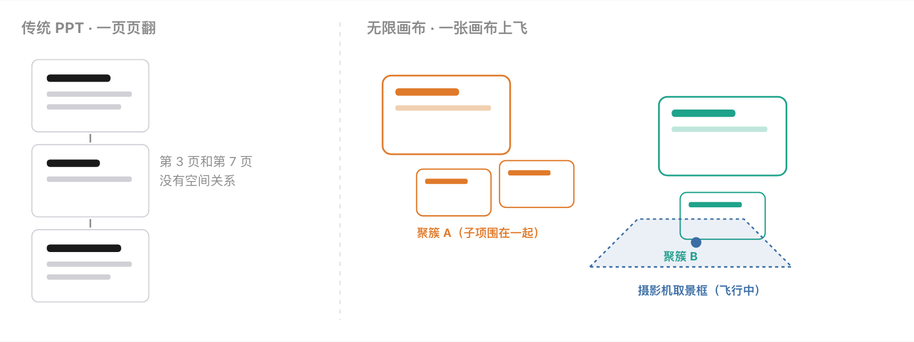

> 🔑 **立身之本**
> 
> 这个 skill 最核心的产出不是「页面美化」，而是**「内容逻辑 → 空间结构」的映射**。判断一个 Prezi 演示好不好，就看一句话：**把全景图摆出来，只看空间布局，能否读出「内容有几大块、块内子项什么关系」？** 看出一条均匀的路径线 = 失败。
> 
> 

### 产物的三个硬指标

- **单文件自包含**：一个 `.html`，CSS/JS 全内联，图片默认 base64 内联，断网也能播。浏览器双击即开，零构建、无依赖。

- **空间叙事**：基于 `impress.js`，镜头的缩放 / 平移 / 旋转运动本身就是讲解节奏。

- **零臆造**：上屏的每个字、每个数据都来自一份带出处的事实清单，杜绝 AI「合理补充」编造数据。

---

## 三步流水线全貌

> **严格按 1 → 2 → 3 顺序，不跳步；每步产出落盘为 JSON，以 ****`scene_id`**** 串成闭环。**
> 
> 

skill 把整个生成过程拆成三步，每一步的**产出必须落盘成工作区文件**（聊天里口头说说不算数）。上一步的 JSON 是下一步的输入，**每步出口都有一道脚本闸门**把守，`rc≠0` 不许进下一步。

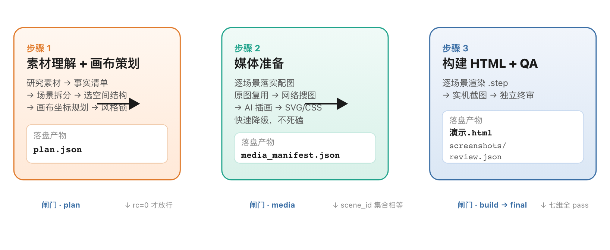

### 步骤 1 · 素材理解与画布策划

角色是「叙事设计师 \+ 信息架构师」。先**完整读完素材**（长文档必须分页读完，禁止只读开头就规划），建立一份**事实清单**——后续所有上屏文字、数据、术语都只能来自这份清单，每条都带 `source` 出处，禁止凭常识「合理补充」。

然后把内容拆成 6–20 个场景，每个场景只讲一个讲点（观众 10–30 秒可消化）。关键是**由内容逻辑推导空间结构**（见第 3 节），规划好每个场景的坐标，落盘 `plan.json`。

> 📌 **`source_inventory`**** · 防漏**
> 
> 事实清单防的是「臆造/多」；另有 `source_inventory` 防「漏」——通读源素材后把它切成重要内容点逐一登记（covered / skipped \+ 理由），防止把本该讲的重点整段删掉。判据是**内容重要性**，不是图片数量。
> 
> 

### 步骤 2 · 媒体准备（快速降级不死磕）

这是**标配流程不是可选项**：每次演示默认产出 60%–80% 内容场景配图，保持「每 1–2 页一图」的视觉节奏。素材获取有严格的优先级链：

> ⚠️ **降级铁律**
> 
> 每个素材最多验证 2–3 个候选 URL，全失败就**立即降级**，不换源纠缠。**按时交付完整演示 \> 单个素材的完美**。豆瓣/电商图床有防盗链，工具验证通过但浏览器可能 403，此类来源直接跳过。
> 
> 

### 步骤 3 · 构建 HTML 演示与 QA

角色是「资深前端工程师 \+ 演示设计师」。把 `plan.json` \+ `media_manifest.json` 渲染成单文件 HTML，坐标严格照搬步骤 1 规划。QA 分三段顺序执行：**构建闸（机械）→ 实机截图（必做）→ 独立终审（柔，七维）**。详见第 6 节。

---

## 核心设计观：空间即逻辑

> **先判内容是什么逻辑，再决定它该长成什么形状——别默认全程一条均匀路径。**
> 
> 

最常见的失败，是把所有场景等距排成一排、只靠翻页前进——空间没承载任何逻辑。正确做法是**先判内容逻辑，再选空间结构**：

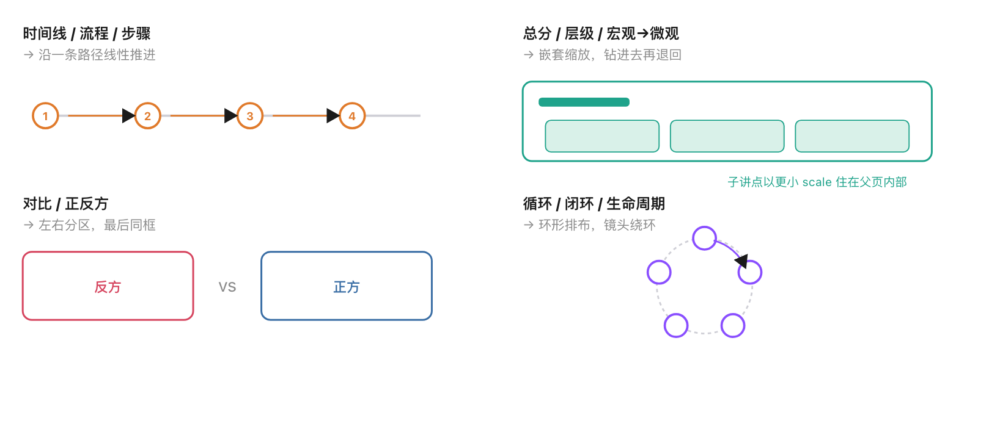

### 聚簇优先四原则

这是「空间即逻辑」的执行准则（`--phase plan` 机械闸核验）：

1. **先拆聚簇**：把紧密相关的页面分成一个个「簇」（子主题 / 并列组 / 序列 / 部分\-整体组）。**每页必属某簇，不许出现均匀路径上的孤立散页。**

2. **簇内紧凑但不遮挡**：同簇页面空间紧挨（镜头小幅移动），但任意两张卡片足迹**不许相互遮挡**，要留小缝。

3. **簇间分离且承载关系**：不同簇之间留明显空隙（镜头大幅移动），**簇的相对位置反映簇间逻辑**（论点→主体→结论、总→分、问题→解决）。

4. **结构靠空间与镜头涌现，禁止剧透**：不得用「结构说明图 / 目录页」预先标注「这里有下钻」。结构要靠镜头运动**自然涌现**，开场若给全貌就用**真实画布的远景俯瞰**，不画示意图。

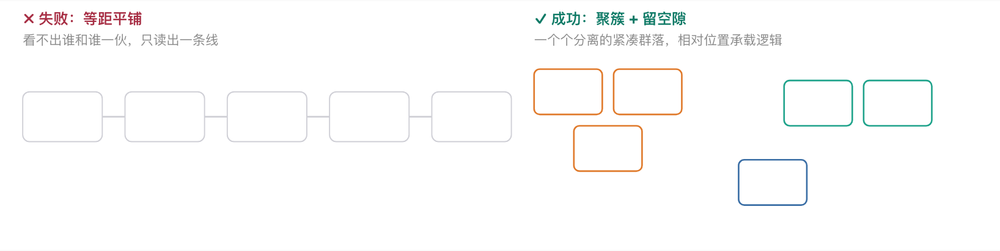

### 真嵌套缩放（Prezi 的招牌魅力）

对于总分 / 层级内容，必须至少做一组**真嵌套**——这是 Prezi 最迷人的地方：

- **父场景**是一个能看清整体结构的视图（结构图 / 分区图）。

- **≥2 个子讲点**以显著更小的 `data-scale`（父子 scale 比 ≥ 3）**嵌在父场景的空间包围盒内部**。镜头钻进去时，子讲点填满取景框，观众看不出它其实住在父图里。

- 有**钻入 → 子间穿梭 → 退回**的完整镜头序列。退回时观众因为刚探索过，会觉得既熟悉又赏心悦目。

> ⚠️ **纯 y 平铺 \+ 远景 hub ≠ 嵌套**
> 
> 把场景摆高低、镜头从没「钻进某个图形内部再退出来」，只是伪装成层级。机械闸会核 HTML 坐标里父子 scale 比 ≥ 3、子坐标落在父包围盒内、有钻入\+退回序列；纯时间线/流程/循环/对比可在 `plan.json` 注明 `structure_type` 豁免。
> 
> 

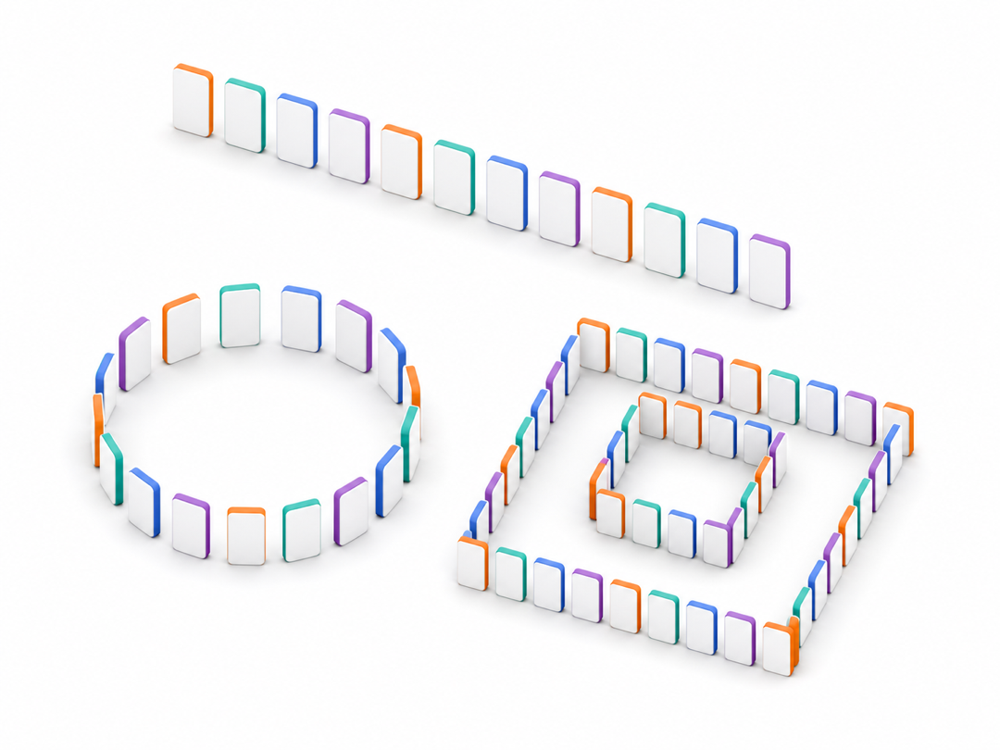

---

## 镜头语言与坐标系

> **impress\.js 用 6 个 data 属性控制每一个「镜头停留点」。**
> 
> 

每个场景是一个 `
`，它的位置和姿态由这几个属性决定。摄影机在 step 之间过渡时，会平滑插值这些值——这就是镜头运动的来源。

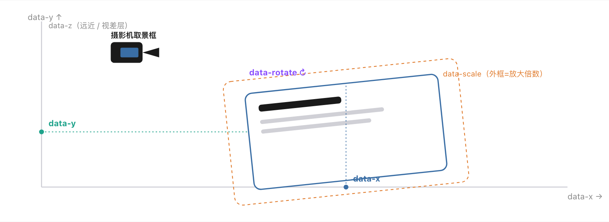

### 防晕规则

大旋转 \+ 大缩放叠在一起会让观众头晕。规划坐标时执行：相邻旋转 ≤ 90°、相邻缩放比 ≤ 10 倍、镜头运动类型（平移/缩放/旋转）**交替出现**、相邻场景间距大于各自包围盒（防邻居穿帮）。

### 图片聚焦步（imgfocus）

一个很实际的痛点：内容卡「左文右图」时，如果右侧是一张**横向图**（宽/高 ≥ 1\.25，如截图、论文图、图表），镜头停整卡时图只占取景框一小块，**必然看不清**。解法是 Prezi 语言里现成的——**镜头再走一站**：

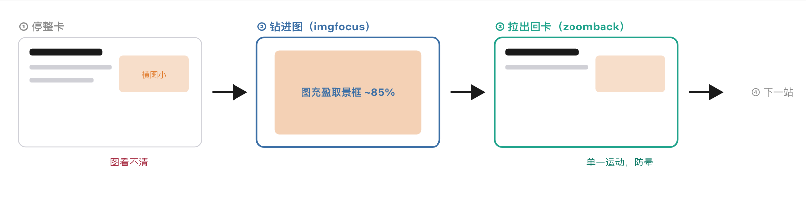

横向侧栏图的标准镜头节奏：**整卡 → 钻进图 → 拉出回卡 → 下一站**。直接从深钻的图飞到下一张卡会大变焦\+大平移叠加眩晕，所以中间必须插一个 `zoomback` 空步拆成两段单一运动。机械闸核这一序列在位。

### 渐进显现（substep）

聚焦到一张内容卡时，标题立即显示，**要点逐条 \+ 配图作为一条**初始隐藏——观众每按一次「下一步」显现一条，全部显现后再按才离开本卡。这让人**感受到生成过程、也方便回顾复习**。一旦离开，之后回看（总览/重访）全部保留可见。

> 📌 **点击直达**
> 
> 除了键盘翻页，必须实现「**点击卡片直接聚焦**」——点总览里某簇、或父页里某个子卡，都能一键飞过去聚焦；点空白处才顺序前进。进度圆点也做成可点击直达。
> 
> 

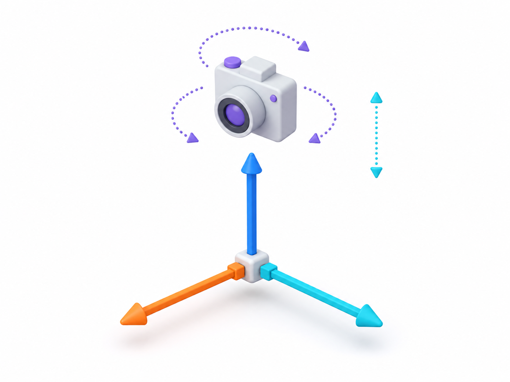

---

## Roam 大纲双向生产线

> **HTML 难手改？让一份纯文本大纲成为可编辑的「源」。**
> 
> 

单文件 HTML 不方便手动修改。为此 skill 配了一条**双向生产线**：交付时同时导出一份 Roam Research 风格的 Markdown 大纲 `roam.md`，它是**人类可读、可编辑的源**。改大纲 → 跑一行命令 → 确定性重建 plan / 布局 / HTML 并过机械闸。

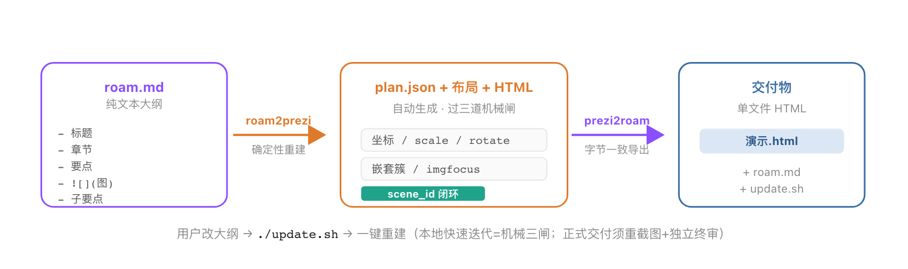

树模式语法（零控制符，纯层级）

默认采用**全递归树模式**：4 空格缩进、`- ` bullet；**有子节点 = 容器（自动变结构视图页），叶子 = 该节点自己的上屏要点**。图片只能是独立一行的 `- !`。

**根节点 = 演示标题；其叶子 = 标题页副题 \+ 题图**
\- 创始人手册：打造 AI 原生创业公司
    \- 从构思到 IPO：Claude 贯穿创业四阶段的实战地图
    \- AI 原生创业的时代变局            \# ← 有子节点 = 容器，自动变「父结构视图」
        \- 2026，创业生命周期重启       \# ← 这个子也有子 → 也是容器
            \- AI 已消除代码编写门槛，没写过代码也能发布生产级应用
            \- 融资到招人到开发的线性旧模式，让位于精益执行

        \- 创始人定义的演变
            \- 懂开发的人与有点子的人之间的墙被推倒
     

> 🔑 **树模式的聪明之处**
> 
> 子节点以显著更小的 scale **真几何嵌入**父节点足迹内（真嵌套预览到底）；镜头 = DFS 前序遍历 \+ 每个子树走完退回时插 recap 回看。**无硬性深度 / 子数 / 总数上限**——内容多层就深。还有三条镜头编排规则自动生效：单子链坍缩（空壳层不生成独立回看）、连环 recap 去重、imgfocus 出站防晕。
> 
> 

两条命令记住就够了：

导出可编辑大纲（交付时必做）

python3 \~/\.claude/skills/infinite\-canvas\-prezi/scripts/prezi2roam\.py \<workdir\>

改完大纲，一键重建 plan/布局/HTML \+ 过三道机械闸

python3 \~/\.claude/skills/infinite\-canvas\-prezi/scripts/roam2prezi\.py \<workdir\>

追加 \-\-full\-qa 连实机截图一起跑；\-\-cluster 用旧聚簇模式；\-\-online 用 CDN\+远程图

---

## 闸门与独立终审

> **确定性脚本守住机械规则，独立子 Agent 守住语义/观感——构建者不许自审放行。**
> 
> 

这个 skill 最讲究的是**不许糊弄**。它用两层防线：第一层是**确定性脚本闸门**（能写成测试的规则，机器硬拦）；第二层是**独立子 Agent 终审**（靠语义/观感判断、写不出确定性测试的维度）。

### 四道机械闸门（`prezi_gate.py`）

> ⚠️ **铁律**
> 
> 任何相位 `rc≠0` → 修复后重跑，**同一相位最多打回 2 次**；仍不过 → 停下向用户报告，不许无限重试。闸门还内置 `--selftest` 负向控制自测，用反例自证不会误放行。
> 
> 

### 七维独立终审

构建完用 **Agent 工具起一个独立子 Agent**（非构建上下文），照审查清单逐项审，产出 `review.json`。七个维度一个不能少：

- **R1 · 原图复用** — 原文明明有对应图，是否直接用进对应场景？弃原图全走 AI 插画 = fail。

- **R2 · 充盈取景框** — 内容是否占版心 70–88%、不缩在中央一小团？imgfocus 图是否充盈约 85%？

- **R3 · 空间即逻辑** — 总览一屏能否读出聚簇结构？簇间位置是否承载逻辑？有无剧透目录页？

- **facts · 事实溯源** — 抽查上屏文字能否溯源到事实清单；抽查 source 本身没伪造。

- **nav · 导航** — 无头浏览器真点一张卡，验证镜头确实飞过去聚焦（不只看代码 token）。

- **coverage · 源覆盖** — **绕过 plan 清单，自己重读源素材重切内容点**，揪「本该讲的重点被误删」。

- **nesting · 真嵌套** — 总分/层级内容有没有真嵌套（钻入\+退回），还是平铺假装层级？**不得凭 plan 自报的 structure\_type 放行**，须独立判定内容逻辑。

> ⚠️ **信任红线**
> 
> **构建者禁止手写或修改 review\.json**——它只能由独立子 Agent 产出。有 fail 项时构建者只修产物，修完必须重跑 build 闸、重新截图、重新调独立子 Agent 复审（≤2 轮）。`final` 闸用 html\_sha256 哈希绑定，使「改完产物拿旧 review 闯关」在机械上不可绕过。
> 
> 

---

## 实战示例：创始人手册

> **把 Claude Blog 一篇长文，做成一张可飞行的创业旅程画布。**
> 
> 

下面所有截图都来自一个真实产物——把 Claude Blog 的《The Founder's Playbook》一篇长文，用本 skill 做成的 60 个镜头的单文件演示。它的**空间结构是中心辐射**：中央标题作锚点，七个章节聚簇环绕展开，每个章节内部又是「父结构视图 \+ 子讲点」的嵌套。

**第 1 帧 · 标题页**（建立整个画布的锚点）

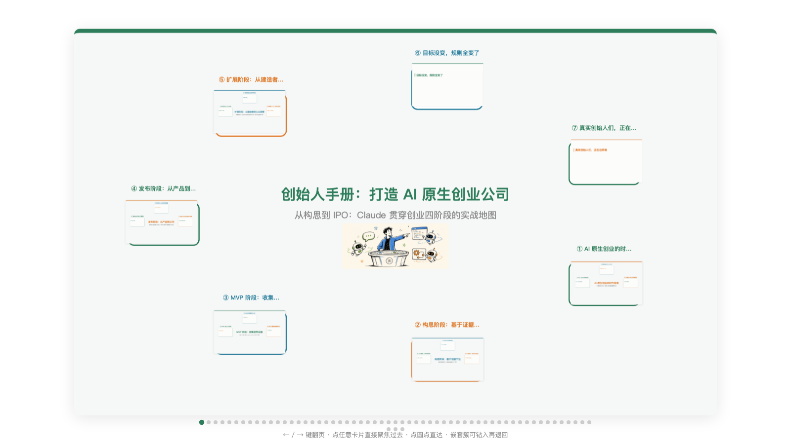

标题页居中、白底黑字 \+ 暖橙点缀，配一张点题横幅。**它同时是画布的几何中心**——后面所有聚簇都围绕它展开。

**第 3 帧 · 内容卡**（左文右图 \+ 渐进显现）

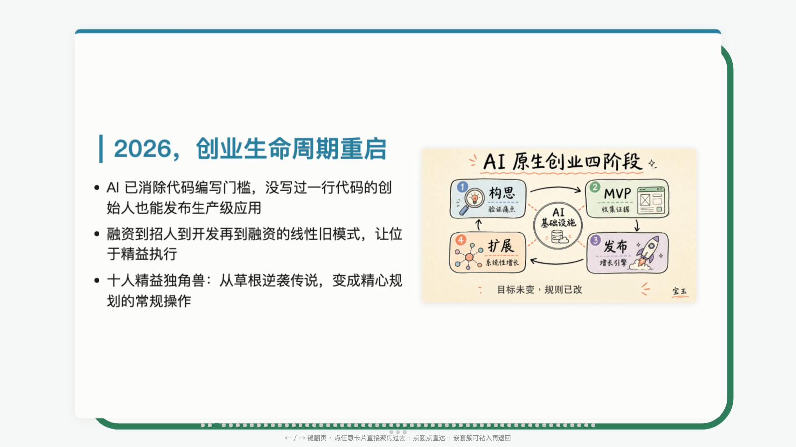

镜头钻进一个子讲点：标题 \+ 要点充盈取景框，右侧配图。要点是逐条 substep 显现的——观众每按一次「下一步」多出一条。

**第 4 帧 · 图片聚焦步 imgfocus**（钻进图看清细节）

上一帧的横向配图看不清？镜头**再走一站钻进图**，让图充盈取景框约 85%，细节清晰可读。看完自动 `zoomback` 拉出回卡。

**第 12 帧 · 父结构视图 recap**（退回看整体）

子讲点探索完毕，镜头**退回父级**回看一眼：中央标题「AI 原生创业的时代变局」\+ 三个编号子框（①②③三角排布）。因刚钻进去过，此刻既熟悉又赏心悦目——这就是真嵌套的魅力。

**第 60 帧 · 全景总览 overview**（收尾，一屏看尽）

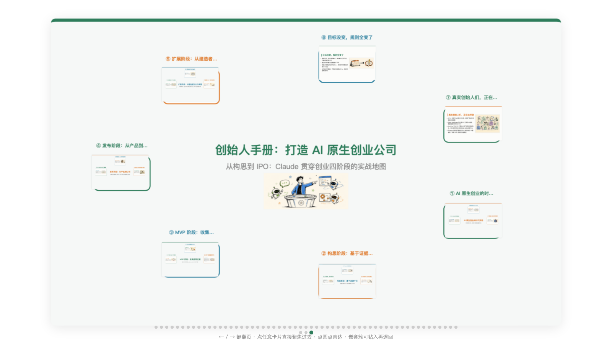

结尾的标志性收尾：镜头拉到最远，**一屏看尽整张画布**。七个章节聚簇环绕中央标题呈中心辐射——只看这张图，就能读出「内容分七大块、块内是嵌套子结构」。**这就是「空间即逻辑」的终极验证。**

> 🔑 **这个产物的规模**
> 
> 60 个镜头、7 个章节聚簇、每个章节含 3 个嵌套子讲点；约七成场景配统一风格插画 \+ 原文原图混用；单文件 HTML 约 42MB（全部图片 base64 内联，断网可播）。交付时附 `roam.md`，用户改大纲跑 `update.sh` 即可迭代。
> 
> 

---

## 何时该用 / 何时别用

> **触发条件很明确——必须是「一张无限画布 \+ 镜头运动承载逻辑」，而不是「一页页翻的幻灯」。**
> 
> 

### 该用它的场景

- 用户明确说：**Prezi / Prezi 风格 / 无限画布 / 空间叙事 / impress\.js / 镜头在一张画布上缩放平移旋转**。

- 内容天然有**空间结构**：总分/层级（钻进去看细节）、时间线/流程（沿路径走）、对比（左右）、循环（绕环）。

- 想要**单文件、零构建、浏览器直接打开**的可分享演示。

- 输入是主题 / 长文 / 转写稿，想自动产出研究 \+ 配图 \+ 叙事一条龙。

### 别用它的场景（有更对口的工具）

> ⚠️ **关键判据**
> 
> 用户要的是「**一张无限画布上镜头运动**」还是「**一页页翻的幻灯**」？前者用本 skill，后者别用。**不要被泛化的「会动的网页 / 缩放动画」误触发。**
> 
> 

### 怎么触发

直接说需求即可，例如：

纯主题

做一个关于黑洞的 Prezi 风格无限画布演示

带素材

把 @这篇文章 做成一张镜头会缩放平移的无限画布演示

或直接用斜杠命令

/infinite\-canvas\-prezi

触发后 skill 会**自动按 1→2→3 跑完整条流水线**，只在原则性疑惑时停下问你（素材严重残缺 / 多种完全不同的理解 / 受众目的无法判断）。凡能自行合理决定的，直接推进不等确认——唯独**部署到公网**（wrangler）和**Telegram 投递**这两步会先问，因为它们产出对外可见的链接/消息。

> 📌 **本机工具映射已就绪**
> 
> AI 生图走 `Evan-gpt-image` 的 `gen_via_codex.py`（吃 codex CLI 订阅额度，无需 OPENAI\_API\_KEY）；公开预览走已装的 `wrangler` CLI。impress\.js 用唯一实测可用的 CDN：`cdn.jsdelivr.net/gh/impress/impress.js@2.0.0`（npm 与 cdnjs 路径都 404）。
> 
> 

---

*`infinite-canvas-prezi`** · 无限画布演示生成器 · HTML 版本教程*

[index\.html](图片和附件/index.html)

案例展示：https://founders\-playbook\-prezi\.pages\.dev

huanwang\.org                                            \(申请备注：项目、写歌、技术、共学\)

