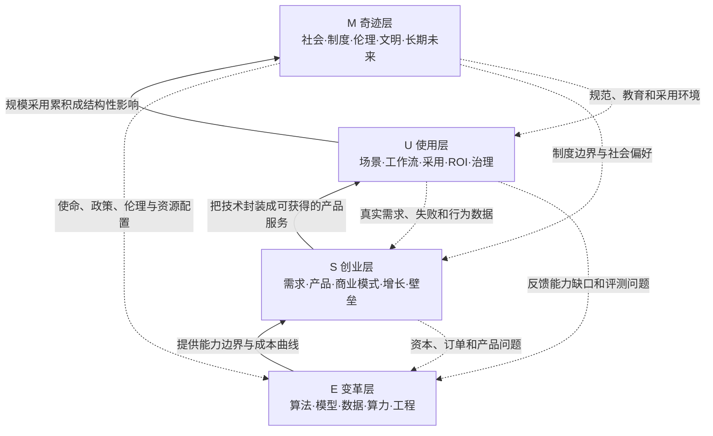

# 01. DataPack：MUSE 模型

> 文档定位：与具体活动、行业和案例解耦的通用 MUSE 分析底盘。  
> 主要用途：支撑人和 AI 对一个 AI 课题进行分类、建模、研究设计、跨层推演和高水平分析。  
> 版本：v1.0  
> 证据边界：本文严格区分“原始模型定义”“基于原模型的结构推导”“为了分析而增加的扩展工具”。

---

## 0. 使用前必读：MUSE 只有四个原生层，本文用十层方法解读它

MUSE 的原始结构是四层：

```text
M = Miracle    奇迹层
U = Usage      使用层
S = Startup    创业层
E = Evolution  变革层
```

“十层解读”不是把 MUSE 擅自扩成十个组成层，而是一种高阶理解方法：从十个角度反复解释同一个模型，使它与不同人的认知体系发生连接。

本文采用三类标签：

- **[原始定义]**：可在本地 MUSE 课程或框架原文中直接找到；
- **[结构推导]**：从原始定义和因果关系中合理推出，但不是原文逐字结论；
- **[扩展工具]**：为了让模型更适合研究、诊断和 AI 调用而增加的操作框架。

一句话总纲：

> **MUSE 用四种不同尺度的问题，把 AI 的底层变革、产品创业、实际使用和文明影响放进一张可以相互解释的全景地图。**

---

## 1. MUSE 快速参考卡

| 层级 | 中文 | 核心问题 | 主要对象 | 典型产物 | 常见角色 |
|---|---|---|---|---|---|
| M | Miracle 奇迹层 | AI 最终会把世界带向哪里？ | 社会、制度、文明、人机关系 | 情景、命题、趋势判断、治理议题 | 长期主义者、思想者、政策与治理研究者 |
| U | Usage 使用层 | 谁在什么场景中如何使用 AI，并得到什么结果？ | 个人、团队、组织、具体工作流 | 用例、流程、能力、ROI、最佳实践 | 普通用户、业务人员、管理者、实施者 |
| S | Startup 创业层 | 如何把 AI 能力变成独立产品和可持续生意？ | 用户、需求、产品、公司、商业系统 | 产品、服务、商业模式、增长和壁垒 | 创业者、产品经理、投资人、产业伙伴 |
| E | Evolution 变革层 | AI 为什么有效，能力边界如何演进？ | 算法、模型、数据、算力、工程基础设施 | 原理、技术路线、基准、基础能力 | 科学家、研究员、工程师、基础设施团队 |

### 两种顺序必须同时记住

**展示与阅读顺序：**

```text
M → U → S → E
未来愿景 → 当下使用 → 独立创业 → 底层技术
```

这个顺序有利于人从宏观和熟悉场景逐步进入技术深处，也构成单词 MUSE。

**主要变化传导顺序：**

```text
E → S → U → M
技术突破 → 产品与服务 → 大规模采用 → 社会与文明影响
```

这个顺序解释变化如何从底层向上传导。

### 最重要的边界提醒

MUSE 不是：

- 从低到高的能力等级；
- 企业发展的固定四阶段；
- 四个互斥、不可跨越的文件夹；
- 用来预测未来必然发生什么的公式；
- 用四个字母替代具体行业知识的万能模型。

MUSE 是：

- 一张 AI 议题全景地图；
- 一套区分问题尺度的共同语言；
- 一条理解技术如何走向社会的传导链；
- 一个检查研究是否缺层、跳层的框架；
- 一个组织知识库、课程、研究团队和分析报告的上位结构。

---

## 2. MUSE 为什么被提出

### 2.1 它解决的原始问题

关于 AI 的讨论经常混在一起：

- 一会儿讨论大模型、Transformer、算力；
- 一会儿讨论 AI 写作、编程和降本增效；
- 一会儿讨论 AI 产品、融资和创业机会；
- 一会儿又跳到岗位替代、教育重构和人类未来。

这些话题都与 AI 有关，却处在完全不同的尺度，使用不同证据，也面对不同角色。如果不先分层，讨论会同时出现三种问题：

1. **对象混乱**：把工具功能、商业机会和社会影响当成同一种结论；
2. **证据错配**：用一个 Demo 证明产业成熟，用一个产品预测文明未来；
3. **沟通错位**：技术人员、业务人员、创业者和长期观察者说着不同语言。

### 2.2 MUSE 的基本解法

MUSE 不急着回答所有 AI 问题，而是先问：

> 你此刻讨论的，究竟是底层能力、独立产品、实际使用，还是长期影响？

一旦层级被辨认出来，研究对象、证据类型、关键角色和输出形式都会清晰很多。

### 2.3 它真正提供的不是答案，而是坐标系

MUSE 最像地图，而不是路线说明书。

- 地图告诉你目前站在哪里；
- 地图展示相邻区域和上下游；
- 地图提醒你还有哪些区域没有考察；
- 但地图不会替你完成当地调查，也不会自动给出正确结论。

这决定了 MUSE 的最佳用法：**先定位，再深挖；先分层，再建立因果；先检查完整性，再做具体判断。**

---

## 3. 四个层级分别包含什么

## 3.1 E：Evolution 变革层

### 原始定义

> 底层的技术研究和支撑基础的升级、变革。

E 层研究 AI 的“为什么”和“凭什么”：模型为什么有效，能力从哪里来，成本为何变化，技术边界如何演进。

### E 层的五类内容

| 子域 | 主要内容 | 典型问题 |
|---|---|---|
| 原理与范式 | 机器学习、深度学习、Transformer、世界模型、强化学习 | 能力的机制是什么？哪些假设成立？ |
| 模型与训练 | 预训练、后训练、对齐、推理、多模态、记忆 | 模型如何获得、保持和调用能力？ |
| 数据与评测 | 数据生成、清洗、反馈、基准、安全评测 | 我们如何知道模型真的变强？ |
| 算力与系统 | 芯片、集群、推理、存储、网络、能源、部署 | 能力如何以可接受成本稳定运行？ |
| 工程与协议 | Agent Harness、工具调用、MCP、权限、观测与恢复 | 如何把概率模型变成可运行系统？ |

### E 层的主要证据

- 论文、技术报告、官方文档；
- 基准测试和可复现实验；
- 系统指标：吞吐、延迟、成功率、能耗、成本；
- 架构、训练和部署细节；
- 失败案例、能力边界和安全评测。

### E 层的典型产物

- 技术路线图；
- 模型能力与边界说明；
- 技术选型和架构判断；
- 数据集、评测集、基准和实验报告；
- 可以被上层产品调用的基础能力。

### E 层常见误区

- 把“新”自动等于“重要”；
- 只看榜单，不看任务和评测条件；
- 只看模型，不看数据、推理、权限和工程系统；
- 把技术可行误写成产品可行；
- 把实验室能力直接外推为社会影响。

### E 层的过关问题

1. 这项能力的机制和边界是什么？
2. 在什么数据、算力和环境下成立？
3. 它比已有方案具体改变了什么？
4. 能否被稳定、低成本地调用？
5. 哪些失败和约束会阻止它进入 S 或 U 层？

---

## 3.2 S：Startup 创业层

### 原始定义

> 使用 AI 核心技术创业，创造新的智能服务；形成独立、自负盈亏的产品或业务。

S 层研究的不是“公司有没有使用 AI”，而是“AI 是否构成一个独立产品和生意的核心”。

### S 层的六类内容

| 子域 | 主要内容 | 典型问题 |
|---|---|---|
| 用户与需求 | 用户、场景、痛点、付费意愿 | 谁为什么愿意付钱？ |
| 产品内核 | AI 原生价值、工作流、交付物 | 没有 AI，这个产品是否还成立？ |
| 可行性 | 技术、数据、合规、交付边界 | 能否持续交付，而非只做 Demo？ |
| 商业模式 | 定价、成本、毛利、回款、单位经济 | 每成功交付一次是否赚钱？ |
| 增长 | 获客、渠道、留存、复购、传播 | 如何从少数用户走向可持续增长？ |
| 壁垒 | 数据、工作流、集成、品牌、网络效应 | 基础模型升级后还剩下什么？ |

### AI 原生创业的判断标准

1. AI 是核心价值，不是宣传标签；
2. 形成独立面向用户或客户的产品/服务；
3. 有明确的价值交换和经济责任；
4. 产品因 AI 获得过去难以成立的新能力或成本结构；
5. 能从一次演示走向重复交付。

### S 层与 U 层最关键的区别

```text
U：公司内部用 AI 写代码、做客服、整理资料，提高自己的效率。
S：把 AI 编程、客服或研究能力做成独立产品，向外部客户收费并承担交付。
```

判断口诀：

> **内部使用、改善原业务，主要属于 U；独立产品、对外交易、自负盈亏，主要属于 S。**

### S 层的主要证据

- 用户访谈与真实需求；
- 试用、留存、复购和使用频率；
- 订单、合同、回款与毛利；
- 交付成功率、人工介入和服务成本；
- 获客渠道与转化；
- 竞争、替代方案和壁垒证据。

### S 层的典型产物

- 产品定义与价值主张；
- MVP、试点和正式产品；
- 商业模式和单位经济模型；
- 增长路径与渠道系统；
- 可持续公司或 OPC 运行系统。

### S 层常见误区

- 把模型 API 加界面当成长期产品；
- 用展会热度、融资和媒体曝光替代用户价值；
- 把“有人想试”当成“有人持续付费”；
- 只算 Token 成本，不算获客、人工审核、部署和售后；
- 把技术领先当成自动形成的商业壁垒。

### S 层的过关问题

1. 用户是谁，原来怎样解决？
2. AI 改变了哪一个关键结果？
3. 为什么这是独立产品，而不只是功能？
4. 谁付钱，多久付一次，交付成本多少？
5. 模型能力普及后，壁垒是否仍存在？

---

## 3.3 U：Usage 使用层

### 原始定义

> 使用 AI 技术和工具，在个人与组织场景中降本增效、提高收入或完成过去难以完成的任务。

U 是绝大多数人接触 AI 的入口，也是 AI 是否产生真实价值的主要验收层。

### U 层的六类内容

| 子域 | 主要内容 | 典型问题 |
|---|---|---|
| 个体能力 | 写作、研究、设计、编程、学习、决策 | 一个人如何获得新能力？ |
| 工作流 | 任务拆解、工具组合、上下文、交付 | AI 如何进入完整流程？ |
| 组织落地 | 岗位、协同、权限、培训、流程重构 | 团队怎样规模化使用？ |
| 场景应用 | 医疗、教育、金融、制造、内容等 | 在具体环境中产生什么结果？ |
| 采用与体验 | 门槛、信任、习惯、界面、人工接管 | 人为什么愿意持续使用？ |
| 效果与治理 | ROI、质量、安全、隐私、审计 | 价值是否大于成本与风险？ |

### U 层的主要证据

- 真实用户行为，不只是意向；
- 任务完成时间、质量和成功率；
- 使用频率、留存和重复使用；
- 人工接管率和失败类型；
- 组织采用率、培训与迁移成本；
- 投入产出、风险和责任记录。

### U 层的典型产物

- 场景用例库；
- SOP、Prompt、Skill、Agent 和工具链；
- 人机协作流程；
- 组织部署方案与治理规则；
- 可验证的效率、质量和收入改进。

### U 层常见误区

- 收藏工具等于建立能力；
- 成功做过一次等于稳定可复用；
- 只测速度，不测质量和返工；
- 只看个人高手案例，不看普通人采用门槛；
- 用“节省时间”掩盖新增审核、管理和错误成本。

### U 层的过关问题

1. 谁在什么真实场景中使用？
2. AI 接管了哪段工作，而非只提供建议？
3. 使用前后结果如何比较？
4. 失败时如何发现、接管和恢复？
5. 这种使用能否被普通人和组织重复复制？

---

## 3.4 M：Miracle 奇迹层

### 原始定义

> 关于 AI 长期未来的思考，包含未来愿景、科学幻想、社会重构、伦理与文明级影响。

M 层回答 AI 最终把人、组织、行业和世界带向哪里。它不是脱离事实的幻想，而是把底层变化、大规模采用和制度反应放到更长时间尺度中研究。

### M 层的六类内容

| 子域 | 主要内容 | 典型问题 |
|---|---|---|
| 人与工作 | 岗位替代、能力增强、劳动意义 | 人类工作的结构会怎样变化？ |
| 组织与经济 | 公司形态、生产关系、分配和增长 | AI 会产生怎样的新组织和经济制度？ |
| 教育与成长 | 学什么、如何学习、人的独特价值 | 教育目标是否需要重写？ |
| 社会与治理 | 权力、规则、公共服务、数字鸿沟 | 谁拥有、控制并受益于 AI？ |
| 伦理与安全 | 责任、偏见、意识、对齐、失控风险 | 什么可以做，谁为后果负责？ |
| 文明与意义 | AGI、后稀缺、人机共生、文明演化 | 人类如何重新理解自身？ |

### M 层的主要证据

M 层无法只靠单个产品和短期数据证明，需要组合证据：

- E 层长期技术轨迹；
- S 层产品和产业结构变化；
- U 层大规模采用与行为变化；
- 劳动、教育、组织和制度数据；
- 历史类比、跨国比较和情景假设；
- 明确标注不确定性的趋势与情景分析。

### M 层的典型产物

- 多情景未来图景；
- 长期战略命题；
- 社会、伦理和治理议程；
- 教育、组织与个人能力的新假设；
- 对下层创新的价值约束和方向选择。

### M 层常见误区

- 把科幻可能性写成确定预测；
- 从一个新产品直接跳到“行业将被颠覆”；
- 只有宏大叙事，没有传导链和中间机制；
- 只讲技术能力，不讲利益、制度和人的反应；
- 只讲风险或奇迹中的一面，缺少多情景。

### M 层的过关问题

1. 这个长期判断依赖哪些 E、S、U 层前提？
2. 影响通过什么机制和时间尺度发生？
3. 谁受益、谁受损、谁拥有决定权？
4. 有哪些替代情景和反作用力？
5. 这个未来判断今天能指导什么选择？

---

## 4. 四层之间的依赖、支撑与反馈关系

## 4.1 主传导链：E → S → U → M



主链说明：

1. **E 支撑 S**：新能力、成本下降和工程成熟提供创业可能；
2. **S 连接 E 与 U**：创业者把复杂技术封装成用户可获得、可理解、可购买的产品；
3. **U 验收 S**：真实使用决定产品是否有价值，也暴露能力、体验和成本问题；
4. **U 累积为 M**：当采用达到足够规模和持续时间，才可能改变岗位、组织、制度和社会关系。

## 4.2 依赖不是“有了上层就必然产生下层”

更准确的关系是：

```text
E 是 S 的重要使能条件，但技术突破不保证商业成功。
S 是规模化 U 的重要中介，但开源工具和组织内部自建可能绕过创业公司。
U 是 M 发生的现实基础，但大量使用不必然产生预想中的社会结果。
M 会反过来影响政策、资本、人才和研究议程，改变 E/S/U 的方向。
```

所以 MUSE 是一条**非充分条件的传导链**。每次跨层都需要新的证据，不能自动跳跃。

## 4.3 四种关系类型

| 关系 | 含义 | 示例 |
|---|---|---|
| 使能关系 | 下层让上层第一次成为可能 | 推理成本下降使实时 Agent 产品可行 |
| 封装关系 | 中间层把复杂能力变成可使用形式 | 产品把模型、工具、权限封装成工作流 |
| 验证关系 | 使用结果反证产品和技术是否成立 | 高人工接管率暴露 Agent 可靠性不足 |
| 约束关系 | 上层价值和制度限制下层方向 | 隐私和责任规则改变产品与技术设计 |

## 4.4 四个关键飞轮

### 技术—产品飞轮

```text
E 技术能力 → S 产品试验 → 暴露能力缺口 → E 工程与模型改进
```

### 产品—使用飞轮

```text
S 产品 → U 用户使用 → 行为与反馈数据 → S 产品迭代、定价与增长
```

### 使用—社会飞轮

```text
U 规模采用 → M 组织与制度变化 → 新规范和新需求 → U 新使用方式
```

### 愿景—创新飞轮

```text
M 长期愿景/风险 → 资源、使命和治理议程 → E/S 创新方向 → 新的 M 可能性
```

## 4.5 跨层跳跃的证据门槛

| 从哪里到哪里 | 不能只凭什么 | 至少需要补什么 |
|---|---|---|
| E → S | 模型榜单、论文、Demo | 用户需求、交付可行性、成本和替代方案 |
| S → U | 发布会、融资、订单意向 | 真实使用、留存、复购、成功率和组织采用 |
| U → M | 个别高手案例、短期热度 | 规模、持续时间、制度反应、分配效应和多情景 |
| M → 当下决策 | 宏大愿景或恐惧 | 可观察先行指标、时间窗口和可逆行动 |

---

## 5. 容易混淆的边界问题

## 5.1 一项内容可以跨层，但必须有主层

例如“AI 编程助手”可以同时涉及：

- E：代码模型、上下文、工具调用的技术机制；
- S：编程产品如何定价、增长和形成壁垒；
- U：开发者如何使用，效率和质量如何变化；
- M：软件岗位、教育和组织形态是否被改变。

分类时不要问“它属于哪一个唯一文件夹”，而要问：

> **这份材料主要在回答哪一层的问题？它的主证据和主产物是什么？**

## 5.2 主层判断四问

1. 作者真正试图回答什么问题？
2. 文章使用的主要证据是什么？
3. 最终产出的判断服务谁？
4. 如果删掉其他内容，哪一部分仍是文章骨架？

## 5.3 高频混淆对照表

| 情形 | 主层 | 原因 |
|---|---|---|
| 公司员工用 ChatGPT 写周报 | U | 内部使用以提效为目标 |
| 公司把 AI 写作能力做成收费产品 | S | 独立产品、外部交易 |
| 研究长上下文为何失效 | E | 研究底层机制和边界 |
| 研究 AI 写作是否改变内容岗位 | M 或 U | 大规模岗位结构为 M；具体流程变化为 U |
| 创业者用 AI 辅助做产品 | U | AI 是创业过程中的工具 |
| 创业者做一个 AI 原生产品 | S | AI 构成产品核心价值 |
| 技术趋势报告讨论商业机会 | E 主、S 副 | 主要证据若来自技术演进，主层仍为 E |
| 未来教育畅想 | M | 长期社会与人的变化 |

---

## 6. 用十层解读法，系统理解 MUSE

> 以下十层是解释角度，不是 MUSE 的十个原生组成部分。

## 第 1 层：它到底是什么

MUSE 是一套 AI 全景认知分类框架。它把 AI 相关问题分成奇迹、使用、创业和变革四层，并通过 `E→S→U→M` 解释变化如何由技术逐步传导到社会。

## 第 2 层：它解决什么问题

它解决 AI 讨论尺度混乱的问题：不同人说的都对，却不在同一层；同一篇分析跨越多层，却没有补足跨层证据。

## 第 3 层：它和普通分类目录有什么不同

普通目录只回答“内容放哪里”；MUSE 还回答：

- 四层使用什么证据；
- 哪些角色在这一层行动；
- 下层怎样支撑上层；
- 分析跨层时需要补什么门槛。

因此，它既是分类法，也是初步的因果地图和协作语言。

## 第 4 层：它和其他模型是什么关系

| 模型类型 | 主要回答 | 与 MUSE 的关系 |
|---|---|---|
| 技术成熟度/TRL | 技术成熟到哪一步 | 可用于 E→S 的成熟度检查 |
| 一堂五步法 | 生意如何从需求走向壁垒 | 主要展开 S 层 |
| 双三角模型 | AI 如何侵蚀任务、岗位与组织 | 主要连接 U 与 M，并回看 E |
| 产品采用/扩散模型 | 用户为何采用、如何扩散 | 主要展开 U→M |
| 情景规划 | 多种未来怎样形成 | 主要展开 M 层 |
| 技术栈/系统架构 | 能力怎样被工程实现 | 主要展开 E 层 |

MUSE 不替代这些模型。它负责选择研究尺度和组织关系，专业模型负责在某一层深入分析。

## 第 5 层：它的独特价值在哪里

它把看似分散的四类 AI 对话放进同一张图，并同时保留：

- 宏观与微观；
- 技术与商业；
- 当下与长期；
- 使用者与创造者；
- 分类关系与传导关系。

它的价值不是四个英文单词，而是建立了跨角色、跨尺度的共同语言。

## 第 6 层：它的审美答案是什么

一份好的 AI 分析不应只有未来想象，也不应只有工具清单；它应该能说明：

> 底层能力发生了什么，谁把它做成什么产品，哪些人在怎样使用，规模化之后可能改变什么。

这就是 MUSE 对“完整 AI 分析”的审美答案：**四层各自讲清，跨层有证据，传导不跳步。**

## 第 7 层：它的方法论答案是什么

MUSE 可以转化为一套五步研究法：

```text
定主层 → 补邻层 → 找传导 → 查证据 → 做推演
```

1. 定主层：明确研究主要回答 M/U/S/E 哪一层；
2. 补邻层：检查它依赖的上下游；
3. 找传导：写出能力如何变成产品、使用和影响；
4. 查证据：每次跨层都设置证据门槛；
5. 做推演：给出情景、行动、风险和待验证问题。

## 第 8 层：它的资产答案是什么

当 MUSE 被用来组织知识和研究，可以沉淀：

- 四层知识库；
- 跨层案例卡；
- 技术—产品—使用—影响链；
- 分角色课程地图；
- 研究问题库、证据库和假设库；
- 可被 AI 调用的结构化 Data Pack。

## 第 9 层：它对不同角色有什么价值

| 角色 | 主要价值 |
|---|---|
| 普通学习者 | 不再被工具、名词和新闻淹没，建立知识地图 |
| 企业管理者 | 区分技术热度、产品价值和组织采用 |
| 创业者 | 从技术机会追到需求、使用和长期结构变化 |
| 投资人 | 检查项目是否跨层跳跃，识别真正的验证证据 |
| 研究者/教研 | 组织课题、课程、材料和跨层因果链 |
| 政策与治理者 | 从规模使用和外部性反推治理与技术约束 |
| AI Partner | 获得稳定的问题路由、证据检查和报告结构 |

## 第 10 层：它为什么会长期值钱

AI 工具和产品会持续变化，但四种基本问题不会很快消失：

- 能力从哪里来；
- 谁把能力变成产品；
- 谁怎样使用并得到结果；
- 大规模之后世界怎样改变。

MUSE 的长期价值，在于提供一套不依赖具体工具名称的稳定坐标。它能让变化极快的材料不断进入一个相对稳定的认知系统。

---

## 7. 用十指讲香，把 MUSE 讲清、讲透、讲出价值感

> 讲香不是夸大价值，而是让真实价值更容易被理解、感知和记住。

## 7.1 场景化

当一场 AI 讨论同时出现大模型、办公提效、创业融资和人类未来时，所有人都在说 AI，却很难形成共同判断。MUSE 先把四种问题放回四个位置。

## 7.2 口语化

```text
E：AI 为什么突然会了？
S：谁把这种能力做成生意？
U：谁真的用起来了，结果怎样？
M：用到足够大以后，世界会怎样？
```

## 7.3 数字化

MUSE 用 **4 层、2 种顺序、1 条主传导链、4 类反馈关系**，组织跨度极大的 AI 世界。

## 7.4 故事化

一个技术从论文诞生，到创业者做出产品，再到用户每天使用，最后改变岗位和制度，这就是一项 AI 创新的完整生命史。MUSE 把这段生命史拆成四个可以研究的章节。

## 7.5 素材化

最适合 MUSE 的素材包括：

- 四层全景图；
- E→S→U→M 传导图；
- 正向支撑与反向反馈图；
- 同一案例的四层证据卡；
- “事实—推断—情景”分层表。

## 7.6 比喻化

可以把 MUSE 比作一棵树：

```text
E 是根系和土壤：提供底层能力
S 是枝干和嫁接：把能力组织成产品
U 是叶片和果实：在真实环境中产生价值
M 是森林与气候：大量个体累积成生态和文明变化
```

但树也会反过来改变土壤和气候，因此它不是单向机械流水线。

## 7.7 金句化

- 讨论 AI，先分清是在讲能力、产品、使用，还是未来。
- 技术突破不是商业成功，产品发布不是用户采用，个别采用不是社会变革。
- MUSE 不是四个抽屉，而是一条从能力到文明的证据链。
- 四层各自讲清，跨层不跳步，才是一份完整的 AI 分析。
- 工具会过时，坐标系更耐用。

## 7.8 情绪化

MUSE 最适合带来的感受不是兴奋，而是“终于看清楚了”：原来不是自己跟不上 AI，而是所有层级的信息一直混在一起。

## 7.9 冲突化

- 不是 AI 新闻看得越多越懂 AI，而是能把信息放回正确层级；
- 不是技术越强产品一定越好，而是每次跨层都要重新验证；
- 不是未来想得越大分析越深，而是传导机制越清楚越深；
- 不是每个项目都要覆盖四层，而是主层明确、上下游不缺证据。

## 7.10 升华化

MUSE 最终提供的是一种面向 AI 时代的世界理解方式：既不被眼前工具困住，也不被宏大未来带走；既尊重底层技术，也坚持让产品接受真实使用和社会结果的检验。

---

## 8. 通用分析协议：怎样用 MUSE 研究任何课题

## 8.1 第一步：定义研究对象

```text
研究对象：
时间范围：
空间/行业范围：
希望回答的决策：
不研究什么：
```

## 8.2 第二步：确定主层与副层

| 项目 | 填写内容 |
|---|---|
| 主层 | M / U / S / E，只选一个 |
| 主问题 | 本研究最核心的问题 |
| 副层 | 必须补充的相邻或上下游层 |
| 主产物 | 报告最终要交付什么 |
| 主要证据 | 哪类证据能够支持结论 |

## 8.3 第三步：建立四层事实表

| 层级 | 已确认事实 | 关键证据 | 不确定/争议 | 待验证问题 |
|---|---|---|---|---|
| E |  |  |  |  |
| S |  |  |  |  |
| U |  |  |  |  |
| M |  |  |  |  |

## 8.4 第四步：写出跨层传导链

```text
因为 E 层发生了 ______，
所以 S 层第一次能够/更便宜地 ______；
但要成立，还必须验证 ______。

如果 S 层产品能够 ______，
U 层用户可能在 ______ 场景中采用；
但规模采用还受 ______ 约束。

如果 U 层在 ______ 范围持续发生，
M 层可能出现 ______ 结构变化；
另一个可能情景是 ______。
```

## 8.5 第五步：检查反向反馈

- U 层真实失败暴露了哪些 S 产品问题？
- U 层数据提出了哪些 E 技术问题？
- M 层的政策、伦理和公众态度如何限制 S/U？
- M 层愿景是否在重定向资本、人才和 E 层研究？

## 8.6 第六步：输出结论时分四类

| 标签 | 定义 | 写法示例 |
|---|---|---|
| 事实 | 有直接证据支持 | 已观察到、数据显示、官方披露 |
| 判断 | 多事实综合后的解释 | 这表明、较可能意味着 |
| 假设 | 尚待验证的因果或预测 | 如果……那么……，需验证 |
| 情景 | 多种可能未来 | 乐观/基准/保守情景 |

---

## 9. 面向 AI 的结构化 Data Schema

下面的 YAML 可作为未来研究卡、案例卡或 Agent 输入格式：

```yaml
muse_record:
  title: ""
  object: ""
  scope:
    time: ""
    geography: ""
    industry: ""
  primary_layer: "E|S|U|M"
  secondary_layers: []
  core_question: ""

  layers:
    evolution:
      capability_change: []
      mechanism: []
      constraints: []
      evidence: []
    startup:
      user_need: []
      product: []
      business_model: []
      growth_and_moat: []
      evidence: []
    usage:
      users_and_scenarios: []
      workflow_change: []
      measured_outcomes: []
      adoption_and_risk: []
      evidence: []
    miracle:
      structural_impact: []
      stakeholders: []
      governance_and_ethics: []
      scenarios: []
      evidence: []

  transmissions:
    e_to_s:
      claim: ""
      missing_conditions: []
    s_to_u:
      claim: ""
      missing_conditions: []
    u_to_m:
      claim: ""
      missing_conditions: []

  feedback_loops: []
  confirmed_facts: []
  interpretations: []
  hypotheses: []
  unknowns: []
  actions: []
```

---

## 10. 高水平分析的质量评分表

每项 0—2 分，总分 20 分。

| 维度 | 0 分 | 1 分 | 2 分 |
|---|---|---|---|
| 主层清晰 | 未定位 | 隐约可见 | 明确主层、主问题、主产物 |
| 四层边界 | 大量混淆 | 部分区分 | 各层对象和证据清晰 |
| E 层深度 | 只报技术名 | 有能力说明 | 有机制、边界、成本和评测 |
| S 层深度 | 只报产品/融资 | 有需求或商业信息 | 有产品、交付、单位经济和壁垒 |
| U 层深度 | 只列案例 | 有使用描述 | 有工作流、效果、采用和风险证据 |
| M 层深度 | 口号或科幻 | 有趋势判断 | 有机制、多情景、利益与制度分析 |
| 跨层传导 | 直接跳结论 | 有简单关系 | 每次跨层都有条件和证据门槛 |
| 反向反馈 | 完全没有 | 提到反馈 | 清楚说明 U/M 如何反向塑造 E/S |
| 证据纪律 | 观点当事实 | 部分标注 | 事实、判断、假设、情景严格分开 |
| 行动价值 | 只有描述 | 有泛化建议 | 能导出决策、实验、指标和下一步 |

评分解释：

- **0—7 分**：资讯汇总，还未形成模型化分析；
- **8—13 分**：基本完整，但跨层证据或行动性不足；
- **14—17 分**：高质量分析，可支撑讨论和决策；
- **18—20 分**：结构、证据、推演和行动均成熟，可作为 Data Pack 或决策底盘。

---

## 11. 常见反模式与纠偏

| 反模式 | 症状 | 纠偏 |
|---|---|---|
| 四层平均用力 | 每层都写很多，主问题不清 | 先选主层，再补必要邻层 |
| 由 E 直接跳 M | 新模型出现，所以社会必然重构 | 补 S 产品化、U 采用和制度反应 |
| 把 U 当 S | 内部提效案例被写成创业机会 | 补外部用户、付费和独立交付 |
| 把热度当 U | 曝光、下载、排队被当成价值 | 补持续使用、留存、质量和 ROI |
| 把融资当 S 成立 | 资本认可替代商业验证 | 补收入、毛利、交付和复购 |
| 把 M 当口号 | 只说颠覆、重构、新时代 | 写清机制、受益者、受损者和多情景 |
| 把模型当答案 | 分完四层就结束 | 在主层继续调用专业方法和一手证据 |
| 忽略反馈 | 只写 E→S→U→M 单向链 | 检查使用、政策和社会如何反向塑造创新 |

---

## 12. 可直接调用的分析提示词

```text
请使用 MUSE 模型分析【研究对象】。

要求：
1. 先确定一个主层，并解释为什么；不要把四层平均展开。
2. 分别整理 E（底层能力）、S（产品与商业）、U（真实使用）、M（长期影响）的已确认事实。
3. 每一条明确标注：事实、判断、假设或情景。
4. 写出 E→S、S→U、U→M 的传导关系；每次跨层列出必要条件和当前证据缺口。
5. 检查 U→S/E、M→E/S/U 的反向反馈和约束。
6. 区分技术可行、产品可行、商业可行、规模采用和社会影响，禁止相互替代。
7. 给出最关键的 5 个未知问题、3 个反例或失败情景、下一步验证动作和指标。
8. 最终输出：一页结论、四层事实表、依赖关系图、分歧、判断、行动建议。
```

---

## 13. Data Pack 的稳定结论

以下内容可以作为后续分析反复调用的稳定底盘：

1. MUSE 的原生结构是 M/U/S/E 四层；十层解读是解释方法，不是扩充原模型。
2. MUSE 有两种顺序：展示顺序 `M→U→S→E`，主要变化传导顺序 `E→S→U→M`。
3. E 研究能力与机制，S 研究独立产品和生意，U 研究真实使用和结果，M 研究长期结构影响。
4. 使用层与创业层的分界，主要看内部提效还是独立产品、对外交易、自负盈亏。
5. 四层不是高低等级，也不是互斥分类；复杂对象可以跨层，但研究必须确定主层。
6. 技术突破不是商业成功，产品发布不是规模使用，规模使用也不自动等于预想中的社会影响。
7. 每次跨层都必须补充新的证据和必要条件。
8. 真实系统包含反向反馈：用户、市场、政策、伦理和长期愿景都会反向塑造产品与技术。
9. MUSE 最适合做上位坐标系；进入具体层后，仍需调用专业模型和一手证据。
10. 高水平 MUSE 分析的标准是：主层清楚、四层有据、跨层不跳、反馈完整、能导出行动。

---

## 14. 来源与推导说明

### MUSE 原始定义的主要本地来源

- [框架：认识 MUSE 模型](</Users/xuchu/Documents/我的内容库/10-分类整理和算法/框架：认识MUSE模型.md>)
- [人工智能认知篇](</Users/xuchu/Documents/我的研究团队/36. AI理论：MUSE/关键课程逐字稿/人工智能认知篇.md>)
- [人工智能第一课 v2.0](</Users/xuchu/Documents/我的研究团队/36. AI理论：MUSE/关键课程逐字稿/全员必修：人工智能第一课 v2.0.md>)
- [MUSE 核心课程索引](</Users/xuchu/Documents/我的研究团队/36. AI理论：MUSE/核心课程索引.md>)

### 十层解读与讲香方法的主要本地来源

- [角度：十层解读](</Users/xuchu/Documents/我的研究团队/62. 课题：教研重点课题/课题：里程碑萃取/51. 角度：十层解读.md>)
- [角度：十指讲香模型](</Users/xuchu/Documents/我的研究团队/62. 课题：教研重点课题/课题：里程碑萃取/53. 角度：十指讲香模型.md>)
- [讲香：为什么如此重要](</Users/xuchu/Documents/我的研究团队/62. 课题：教研重点课题/课题：里程碑萃取/50. 讲香：为什么如此重要.md>)

### 本文增加的扩展工具

下列部分属于基于原模型的结构化扩展，不是课程原文直接给出的固定组件：

- 四层的细分子域、证据类型和过关问题；
- 四类关系与四个反馈飞轮；
- 跨层证据门槛；
- 通用分析协议、YAML Schema 和质量评分表；
- 面向 AI 调用的提示词。

增加这些内容的目的，是把 MUSE 从一张认知地图进一步变成可研究、可检查、可复用、可被 AI 调用的 Data Pack，同时保留其原始边界。
