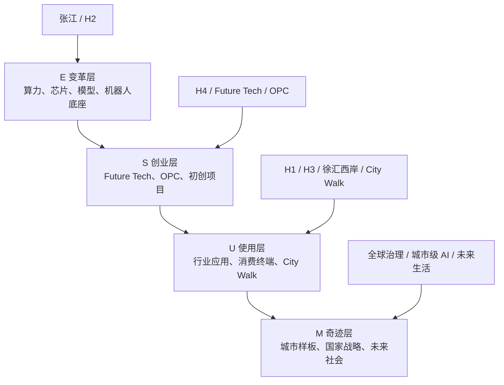

# 00. 顶层：从 WAIC 重新理解 AI 全景与 MUSE 模型

> 这篇不是 WAIC 的事实清单，而是我对这次学习的顶层定位：为什么研究一次大会，能够变成一次 AI 全局认知训练。  
> 核心参照：本地知识库中的 MUSE 模型，以及这次 WAIC 研究形成的展览、City Walk、创业生态、OPC 等文档。

---

## 1. 这次 WAIC 研究的真正价值

这次研究上海 WAIC，不只是为了知道大会里有哪些论坛、展馆、机器人、初创公司和 City Walk。更大的价值在于：它第一次把我手里正在做的 AI 事情，和国家级 AI 产业结构放到同一张图里。

我平时关注的事情包括：

- OPC、一人公司、独立开发者。
- AI 教育、AI 训练营、系统学习。
- AI 协作、AI 团队、OPT。
- 创业服务、创业项目判断、AI 产品设计。
- 具体工具、Agent、内容生产、工作流封装。

这些事情如果单独看，容易变成碎片：一个工具、一个案例、一个产品、一个展品、一个创业团队。但 WAIC 提供了一个更大的容器：它把底层算力、模型、智能体、机器人、行业应用、创业生态、城市体验、全球治理和青年人才放在同一个场域里。

所以这次学习的重点，不是“记住 WAIC 展了什么”，而是借 WAIC 建立一个 AI 全景坐标系：

```text
底层技术如何变成创业机会？
创业项目如何变成用户场景？
用户场景如何变成城市级体验？
城市级体验如何映射国家 AI 战略？
我自己的工作又处在哪一层？
```

---

## 2. MUSE 模型：理解 AI 的四层地图

本地知识库中的 MUSE 模型，把 AI 认知分成四层：

```text
MUSE = Miracle · Usage · Startup · Evolution

M - Miracle   奇迹层：未来愿景、文明影响、长期社会变化
U - Usage     使用层：AI 工具应用、降本增效、工作与生活落地
S - Startup   创业层：AI 原生创业、独立产品、一人公司、小团队
E - Evolution 变革层：底层技术、模型、算法、算力和前沿突破
```

它有两个方向：

1. 认知排列：M -> U -> S -> E  
   从人最容易感知的愿景、使用、创业，逐步走到底层技术。

2. 变化传导：E -> S -> U -> M  
   底层技术突破，带来新的创业机会；大量 AI 产品出现后，进入公司和个人使用；当亿级用户被改变，最终才形成文明级和社会级变化。

这次 WAIC 特别适合作为 MUSE 的练习场，因为它四层都在：

| MUSE 层级 | WAIC 中的对应内容 | 我应该怎么看 |
|---|---|---|
| E 变革层 | 芯片、算力、超节点、智算中心、基础模型、具身智能底座 | 看 AI 能力从哪里来，成本结构如何变化 |
| S 创业层 | H4 Future Tech、150+ 初创公司、OPC 挑战赛、一人公司 | 看新产品、新工作流、新团队形态在哪里出现 |
| U 使用层 | H1 行业应用、徐汇西岸消费 AI、City Walk、AI 眼镜、机器人咖啡 | 看 AI 如何进入真实工作、消费和生活 |
| M 奇迹层 | 全球治理、城市 AI 样板、AI 进入社会基础设施、未来生活想象 | 看 AI 如何改变城市、产业、教育和人的能力边界 |

这也是我这次最大的感受：WAIC 不是单一展会，而是一个 MUSE 模型的立体样本。

---

## 3. 用 MUSE 重新看 WAIC 的空间结构

WAIC 2026 的展览布局是“三地四馆”，其中：

- 张江科学会堂偏 E：芯片、智算、算力基础设施。
- 世博展览馆 H2 偏 E：硬科技和技术底座。
- 世博展览馆 H1 偏 U/S：行业应用、智能体、企业工作流。
- 世博展览馆 H3 偏 U/E：机器人、具身智能、物理世界执行。
- 世博展览馆 H4 偏 S：Future Tech、初创公司、OPC、创投生态。
- 徐汇西岸偏 U：消费级 AI、未来生活、AI 终端。
- City Walk 偏 U/M：AI 走进街区、商业、文旅和城市体验。
- 论坛和全球治理偏 M：文明级、国家级、治理级问题。

可以画成这样：



这张图给我的启发是：我不能只盯着最热闹的应用和创业故事，也要看它们背后的底层变化；不能只看底层技术，也要看它如何穿透到用户、城市和教育。

---

## 4. OPC 与 OPT：WAIC 的创业热点和一堂体系的延展

WAIC 2026 很重视 OPC：独立先锋挑战赛、一人公司、独立开发者、开源项目、小团队，都被放进正式展区和赛事系统里。

这说明 AI 正在改变创业的最小单元：

- 一个人可以写代码、做调研、做设计、做内容、做产品原型。
- 小团队可以快速完成过去大团队才能完成的 Demo。
- 一个创意可以通过 AI、开源模型、Agent、云平台迅速变成可展示产品。

但从一堂体系看，OPC 还不是终点。云开发文档里的“一人团队”课程提醒了一个更重要的升级：

```text
OPC = One Person Company
强调一个人也能创业。

OPT = One Person Team
强调一个人要能调动一支 AI 团队。
```

OPC 容易让人想象成“一个人独自扛所有事情”。但真正长期有效的能力，可能不是一个人变成超人，而是一个人能够搭起稳定的 AI 协作系统：

- 有长期上下文。
- 有固定角色。
- 有稳定技能。
- 有可复用文档。
- 有多线程推进能力。
- 有持续沉淀的资产。

所以 WAIC 的 OPC 对我来说，不只是创业赛事，而是一个提醒：AI 降低了创业门槛，但真正的竞争力，不只是会用 AI 做出一个 Demo，而是能不能把 AI 工作方式变成可迁移、可复用、可迭代的系统。

---

## 5. 我自己的系统学习课题

这次 WAIC 可以转化为一组系统学习课题，而不是一次性资料收集。

### 5.1 AI 分层和产业链框架

目标：建立 AI 全产业链地图。

要理解：

- 算力、芯片、数据中心、液冷、超节点。
- 基础模型、多模态模型、世界模型、智能体。
- 行业应用、企业工作流、政企服务。
- 具身智能、机器人、AI 终端。
- 创业生态、投资、采购、场景验证。

这对应 MUSE 里的 E -> S -> U 传导链。

### 5.2 MUSE 模型和 WAIC 对应关系

目标：==用 MUSE 做研究坐标，而不是被大会信息淹没。==

每看一个展品、项目、论坛或创业团队，都问：

- 它在 E/S/U/M 哪一层？
- 它是底层变化、创业机会、使用场景，还是未来想象？
- 它往上一层会带来什么？
- 它往下一层依赖什么？

### 5.3 微观工作与宏观战略的层级推导

目标：理解我自己的 AI 工作和国家 AI 战略之间的层级关系。

比如：

- 我做的 AI 教育和训练营，属于 U/S：帮助人从使用层走向创业层和系统能力。
- 我关注 OPC/OPT，属于 S/U 的交界：小团队创业与个人工作系统升级。
- 我做创业服务，属于 S：帮助项目判断需求、方案、商业模式、增长和壁垒。
- WAIC 展示的算力、机器人和城市体验，则把我的微观工作放进更大的 E/M 结构中。

这能避免两种问题：

- 只做微观工具，缺少大势判断。
- 只谈宏观趋势，落不到训练和产品。

### 5.4 从硬技术到软生活场景的打通

目标：真正理解 AI 是如何从最硬的技术走到最软的生活体验。

WAIC 的链路非常清楚：

```text
芯片和算力
  -> 模型和智能体
  -> 行业应用和机器人
  -> 消费终端和城市空间
  -> City Walk、AI 咖啡、AI 试衣、AI 酒吧、AI 文旅
```

这条链路对教育和创业服务很有启发：很多人不是从芯片理解 AI，而是从一杯机器人咖啡、一次 AI 试衣、一个 AI 助手开始建立体感。系统学习要能兼容这两端：既能讲底层，也能让人有身体感受和产品感受。

---

## 6. 这次专题可以形成的学习产品雏形

如果把这次 WAIC 研究变成一个“简单专题学习”产品，它不应该只是资料包，而可以设计成一个四层学习路径：

1. 先建立全景：WAIC 是什么，三地四馆怎么分，AI 产业链在哪里。
2. 再进入 MUSE：用 MUSE 把大会内容分层，不再碎片化理解。
3. 再看创业生态：Future Tech、OPC、H4、投资人、采购团，理解 AI 创业机会。
4. 最后回到自己：我在哪一层，我要补哪一层，我的 AI 工作系统如何升级。

这个专题最适合解决的问题是：

> 一个创业者、教育产品设计者、AI 学习者，如何通过一次国家级 AI 大会，建立自己的 AI 全局认知？

---

## 7. 下一步可以继续补的内容

1. 做一张「WAIC x MUSE」总图，把所有已写文档映射到四层。
2. 把 H4 初创项目按 MUSE 和一堂五步法重新分类。
3. 把 City Walk 作为 Usage 层案例，分析“AI 如何进入身体体验和城市消费”。
4. 把 OPC 与 OPT 做一篇独立对比：AI 一人公司 vs AI 一人团队。
5. 把这次专题整理成一套 30-60 分钟内部分享稿。

---

## 8. 本地依据

- MUSE 模型说明：`/Users/xuchu/Documents/我的内容库/10-分类整理和算法/框架：认识MUSE模型.md`
- MUSE 核心课程索引：`/Users/xuchu/Documents/我的研究团队/36. AI理论：MUSE/核心课程索引.md`
- MUSE 认知课程：`/Users/xuchu/Documents/我的研究团队/36. AI理论：MUSE/关键课程逐字稿/人工智能认知篇.md`
- AI 第一课 v2.0：`/Users/xuchu/Documents/我的研究团队/36. AI理论：MUSE/关键课程逐字稿/全员必修：人工智能第一课 v2.0.md`
- 一人团队 / OPT 课件片段：`/Users/xuchu/云开发文档/飞书HTML项目-360AI原生训练营/part-02.source.html`
- 本专题已写文档：`01` 至 `05` WAIC 系列研究文档。

---


# 附录：我的原始激发（保留原文）


# 第一次激发

这是一次非常难得的，把我手里的AI事情（OPC，教育，培训，创业服务）和国家层面产生层级联系，第一次从MUSE模型角度系统理解AI全产业链大会，是一个极好的MUSE模型实践机会。

碎片化的案例和见识，具体的产品设计，固然有些帮助，
但更重要的是建立更大尺度的认知系统。
能看到整个全局视角的AI大的图景。

系统认识和学习：
1. AI分层和产业链框架。
2. MUSE模型和对应关系。
3. 微观工作和宏观国家AI战略的层级和推导。
4. 从最硬核的技术到最soft的AI生活场景打通。


# 第二次激发


用MUSE模型重构整个理解：
1. 为什么混乱（碎片，单点，缺少全局，产业链难以理解）
2. 解读MUSE模型的价值和精髓（分层，依赖关系）
3. MUSE模型和大会的各个模块的对应
4. 每一层的核心任务，代表性技术和公司，新变化和趋势

系统理解的价值，写进10文档；


