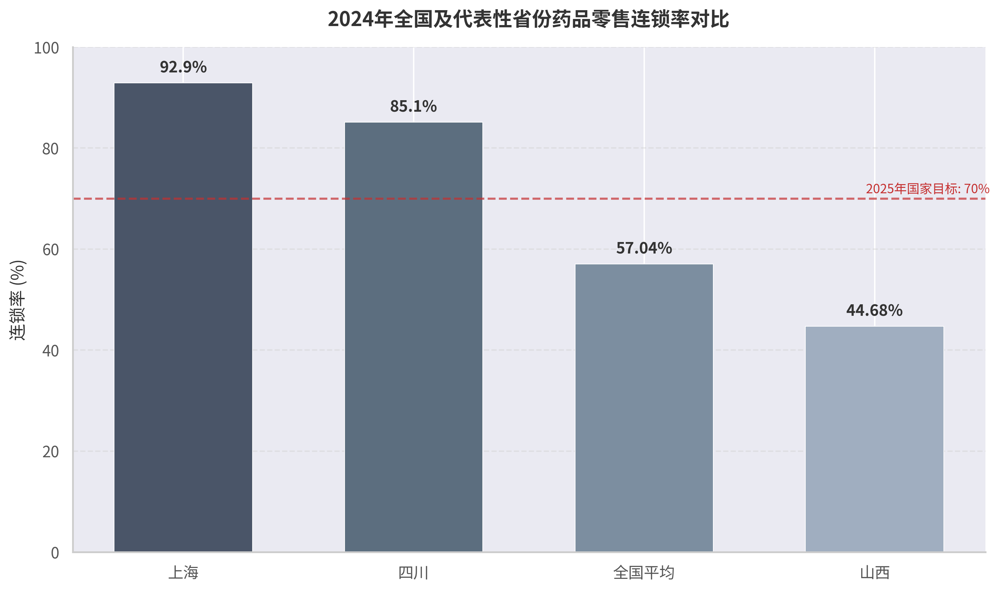

# 1. 政策背景与制度框架

## 1.1 国家药品零售监管法规体系

### 1.1.1 五层级法规体系：从法律到地方立法

中国药品零售监管法规体系呈现典型的金字塔结构，由五个层级构成，效力自上而下递减，规范密度则逐级递增。第一层为法律，以《中华人民共和国药品管理法》（2019年修订）为统领，确立药品经营的基本制度框架与底线要求；第二层为行政法规，2026年1月16日公布的《药品管理法实施条例》（国务院令第828号）于2026年5月15日起施行，将法律原则转化为可操作的行政规则；第三层为部门规章，以国家市场监督管理总局令第84号《药品经营和使用质量监督管理办法》为核心，细化许可程序、质量管理、网络销售等具体制度；第四层为规范性文件，包括国家药监局2024年第48号公告《关于进一步做好药品经营监督管理有关工作的公告》以及2026年5月25日发布的《处方药网络零售合规指南》（药监综药管函〔2026〕282号），主要承担技术标准与政策指引功能；第五层为地方立法，即各省药监局及行政审批部门结合本地实际制定的许可细则、设置标准与监督管理规范性文件。[^nmpa-drug-law][^state-council-828][^nmpa-84-order][^nmpa-48-notice][^nmpa-compliance-guide]

上述五层级并非简单的线性叠加，而是存在复杂的授权与限制关系。法律与行政法规设定刚性底线，部门规章与规范性文件在底线之上划定操作空间，地方立法则在授权范围内进行差异化创新。理解这一层级关系，是评估山西省新规合法性与创新边界的前提。

**表1 国家药品零售监管法规五层级体系架构**

| 层级 | 核心文件 | 关键条款 | 对地方创新的授权空间 | 对地方创新的限制边界 |
|:---|:---|:---|:---|:---|
| 法律 | 《药品管理法》（2019年修订） | 第52条（经营条件）、第53条（GSP与鼓励连锁）、第54条（处方药/OTC分类管理） | "相适应"等弹性表述允许地方结合实际细化面积、设备标准；第53条"鼓励连锁"为地方设定连锁门槛提供政策导向 | 药师配备为强制性要求，地方不得取消；经营场所、设备、仓储设施为刚性条件，地方不得降低标准；处方药/OTC分类属性由国务院药监部门制定，地方无权变更 |
| 行政法规 | 《药品管理法实施条例》（国务院令第828号，2026.5.15施行） | 第42条（许可程序，20个工作日）、第43条（乙类OTC配备弹性；处方药凭处方销售）、第52条（鼓励信息化处方传递） | 许可程序授权地方探索告知承诺制、电子审批；乙类OTC配备标准可由国家药监部门规定后地方细化；信息化处方传递为电子处方流转提供依据 | 20个工作日为法定上限，地方可缩短但不得延长；处方药凭处方销售为刚性要求，不得突破 |
| 部门规章 | 《药品经营和使用质量监督管理办法》（84号令） | 第7条（省级药监制定检查细则）、第43条（"七统一"管理）、第48条（跨省设仓库） | 省级药监可制定检查细则；连锁总部跨省设仓库程序为山西"跨省配送中心"提供参照 | 跨省设仓库需取得仓库所在地省级药监部门同意；GSP检查细则不得降低国家指导原则标准 |
| 规范性文件 | 48号公告（2024年） | 第7条（自助售药机仅售乙类OTC）、第9条（连锁总部跨省设仓库参照批发企业）、第12条（地方可制定配套文件） | 第12条直接授权地方"结合实际制定配套文件"，是山西新规最核心的合法性依据之一 | 第7条明确自助售药机不得销售甲类OTC和处方药，地方不得突破 |
| 规范性文件 | 《处方药网络零售合规指南》（2026年） | 处方审核由执业药师开展，不得由AI代为实施；日均审方量建议控制在300张以内 | 为地方智慧药房、远程审方提供全国统一标准参照；地方可在不低于该标准前提下细化 | 处方审核人为责任为底线，地方不得允许AI自动审方或降低审方人员资质要求 |

该体系的核心逻辑在于：药品安全属于中央事权中的监管标准制定权，但具体许可程序、检查细则、业态创新试点等执行性事务存在明确的省级授权空间。48号公告第12条明确"各级药品监督管理部门依据《办法》和本公告要求，可以结合工作实际制定配套文件"，这一条款实质上为山西省制定药品零售经营监督管理办法提供了直接的规范性文件依据。[^nmpa-48-notice]

### 1.1.2 核心上位法对地方创新的授权空间与限制边界

《药品管理法》第52条要求药品经营企业配备"依法经过资格认定的药师或者其他药学技术人员"，并具备"与所经营药品相适应的营业场所、设备、仓储设施"。其中"相适应"一词为标准弹性表述，省级监管部门可据此设定差异化的面积门槛——山西省办法将单体药店面积定为70平方米、连锁门店定为40平方米、仅经营乙类OTC定为20平方米，正是对这一弹性空间的合理利用。然而，该条款同时明确GSP由"国务院药品监督管理部门制定"，地方仅能在执行层面制定检查细则，无权变更GSP的核心标准。[^nmpa-drug-law]

《药品管理法实施条例》第43条构成地方政策创新的另一关键授权节点。该条规定"只经营乙类非处方药的药品零售企业，可以按照国务院药品监督管理部门的规定配备药学技术人员"，这意味着国务院药监部门有权为乙类OTC零售企业制定特殊的药师配备标准，省级部门在授权范围内可进一步细化。山西省办法据此对仅经营乙类OTC的企业实行告知承诺制，申请人向县级行政审批部门申请，符合条件的当日颁发许可证，属于对上位法授权空间的合理运用。但同条亦明确规定"药品零售企业应当凭处方销售处方药"，构成不可突破的刚性底线。[^state-council-828]

在跨省经营方面，《药品经营和使用质量监督管理办法》第48条为批发企业跨省设置仓库建立了协商机制："药品批发企业所在地省级药品监督管理部门商仓库所在地省级药品监督管理部门同意后，符合要求的，按照变更仓库地址办理。"48号公告第9条进一步将这一机制扩展至连锁总部。山西省办法据此允许连锁总部跨省设置配送中心，属于对既有规则的扩展适用，合规性基础较为扎实，但需满足"取得仓库所在地省级药监部门同意"这一程序要件。[^nmpa-84-order][^nmpa-48-notice]

值得关注的是智慧药房（柜）的合规边界。48号公告第7条明确"自助售药机不得销售甲类非处方药和处方药"，将自助售药机的销售范围严格限定为乙类OTC。山西省办法将"智慧药房（柜）"界定为与"自助售药机"不同的业态，前者可销售处方药，但需具备互联网诊疗、远程药学服务设备和能力，确保处方经执业药师审方后方可调配。这一创新是否构成对上位法的突破，取决于"智慧药房（柜）"在功能上是否可被归入48号公告所称的"自助售药机"范畴。若监管部门在后续执法中将二者视为同类设备，则存在较高的合规风险。[^nmpa-48-notice]

## 1.2 山西省政策出台背景

### 1.2.1 行业"小而散"：连锁率缺口作为核心驱动力

山西省药品零售行业的结构性短板是理解本次政策出台逻辑的关键切入点。根据山西省商务厅、山西省工业和信息化厅2024年9月发布的《山西省现代医药产业链中长期发展规划（2024—2026年）》，截至2023年底，全省共有药品经营企业18,039家，其中批发企业339家、总部连锁企业103家、连锁门店7,863家、单体药店9,734家，零售板块连锁率仅为44.68%。[^shanxi-industry-plan]

这一数据在全国坐标系中处于明显偏低位置。国家药监局发布的《药品监督管理统计年度数据（2024年）》显示，截至2024年底，全国零售药店总数为683,666家，其中零售连锁门店389,951家、单体药店293,715家，全国连锁率由2023年的57.81%微降至57.04%。[^nmpa-stats-2024] 山西省的44.68%不仅低于全国平均水平约13个百分点，更与商务部《"十四五"时期促进药品流通行业高质量发展的指导意见》提出的"2025年药品零售连锁率接近70%"目标存在超过25个百分点的差距。[^mofcom-14th-plan]

**表2 山西与全国及主要省份药品零售连锁率对比（2023–2024年）**

| 地区 | 连锁率（%） | 统计年份 | 药店总数（家） | 连锁门店（家） | 单体药店（家） | 与全国平均差距（百分点） |
|:---|:---|:---|:---|:---|:---|:---|
| 上海 | 92.90 | 2024 | ~4,800 | ~4,460 | ~340 | +35.86 |
| 四川 | 72.50 | 2024 | ~50,000 | ~36,250 | ~13,750 | +15.46 |
| 山东 | 62.00 | 2024 | ~48,000 | ~29,760 | ~18,240 | +4.96 |
| 广西 | 60.00 | 2024 | ~18,000 | ~10,800 | ~7,200 | +2.96 |
| 全国 | 57.04 | 2024 | 683,666 | 389,951 | 293,715 | — |
| 全国 | 57.81 | 2023 | 666,960 | 385,594 | 281,366 | — |
| 浙江 | 48.00 | 2024 | ~22,000 | ~10,560 | ~11,440 | −9.04 |
| 湖北 | 46.00 | 2024 | ~20,000 | ~9,200 | ~10,800 | −11.04 |
| 山西 | 44.68 | 2023 | 17,700 | 7,863 | 9,734 | −12.33¹ |
| 广东 | 47.00 | 2024 | ~60,000 | ~28,200 | ~31,800 | −10.04 |
| 福建 | 45.00 | 2024 | ~12,000 | ~5,400 | ~6,600 | −12.04 |

¹ 山西数据为2023年底统计，与2024年全国数据存在时间差，但即便以同期口径比较，山西仍显著低于全国平均。数据来源：山西省商务厅、国家药监局统计年度数据、行业研究综合测算。[^shanxi-industry-plan][^nmpa-stats-2024]

从空间分布看，山西连锁率偏低并非孤立现象。福建、广东、浙江等民营经济活跃省份同样存在连锁率低于50%的情况，其背后反映了单体药店在特定区域市场仍具备较强的成本适应性与经营灵活性。然而，山西的特殊性在于：其医药零售市场规模约112.8亿元（2023年），占全国份额仅2.19%，店均服务人口2,136人，略低于全国2,155人水平，行业整体增长乏力，大部分企业销售额较2022年出现下滑。[^china-pharmacy-mag] 在增量空间有限的前提下，通过政策手段推动存量整合、提升行业集中度，成为监管部门的可行选择。

山西省办法的制度设计直接回应了这一结构性缺口。单体药店经营面积门槛设定为70平方米，连锁门店仅为40平方米，二者之间30平方米的差距构成了明确的梯度化激励——单体药店若不愿承担更高的面积成本，可选择加盟连锁或被收购整合。同时，10家门店的连锁准入门槛、许可证有效期内门店数量不达标即撤销的"硬约束"，以及收购兼并期间不暂停经营等便利化条款，均指向同一政策目标：压缩单体药店生存空间，推动资源向连锁体系集中。参照山东、北京、广东等省份在提高连锁门槛后的经验，山西连锁率预计在办法施行后2至3年内由44.68%向55%–60%区间跃升。

### 1.2.2 政策制定过程：从制度碎片化到省级统一规章

在国家层面药品零售监管框架密集更新的背景下，山西省此前缺乏一部系统整合药品零售经营许可、连锁管理、网络销售、新业态监管等内容的省级专门规章，存在制度碎片化与监管标准不统一的问题。2024年1月1日施行的《药品经营和使用质量监督管理办法》（84号令）、2022年12月1日施行的《药品网络销售监督管理办法》以及2026年5月25日发布的《处方药网络零售合规指南》，均要求省级监管部门制定配套落地细则。山西省的滞后不仅造成监管执法依据分散，也使得企业在跨区域经营时面临标准不一的合规成本。

山西省药品监督管理局联合山西省行政审批服务管理局于2026年2月12日印发《药品零售经营监督管理办法（试行）》（晋药监规〔2026〕7号），自2026年5月1日起施行，有效期至2028年4月30日，试行期为两年。[^shanxi-regulation] 文件由药监局与行政审批局联合发布，体现了行政许可权与监管执法权在省级层面的协调配置：省药监局负责连锁总部的许可与监管，市县市场监管部门及行政审批部门负责单体药店和连锁门店的许可与日常监督。这种"分级审批、联合检查"的体制安排，与《药品管理法实施条例》第42条"向所在地县级以上地方人民政府药品监督管理部门提出申请"的规定相衔接，同时在程序上增加了"行政审批部门的人员和药品流通检查员联合开展现场检查"的要求，强化了技术审评与行政审批的协同。[^state-council-828]

两年试行期的设定具有明确的政策评估意图。办法第六十一条规定"已取得许可证的单体药店或连锁门店变更经营地址、仓库地址的应符合本办法要求；其他企业以许可证有效期为准，在届满前达到要求"，这意味着存量企业不立即受新规冲击，但须在许可证届满前完成达标。2028年4月30日的有效期节点，为监管部门提供了充足的政策评估窗口，以便根据行业反馈决定是否将部分条款固化或调整。

### 1.2.3 与"放管服"改革和"四个最严"监管原则的平衡

山西省办法的立法定位需要在两条政策主线之间寻求平衡：一是国务院持续推进的"放管服"改革，强调简政放权、优化审批流程、降低制度性交易成本；二是药品监管领域长期坚持的"四个最严"原则，即最严谨的标准、最严格的监管、最严厉的处罚、最严肃的问责。[^beijing-yjj-4-strict]

在"放"的维度，山西省办法纳入了多项便利化措施。仅经营乙类OTC的企业实行告知承诺制，申请人向县级行政审批部门申请，符合条件的当日颁发许可证，自许可决定作出之日起3个月内由药监部门开展事后核查。这一制度并非山西独创，新疆、广西北海、河北保定、福建泉州、广东汕尾等地此前均已实施，属于国务院"放管服"改革在药品零售领域的通行做法。[^xinjiang-promise][^beihai-promise][^baoding-promise][^quanzhou-promise][^shanwei-promise] 此外，单体药店变更为连锁门店时，若营业场所、仓库地址、质量管理体系未发生变化，可免现场检查；连锁企业通过收购兼并增加门店期间，可不暂停原有经营活动。这些条款显著降低了行业整合的制度性交易成本。

在"管"的维度，办法设置了严格的底线约束。单体药店法定代表人须具有执业药师资格；连锁总部质量负责人须具有执业药师资格、3年以上药品经营质量管理工作经历且本科以上学历；远程药学服务不得取代驻店执业药师，且不得采用人工智能对处方药自动审方；药品零售企业须建立覆盖采购、储存、销售全流程的追溯体系，实施全品种追溯码信息采集与上传。信用监管与分级分类管理也被写入省级规章，第五十八条明确要求"完善并执行失信行为认定、记录、归集、共享、公开、惩戒和信用修复等机制"。[^shanxi-regulation]

两条主线之间的平衡机制可概括为"宽进严管、放管结合"。告知承诺制压缩了准入时间，但不改变事中事后监管强度——企业承诺不属实将被撤销许可并列入失信名单。鼓励连锁经营与统一采购配送降低了流通成本，但"七统一"管理和门店不得自行采购的刚性约束强化了总部对门店的质量主体责任。智慧药房等新业态获得制度准入，但处方来源真实性、执业药师远程审方、温湿度自动监测等技术要求构成叠加式监管屏障。这一平衡逻辑与国务院办公厅2025年1月3日印发的《关于全面深化药品医疗器械监管改革促进医药产业高质量发展的意见》精神一致：在鼓励创新的同时，"严格药品安全监管"，确保"促发展"不偏离"保安全"的轨道。[^state-council-quality-dev]

---

[^nmpa-drug-law]: 《中华人民共和国药品管理法》，2019年8月26日修订。https://www.nmpa.gov.cn/xxgk/fgwj/flxzhfg/20190827083801685.html

[^state-council-828]: 《中华人民共和国药品管理法实施条例》，国务院令第828号，2026年1月16日公布，2026年5月15日施行。https://www.gov.cn/zhengce/content/202601/content_7056255.htm

[^nmpa-84-order]: 《药品经营和使用质量监督管理办法》，国家市场监督管理总局令第84号，2023年9月27日公布。https://www.nmpa.gov.cn/xxgk/zhcjd/zhcjdyp/20231013150429168.html

[^nmpa-48-notice]: 国家药监局《关于进一步做好药品经营监督管理有关工作的公告》（2024年第48号），2024年4月22日。https://www.nmpa.gov.cn/xxgk/ggtg/ypggtg/ypqtggtg/20240422170840151.html

[^nmpa-compliance-guide]: 《处方药网络零售合规指南》，国家药监局综合司，药监综药管函〔2026〕282号，2026年5月25日。https://www.nmpa.gov.cn/xxgk/fgwj/gzwj/gzwjyp/20260525142536103.html

[^shanxi-industry-plan]: 山西省商务厅、山西省工业和信息化厅《山西省现代医药产业链中长期发展规划（2024—2026年）》，2024年9月5日。http://swt.shanxi.gov.cn/xxgk/xxgkzl/xxgklm/gztz_69874/202409/t20240905_9648145.shtml

[^nmpa-stats-2024]: 国家药监局《药品监督管理统计年度数据（2024年）》，行业分析引用。http://mp.weixin.qq.com/s?__biz=MjM5NDEwMDQ2Mg==&mid=2658693111

[^mofcom-14th-plan]: 商务部《关于"十四五"时期促进药品流通行业高质量发展的指导意见》。

[^china-pharmacy-mag]: 《中国药店》杂志，2024年6月6日。http://www.ydzz.com/zgyd.php?col=22&file=65841

[^shanxi-regulation]: 山西省药品监督管理局、山西省行政审批服务管理局《药品零售经营监督管理办法（试行）》（晋药监规〔2026〕7号），2026年2月12日印发。https://m.ciopharma.com/supervise/60951

[^beijing-yjj-4-strict]: 北京市药品监督管理局《与时代同行，谱写药品监管新篇章》，2025年11月24日。https://yjj.beijing.gov.cn/yjj/zwgk20/gg17/1694968/index.html

[^state-council-quality-dev]: 国务院办公厅《关于全面深化药品医疗器械监管改革促进医药产业高质量发展的意见》，2025年1月3日。https://www.nmpa.gov.cn/xxgk/fgwj/qita/20250103170940152.html

[^xinjiang-promise]: 新疆推行药品经营许可换证"告知承诺制"，2022年7月6日。https://new.qq.com/rain/a/20220706A035BU00

[^beihai-promise]: 北海发出首张"告知承诺制"药品经营许可证，人民网广西频道，2023年8月15日。http://gx.people.com.cn/n2/2023/0815/c407813-40532652.html

[^baoding-promise]: 保定颁发首张"告知承诺制"药品经营许可证，长城网，2023年7月19日。

[^quanzhou-promise]: 泉州推行乙类非处方药经营许可告知承诺，泉州市市场监管局，2022年12月30日。

[^shanwei-promise]: 汕尾市对部分食品、药品经营许可推行告知承诺制，2026年5月26日。http://www.gdhf.gov.cn/scjdglj/zwgk/0700/0705/content/post_1050422.html
