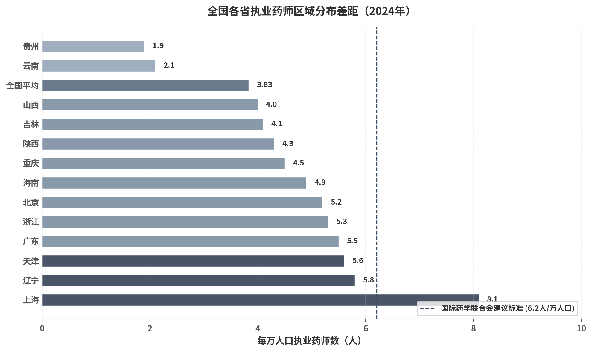

## 6. 远程药学服务与远程审方政策全国对比

远程审方（Remote Prescription Review）是指药品零售连锁企业总部或第三方机构通过远程网络审方系统，为连锁门店提供在线处方审核与合理用药指导的服务模式。该政策最早可追溯至2013年湖南省长沙市试点，初衷是在执业药师数量严重不足的背景下，通过“互联网+药品流通”技术实现执业药师资源的集约化配置 [^dim05-1]。截至2019年，全国已有山东、河北、黑龙江、湖南、海南、陕西、山西、福建、云南等省宣布全面推行远程审方政策 [^dim05-2]。然而，2024—2026年间，随着国家层面监管框架的收紧，各省远程审方政策在人员配备、审批流程、服务范围及技术标准的分化趋势逐渐显现，并呈现出从“替代驻店”向“仅作补充”的政策收敛态势。

### 6.1 各省远程审方核心要素对比

#### 6.1.1 人员配备：基数门店与执业药师比例分化显著

各省对远程审方中心执业药师的配备要求差异显著，主要体现在基数门店数量和增量配比两个维度。云南以10家门店配3名执业药师、每增15家增1名的标准，使1名执业药师理论上可覆盖约5家门店，配比最为宽松；福建要求20家门店基数3名、每增10家增1名，覆盖比例次之；北京、重庆采用30家基数3名、每增10家增1名的标准，介于宽松与严格之间 [^dim05-3]。山西省在2026年新规中未按门店比例硬性规定，而是要求远程药学服务部原则上不少于2名执业药师，具体数量与服务范围和规模相匹配，这一表述赋予企业更大灵活性，但也增加了合规不确定性 [^shanxi-1]。

从门店药师替代政策看，分化更为严重。云南、福建、湖南、黑龙江、重庆、辽宁等省份允许远程审方在一定程度上替代门店执业药师配备，门店只需配备较低资质的药学技术人员即可；而山西、陕西、北京、上海等地则明确远程审方不得替代驻店执业药师，仅作为不在岗期间或非工作时段的补充 [^dim05-4]。以云南为例，开展远程审方业务的连锁门店可不再配备执业药师，仅需至少1名依法经过资格认定的药学技术人员作为质量负责人 [^yunnan-1]；而山西则明确“不得以远程药学服务取代执业药师驻店配备”，且远程药学服务只能为下属连锁门店提供，不得对其他药品零售和连锁企业提供远程审方等药事服务 [^shanxi-2]。

下表对10个代表性省份的远程审方核心要素进行12维度系统对比：

| 维度 | 云南 | 福建 | 北京 | 山西 | 湖南 | 陕西 | 黑龙江 | 重庆 | 辽宁 | 上海 |
|:---|:---|:---|:---|:---|:---|:---|:---|:---|:---|:---|
| 政策时间 | 2019-08 | 2019-07 | 2025-03 | 2026-05 | 2019-04 | 2022-12 | 2019-08 | 2019-08 | 征求意见 | 2024-08 |
| 基数门店 | 10家 | 20家 | ≤30家 | 未按比例 | 20家 | 30家 | 20家 | 30家 | 10家 | 未按比例 |
| 基数药师 | 3名 | 3名 | 3名 | ≥2名 | 3名 | 3名 | 3名 | 3名 | 3名 | ≥2名 |
| 增量配比 | 每增15家增1名 | 每增10家增1名 | 每增10家增1名 | 按规模匹配 | 每增20家增1名 | 每增15家增1名 | 每增20家增1名 | 每增10家增1名 | 每增10家增1名 | 按规模匹配 |
| 能否替代驻店药师 | **可替代** | **可替代** | **不可替代** | **明确不可** | **可替代** | **明确不可** | **可替代** | **可替代** | **可替代** | **明确不可** |
| 门店最低配备 | 1名药学技术人员 | 1-2名药学技术人员 | 须配执业药师 | 须配执业药师 | 1名药学技术人员 | 须配执业药师 | 1名药学中专以上人员 | 药师以上或药学中专以上 | 其他药学技术人员 | 须配执业药师 |
| 跨企业服务 | 鼓励第三方 | 仅限所属门店 | 集团内共享 | **明确禁止** | 未明确 | 仅限自建中心 | 仅限连锁总部 | 可委托第三方 | 仅限所属门店 | 仅限总部 |
| 审批要求 | 州/市局初审，省局批准 | 无需审批，向属地报告 | 纳入许可管理 | 药监审批，医保备案 | 鼓励支持 | 省局验收公示 | 未明确 | 按程序报备 | 未明确 | 信息填报 |
| AI审方 | 未明确 | 未明确 | 未明确 | **明确禁止** | 未明确 | 未明确 | 未明确 | 未明确 | 未明确 | **明确禁止** |
| 特殊药品限制 | 未明确 | 未明确 | 毒性药品、二类精神药品等依照规定 | **毒性药品、二类精神药品、含特殊药品复方制剂不得远程审方** | 未明确 | 从其规定 | 未明确 | 电子处方限于常见病、慢性病复诊 | 未明确 | **毒性药品、二类精神药品、含特殊药品复方制剂不得远程审方** |
| 中药类比例 | 经营中药饮片需配中药师 | 至少1名中药师 | 未单独规定 | 未单独规定 | 中药类≥30% | 中药类≥30% | 1名须为执业中药师 | 中药类≥25% | 至少1名执业中药师 | 未单独规定 |
| 监管接入 | 未明确 | 未明确 | 未明确 | 配合事中事后检查 | 未明确 | 省局实时监控 | 未明确 | 开放数据接口 | 未明确 | 未明确 |

*数据来源：各省药监局公开文件、政策解读及合规查查CIO在线汇总 [^dim05-3] [^yunnan-1] [^fujian-1] [^beijing-1] [^shanxi-1] [^hunan-1] [^shaanxi-1] [^heilongjiang-1] [^chongqing-1] [^liaoning-1] [^shanghai-1]。*

上表揭示了三条关键分化线。第一，在人员配比维度上，云南与江西（征求意见稿）分别处于宽松和严格的两极：云南10家基数3名、每增15家增1名，而江西要求30家基数5名、每增10家增1名，相当于1名执业药师覆盖约6家门店，且对连锁企业规模设定不低于30家门店的门槛 [^jiangxi-1]。第二，在门店药师替代政策上，西南和东北省份普遍允许远程审方替代驻店执业药师，而华北、华东和西北省份则坚持“不可替代”的底线。第三，在跨企业服务维度上，山西明确禁止对外提供远程审方服务，是北京“集团内共享”模式的反向极端，反映出监管部门对“远程审方商业化外包”的审慎态度。

#### 6.1.2 审批流程：从实质性前置审批到企业自主行为

审批流程的差异直接影响远程审方中心的设立成本和合规风险。陕西省要求连锁企业总部向省局提交书面报告，经检查验收并公示后方可开展远程审方服务，属于实质性前置审批 [^shaanxi-1]。云南省采取州/市局初审、省局批准的两级审批制，兼顾了地方监管与省级统筹 [^yunnan-1]。与此形成鲜明对比的是，福建省明确连锁总部开展远程审方“属于企业自主行为，无需向省药品监督管理局申报审批”，仅需向属地稽查办公室报告并接受日常监管 [^fujian-1]。山西省2026年新规则采取“总部自我评价+药监审批+医保备案”的三重路径，要求企业认定符合要求后将评价情况和相关资料分别向省药品监督管理局及连锁门店许可证发证机关报告，并依法配合监督检查 [^shanxi-1]。这种审批模式的差异化，本质上是各省在“鼓励创新”与“审慎监管”之间的不同平衡点的体现。

#### 6.1.3 服务范围：集团内部共享与跨企业限制并存

在服务范围上，北京允许同一实际控制人或同一集团内的多个连锁总部共享远程审方中心，体现了对药品零售集团化、规模化发展的政策鼓励 [^beijing-1]。山西则明确远程药学服务“只能为下属连锁门店提供，不得对其他药品零售和连锁企业提供远程审方等药事服务”，这是目前省级文件中对服务范围限制最严格的表述 [^shanxi-2]。重庆走得更远，允许委托第三方机构开展远程药学服务，甚至单体药店也可申请参加，为第三方远程审方平台的发展提供了制度空间 [^chongqing-1]。云南亦明确鼓励药品零售企业采取向社会第三方购买服务的方式开展远程审方 [^yunnan-1]。两者看似矛盾，实则统一：政策鼓励内部资源整合，限制外部商业化跨企业服务，但允许第三方平台在合规前提下为分散的单体药店提供集约化服务。

### 6.2 AI审方与技术标准

#### 6.2.1 国家层面：2026年5月合规指南明确禁止AI替代审方

2026年5月25日，国家药监局正式发布《处方药网络零售合规指南》，以强制性用语明确：“药品网络零售企业要确保本企业的处方审核工作由执业药师开展，不得由其他岗位人员或者人工智能代为实施。” [^nmpa-guide-1] 对比2025年9月征求意见稿中“避免由其他岗位人员或人工智能代为实施”的温和措辞，正式版将“避免”升级为“不得”，约束力显著增强 [^nmpa-guide-2]。此外，第三方平台被赋义务“运用技术手段及时识别、拦截通过平台流转的人工智能处方和虚假处方” [^nmpa-guide-1]。该指南的出台，标志着远程审方从早期的“地方探索”进入“全国统一规范”阶段，对各省既有远程审方政策形成上位法约束。从行业影响看，京东健康2025年总收入734亿元，过去12个月年度活跃用户达2.18亿，已建成超万人药师队伍；阿里健康2026财年营收超342亿元，签约提供在线健康咨询服务的执业医师、药师和营养师合计近27万人 [^industry-1]。AI审方禁令意味着这些平台在审方环节的人力成本将直接上升，但也可能倒逼其药师队伍从“规模覆盖”向“专业服务”转型。

#### 6.2.2 地方层面：山西、上海先行禁止AI自动审方

在国家级指南出台前，部分省份已先行探索AI审方禁令。山西省（2026年2月）明确“不得采用人工智能对处方药自动审方”，是全国省级药品零售监管规章中最早将AI自动审方列为禁止性条款的省份之一 [^shanxi-1]。上海市（2024年8月）在《药品零售企业许可验收实施细则》中同样明确“不得采用人工智能对处方药自动审方” [^shanghai-1]。江西省（2024年9月征求意见稿）将“是否由人工智能代替执业药师本人审方”列为远程审方现场检查的重点内容之一 [^jiangxi-1]。地方政策对AI审方的态度经历了从“未提及”到“检查关注”再到“明令禁止”的演进，国家药监局2026年5月指南的发布，实际上是对山西、上海等地先行探索的确认与全国推广。

尽管AI被禁止替代执业药师进行最终审方决策，但行业共识认为AI在处方初筛、药物相互作用提示、剂量异常预警、历史用药记录调取等辅助环节仍可发挥价值 [^ai-aux-1]。最终判断“药该不该发、怎么发”只能由执业药师完成，这一边界已被国家法规和地方规章共同锁定。

#### 6.2.3 技术系统标准：硬件、软件与监管接入形成统一共识

各省对远程审方技术系统的硬件要求已逐渐形成高度共识。下表对比主要技术要素的典型参数要求：

| 技术要素 | 典型参数要求 | 适用省份/来源 |
|:---|:---|:---|
| 处方图像采集 | 高拍仪光学分辨率≥1600×1200 dpi；处方静态图像清晰可辨 | 新疆、福建、北京 |
| 视频对讲 | 动态像素≥130万像素；帧速≥20帧/秒；USB2.0接口 | 新疆远程审方系统标准 |
| 语音对讲 | 灵敏度-36dB±2dB；频率范围30-18000Hz；立体声 | 新疆远程审方系统标准 |
| 门店服务电脑 | 配置与总部相配套的远程审方管理软件 | 福建、山东 |
| 数据服务器 | 企业级专用数据服务器，双机热备；固定外网IP | 山东、陕西 |
| 不间断电源 | 备用发电机组或UPS，确保断电情况下平台正常运行 | 山东、陕西 |
| 生物识别 | 指纹确认、人脸识别，用于执业药师登录与审方签字确认 | 福建、江西、陕西 |

*数据来源：各省远程审方技术规范及地方标准文件 [^xinjiang-1] [^fujian-1] [^beijing-1] [^shaanxi-1] [^shandong-1] [^jiangxi-1]。*

在软件与数据管理层面，北京、福建、山东等地均要求远程审方操作系统具备与各门店实时连接、高清视频语音功能，能提供实时在线用药咨询、用药指导、处方审核等药学服务 [^beijing-1] [^fujian-1]。远程审方管理系统应当具有处方接收、分配、审核、统计及记录保存的功能，禁止修改、删除或外接设备导入数据信息 [^beijing-1] [^shanghai-1]。对未审核通过的处方或无处方情况，业务系统应自动锁定，拒绝调配和收银 [^shandong-1]。处方影像资料保存不少于1年；含麻黄碱类复方制剂等特殊管理药品的处方保存时间不少于2年 [^shandong-1] [^shaanxi-1]。

在监管接入模式上，陕西省要求企业在远程服务中心安装高清视频设备，通过互联网与药品监管部门连接，实现省药监局对执业药师远程服务情况的实时监控 [^shaanxi-1]。重庆要求企业向监管部门开放数据接口，接受实时全程监管 [^chongqing-1]。江西省（征求意见稿）要求现场检查至少抽查5家门店，重点检查是否由AI代替执业药师本人审方、是否存在挂证行为、电子处方是否合规 [^jiangxi-1]。未来技术监管的重点将从“有没有设备”转向“设备是否真实运行、执业药师是否本人操作”。

### 6.3 执业药师缺口与配置转型

#### 6.3.1 全国缺口约60万+，地域分布极不均衡

根据国家药监局执业药师资格认证中心数据，截至2025年7月底，全国注册执业药师833,291人，平均每万人口拥有5.9人 [^pharmacist-reg-1]。其中约91%注册于药品零售企业，即约75.7万人。然而，全国零售药店数量截至2024年6月已突破70万家 [^pharmacist-gap-1]。若按“每家药店至少配备2名执业药师”的严格标准测算，70万家药店需140万名执业药师，当前缺口约55—60万人。若进一步按中西药分开配备标准（经营中药饮片需另配执业中药师），缺口更为显著 [^pharmacist-gap-2]。

地域分布的失衡加剧了结构性矛盾。据各省药监局统计公报及中国药师协会数据，上海每万人口执业药师数约8.1人，而贵州仅约1.9人，二者相差超过4倍 [^pharmacist-dist-1]。东部地区注册执业药师占全国总量的52%以上，而西部地区占比不足21% [^pharmacist-dist-2]。仅下沉市场（乡镇、农村）执业药师缺口即超过20万人 [^pharmacist-gap-3]。这一分布特征与远程审方政策的区域分化形成微妙关联：允许远程审方替代驻店药师的省份多集中于西南和东北地区，恰恰是执业药师绝对短缺最为严重的区域；而坚持“不可替代”的华北、华东省份，其执业药师资源相对充裕，有条件维持更高的门店配备标准。

上图选取14个代表性省份及全国平均水平，以每万人口执业药师数为指标呈现区域分布差距。上海以8.1人/万人口位居全国前列，显著高于国际药学联合会建议的6.2人/万人口标准；而贵州、云南等省份低于全国平均的3.83—5.8人区间，与发达省份形成鲜明对比。这种分布不均意味着，即便远程审方技术可以跨地域调配药师资源，政策上仍受到“不得替代驻店药师”的刚性约束，使得偏远地区药店的合规压力难以通过技术手段完全缓解。

#### 6.3.2 政策组合拳推动执业药师配置从“数量刚性”向“结构弹性”转型

远程审方（总部共享）、药食同源免药师（特定品种）、AI辅助（非替代）、差异化配备（城乡差异）等一系列政策的组合，实质上是在不改变执业药师总量的情况下，通过结构优化来缓解60万+缺口压力。这一转型的核心逻辑在于：不改变“总量不足”的事实，但改变“配置结构”——通过远程审方使1名药师服务多家门店，通过药食同源豁免使部分药店暂免药师要求，通过AI辅助提高审方效率。这是一种务实的过渡策略，预示着未来执业药师管理可能从“一店一药师”的刚性模式，转向“集团共享+技术辅助+场景豁免”的弹性模式 [^insight-4]。

然而，弹性化的制度设计也带来了新的监管风险。2025年底全国执业药师差异化配备过渡期结束后，多地已要求所有药店必须配备执业药师，远程审方的“替代”功能被大幅压缩 [^pharmacist-trans-1]。2026年1月，海南省药监局再次发布提示函，明确药品零售连锁总部实施远程审方仅可在所属零售门店按规定配备的执业药师临时不在岗时使用，强调“执业药师应配尽配” [^hainan-1]。这一趋势表明，远程审方的弹性空间正在被国家层面的合规收紧所压缩，执业药师配置正在从“过渡性权宜之计”向“长期制度底线”回归。

#### 6.3.3 远程审方“不得取代驻店药师”与执行现实的张力

政策文本与执行现实之间存在显著张力。严格执行“一店一药师”可能导致偏远地区药店因无法招聘到执业药师而被迫关闭，这与“提高药品可及性”的政策目标相悖。黑龙江大庆市红岗区检察院调查发现，多家药店执业药师不在岗时以手机远程审方辩解，但手机远程审批处方单无法看到并确认患者本人，不能作为药师在药店执业的替代，最终被认定为违规 [^daqing-1]。这一案例折射出远程审方在基层执行中的变形：当执业药师资源绝对匮乏时，远程审方容易从“补充工具”异化为“规避手段”。

从政策效果看，远程审方对执业药师资源配置的影响呈现两极分化。在允许替代的省份，1名远程执业药师理论上可覆盖5—20家门店，大幅降低了连锁企业对门店执业药师的总需求；但在明确不可替代的省份，远程审方并未减少门店执业药师的总需求，反而在总部新增了远程审方中心的执业药师岗位，实际上增加了对执业药师的总需求，但优化了高资质药师的使用效率——让执业药师专注于审方核心工作，门店药学技术人员负责调配复核 [^dim05-5]。这种模式下，执业药师从“分散在门店”向“门店+总部双轨配置”转变，催生了“专职远程审方执业药师”新岗位，推动了执业药师从“门店全能型”向“总部专业型”分化 [^shaanxi-1]。

中长期来看，若严格执行“不得取代驻店药师”且维持现有执业药师培养速度（年新增注册约6—8万人，考试通过率维持在20%左右），全国缺口预计在未来5—10年内难以根本扭转 [^pharmacist-gap-2]。政策制定者面临两难：一方面，“四个最严”的监管原则要求保证用药安全；另一方面，60万+的缺口不可能在短期内通过培养填补。这一张力可能促使国家在未来出台“执业药师集团注册+多点执业”的制度，以制度化的方式承认当前的弹性实践，但短期内，门店执业药师配备仍将是药店合规的硬约束与核心成本项。

[^dim05-1]: 重庆市药品监督管理局《关于在全市药品零售企业推行执业药师远程药学服务和电子处方试点工作的指导意见》文件解读. 2023-10-17. https://www.ciopharma.com/supervise/33764

[^dim05-2]: 正保医学教育网. 执业药师远程审方政策汇总. 2024-11-12. https://www.med66.com/zhiyeyaoshikaoshi/zhengce/cy1909196612.shtml

[^dim05-3]: 政策研究员_远程药学服务. 中国各省远程药学服务与远程审方政策对比研究报告. Dim05. 2026-06-13.

[^dim05-4]: 政策研究员_远程药学服务. 中国各省远程药学服务与远程审方政策对比研究报告. Dim05. 2026-06-13.

[^dim05-5]: 政策研究员_远程药学服务. 中国各省远程药学服务与远程审方政策对比研究报告. Dim05. 2026-06-13.

[^shanxi-1]: 山西省药品监督管理局 山西省行政审批服务管理局. 关于印发《药品零售经营监督管理办法（试行）》的通知（晋药监规〔2026〕7号）. 2026-02-12. https://m.ciopharma.com/supervise/60951

[^shanxi-2]: 正保医学教育网. 山西省远程审方政策解读. 2025-03-20. https://www.med66.com/zhiyeyaoshikaoshi/zhengce/me2005148412.shtml

[^yunnan-1]: 云南省药监局《关于进一步促进药品零售企业健康发展的意见》. 药店经理人/摩熵医药. 2019-07. https://www.pharnexcloud.com/zixun/bg_117

[^fujian-1]: 福建省药品监督管理局. 关于鼓励通过信息技术开展执业药师远程审方的意见解读. 2019-09-10. https://yjj.scjgj.fujian.gov.cn/zwgk/zcjd/bmzfwjjd/201909/t20190910_5021437.htm

[^beijing-1]: 北京市药品监督管理局. 北京市药品零售企业许可管理规定. 2025-02-25. https://yjj.beijing.gov.cn/yjj/zwgk20/zcwj91/543536185/index.html

[^hunan-1]: 湖南省执业药师远程审方设置规范. 2019-04. （政策文件汇编）

[^shaanxi-1]: 陕西省药品监督管理局. 陕西省药品零售连锁企业开展执业药师远程审方服务工作指导意见. 2022-12-05. https://mpa.shaanxi.gov.cn/info/1006/46143.htm

[^heilongjiang-1]: 黑龙江省药品监督管理局. 黑龙江省药品零售连锁企业执业药师在线远程网络审核处方有关规定（试行）. 2019-08.

[^chongqing-1]: 重庆市药品监督管理局. 关于在全市药品零售企业推行执业药师远程药学服务和电子处方试点工作的指导意见. 2019-08.

[^liaoning-1]: 辽宁省药品监督管理局. 药品零售连锁企业远程药学服务指导意见（征求意见稿）. （政策文件）

[^shanghai-1]: 上海市药品监督管理局. 上海市药品零售企业许可验收实施细则政策解读. 2024-08-29. https://yjj.sh.gov.cn/zcjd/20240829/01785e19d54b48d8880e38e845ee1568.html

[^jiangxi-1]: CIO在线. 江西药监局《药品零售连锁企业远程药学服务现场检查细则（征求意见稿）》. 2024-09-06. https://www.ciopharma.com/article/explain/1061

[^nmpa-guide-1]: 国家药监局综合司. 处方药网络零售合规指南. 2026-05-25. https://www.nmpa.gov.cn/xxgk/zhcjd/zhcjdyp/20260525142837100.html

[^nmpa-guide-2]: 上观新闻/解放日报. 网售处方药行业迎深度洗牌. 2026-06-05. https://www.shobserver.com/news/detail?id=1118313

[^industry-1]: 南方日报. 网售处方药行业迎深度洗牌. 2026-06-05. https://epaper.nfnews.com/nfdaily/html/202606/05/content_10172275.html

[^ai-aux-1]: ByDrug/制药魔方. 国家药监局重磅发文：严禁AI审方！药师这次稳了？. 2026-06-04. https://bydrug.pharmcube.com/news/detail/6f5caf06f02a5230743c19488981ba84

[^xinjiang-1]: 新疆维吾尔自治区药品监督管理局. 远程审方系统配备硬件及系统技术标准（试行）. 2019-11.

[^shandong-1]: 海报新闻/山东省药品监督管理局. 最新！执业药师远程审方标准公布. 2021-09-03. https://hb.dzwww.com/p/pelsjCgjAGd.html

[^pharmacist-reg-1]: 国家药监局执业药师资格认证中心. 2025年7月全国执业药师注册情况. 2025-09-03（行业汇总）. http://mp.weixin.qq.com/s?__biz=MzIwMDQxMzkyNQ==&mid=2650437028

[^pharmacist-gap-1]: 正保医学教育网/希赛网. 执业药师缺口近60万？除了药店，这些岗位也需执业药师担任！. 2025. http://mp.weixin.qq.com/s?__biz=MzU1MTU4MTM4Ng==&mid=2247639668

[^pharmacist-gap-2]: 财新网. 稳就业｜全国执业药师缺口如何填补？. 2025-06-05. https://m.caixin.com/m/2025-06-05/102327327.html

[^pharmacist-gap-3]: 正保医学教育网. 执业药师缺口近60万？除了药店，这些岗位也需执业药师担任！. 2025. http://mp.weixin.qq.com/s?__biz=MzU1MTU4MTM4Ng==&mid=2247639668

[^pharmacist-dist-1]: 中国药师协会执业药师配备数据；各省药监局统计公报. （交叉验证报告引用）. 2026-06-13.

[^pharmacist-dist-2]: PMC. Changes in pharmaceutical retail market and regional pharmacists in China. 2022. https://pmc.ncbi.nlm.nih.gov/articles/PMC9680178/

[^insight-4]: 政策研究员_洞察提取. 洞察4：执业药师配置正在从“数量刚性”向“结构弹性”转型. 2026-06-13.

[^pharmacist-trans-1]: 各省执业药师差异化配备过渡期政策汇总. 2024-2025. （行业汇编）

[^hainan-1]: 海南省药监局. 关于药品零售企业按规定配备执业药师相关工作提示的函. 2026-01-12. https://m.rundejy.com/zixun/yaoshi/xwzc/12908

[^daqing-1]: 药店经理人/楚天频道. 药店远程审方，有检察院开始严查. 2023-10-07. https://mp.weixin.qq.com/s?__biz=MzIzMjY3NzgxMw==&mid=2247551067
