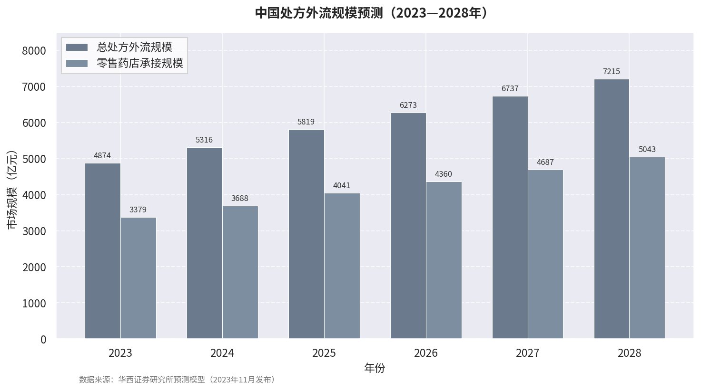

## 9. 未来趋势与政策建议

### 9.1 未来趋势预测

#### 9.1.1 智慧监管：AI监测、云上巡查、电子处方流转平台全国统一

药品零售监管正经历从"人工现场检查"向"数据驱动智慧监管"的范式迁移。国家医保局等四部门要求，自2025年7月1日起，医保定点医药机构销售药品须扫码后方可医保结算；2026年1月1日起，所有医药机构实现药品追溯码全量采集上传。[^nhsa-traceability] 截至2025年3月，国家医保信息平台已累计归集追溯码273.09亿条，接入88.9万家定点医药机构，接入率95.6%。[^nhsa-traceability-data] 追溯码强制应用意味着零售药店每一盒药品从入库到销售均被纳入国家统一数据库，"回流药"串换、空刷套卡等违法行为可通过重复扫码记录被实时锁定。

在智能监管层面，国家医保局2025年11月发布《关于进一步加强超量开药智能监管工作的通知》，部署分三阶段推进：2025年12月底前试点地区覆盖50种药品；2026年6月底前各省扩至100种；2026年12月底前全国各级医保部门实现全覆盖。[^nhsa-smart-reg] 国家医保局基金监管司司长顾荣表示，已研发数十种大数据监管模型，为监督检查提供精准识别能力。[^nhsa-smart-reg]

电子处方流转的技术标准统一已取得里程碑式突破。2025年8月，市场监管总局（国家标准委）发布推荐性国家标准《医疗保障信息平台 便民服务相关技术规范》（GB/T 45938—2025），自2026年1月1日起实施，首次实现医保移动支付、电子处方流转、医保码接入的"三个统一"。[^nhsa-gb-45938] 截至2025年7月，全国接入医保电子处方的机构超过35万家，累计开方6,300余万张。[^nhsa-gb-45938] 电子处方流转的标准化意味着跨省处方互认的技术障碍正在消除，但医保结算接口与药监追溯系统的"两网融合"仍是下一步关键工程。

#### 9.1.2 全国统一大市场：跨省许可、监管互认、处方外流

2022年《中共中央 国务院关于加快建设全国统一大市场的意见》为药品流通行业指明了跨区域整合方向。[^state-council-unified-market] 跨省经营许可破冰已出现标志性案例：2023年10月，天津市武清区市场监管局核发全市首张跨省《药品经营许可证》，允许总部位于河北省廊坊市的九康医药连锁有限公司在天津开办门店，开创了京津冀药品许可监管协作的先例。[^tianjin-cross] 山西省2026年新规进一步允许连锁总部跨省设置配送中心，海南推行批零一体化，同一法人主体可同时取得批发与零售连锁双重许可。[^hainan-chain] 国务院办公厅2025年1月文件明确，按省级炮制规范炮制的中药饮片可按规定跨省销售，按国家药品标准生产的中药配方颗粒可直接跨省销售。[^state-council-quality-dev] 政策信号清晰：省际药品流通壁垒将在2026—2028年持续松动。

处方外流是驱动零售药店承接增量市场的核心变量。截至2023年8月，全国约14.14万家定点零售药店开通门诊统筹服务，累计结算1.74亿人次，结算医保基金69.36亿元。[^nhsa-outpatient] 华西证券预测2028年国内总处方外流规模将超过7,200亿元，其中零售药店作为院外主要承接方，受益规模约5,000亿元。[^huaxi-forecast] 若院外处方药销售占比达到美国水平（约45%），增量空间还将再增3,000—4,000亿元。[^huaxi-forecast]

上图显示，处方外流规模预计由2023年的约4,874亿元增长至2028年的约7,215亿元，年均复合增长率约8.2%；零售药店承接规模预计由3,379亿元增至5,043亿元。这一增长预期的前提是电子处方中心全国联网、门诊统筹药店"应纳尽纳"、医保结算接口统一等政策瓶颈在2026—2027年得到实质性突破。

#### 9.1.3 执业药师制度从"一店一药师"刚性模式向"集团共享+多点执业"弹性模式演进

全国执业药师配置面临"总量不足、区域失衡"的双重挤压。截至2025年7月底，全国注册执业药师约833,291人，其中约91%注册于药品零售企业。[^pharmacist-reg-2025] 但全国药店总数已突破70万家，若按二类药店至少1名、三类药店至少2名执业药师配备，静态硬缺口约55—60万人。[^pharmacist-gap] 地域分布极不均衡：上海每万人口执业药师约8.1人，而贵州仅约1.9人。[^pharmacist-gap] 2025年底差异化配备过渡期结束，多地合规需求集中释放，缺口进一步显性化。

在政策执行层面，"远程审方不得取代驻店药师"的刚性要求与60万+缺口构成持续张力。2026年5月《处方药网络零售合规指南》重申禁止AI替代审方，要求日均审方量控制在300张以内，强化了执业药师的人为责任，但未改变供给端瓶颈。[^nmpa-compliance-guide] 务实的政策演进路径已经出现：陕西省2019年明确鼓励执业药师节假日多点执业，并在实行"七统一"且门店超过30家的连锁企业中，允许执业药师注册在总部、由总部统一调配使用，保证每店不少于1名药师即可。[^shaanxi-multisite] 湖北省2022年印发《执业药师注册管理实施办法》，将远程审方第三方平台纳入执业单位类别，并允许执业药师在同一执业单位省内多个地点备案执业。[^hubei-pharmacist] 这些地方试点实质上已在现行制度框架内创造了"集团共享+多点执业"的弹性空间。

从演进方向判断，国家层面可能在2026—2028年出台执业药师"集团注册+多点执业"的正式制度，以法规形式承认当前的过渡实践。但需警惕的是，弹性模式若缺乏清晰的责任追溯机制，可能诱发新一轮"挂证"回潮——2024年全国执业药师注销注册超3万人，同比增幅超62%。[^pharmacist-fraud] 弹性化与合规性之间的平衡，将是执业药师制度改革的核心难点。

### 9.2 政策建议

#### 9.2.1 国家层面：尽快出台"智慧药房"国家标准和分类规范，弥合地方政策差异；推动电子处方流转与医保结算全国统一接口

当前智慧药房（柜）面临的最大制度不确定性，是地方"概念区分"策略与国家上位法之间的潜在冲突。山西、山东烟台、湖南永州等地通过将"智慧药房"与"自助售药机"严格区分，实现了处方药自动销售的政策突破；北京、陕西等地则固守48号公告底线，仅允许乙类OTC销售。[^dim02] 这种地方分化增加了连锁企业的跨区域合规成本。建议国家药监局尽快出台《智慧药房管理条例》或修订《药品网络销售监督管理办法》，对"智慧药房""自助售药机""远程审方"作出统一定义，明确智慧药房售处方药的前置条件（如必须配备远程执业药师实时视频审核、建立患者用药档案等），消除"一省一策"的制度摩擦。

电子处方流转与医保结算的全国统一接口已具备技术基础。GB/T 45938—2025标准实现了接入层统一，但医院HIS系统、零售药店ERP系统、医保结算系统之间的业务逻辑接口仍由各省分别改造，存在"接口碎片化"问题。[^dim08] 建议国家医保局与国家药监局联合发布电子处方流转业务规范，强制要求所有统筹地区在2026年底前完成电子处方中心与零售药店直连接入，统一电子处方格式、流转协议、身份认证和医保药师审方签名标准。深圳电子处方中心已探索对接互联网医院、医疗机构处方系统、医保信息平台、支付结算机构的"一网通办"模式，可作为技术参考。[^shenzhen-eprescription]

此外，执业药师立法滞后于行业实践。建议加快《药师法》立法进程，明确执业药师在远程审方、多点执业场景中的权利义务与法律责任边界。

#### 9.2.2 省级层面：在提高连锁门槛的同时，建立单体药店转型支持机制，避免农村药品可及性下降

山西省将连锁准入门槛设定为10家门店，并附加许可证有效期届满时门店数量不达标的"硬约束"，这一政策逻辑在提升行业集中度方面具有合理性，但可能加剧乡镇农村市场的药品供应萎缩。[^shanxi-reg] 大型连锁药店倾向于在城区布局，乡镇和农村地区因盈利能力弱、物流成本高而难以吸引投资。参照山东、北京等地经验，建议在提高连锁门槛的同时，为单体药店提供三条转型通道：加盟便利化——对加入连锁体系的单体药店，在许可证变更、GSP现场检查等环节实行"绿色通道"；乙类OTC专营许可——对仅经营乙类OTC的单体药店实行告知承诺制，降低面积和人员门槛，使其转型为社区便利性健康终端；药食同源差异化经营——明确"非临床配方使用"的界定标准，允许偏远地区单体药店在豁免执业中药师的前提下经营定型包装药食同源饮片，释放下沉市场活力。

对农村药品可及性的保护还应纳入配送网络建设。建议省级药监部门联合商务、邮政部门，推动连锁企业或第三方物流企业向乡镇延伸配送节点。山西允许连锁总部委托第三方药品现代物流企业配送，为农村配送社会化提供了制度接口。[^shanxi-reg] 若省级财政对偏远地区配送给予适当补贴，可在不降低连锁门槛的前提下缓解农村"空心化"风险。

#### 9.2.3 企业层面：加快数字化升级和连锁化布局，将远程审方、智慧药房、追溯码系统纳入战略投资优先级

政策组合所形成的"供给侧改革"压力，要求药品零售企业重新定位战略投资优先级。从合规维度看，药品追溯码系统已由2025年的"医保结算前提"升级为2026年的"全量采集义务"，未接入追溯码系统的零售药店将面临医保结算暂停、甚至许可证重新审查发证的合规风险。[^nhsa-traceability] 企业须在2026年上半年前完成ERP系统改造、扫码设备部署、进销存数据与追溯码的绑定上传，此项投入对单体药店而言成本压力较大，但已是生存性投资。

从增长维度看，处方外流的红利窗口预计在2026—2028年达到高峰。头部连锁药店已提前布局DTP药房、慢病管理门店、特慢病医保结算资质。[^dim09] 单体药店和中小连锁若希望分享处方外流增量，必须在执业药师配备、处方审核能力、冷链管理、电子处方对接等方面达到门诊统筹和"双通道"药店的准入标准。建议企业将远程审方中心、智慧药房试点、追溯码系统纳入同一数字化战略框架，三者协同可降低重复建设成本。

从市场结构维度看，行业并购整合高峰已至。2024年全国闭店约3.9万家，2025年预计关店5—10万家，头部连锁逆势扩张。[^market1] 山西省连锁率44.68%远低于全国57.04%的平均水平，办法施行后预计2—3年内将向55%—60%区间跃升。[^dim09] 区域性单体药店主动加入连锁体系或转型为乙类OTC专营便利店，是应对政策收紧的理性选择；对头部连锁而言，跨省配送中心与批零一体化降低了物流重复建设成本，全国性网络扩张的财务可行性显著提升。[^crosswarehouse1]

[^nhsa-traceability]: 国家医保局等四部门《关于加强药品追溯码在医疗保障和工伤保险领域采集应用的通知》. 2025-03-24. https://www.gov.cn/zhengce/202503/content_7015282.htm

[^nhsa-traceability-data]: 国家医保局新闻发布会. 2025-03-31. https://www.nhsa.gov.cn/

[^nhsa-smart-reg]: 国家医保局《关于进一步加强超量开药智能监管工作的通知》. 2025-11-07. https://www.nhsa.gov.cn/

[^nhsa-gb-45938]: 市场监管总局（国家标准委）《医疗保障信息平台 便民服务相关技术规范》（GB/T 45938—2025）. 2025-08. https://www.nhsa.gov.cn/

[^state-council-unified-market]: 《中共中央 国务院关于加快建设全国统一大市场的意见》. 2022-04-10. https://www.gov.cn/zhengce/202204/content_5690073.htm

[^tianjin-cross]: 天津市武清市场监管局核发全市首张跨省《药品经营许可证》. 2023-10-20. https://www.cqn.com.cn/zj/content/2023-10/20/content_8991003.htm

[^hainan-chain]: 海南省《关于规范药品批发零售一体化经营工作的通知》（琼药监规〔2025〕2号）. 2025-03.

[^state-council-quality-dev]: 国务院办公厅《关于全面深化药品医疗器械监管改革促进医药产业高质量发展的意见》. 2025-01-03. https://www.nmpa.gov.cn/xxgk/fgwj/qita/20250103170940152.html

[^nhsa-outpatient]: 国家医保局《关于进一步做好定点零售药店纳入门诊统筹管理的通知》及2023年8月数据发布. 2023-02-15.

[^huaxi-forecast]: 华西证券研究所. 零售药店行业深度报告：处方外流持续推进，零售药店集中度提升. 2023-11.

[^pharmacist-reg-2025]: 国家药监局执业药师资格认证中心. 2025年7月全国执业药师注册情况. 2025-08.

[^pharmacist-gap]: 中国药师协会执业药师配备数据；行业综合分析. 2025.

[^shaanxi-multisite]: 陕西省药监局《关于加强药品零售企业执业药师管理的通知》. 2019-05-24. https://www.medsci.cn/article/show_article.do?id=94e2166968a6

[^hubei-pharmacist]: 湖北省药监局《湖北省执业药师注册管理实施办法》. 2022-01-07. https://cs.cnpharm.com/c/2022-01-14/815548.shtml

[^nmpa-compliance-guide]: 国家药监局《处方药网络零售合规指南》（药监综药管函〔2026〕282号）. 2026-05-25. https://www.nmpa.gov.cn/xxgk/fgwj/gzwj/gzwjyp/20260525142536103.html

[^pharmacist-fraud]: 2025年第二十五届中国药师周产业简报. 2025-12-20. https://www.huiyi-123.com/article/4o8k3g8c-179.html

[^shanxi-reg]: 山西省药品监督管理局、山西省行政审批服务管理局《药品零售经营监督管理办法（试行）》（晋药监规〔2026〕7号）. 2026-02-12. https://m.ciopharma.com/supervise/60951

[^shenzhen-eprescription]: 国家发展改革委、商务部《关于深圳建设中国特色社会主义先行示范区放宽市场准入若干特别措施的意见》. 2022-01-26. https://database.caixin.com/2022-01-26/101835044.html

[^dim02]: 政策研究员_售药渠道创新. 中国各省药品零售渠道创新政策对比研究报告. Dim02. 2026-06-13.

[^dim08]: 政策研究员_智慧药房技术. 智慧药房技术标准、监管实践与行业应用调研报告. Dim08. 2026-06-13.

[^dim09]: 政策研究员_行业影响. 政策对药品零售行业的影响与实施效果研究报告. Dim09. 2026-06-13.

[^market1]: 米内网药品零售终端数据；上市公司公告. 2025-2026.

[^crosswarehouse1]: 山西省药品零售经营监督管理办法第24条；国家药监局48号公告第9条. 2024-2026.
