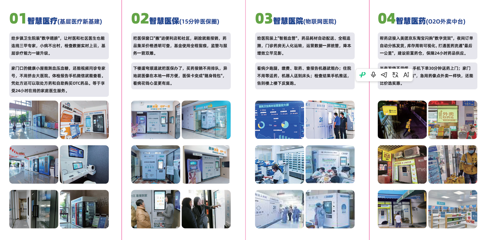

# 第6期 55班 问题私董会v2\.0 广州老朱 副本

# 第6期 55班 问题私董会v2\.0 广州老朱（聚焦版）

> **案主**：老朱（朱林海）
> **日期**：2026年8月6日
> **私董会类型**：问题私董会
> **文档性质**：案主提案（聚焦版）
> **与完整版的区别**：完整版呈现全部诊断分析，请幕僚帮助找真问题；本版聚焦到一个具体执行节点，请幕僚帮助破解瓶颈
> 
> 

---

# 零、热场

1. **破冰签到**：线上私董会，主持人看进场时间给同学名字编号，按编号介绍和发言

|**签到：**<br>线上私董会，主持人看进场时间给同学名字编号，按编号介绍和发言；<br>建议开摄像头才能做幕僚，或这个阶段要求截图拍照；<br>迟到同学，可以给大家说一句夸夸；<br>本场案主：<br>本场主持人：<br>本场AI笔记官：<br><br>**破冰：**<br>让大家从繁忙思绪中，转到当下的会议中，做好注意力准备<br>开摄像头截图留念发群里<br>**话术：**<br>- 最近一周大家的目标达成状况，1\-10分打几分？（全员点名互动）<br>- 每人分享会前调研和会前问题|||
|---|---|---|
|**姓名**|是否会前阅读和调研☑️|会前1小时问题3个|
|**1）刘亚琼**|- 退休返聘超市岗位，更加认真、发挥余热的精神打动我<br>- 8 分；期待老朱老师私董会||
|**2）****王非**|- 企业参访、行业老方法， 3 个人从老东家出来，都单独成立业务，相互内卷起来<br>- 心情好，西安，一连几天阴雨，今天下午终于放晴||
|**3）老朱**|- 供应链复盘、服务好但遇到问题，没有及时反馈和调整，影响下游供应商；细分赛道仍存机会，工业化生产时代过去<br>- 心情复杂、感慨大变革、专注细分垂直赛道，才有机会||
|**4）林标扬**|- 与政府打交道，承诺难兑现<br>- 心情复杂||
|**5）****张溶冰**|- 做了普通胃镜检查，骑行20公里；<br>- 心情还行，虽然有小事延误||
|**6）叶柳清**|- 心情不太好||
|**7）****罗意**|- 上周日直播成交 60w，<br>- 心情开心||
|**8）**|||
|**9）**|||
|10）|||
|1. 请假和迟到<br>人员（迟到10分钟算迟到）<br>2. 没有提前阅读和准备人员|||


2. **保密承诺**：本人对在私董会小组、会议、群聊、作业、飞书文档、录音录像、会议纪要、AI总结、评分反馈及相关沟通中接触到的**非公开信息**，承担保密义务。

“本人对在私董会小组、会议、群聊、作业、飞书文档、录音录像、会议纪要、AI 总结、评分反馈及相关沟通中接触到的**非公开信息，**承担保密义务。”


大家跟主持人一起说：**我承诺保密**


---

# 一、案主背景

⏳主持人计时，留意提醒超时，避免案主讲太多细节，讲不清整体商业生意逻辑

## 希望一堂同学帮帮忙的问题

### ① 案主的问题有？

**问题演变：我以为的问题 → 真问题 → 聚焦节点**

**我以为的问题：**

> "我面临方向选择：**润心堂药食同源电商、设备\+Saas软件销售、药店数字化运营**——该选哪个？"
> 
> 

**经过多轮深度AI对话后发现的真问题：**

> 方向其实早已清晰——药店数字化运营。真正的产品不是硬件和系统，是运营。终局是数字化前置仓\+健康管理服务。飞轮是药店渠道×润心堂高毛利产品。我甚至在对话中做出了12年来第一次明确的聚焦选择："一段时间只做一件事，当下专注药店。"
> 
> 但我卡在一个依赖死结上：需要钱才能开示范店 → 需要解决巨米遗留才能开始融资 → 需要证明模型才能融到钱 → 需要开示范店才能证明模型。
> 
> 这个死结的外在表现是"时机不成熟"，内在本质是"我不敢在不完美的条件下开始"。而我的惯性反应是不断产生新方向来回避真正要做的那件事。
> 
> 

**本次私董会聚焦的节点：**

> **"****如何在不依赖大额融资的前提下，启动药店即时零售的第一家示范店？****"**
> 
> 

方向和真问题我已通过深度对话想清楚了。我不想用私董会的时间重新找方向——**我想用它来破解这个具体的执行瓶颈。**

### ② 案主做过哪些尝试，结果如何？约束是什么？l

|时间|尝试|结果|失败原因/约束|
|---|---|---|---|
|2013\~2015年|凉茶机\+自助奶茶系统|搁置|太早，市场未成熟，现在有人开始做|
|2011\~2013年|四季说（新中式茶饮）|方向转向|比喜茶早5年，趋势对但太早\+完美主义延迟|
|2011\~2025年<br>|物联网\+Saas公司<br>|失败|单元模型不成立→资本驱动扩张→失去决策权→失败；**目前仍在处理历史遗留**|
|2015\~2025年|润心堂工厂|脱管近十年|不愿只做工厂，找职业经理人当甩手掌柜|
|2023\~2025年|药店"店中店"改造|失败|老板认知和运营体系跟不上、时机不成熟|
|2024\~2025年|药店自营数字化项目|中途夭折<br>|有投资人但投了一半出问题→资金链断裂\+执行没到位|
|2026\~至今|软件开发\+硬件供应链管理|**进行中**|带团队加入以前的客户公司|

**当前约束：**

- **资金锁**：历史遗留问题未解决，尚未开始接触投资人

- **平台锁**：A公司提供生存保障，但老板不认同药店即时零售方向（想做诊所/HIS/院外体系）

- **能力锁**：运营能力还在"慢慢摸索"阶段；需要找"对药店和药品非常熟悉的合伙人"

- **性格锁**：完美主义\+取舍困难 → "等完美时机再开始" → 时机永远不会来

### ③ 由于没解决这个问题，导致对业务有哪些影响？

1. **药店项目停留在策划阶段**——没有一家店在运营，没有一份BP在融资，没有一个合伙人在谈

2. **12年重复同一模式**——看到趋势→想清楚→等完美时机→时机错位→寻找下一个趋势

3. **生存与理想持续拉扯**——一直在做买卖生意模式，品牌梦一天天远去，心有不甘

### ④ 案主的目标是什么？短期目标，长期目标？

**短期（0\-6个月）**：启动第一家示范店，验证运营模型能否跑通

**中期（6\-18个月）**：跑通1家→复制到3\-5家→提取运营SOP→带着数据融资

**长期（3\-10年）**：药店渠道网络\+润心堂高毛利产品→数字化前置仓\+健康管理服务→新中式健康生活方式品牌

---

## 案主背景

创业25年，做了三件事：

1. **土木工程包工头**（前十年，赚了第一桶金）

2. **润心堂饮料原料企业**（18年历史，曾3000万/年，2025年全面代工，团队4人，目前搁置）

[第3次正式会议\|5期33组（投屏文档）](https://my.feishu.cn/wiki/UpPWwL2AwiiCtXkcc9ics6QNnMd?from=from_copylink)

3. **SaaS平台\+物联网智能设备企业**（14年历史，智能药柜/智慧药房，资金链问题从80人压缩到5人）

4. 现在带着团队加入过去的客户公司（A公司），帮助他们做诊所的软硬件数字化项目

**资质与专业履历**：

- **企业资质**：曾创办2家省级专精特新企业、2家国家级高新技术企业，累计申请数百项专利

- **研发能力**：从底层硬件到上层平台全栈自研——电子电路板设计、单片机/嵌入式固件开发、软硬件通信协议、硬件管理平台、SaaS运营管理平台、API开放中台、外卖订单管理中台

- **行业系统**：独立开发HIS系统与药店ERP系统

- **系统对接**：对接数百家医院HIS系统、药店ERP系统，接通十余个城市的医保个账和统筹业务

|<br><br>[6289c27f0535d24002210a217f7d6505\.mp4](图片和附件/6289c27f0535d24002210a217f7d6505.mp4)<br><br>[微信视频2026\-08\-03\_233543\_475\.mp4](图片和附件/微信视频2026-08-03_233543_475.mp4)<br>|
|---|

**人生红点**：成就型/作品型，终极目标是打造品牌企业能持续经营100年。


**性格特质（一堂同学曾经帮我做过性格诊断报告）：**

|特质|在本次问题中的表现|
|---|---|
|跳跃性思维|11个方向并存；不断冒新方向回避选择|
|完美主义|"等融到足够的钱再开始"——标准永远在提|
|个人偏好主导|十年不管润心堂；设备销售定位为"生活的苟且"|
|前瞻性预判|三次"趋势对了但时机错了"——实际是不敢在时机成熟时行动|
|取舍困难|哪个都舍不得放；天秤座，选择焦虑症|

**关键创伤：**

1. **巨米历史创伤**：资本驱动扩张→失去决策权→失败。形成了"无利润不扩张"的底层约束，对拿别人的钱有警惕

2. **药店项目创伤**：上次药店项目因投资人出问题\+执行没到位\+资金跟不上而中途夭折。

---

## 项目背景

### 一句话介绍

用**"硬件\+系统\+运营能力"**的解决方案，解决**药店经营方**在数字化时代**"不会运营、无法盈利"**的痛点，场景是**药店即时零售/数字化运营**。

### 目前规模阶段

- **硬件\+系统**：已开发完成，正在销售给若干药店客户/等级医院、医保系统、卫健系统项目一直在做

- **Proof point**：厦门1家客户，5家店全部盈利（但依赖该老板个人的运营能力，不可复制）

- **运营能力**：正在学习中（选品/定价/流量获取在慢慢摸索掌握，促销节奏/库存周转待学习）

- **AI能力**：尚未启动

- **示范店**：0家——药店项目仍停留在策划阶段。2024年做了5家店，后投资人资金断链关停。

### 团队情况

- **当前**：原产品团队5人\+A公司平台（设备销售团队）

- **已知缺口**：需要一个对药店和药品非常熟悉的合伙人

- **合伙人画像**：未明确（待梳理：从哪些渠道找？用什么吸引？给股权还是项目分成？）

---

## 行业信息

### 药店行业转型背景

- **医保控费\+国家严管**：药店生存普遍困难，传统模式很难挣钱

- **O2O即时零售已覆盖1467个区县**，县域夜间订单近100万单——市场已经成熟

- **药店正处于转型的关键节点**：不转型就活不下去，但大多数药店老板不知道怎么转

- **未来方向**：药店作为数字化的前置仓，叠加健康管理服务

### 终局障碍（远期，不影响近期启动）

1. **技术障碍**：机器人方案非常不成熟。药店至少要做到千分之五以下的故障率，但现在机器人基本上都在百分之五以上，远远没达到商用程度。

2. **政策障碍**：涉及卖药，远程审方怎么处理、人员怎么安排，需要政策支持。现在有些地方放开了，有些地方还在遮遮掩掩。

---

## 产品举例

### 用户故事：厦门老板——5家店全部盈利

**背景**：厦门一位年轻药店老板，本身做过电商，有精细化运营和流量的概念。

**使用路径**：

1. 接触到老朱的硬件\+系统解决方案

2. 采购设备\+系统部署到自己的药店

3. **关键**：他用自己的电商运营经验（选品、定价、流量获取、促销节奏、库存周转）来驱动药店经营

4. 结果：5家店全部做到盈利——在药店行业普遍困难的当下，这非常不容易

**成功原因拆解：**

|运营模块|厦门老板的做法|药店场景特点|
|---|---|---|
|选品策略|成熟经验|—|
|定价策略|成熟经验|—|
|流量获取|成熟经验，商圈流量→低成本获客|—|
|库存周转|做得非常好|—|

**核心洞察**：药店运营的关键不是传统的会员/促销体系，而是"精准触达用户\+价格合适时完成销售"——这本质上是**流量驱动和数据驱动**的。

**不可复制性**：做过电商\+有精细化运营概念\+懂药店\+愿意做药店的人太难找。合作门槛极高，推进速度极慢。

**对老朱的启示**：真正的产品不是硬件和系统，是运营。硬件和系统只是基础设施。当运营能力存在时，硬件\+系统就能发挥作用；当运营能力不存在时，硬件\+系统卖出去也没用。

（**这是我们曾经的10个客户当中唯一能够运营好的一个客户**）

**其他9个客户为什么全部失败**：最大的问题不是技术或产品，而是**思维认知和路径依赖**——大部分药店老板的思维停留在传统货架模式，拿到硬件和系统也用不起来。即使少数客户有认知，组织配套跟不上（人员、流程、执行力），也一样出问题。美团当年做类似项目也失败了——不仅是不懂药店运营，更深层的原因是**组织文化**：他们的体量已经太大，所有流程和文化都为大规模运营设计，对于药店这种"苍蝇腿、蚊子肉"的线下小生意，组织文化并不支撑，做不好线下场景。

---

## 生产举例

### 产品/服务的生产流程

```
第一层：硬件（自动化设备）
  → 已有，正在销售
  → 但单纯卖硬件卖不动（药店老板认知跟不上+生存困难不愿买单）

第二层：系统（药店管理系统）
  → 已有，与硬件配套
  → 同样卖不动

第三层：运营（选品/定价/流量/促销节奏/库存周转）
  → 在学习中，厦门老板证明了价值
  → 这是真正创造价值的层，但当前依赖个人能力，不可复制

第四层：AI（运营能力产品化/工具化）
  → 尚未启动
  → 远期目标：让普通药店老板也能用AI工具获得运营能力
  → 但当前普通药店老板年龄偏大，思维停留在"货架电商"阶段，拿到工具也用不会
```

**当前生产方式**：卖硬件\+系统给药店 → 药店自己运营 → 大部分做不好

**目标生产方式**：自己做示范店 → 跑通运营模型 → 提取运营SOP → 复制/工具化

---

## 使命愿景

### 缘起故事

12年前，我创立"四季说"——一个新式茶饮品牌。那时候我就看到了健康生活方式的趋势，想做的是一个能够持续经营的品牌企业，而不是一个单纯的生意。

四季说比喜茶早了5年。趋势看对了，但因为太早\+完美主义延迟，最终失败了。后来做凉茶机，也是太早，搁置了——现在才有人跟。

这些年我一直在"拧巴"中度过：想做品牌，但不愿只做工厂；有**润心堂国家非物质文化遗产**的基因，但脱离了十年没去管它；靠设备销售生存，但定位为"苟且"。

我真正的初心始终没变：**打造新中式健康生活方式品牌，持续经营100年。**

现在我看到了一条路：药店数字化。药店不只是卖药的地方，它可以成为数字化的前置仓，叠加健康管理服务。药店本身缺少高毛利产品，而润心堂的药食同源类健康产品正好可以填补这个空缺。

**药店是渠道，润心堂是产品。先有渠道，再有产品。** 这不是两条平行线，是一个飞轮。

**使命**：让每一家药店都能成为社区健康的数字化前置仓。

**愿景**：打造新中式健康生活方式品牌，持续经营100年。

---

# 二、画布陈述

## 一堂五步法商业画布（聚焦第一家示范店）

### 需求

|维度|内容|
|---|---|
|拆细分用户|药店经营方（老板），尤其是生存困难、传统模式不挣钱的中小学药店；未来可扩展到想进入药店行业的新创业者|
|推场景痛点|①药店老板不会运营→无法盈利 ②懂运营的人太稀缺→不可复制 ③医保控费\+国家严管→传统模式难以为继 ④药店缺少高毛利产品→利润空间被压缩|
|评需求痛点|**刚需**——药店正处于转型关键节点，不转型就活不下去。O2O即时零售已覆盖1467个区县，市场已成熟|
|算天花板|全国七十万家药店，即时零售市场已有百万级夜间订单。药店数字化\+健康管理服务是万亿级市场|

**非用户/客户**：大型连锁药店（有内部数字化团队）；不愿意转型的传统药店老板；年龄偏大、思维停留在"货架电商"阶段的药店经营者

### 解决方案

|维度|内容|
|---|---|
|一句话介绍|用"硬件\+系统\+运营能力"赋能药店，做成新业态药店（低成本选址\+流量运营），让不会运营的药店也能盈利|
|产品形态|硬件设备（自动化设备）\+ 系统（药店管理系统）\+ 运营SOP（选品/定价/流量/促销节奏/库存周转）\+ 未来AI工具|
|产品内核|**运营能力**——这是真正创造价值的部分。硬件和系统只是基础设施。厦门案例证明：有运营能力时模型跑通，没有时卖出去也没用|
|产品效果|厦门案例：5家店全部盈利（但依赖个人运营能力，尚未系统化）|

**非内核**：硬件设备（基础设施，非核心竞争力）；系统功能（基础设施，非核心竞争力）

### 商业模式

|维度|内容|
|---|---|
|当前运营数据|硬件\+系统已销售给若干客户；厦门1家客户5家店全部盈利；无自有示范店|
|单元模型|**待算（请幕僚帮忙拆解）**——启动成本、运营成本、收入结构、回本周期|
|收入/收费方式|当前：设备销售\+系统费用（一锤子买卖）；目标：分成合作模式（设备双方分摊\+系统\+运营赋能\+利润分成）；远期：AI工具/平台订阅|
|成本|**待算**——硬件成本（已有）、系统成本（已有）、运营人力成本（待估）、店铺租金\+选址成本（待估）|
|毛利|**待算**——药店常规药品和医保药品价格低、不赚钱；润心堂药食同源产品开发高毛利品类|

**飞轮模型（药店渠道 × 润心堂产品）：**

```
新业态药店（低成本选址 + 流量运营）
        ↓
  证明模型 → 规模扩张
        ↓
  药店成为渠道 → 植入润心堂高毛利产品
        ↓
  药店利润率提升 → 更多药店愿意加入
        ↓
  渠道规模扩大 → 润心堂品牌借助渠道成长
        ↓
  回到顶部：更多药店，更多产品，更强品牌
```

**关键逻辑**：药店常规药品不赚钱→缺少高毛利产品→润心堂药食同源产品填补空缺→药店利润率提升→更多药店愿意加入→渠道扩大→润心堂品牌成长

**合作模式设想**：投入部分设备\+系统\+运营赋能（设备费用双方分摊——药店老板必须投入设备费用才会上心，否则没做好随时可能要求撤设备，对我方极不利。此客户洞察来自厦门案例），与药店谈好标配一定比例润心堂产品→既提高药店利润率，又拓展润心堂渠道→一个动作把三件事串起来

### 增长

|维度|内容|
|---|---|
|阶段周期|第一阶段（当前）：生存期——A公司维持生存，学习运营能力，解决历史遗留问题；第二阶段：一家店MVP——新业态药店分成合作，验证运营模型；第三阶段：示范店复制——提取SOP，扩展到多家店；第四阶段：规模扩张\+工具化——融资，建团队，AI化|
|渠道|直接合作/分成模式；通过示范店数据吸引更多药店加入；远期通过AI工具/平台规模化|
|指标|单店盈利模型（月营收/月成本/回本周期）；运营SOP可复制性（新店达到盈利的时间）；客户留存率；渠道产品渗透率|
|实验|**一家店分成合作MVP**——出部分硬件\+系统\+运营能力，药店出部分硬件费用\+场\+执照\+库存\+人员，收入分成。理想路径：深度跟访厦门老板提取运营SOP \+ 自己开店验证模型，两者结合。这是闪电模型第1步的"假设试错"|
|团队|当前5人团队\+A公司平台；需要找药店药品领域合伙人；远期需要运营团队\+技术团队|

### 壁垒

|维度|内容|
|---|---|
|竞争方|其他药店数字化服务商、药店SaaS公司、智能设备厂商|
|直接竞品|①其他药店SaaS/硬件供应商——优劣势：他们有产品但缺运营能力 ②药店连锁的内部数字化团队——优劣势：他们有规模但缺灵活性|
|间接竞品|①美团/饿了么等平台的药店O2O——优劣势：有流量、有资金，但不懂药店运营，且组织文化为大规模运营设计，不支撑线下小生意场景 ②传统药店批发商的数字化尝试——优劣势：有供应链但缺技术能力|
|壁垒|①运营能力\+硬件系统整合（不是纯卖设备，是卖运营结果）②润心堂产品渠道独占性（药店一旦标配润心堂产品，形成排他）③先发优势\+示范店数据（厦门案例已验证模型）④运营SOP的系统化/AI化（远期壁垒，一旦运营能力被产品化，护城河极深）|

**非壁垒**：硬件设备（可被复制）；系统功能（可被复制）；单纯的设备销售关系（无粘性）

---

## 一句话复述问题

### ① 案主夜不能寐的问题

> **"我什么都想清楚了——方向、产品本质、运营拆解、飞轮设计、终局愿景。但我没有迈出第一步。我的药店项目还停留在想象阶段：没有一家店在运营，没有一份BP在融资，没有一个合伙人在谈。而我12年来的模式就是：看到趋势→想清楚→等完美时机→时机错位→寻找下一个趋势。"**
> 
> **我需要的不是再找一次方向，而是找到一种在不完美条件下启动第一家店的方式****。**
> 
> 

### ② 案主的目标是什么？要解决什么问题？为什么？

> **在资金有限、合伙人未定、运营能力在学、生存压力未解的条件下，用最小代价验证最大假设：运营能力\+硬件系统能让一家新业态药店盈利。**
> 
> **因为如果我继续等下去，12年的循环会变成13年、14年。市场已经成熟了，客户已经在痛苦中了，厦门案例已经证明了模型可行——唯一不成熟的是我自己。**
> 
> 

---

# 聚焦问题：我希望幕僚帮我破解的1个具体问题

> 以下是我真正需要集体智慧来破解的具体问题。请幕僚围绕这些方向提问和共创。
> 
> 

### 1\. 在当前条件下，启动第一家新业态药店示范店的最优路径是什么？（聚焦）

我已有设备\+系统的完整方案，厦门案例已验证模型可行。但当前面临几个硬约束：**资金有限（启动成本约15万，正在靠设备销售攒钱）、必须找合伙人（需要对方提供法律主体和部分资金）、运营能力还在学习阶段**（厦门案例依赖个人能力，尚不可复制）。

**我已经考虑了4条路径，但每条都有让我犹豫的地方：**

|路径|核心思路|我的顾虑|
|---|---|---|
|**A\. 分成合作改造现有药店**<br>|找一家生存困难的药店，我出部分设备\+系统\+运营，对方出场地\+执照\+库存\+人员，利润分成<br>|之前做过"店中店"改造失败了。**失败的根源不是老板认知问题，而是两种商业模式的本质冲突**：街边药店靠"把人引进来→卖高毛利产品→赚差价"，这是货架卖场思维；而我们的模型是流量运营思维。当顾客进店后，按哪种方式运营？两者是冲突的。改造现有药店，等于在旧模式上嫁接新模式，这个矛盾几乎无法调和。|
|**B\. 自己收店\+找合伙人做法律主体**<br>|药店低迷期2万即可收一家店，找合伙人出法律主体\+部分资金，我出设备\+系统\+运营<br>|**这是目前我最倾向的路径**——新业态药店从零开始，没有旧模式冲突。但核心难题是：合伙人合作结构怎么设计？上一次就是因为资本驱动失去决策权而失败，这次怎么既吸引合伙人又保住运营决策权？|
|**C\. 深度绑定厦门老板，复制其模型**<br>|厦门老板5家店全部盈利，是唯一验证过的成功案例。深度跟访提取运营SOP，同时合作开新店|存在地域差异问题——厦门的政策、市场环境、消费者习惯和其他城市不同，直接搬过来会有问题。两地距离远，深度合作的操作性也有疑虑。|
|**D\. 说服****A公司****（当前合作方）投资一家店验证模式**<br>|A公司是做药品供应链的，我带入已有设备和系统资源，是现成的法律主体，老朱已在合作中建立了信任。说服老板在诊所主线之外，投资一家药店作为模式验证——如果跑通，反哺设备销售|老板明确不认同药店方向（想做诊所/HIS）；我已依赖A公司的合作生存，再加投资依赖会加深权力不对等；上次巨米失败就是因为资本驱动失去决策权——这个路径是否会重蹈覆辙？<br>|

**我真正想请幕僚帮我想清楚的：**

1. 这4条路径中，哪条最现实？**还是有我没想到的第5条路？**

2. 路径A的"商业模式冲突"是结构性的还是可以解决的？**有没有一种分成合作模式能避开"货架思维 vs 流量思维"的冲突？** 如果不能，那新业态药店（自己收店）是否是唯一可行路径？

3. 如果走路径B（自己收店），**合伙人合作结构怎么设计**才能既保护双方利益又让我保持运营决策权？

4. 路径D中，**如何说服一个不认同药店方向的合作方投资一家店？** 什么样的合作结构能避免重蹈"资本驱动失去决策权"的覆辙？

5. 在攒钱等待的这6个月里，**除了攒钱我还能做什么**来降低启动风险、提前铺路？

### ~~2\. 如果找合伙人，什么样的合作结构最合理？~~

~~我需要一位对药店和药品非常熟悉的运营合伙人。但在没有融资的情况下，用什么吸引人才？股权、项目分成、还是其他形式？合伙人画像是什么？从哪些渠道找？~~

**~~请幕僚从各自经验出发，帮我设计合伙结构和画像。~~**

### ~~3\. 新业态药店的运营模型怎么设计，第一家就能跑通？~~

~~厦门老板5家店全部盈利，但依赖个人运营能力，不可复制。如何把运营能力拆解成可复制的SOP？选品、定价、流量、促销节奏、库存周转——哪些先做、哪些后做？第一家店需要验证哪些核心假设？~~

**~~请幕僚帮我设计第一家店的运营模型和验证指标。~~**

---

# 三、集体会诊

## 问诊：幕僚提问

### 第1轮｜幕僚提问项目更多背景（快问快答）

> 目的：挖掘案主没有说清楚或是时间有限没有展示完全的项目背景信息。
> 规则：每位幕僚/独立董事仅限2分钟，至少准备好2个问题，聚焦项目背景（仅限提问，不能给建议，可适当追问）
> 
> 

|幕僚|1句话问题（先说问题，再解释）|案主3\-5句话回应（先说结论，再解释依据细节）|
|---|---|---|
|1）王非<br>|1\.你提供的是产品还是服务。<br>2 哪一个立刻可以落地<br>|提供：产品\+服务<br>物联网设备\+线上流量运营<br>立马落地的最大优势/最小化动作：尝试过店中店不成功、选址/运营逻辑有差异|
|2）刘亚琼<br>|1. 需求剥离：最迫切使用系统\+设备的用户？<br>|夫妻老婆店，大公司决策流程长，10 家店最迫切改变<br>节省人力成<br>O2O一定要做24小时<br>|
|3）罗意<br>|1. 10个客户里9个失败，这9家里有没有技术或产品层面导致失败的还是纯粹是人的问题<br>2. 运营能力具体指的什么能力，运营能力是产品，流量，转化率？|1\.设备买来不会运营，以为像冰箱<br>1号位工程才能推得动，快速决策<br>线上：美团、京东、淘宝<br>2\.选址极为重要，建模型；选品也重要|
|4）张溶冰<br>|1，厦门成功药店是连锁形式的吗？<br>2，这5家大概的运营数据，毛利和净利？<br>3，感觉精细化运营能力是比较关键的影响因素<br>4，购买药品，价格/速度|1，目标是连锁，可以谈判，自建仓储，<br>10家以上才可以是连锁<br>2，5\~10万营业额，根据平均进价倒推毛利2万多，净利1万多<br>实际盈利可能更高<br>执业药师，5000块左右。<br>动态运营，极为敏捷快速|
|5）林标扬|厦门成功模型要继续拆，人的因素有哪些？SOP是什么？关键的成功点在哪里？|人的因素。<br>SOP/关键成功点:科学选址、动态选品、精细运营|
|6）|||
|7）叶柳清<br>|1. 润心堂高毛利产品在整个项目里面起什么作用？<br>2. 能服务到什么程度？|1\.暂时不考虑，未来做，不一定用润心堂。煲汤、花草茶<br>2\.老板的想法无法掌控，能够提供对接、帮助盈利等服务，但需要药店老板采用；老板顾虑：拿的少<br>服务尽可能标准化、|
|8）成龙<br>|1\.对于行业的看法，概念？<br>210个客户合作之前筛选过么？<br>3\.合作人群画像细分有拆解过么？<br>4\.是否增加药食同源这个可以一起执行？<br>5\.提高门店的盈利的点（转化率的点）有哪些？<br>|1\.药店数字化转型升级的生存问题；项目的目的：药店传统货架模式一定会改变，<br>合理的利润比、传统药店更改新的生意模式、新型模式的获利方除药店、消费者之外，医保局欢迎，天然数据留存、医保控费<br>我们最终成为数据公司<br>2，合作人群画像拆解：年龄群四五十岁以上男性，例外96年做电商<br>细拆人物画像四象限：三十五以上有过O2O经验和认知的人群？<br>4，药食同源加入，暂时精力不够不考虑<br>5，门店单元模型能够提高转化率的点：流量、爆款（团队没有人做过药）|

### 第2轮｜幕僚提问案主的目标\&问题情况（快问快答）

> 目的：挖掘问题关键假设，找到"真问题"/卡点。
> 规则：每位幕僚/独立董事仅限2分钟，聚焦案主的问题和目标（仅限提问，不能给建议，可适当追问）
> 
> 


|幕僚|1句话问题|案主3\-5句话回应|
|---|---|---|
|1）刘亚琼|有没有可能抛开药店的路径，承包闲置快递柜、外卖柜，做这种尝试<br>|难度在市场监管，药品严管，<br>需要专业药师，不允许在其他地方销售；<br>还有隐私和其他问题，<br>离店场景突破可能需要政策的松绑、流量不集中（来自医院、药店、品规数不多，导致流量不足）——恒温恒湿、先进先出<br>可以卖乙类OTC，但是没有流量|
|2）王非|1\.你合作的的药店老板他们最关心你产品那个点。<br>2\.你产品和服务怎么赚钱？来源于哪一块业务|1，最关心能否帮他们挣钱。需要同频运营才可以<br>2，节省人工，所在地段需要配什么品，需要懂运营去研究，<br>做卫健医院项目，卖产品挣钱；药店不能靠卖产品给他们，<br>需要卖产品\+服务，打包；自己是24年做，需要懂药品\+资金的人合作|
|3）罗意<br>|1. 启假设15万到位，第一步具体做什么？什么时间做<br>2. 运营能力最重要，为什么不是直接找个懂运营懂药的人合作|1，第一步选址；包括周围人群的调研；<br>2，有很多做药店运营的人，但是不一样，有区别；需要原先做过电商的，又稍微懂一些药的人，对于线下也要有一定的研究<br>3，消费者感觉不出用人还是用柜子；24小时需要加3个人工，柜子就不需要|
|4）张溶冰<br>|合伙人撤资时，运营到什么阶段？如果拿现在的认知和经验，再和以往的合伙人合作，他还会撤资吗？|合伙人自己的资金出问题，不是撤资<br>|
|5）林标扬|赚钱的模式是否一定要开店？有可以输出的产品\+服务，有价值的解决方案吗？ |如果不开店没有样板；有门槛和难度，需要给客户展示产品和服务；也考虑用AI的方式提供动态运维<br>也希望可以找到和自己同频的人|
|6）成龙|1\.药店门店的单元模型有没有细拆<br>2\.目前团队怎么解决流量问题<br>|1，单元模型毛利率35%左右，自己做20%左右（当时主要目的想做10家以上）；颗粒度很细，地域性有限制，80%共性的能力迁移，<br>20%个性化<br>2，深度分析研究，做流量模型；但很难沟通；<br>急懒夜私专；<br>团队对于产品洞察是短板；针对急懒夜私专进行流量探索<br>验证；<br>其他公域能力，在探索当中<br>对标拿过来，直接向内求|
|7）叶柳清|1. 药店的老板是否可以分层？<br>2. 你的数据是否可以指导药店老板？|1，厦门老板想用这套打法进行扩张，不太愿意讲；<br>把经验打包|

## 共创：幕僚共建（加法）

> 1. 幕僚各自整理自己的解题模型（5min）
> 
> - 主持人留意大家注意力状态，也可以让大家休息5分钟/喝水上洗手间/酝酿思考真问题
> 
> 2. 幕僚轮流陈述解题要素或模型（每人1min）
> 
> - 幕僚轮流陈述自己写的要素、方法和模型（解案主这个题，需要全面考虑的要素、方法、模型）
> 
> **引导**：请围绕以下3个具体问题贡献各自的经验和资源：
> 
> 

1. 启动第一家示范店的最优路径与最低成本方案

2. 合伙人合作结构设计与人选画像

3. 第一家店的运营模型与核心验证指标

|幕僚|解案主题需要的要素、方法或模型|幕僚陈述笔记|
|---|---|---|
|1）刘亚琼|1）摸厦门的模型；<br>2）找最佳实践<br>|1，自己干的ROI＞培训；<br>假扮员工拿数据,<br>2，举例洗碗设备，找到餐具不达标的企业合作<br>提供思路|
|2）王非|1\.尽快拿到验证结果，有资源的让赚钱，有地段的上设备，找合伙人直接落地。有了数据，开始继续验证|1，投入人和思路，善于运用资源，赶紧干，拿数据<br>|
|3）林标扬|1. 厦门老板愿意合伙吗？愿意和不愿意的原因分别是什么？<br>||
|4）罗意|1. 调研<br>    1. 厦门店铺拆解方法论、流水、选品、流量单量模型<br>    2. 渠道流量模型<br>    3. 用户需求模型|1，漏斗形状，<br>2，渠道<br>3，需求|
|5）张溶冰|1\.托管方式？<br>2\.设备租赁/分成？||
|6）成龙|1\.美团店铺的方法论（付费/关键词排名）<br>2\.门店单元模型计算成本<br>3\.店铺合作人群筛选<br>4\.合作加盟模式\-总台——拿货钱|2，做减法，提高利润率<br>3，合作人群筛选，用户痛点<br>4, 0基础小白，加盟模式，新传统实体<br>团队：获取流量的能力，选品能力；|
|7）叶柳清|在需求分析的基础上自己买一个店测试|租一个药店，下场拿认知；选址调研；人群、气候|
|8）徐里|不成熟的想法，参考张磊去药店打工一段时间调研（厦门）去看看能拿到knowhow，广州有盈利的药店也纳入调研范围|患者教育，店员做推荐，不太理想；有难度；<br>不同区域有不同热度，调研很重要|

## 反馈：幕僚反馈（收敛）

> 主持：回顾收敛今日的问题和前边诊断过程
> 幕僚：一句话定位"真问题"和"当前"重点出口
> 
> ⚠️先说"1句话问题"，再解释
> 
> 如果我是案主，**我会假设真正的问题是**\_\_\_\_\_\_\_\_，因为\_\_\_\_\_\_\_\_。
> 
> ⚠️先说"如果是我"，再建议
> 如果是我来做，我**当前第一步会**这么思考\_\_\_\_\_\_\_\_\_\_\_\_\_\_，第一步会这么做\_\_\_\_\_\_\_\_\_\_\_\_\_\_\_，这是因为\_\_\_\_\_\_\_\_\_\_\_\_\_\_\_。
> 
> 

|幕僚|幕僚最终反馈|
|---|---|
|1）刘亚琼|四条路径，每条路径再验证，如：分成\-收入模型，适合的药店类型；附加流量模型、人效模型等；|
|2）王非|产品内核，客户愿意购买的最小解决方案，需求人群，根据人群定自己产品方案|
|3）林标扬|改变犹豫不决的习惯，下场拿认知，小步测试，最小解决方案先测试，同意王非|
|4）罗意|先拆三要素，竞对，流量，产品|
|5）张溶冰|**我会假设真正的问题是**\_自己已经发现问题，\_没有快速进行假设验证\_\_\_\_\_\_，\_\_看了很多，也认识到很多，需要拿数据\_\_\_\_\_\_。<br>**当前第一步会**这么思考\_找到关键假设，并快速验证\_\_\_，第一步会这么做\_\_筛选愿意合作的药店老板，拿运营数据\_\_\_\_。|
|6）||
|7）叶柳清|1. 先拆解厦门店能拿到的经验 2\. 回归到充分调研 3\. 给到客户解决其问题的初步方案<br>|
|8）成龙|1\.先拆成功的方法论和元素——验证迭代——<br>2\.拆解行业现况难点——药店目前问题需求——自己能解决什么问题——做减法<br>卖服务还是卖产品<br>3\.业务公式拆解：线上\+线下<br>拆线上获客的单元模型\+线下门店单元模型<br>4\.假设验证——跑demo——试手（找门店合作）<br>5总结方论归纳——方论归纳梳理|
|9）徐里|调研（拿到knowhow）和低成本验证（？）|

---

# 四、总结复盘

> *以下为模板保留内容，私董会现场进行*
> 
> 

## 案主总结承诺

表述参考：

1. 我对于问题的认识变化是\_以为是单元模型问题，其实是解决方案问题；

2. 我印象最深的提问是\_成龙老师\_\_\_\_\_\_\_\_\_\_\_\_\_；

3. 我对今天收获建议，下一步消化后反馈的时间节点是\_\_\_\_\_\_\_\_\_\_\_\_\_\_。

|案主总结|
|---|
|- 以为是商业模式问题，其实是产品内核需要调整——厦门案例无法复制的根因可能是产品内核无法复制；（有厦门全部数据，中台在手）<br>- 印象最深：成龙\+罗意两位老师；\+ 全部老师都有贡献；<br>- 三个月以后拿反馈|

## 幕僚复盘总结

> 选出1名黑脸幕僚，最后发言，其他人需接受负反馈。
> 
> 

表述参考：

1. 本场我给自己的提问打几分？\_\_\_\_\_\_。

2. 本场我印象最深的幕僚或提问是？或我从其他幕僚身上学到的是 \_\_\_\_\_\_。

3. 下场私董会我建议迭代的是 \_\_\_\_\_\_。

|幕僚|复盘总结|
|---|---|
|1）刘亚琼|- 5 分<br>- 柳清老师；<br>- 控场时间：需要缩减至 23:30 内|
|2）王非|6   成龙老师的提问命中核心，直接缩小问题聚焦范围|
|3）林标扬|6， 成龙老师经验丰富，提问到位|
|4）张溶冰|5分，成龙老师和罗意老师、王非老师，叶老师，亚琼老师，|
|5）罗意|5分 ，聚焦问题，聚焦业务小项，|
|6）叶柳清|5分，印象最深的幕僚或提问是林老师和成龙老师，直指问题核心|
|7）||
|8）成龙|5分   印象最深|
|9）徐里|1分 参与度低  成龙老师的提问|

## TOP好问题和幕僚评选

1. AI笔记官复制所有幕僚今日的"提问"

2. 主持Top3优秀提问即幕僚投票


