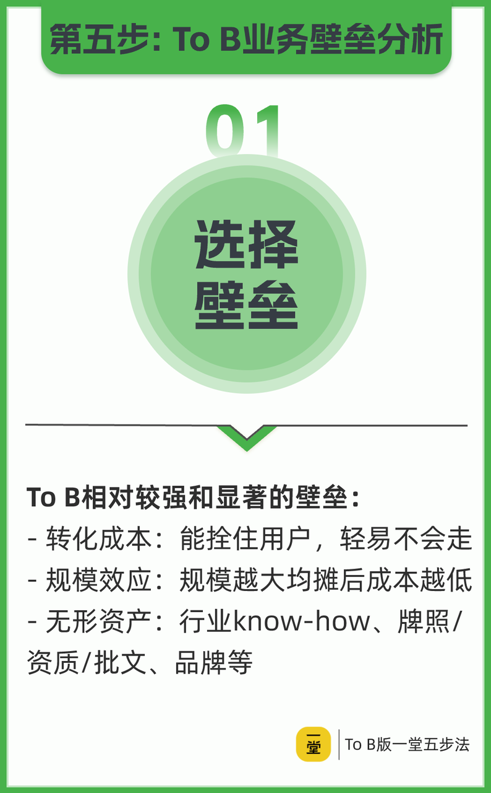
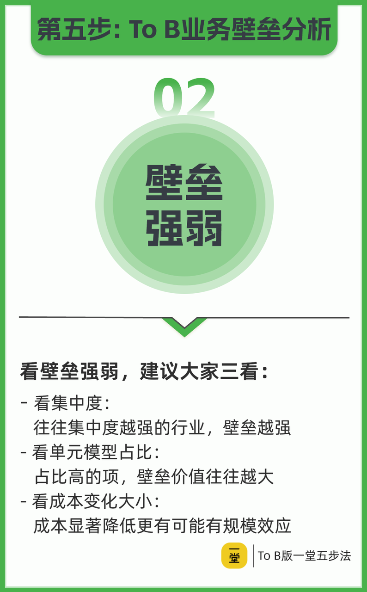
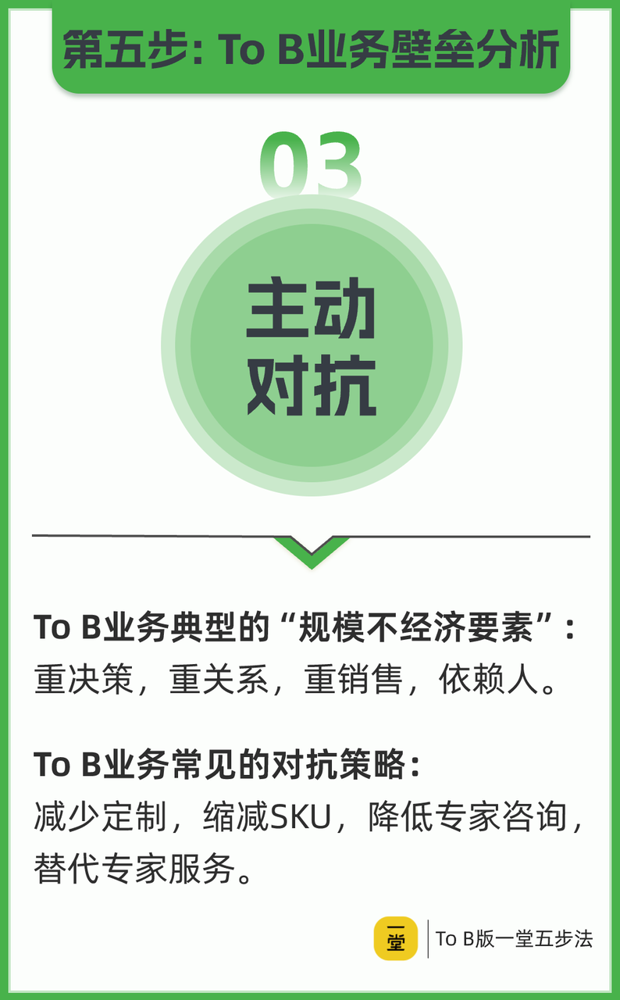

---


id: yt-tob-barriers
title: To B 业务壁垒：选择、强弱判断与规模不经济对抗
type: framework
status: enriched
domain:
  - yitang- yitang
- entrepreneurship
- b2b
- business-strategy
source_refs: []
tags:
- '#method/evaluation-method'
- '#domain/yitang'
- '#domain/b2b'
- '#content-format/framework'
- '#topic/competitive-advantage'
created_at: '2026-06-16'
updated_at: '2026-06-17'
author: 徐剑
reviewed_by: 老顽童
review_date: '2026-06-16'
confidence: 0.82
trust_level: high
related:
  - '[[case-yitang-tob-artificial-bone]]'
  - '[[yt-tob-core-characteristics]]'
  - '[[yt-tob-demand-metrics]]'
  - '[[yt-tob-unit-model]]'
  - '[[yt-tob-customer-sabc]]'
- '[[yt-tob-unit-model]]'
- '[[yt-tob-growth-channel]]'
- '[[yt-tob-customer-sabc]]'
- '[[yt-entrepreneur-five-step-method]]'
- '[[yt-entrepreneur-product-core]]'
- '[[case-yitang-tob-artificial-bone]]'
- '[[case-yitang-tob-smart-park]]'
- '[[case-yitang-tob-career-planning]]'
- '[[yt-barrier-identification-skill]]'
diagnostic_signals:
- signal: 团队讲不清壁垒是什么，只会说“产品好”“技术领先”。
  framework_lens: 壁垒类型选择
  follow_up_question: 客户一旦使用我们的方案，切换出去要付出多少成本？我们有没有规模效应或无形资产在持续加深护城河？
- signal: 行业看起来集中、壁垒强，但自己却赚不到钱，护城河成了别人的。
  framework_lens: 壁垒强弱三维度
  follow_up_question: 这个壁垒在我们的单元模型中占多大比重？成本是否随着规模显著降低？行业集中度是否真正对我们有利？
- signal: 规模化后人效下降、履约成本飙升，越扩张利润越薄。
  framework_lens: 规模不经济对抗
  follow_up_question: 哪些环节是“重决策、重关系、重销售、依赖人”的？我们能否通过减少定制、缩减 SKU、替代专家服务来对抗？

---
> To B 业务常见的三类壁垒：转化成本、规模效应、无形资产；判断强弱看集中度、单元模型占比、成本变化；对抗规模不经济要减少定制、缩减 SKU、替代专家服务。——徐剑《To B 五步法》

---

## 一、三类壁垒选择



| 壁垒类型 | 核心含义 | To B 典型表现 |
|---|---|---|
| **转化成本** | 用户切换供应商需要付出的代价 | 数据迁移、流程再造、人员重新培训、与既有系统集成的沉没成本 |
| **规模效应** | 规模越大，单位成本越低 | 服务器/带宽边际成本下降、采购议价权增强、同一解决方案在同类客户中复制摊薄研发 |
| **无形资产** | 难以短期复制的知识、资质、品牌 | 行业 know-how、专利/软著、牌照/资质/批文、长期服务积累的品牌信任 |

To B 的壁垒往往不是单一要素，而是“关系 + 数据 + 流程 + 资质”的组合。没有转化为客户切换成本或规模效应的技术领先，很容易被模仿或绕过。

---

## 二、壁垒强弱三维度



判断壁垒强弱，建议“三看”：

1. **看集中度**
   - 行业集中度越高，头部玩家的壁垒往往越强。
   - 但对新进入者而言，高集中度行业也可能是“别人的壁垒”——巨头已经占据生态位，新玩家的壁垒价值有限。

2. **看单元模型占比**
   - 壁垒在单元模型中占比越高，壁垒价值越大。
   - 例如：某 SaaS 的“数据迁移成本”若占客户总拥有成本的 30% 以上，就是强壁垒；若只占 3%，则只是辅助优势。

3. **看成本变化大小**
   - 规模扩大后，关键成本是否显著下降。
   - 成本显著下降 → 更可能有规模效应；成本不降反升 → 警惕规模不经济。

---

## 三、对抗规模不经济



To B 业务典型的规模不经济要素：**重决策、重关系、重销售、依赖人**。

这些要素在规模扩大时往往导致：

- 销售人均产出下降
- 履约和交付成本上升
- 定制需求拖垮标准化
- 关键人才流失带走客户

### 四类对抗策略

| 策略 | 做法 | 目的 |
|---|---|---|
| **减少定制** | 用配置化、模块化替代一次性开发 | 降低交付边际成本，缩短交付周期 |
| **缩减 SKU** | 聚焦少数核心产品/服务包 | 减少研发、库存、培训、售后的复杂度 |
| **降低专家咨询** | 把专家经验沉淀为 SOP、模板、工具 | 降低对个别专家的依赖，提升复制效率 |
| **替代专家服务** | 用产品化、自动化、AI 辅助替代部分人工服务 | 把可变成本转化为固定成本摊薄 |

---

## Constraints & Boundaries

### 适用边界

| 边界 | 说明 |
|:-----|:------|
| **壁垒需与商业化阶段匹配** | 早期业务首先要跑通单元模型和获客，不能指望专利/品牌直接带来现金流；成熟期再重点加深护城河。 |
| **必须在单元模型中量化占比** | 脱离单元模型谈壁垒容易空谈。壁垒价值 = 该要素在客户总拥有成本或自身成本结构中的占比 × 不可替代程度。 |
| **需区分“行业有壁垒”与“我有壁垒”** | 高集中度行业里，壁垒可能属于头部玩家；新进入者要评估的是自己能占据的生态位，而不是行业平均。 |
| **对抗规模不经济需组织能力前提** | 减少定制、缩减 SKU 必须配套配置化平台、SOP、培训体系；否则标准化会牺牲服务质量，反而丢客户。 |

### 常见失败模式

| 模式 | 症状 | 修复 |
|:-----|:------|:-----|
| **专利/技术强，但客户切换成本没形成** | 产品技术领先、专利墙厚，上市后销售额远低于目标，客户说“挺好，但我换旧供应商也不难”。 | 把技术优势转化为客户流程、数据、培训上的沉没成本；同步建设渠道和学术/KOL 背书，见 [[case-yitang-tob-artificial-bone]]。 |
| **把行业集中度当成自己的护城河** | 进入 CR4>80% 的赛道，以为“壁垒高”能赚钱，结果发现头部垄断了渠道和客户预算。 | 用单元模型占比重新评估：自己能切到的客户群，该壁垒要素是否真实存在且可占据。 |
| **只看成本下降，忽视收入/利润下降** | 规模扩大后端到端成本降低，但价格战导致毛利率下滑更快，整体利润变薄。 | 用利润口径而非单纯成本口径评估规模效应；同步监控人效、客单价、续约率三指标。 |
| **用高度定制换满意度，陷入规模不经济** | 项目交付客户很满意，但每新增一个客户都要重新开发，利润率随规模下降，关键人一走项目就断。 | 把定制需求抽象为可配置模块；将项目经验沉淀为产品化能力、行业白皮书和运营数据资产，见 [[case-yitang-tob-smart-park]]。 |

---

## 四、案例映射与壁垒强弱检核模板

以下用两个学员真实案例，演示如何把“三类壁垒 + 三维度 + 规模不经济”串成可落地的检核表。

### 4.1 案例对比

| 检核项 | 人工骨医疗器械 [[case-yitang-tob-artificial-bone]] | 智慧园区项目 [[case-yitang-tob-smart-park]] |
|---|---|---|
| **主要壁垒类型** | 无形资产（专利组合强） | 关系 + 项目经验（品牌弱） |
| **切换成本是否形成** | 早期未形成：医生认可但医院采购流程长，旧供应商替换门槛被低估 | 弱：项目制交付，客户下次采购仍可重新招标 |
| **单元模型占比** | 专利保护的是长期竞争地位，不能直接计入首单毛利 | 一次性交付费占主导，后续服务收入未设计 |
| **成本变化趋势** | 研发/注册成本已沉没，规模化后生产成本边际下降，但市场教育成本高 | 高度定制导致交付边际成本居高不下，规模越大越不经济 |
| **规模不经济信号** | 销售团队培养慢，学术推广依赖专家 | 依赖关键项目人员和客户关系，复制性差 |
| **优化方向** | 把专利优势转化为临床数据资产和渠道锁定；分阶段建设转化成本 | 将项目经验产品化，设计年度运营服务费，建立品牌壁垒 |

### 4.2 壁垒强弱快速打分卡（计算模板）

用于内部复盘或投资前自检，5 分制，按业务当前阶段打分。

| 维度 | 权重 | 评分 1–5 | 计分说明 | 示例：人工骨早期 | 示例：智慧园区 |
|---|:---:|:---:|:---|:---:|:---:|
| **转化成本** | 25% | ___ | 客户替换所需时间、资金、组织变动越大，分越高 | 2（医生切换容易，采购流程长但不锁定） | 1（项目结束即可重新招标） |
| **规模效应** | 25% | ___ | 规模扩大后单位成本显著下降，分越高 | 3（生产成本边际下降，但市场教育成本高） | 1（高度定制，边际成本不降反升） |
| **无形资产** | 25% | ___ | 专利、牌照、品牌、数据资产越稀缺且可执行，分越高 | 5（多国发明专利 + 专利墙） | 2（有项目口碑，无系统品牌建设） |
| **集中度匹配度** | 15% | ___ | 行业集中度与自身生态位匹配度越高，分越高 | 3（医疗行业分散，适合专利型差异化） | 2（园区市场分散但关系型获客） |
| **规模不经济风险** | 10% | ___ | 风险越低，分越高 | 3（销售/学术依赖人，但产品可复制） | 1（强定制、重关系、依赖人） |

**计算公式**：

```
壁垒综合得分 = Σ(维度评分 × 权重)
```

- **≥4.0**：壁垒较强，重点应转为深挖和规模化。
- **3.0–4.0**：壁垒有基础，需补齐薄弱维度。
- **<3.0**：壁垒薄弱或虚假，优先跑通单元模型并建设真实切换成本。

> 注意：同一业务在不同阶段得分会变化。人工骨早期可能只有 2.8，但在渠道和临床数据沉淀后可能升至 4.0 以上。

---

## 五、Critique：外部视角攻击

### Buffett 会问

- 这个“护城河”十年后还在吗？专利会到期，技术会被绕过，只有客户真正离不开的切换成本才持久。
- 管理层是不是把“技术领先”错当成了“定价权”？没有定价权的无形资产只是成本，不是利润。
- 规模效应是真的边际成本下降，还是靠压价换量、利润越摊越薄？

### Thiel 会问

- 这是垄断壁垒还是竞争壁垒？转化成本高、网络效应强才算垄断；单纯“比对手好一点”很快会被拉平。
- To B 项目靠关系和定制赢单，本质上是“竞争性投标”而非“垄断性占有”。关系能不能转化为组织化的数据和流程资产？
- 减少定制、缩减 SKU 会不会把业务从“复杂解决方案”降级为“可被大厂碾压的标准品”？

### 反击与修正

这些攻击的共同点在于：**壁垒必须落在客户行为和财务结果上，不能停在概念层**。修正方向是：

1. 把无形资产（专利、资质）与客户流程绑定，形成真实切换成本。
2. 把规模效应从“收入规模”重新定义为“单位经济模型改善”。
3. 把关系型交付升级为可复制的组织能力和数据资产。

---

## 六、Action Triggers

- **Trigger 1：销售人效连续两季度下降 >15%**
  - 立即启动规模不经济审查：拆解“重决策、重关系、重销售、依赖人”四要素，判断是人效问题、定制问题还是渠道模型问题。
  - 输出：一份《规模不经济根因清单》和 30 天内的标准化动作（如 SKU 收敛、SOP 更新、专家经验模板化）。

- **Trigger 2：客户说“你们产品不错，但换掉旧供应商也不难”**
  - 立即启动转化成本设计：量化客户替换所需的时间、资金、组织变动，找出可被放大的沉没成本（数据、流程、培训、集成）。
  - 输出：一份《切换成本增强方案》，明确接下来 90 天要落地的流程绑定或数据沉淀动作。

---

## 七、与其他框架的关系

- [[yt-tob-unit-model]]：壁垒强弱最终要在单元模型中量化，看占比和成本变化。
- [[yt-tob-growth-channel]]：增长策略需要与壁垒建设同步，否则规模扩大只会暴露短板。
- [[yt-entrepreneur-five-step-method]]：壁垒是五步法的最后一步，但应在早期就有意识地识别和构建。
- [[yt-entrepreneur-product-core]]：产品内核的聚焦程度直接影响规模效应和标准化空间。
- [[case-yitang-tob-artificial-bone]]：专利强但转化成本未形成的典型失败案例。
- [[case-yitang-tob-smart-park]]：项目制业务因高度定制陷入规模不经济的典型案例。
- [[yt-barrier-identification-skill]]：用于识别伪壁垒和真壁垒的诊断技能。

---

## 置信度说明

- **高置信度**：三类壁垒（转化成本、规模效应、无形资产）和“三看”强弱判断逻辑在课程图片 OCR 与课堂笔记中一致出现。
- **中置信度**：对抗规模不经济的四条策略为课程提炼，具体落地方式需结合行业和组织能力调整。
- **中置信度**：案例映射来自学员自述作业（`src_20260616_aac184cc`），关键数字需独立核实，但失败模式与框架逻辑高度吻合。
- **未独立核实**：课程中的案例数字和具体行业数据未经验证，引用时定位为“讲师方法论/学员自述”。
