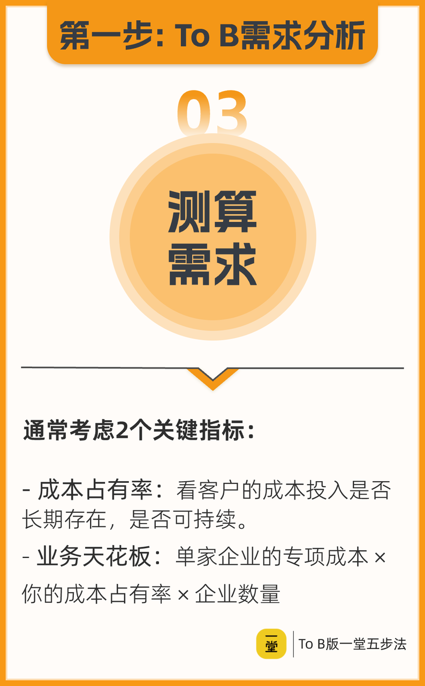

---

id: yt-tob-demand-metrics
title: To B 需求测算双指标：成本占有率 + 业务天花板
type: framework
status: enriched
domain:
  - src_unknown
  - src_unknown
  - src_unknown
  - src_unknown
source_refs: []
tags:
- src_unknown
- src_unknown
- src_unknown
- src_unknown
- src_unknown
- src_unknown
created_at: '2026-06-16'
updated_at: '2026-06-17'
author: 徐剑
reviewed_by: 老顽童
review_date: '2026-06-16'
confidence: 0.78
trust_level: medium-high
related:
  - src_unknown
  - src_unknown
  - src_unknown
  - src_unknown
  - src_unknown
  - src_unknown
  - src_unknown
  - src_unknown
  - src_unknown
  - src_unknown
  - src_unknown
  - src_unknown
  - src_unknown
diagnostic_signals:
- src_unknown
  framework_lens: 成本占有率
  follow_up_question: 该需求对应客户成本结构中的哪一项？历史占比是否稳定、是否可持续？
- src_unknown
  framework_lens: 业务天花板
  follow_up_question: 单家目标客户为此付出的专项成本是多少？我能切到的占有率上限是多少？同类客户又有多少家？
- src_unknown
  framework_lens: To B 收入本质
  follow_up_question: 我们帮客户省下的成本或创造的收入，能否用客户听得懂的数字呈现并传导给决策者？

---
> "我们做 To B 的，你的收入就是你服务对象的成本。" ——徐剑，To B 五步法口述稿 §需求测算（oral ~1366-1577）；课堂笔记 §2 亦将"成本占有率 + 业务天花板"列为需求测算双指标。

该框架用于在 To B 创业早期对需求做**定量验证**：先判断需求是否真实且可持续（成本占有率），再估算业务能做多大（业务天花板）。它强调 To B 的收入本质上是客户的成本，因此应反向拆解客户的单元模型，找到其成本结构中占比高、长期存在且可替代的项目。它与 [[yt-tob-revenue-is-customer-cost]] 互为表里，又与 [[yt-tob-demand-scenarios]] 搭配使用：先定位客户经营重心，再算需求量级。

---

## Constraints & Boundaries

| 边界 | 说明 |
|------|------|
| 适用阶段 | 主要用于需求验证与市场测算阶段，尤其是从 0 到 1 验证真实需求大小时。 |
| 客户对象 | 更适合有可识别成本结构的中小企业或规模以上企业；对极度分散、无账期的微型客户需谨慎使用。 |
| 数字性质 | 案例中的具体数字（如 12 万/人、920 万/家、1 万家企业）来自口述举例，**仅作演示逻辑，未经独立核实**。 |
| 非收入承诺 | 业务天花板是理论上限，不是可到手收入；实际成交还受信任度、决策链、履约能力、竞争格局等影响。 |
| 增收型业务需先还原成本 | 若产品帮客户增收而非降本，须把新增收入对应的新增成本（获客、履约、资金等）拆出来，再评估自己的收入位置。 |

---

## Common Failure Modes

| 模式 | 症状 | 修复 |
|------|------|------|
| 把行业规模当天花板 | 用"医美行业几千亿"论证 SaaS 空间大，但大部分产值与 SaaS 无关。 | 用"单家专项成本 × 占有率 × 客户数"重算，只算与客户成本直接相关的部分。 |
| 追求过高成本占有率 | 想帮客户吃掉全部某类成本，却忽视信任度、私交与切换成本，导致成交困难。 | 先找到高占比且可持续的成本项，再评估自己可合理替代的比例，循序渐进。 |
| 只看省钱、不看可持续 | 找到一次性节省项目就兴奋，但客户明年可能不再需要。 | 优先选择"去年有、今年有、明年大概率还有"的长期成本项。 |
| 价值不可传导 | 只向使用者讲体验，未向决策者呈现降本/增效数字，导致有口碑无订单。 | 面向决策者设计可量化的价值表达，同时兼顾使用者体验。 |
| 变量估计偏差 | 三个变量靠拍脑袋或单一案例推导，天花板算得很好看，实际与真实收入差距巨大。 | 每个变量用 3-5 家真实客户访谈/账单交叉验证；先小范围试点，用真实成交或 POC 数据把偏差控制在 ±20% 以内。 |

---

## 一、成本占有率：判断需求是否真实且可持续

### 1.1 核心定义

**成本占有率** = 你提供的产品/服务所替代或优化的那部分成本，在目标客户**总成本结构**中的占比。

它回答的问题是：客户为这个需求持续花钱吗？花得多吗？这个花钱项是不是长期存在？

### 1.2 操作步骤

1. **拆解客户单元模型**：列出客户经营中的主要成本项（人工、原材料、营销、管理、资金、设备等）。
2. **识别高占比且可持续的成本**：寻找那些占比高、过去数年持续存在、未来大概率仍存在的成本。
3. **判断可替代比例**：评估客户愿意把多大比例的成本交由外部服务商替代，这受信任度、服务质量、合规风险、切换成本等影响。

> 徐剑提示：中小企业的预算往往不规范，因此用"成本占有率"比"预算填充率"更容易落地理解。

### 1.3 增收场景的处理

如果产品帮助客户增收而非直接降本，仍可折算：新增收入会对应新增成本（如获客成本、履约成本），看这部分新增成本中你能占多少。

---

## 二、业务天花板：估算市场规模

### 2.1 核心公式

$$
\text{业务天花板} = \text{单家客户专项成本} \times \text{成本占有率} \times \text{目标客户数量}
$$

其中：
- src_unknown
- src_unknown
- src_unknown

#### 可视化：来自 06 图「测算需求」

> 图源：徐剑 ToB 五步法课程图片 OCR。核心强调：
> - 成本占有率：看客户的成本投入是否长期存在、是否可持续。
> - 业务天花板：单家企业的专项成本 × 你的成本占有率 × 企业数量。

### 2.2 关键区分：收入天花板 vs. 可留存毛利天花板

业务天花板通常要先算**客户为此支付的总金额**（收入天花板），再进一步拆出**自己能留下的服务费/毛利**。后者才是真正的可留存空间。

### 2.3 敏感性分析：三个变量都容易估计偏

$$
\text{业务天花板} = \text{单家客户专项成本} \times \text{成本占有率} \times \text{目标客户数量}
$$

这三个变量在 0→1 阶段都很难精确获取，每个变量都可能出现 ±30%~±50% 的偏差：

| 变量 | 常见偏差来源 | 保守做法 |
|---|---|---|
| 单家客户专项成本 | 客户账面口径不一、隐性成本未计入、案例样本偏差 | 用 3-5 家真实客户的访谈/账单交叉验证，取中位数而非均值 |
| 成本占有率 | 高估客户可替代比例，忽视信任成本、切换成本、合规风险 | 先做小样本试点，用真实成交/POC 数据校准 |
| 目标客户数量 | 把行业企业总数当目标客户数，忽略可触达、可服务、愿付费的筛选 | 用「可触达 × 有能力服务 × 需求匹配」三层漏斗过滤 |

**结论**：业务天花板适合作为"需求量级是否值得投入"的粗略判断，**不适合直接作为财务预测或融资依据**。在正式做商业计划前，应通过小范围验证把三个变量的不确定性降到 ±20% 以内。

#### 2.3.1 施工企业劳务外包的敏感性测算

沿用 §3 案例的基准假设：单家客户年支付 920 万/年（800 万人工成本 + 120 万服务费），目标客户 1 万家。

**收入天花板敏感性（客户总支付口径）**

| 场景 | 单家客户年支付 | 目标客户数 | 收入天花板 | 相对基准 |
|---|---|---|---|---|
| 极悲观（各 -50%） | 460 万/年 | 0.5 万家 | 230 亿/年 | 25% |
| 悲观（各 -30%） | 644 万/年 | 0.7 万家 | 451 亿/年 | 49% |
| 基准 | 920 万/年 | 1 万家 | 920 亿/年 | 100% |
| 乐观（各 +30%） | 1196 万/年 | 1.3 万家 | 1555 亿/年 | 169% |
| 极乐观（各 +50%） | 1380 万/年 | 1.5 万家 | 2070 亿/年 | 225% |

**可留存服务费天花板敏感性**

| 场景 | 单家服务费 | 目标客户数 | 可留存服务费天花板 | 相对基准 |
|---|---|---|---|---|
| 极悲观（各 -50%） | 60 万/年 | 0.5 万家 | 30 亿/年 | 25% |
| 悲观（各 -30%） | 84 万/年 | 0.7 万家 | 59 亿/年 | 49% |
| 基准 | 120 万/年 | 1 万家 | 120 亿/年 | 100% |
| 乐观（各 +30%） | 156 万/年 | 1.3 万家 | 203 亿/年 | 169% |
| 极乐观（各 +50%） | 180 万/年 | 1.5 万家 | 270 亿/年 | 225% |

> 意义：同一个业务，收入天花板与可留存天花板相差近 8 倍；融资或资源决策时要分清口径，否则容易高估真实利润空间。

#### 2.3.2 医美 SaaS 的敏感性测算

课堂中以医美 SaaS 说明"行业大但不相关"，但未给出具体数字。下面用一组**假设性数字**演示三变量如何共同决定天花板；所有数值仅用于理解公式，不代表真实市场。

假设：一家中型医美机构在"客户管理 + 营销运营 + 合规软件"等 SaaS 相关事项上年投入约 **30 万元**；SaaS 方案可替代其中 **20%** 成本；全国可触达且愿付费的目标机构约 **8000 家**。

| 场景 | 单家机构年专项成本 | SaaS 成本占有率 | 目标机构数 | 业务天花板 | 相对基准 |
|---|---|---|---|---|---|
| 极悲观（各 -50%） | 15 万/年 | 10% | 4000 家 | 0.6 亿/年 | 12.5% |
| 悲观（各 -30%） | 21 万/年 | 14% | 5600 家 | 1.65 亿/年 | 34.4% |
| 基准 | 30 万/年 | 20% | 8000 家 | 4.8 亿/年 | 100% |
| 乐观（各 +30%） | 39 万/年 | 26% | 10400 家 | 10.55 亿/年 | 219.8% |
| 极乐观（各 +50%） | 45 万/年 | 30% | 12000 家 | 16.2 亿/年 | 337.5% |

> 启示：若把"医美行业几千亿"直接当天花板，会高估 1-2 个数量级；只有回到"单家专项成本 × 可占有率 × 目标客户数"，才能判断 SaaS 业务的真实量级。

#### 2.3.3 To B 需求测算速算表（模板）

拿到一个 To B 需求时，可用下表快速做第一次量级判断。填表前先阅读 §2.3 的变量偏差来源，避免拍脑袋。

| 步骤 | 需要填写的变量 | 保守值 | 基准值 | 乐观值 | 验证来源 |
|---|---|---|---|---|---|
| 1 | 单家客户专项成本 | | | | 3-5 家客户访谈/账单 |
| 2 | 成本占有率 | | | | 试点成交或 POC 数据 |
| 3 | 目标客户数量 | | | | 可触达 × 可服务 × 需求匹配 |
| 输出 | 业务天花板 | = 保守三项乘积 | = 基准三项乘积 | = 乐观三项乘积 | |

**使用 Checklist**

- src_unknown
- src_unknown
- src_unknown
- src_unknown
- src_unknown

---

## 三、案例演示：国有施工企业劳务外包

### 3.1 背景

口述中徐剑以曾任职的国有施工企业为例（约 2011-2013 年业务扩张期），说明劳务外包的成本占有逻辑。

### 3.2 客户原成本结构

- src_unknown
- src_unknown
- src_unknown

### 3.3 外包替代方案

- src_unknown
- src_unknown
- src_unknown
- src_unknown

### 3.4 天花板测算

假设全国存在类似需求的施工单位约 **1 万家**：

| 口径 | 单家金额 | 客户数量 | 理论天花板 |
|------|---------|---------|-----------|
| 客户总支付（收入天花板） | 920 万/年 | 1 万家 | 约 920 亿/年 |
| 劳务公司可留存服务费 | 120 万/年 | 1 万家 | 约 120 亿/年 |

---

## 四、案例演示：医美 SaaS 的"行业大但不相关"

笔记与口述均提到：某同学想做医美 SaaS，认为医美行业规模很大，因此自己的天花板也很高。

徐剑指出：医美行业的总产值虽然大，但**绝大部分与 SaaS 服务商无关**。真正 relevant 的市场应是：

$$
\text{医美机构在 SaaS 相关事项上的专项成本} \times \text{SaaS 可占有率} \times \text{目标机构数量}
$$

这提醒创始人不能用行业总产值自我说服，必须回到客户成本结构做拆解。具体的敏感性测算见 §2.3.2。

---

## 五、使用建议

1. **先定性、后定量**：先用客户分层、场景识别找到真实需求，再用成本占有率与天花板做量化验证。
2. **优先切"高占比 + 可持续"**：不要只找能省一点钱的项目，要找客户每年都花、且花得不少的成本项。
3. **区分收入天花板与可留存毛利**：To B 业务中，客户支付金额经过渠道、履约、分成后，真正能留下的可能远小于收入天花板。
4. **价值必须可传导**：面向决策者讲清楚"省多少/赚多少"，面向使用者讲清楚"更好用"，否则需求验证无法转化为订单。

---

## 六、与课程其他框架的关系

- src_unknown
- src_unknown
- src_unknown
- src_unknown
- src_unknown
- src_unknown

---

## 置信度说明

- src_unknown
- src_unknown
- src_unknown
- src_unknown
