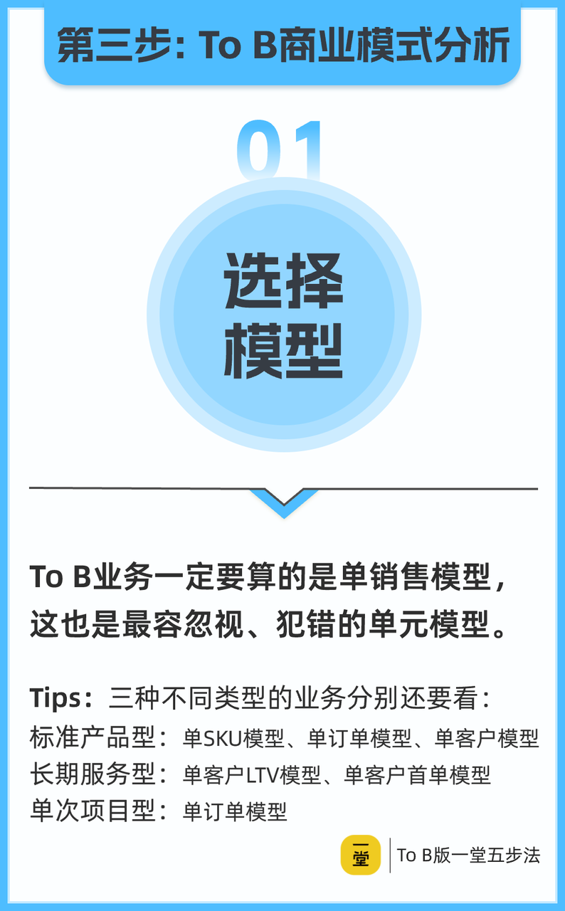

---

id: yt-tob-unit-model
title: To B 单元模型选择与跑通
type: framework
status: enriched
domain:
  - yitang- yitang
  - entrepreneurship
  - b2b
  - business-strategy
source_refs: []
tags:
  - '#method/evaluation-method'
  - '#domain/yitang'
  - '#domain/b2b'
  - '#content-format/framework'
  - '#topic/unit-model'
  - '#topic/business-model'
created_at: '2026-06-16'
updated_at: '2026-06-17'
author: 徐剑
reviewed_by: 老顽童
review_date: '2026-06-16'
confidence: 0.85
trust_level: medium
related:
  - '[[yt-tob-barriers]]'
  - '[[yt-tob-growth-channel]]'
  - '[[yt-tob-core-characteristics]]'
  - '[[yt-tob-sales-unit-model]]'
  - '[[yt-tob-cash-flow]]'
  - '[[yt-entrepreneur-five-step-method]]'
  - '[[yt-entrepreneur-product-core]]'
  - '[[yt-unit-model-three-tools]]'
  - '[[yt-business-formula-business-pattern-selector]]'
  - '[[yt-entrepreneur-key-hypotheses]]'
  - '[[yt-management-business-formula]]'
  - '[[yt-tob-growth-channel]]'
  - '[[yt-tob-customer-sabc]]'
  - '[[yt-tob-revenue-is-customer-cost]]'
diagnostic_signals:
- signal: 公司只算单一订单或单一客户毛利为正，却未分摊总部、研发、履约、销售培养等隐性成本
  framework_lens: 业务单元总毛利覆盖所有成本
  follow_up_question: 若把总部成本、研发摊销、履约尾款、销售培养成本按订单/客户/销售分摊后，整体业务单元是否仍然盈利？
- signal: 规模化后销售、履约成本占比不降反升，或现金流持续紧张
  framework_lens: 五种常用单元模型匹配业务类型 + 现金流口径
  follow_up_question: 当前业务应选用单订单、单 SKU、单客户、单销售、单履约中的哪几种模型？规模化后各成本项与回款周期如何变化？

---
> **核心判断**：To B 业务能不能跑通，不是看单一订单或单一客户是否赚钱，而是看“业务单元的所有毛利能否覆盖所有成本”。
> ——徐剑，口述稿 ~2452–3202；课堂笔记 §4

## 一句话总结

单元模型是 To B 商业模式分析的“辅助但基础”工具。对 To B 业务，应聚焦 **五种常用单元模型**（单订单、单 SKU、单客户、单销售、单履约），根据业务类型（标准产品、长期服务、项目型）选择关键模型，并以 **“业务单元总毛利覆盖所有成本（含隐性成本）”** 作为跑通标准；同时建议用 **现金流口径** 与财务确认口径交叉验证，避免“账面盈利、现金断裂”。

## Constraints & Boundaries

| 边界 | 说明 |
|---|---|
| 单元模型是分析工具，不是决策本身 | 需结合财务模型、行业特性、组织能力、现金流和增长战略综合判断，不能替代商业判断。 |
| 五种常用模型主要对应三类 To B 业务 | 标准产品型、长期服务型、项目型业务的关注模型不同；混合型业务需多模型并用。 |
| 跑通标准强调“业务单元总毛利” | 不能只看单订单/单客户毛利，必须把总部、研发、履约、销售培养等隐性成本纳入。 |
| 本卡素材为单次课程口述稿+课堂笔记 | 案例中的具体数字仅作说明，未独立核实；引用时定位为“讲师观察/案例示意”。 |

## Common Failure Modes

| 模式 | 症状 | 修复 |
|---|---|---|
| 只算单订单/单客户毛利 | 忽视总部、研发、履约、销售培训等隐性成本，规模化后整体亏损。 | 建立业务单元级损益模型，把所有成本按订单、客户、销售或 SKU 分摊。 |
| 模型选择与业务类型错配 | 明明是项目型业务却按产品型算模型，忽略高销售费用和高履约成本。 | 识别业务真实成本结构：履约、销售成本占比高时，按项目型/服务型模型重新测算。 |
| 单销售模型不清就扩张团队或渠道 | 销售人均产出、培养成本、回款周期不明，渠道复制失败。 | 测算单销售的“时间闭环 + 空间闭环”：收入覆盖成本的周期，以及销售成本在目标市场是否有竞争力。 |
| 忽视现金流口径 | 账面盈利但自由现金流为负，账期/垫资导致资金链紧张甚至断裂。 | 同时用财务确认口径和现金流口径测算单元模型，并监控自由现金流。 |
| 项目产品化预期过于乐观 | 默认销售成本、产品成本会自然下降，实际收入下降、迭代成本上升。 | 收入或业务形态发生变化时重新测算，不默认规模经济自动成立。 |

## 一、五种常用单元模型

徐剑在课程中指出，To B 业务有十种单元模型，但其中最常用的有五种：

1. **单订单模型**：以单个订单为最小经济单元，测算该订单的收入、直接成本与毛利。
2. **单 SKU / 单 SU 模型**：以单个产品或产品化服务为单元，关注前期研发投入、标准化成本与规模化后的摊薄。
3. **单客户模型**：以客户全生命周期为单元，关注客户从首次付费到流失期间的全部收入与全部成本。
4. **单销售模型**：以单个销售人员为单元，测算其在固定时间内创造的收入与其自身成本（含培养、管理、支持成本）。
5. **单履约模型**：以一次持续交付/履约周期为单元，测算履约过程中的收入与履约成本。

> 原则：**复制哪个算哪个，哪个最需盯紧哪个。**

### 最容易被忽视的模型：单销售模型

口述稿特别强调，**单销售模型是 To B 业务最容易被忽视的盲区**。很多公司盯着订单或客户，却不清楚“招一个销售到底能带来多少收入、花费多少成本”。

测算单销售模型时要同时考虑两个闭环：

- **时间闭环**：销售提成发放、收入确认、回款周期可能不同步，需要选定一个评估周期。
- **空间闭环**：同样的销售成本，在不同城市/区域的竞争力不同；在一线城市 20 万/年可能招不到人，但在非一线城市 8 万/年已具竞争力。

#### 可视化：来自 10 图「选择模型」

> 图源：徐剑 ToB 五步法课程图片 OCR。核心强调：
> - ToB 业务一定要算的是**单销售模型**，这也是最容易忽视、犯错的单元模型。
> - 标准产品型还要再看：单 SKU 模型、单订单模型、单客户模型。
> - 长期服务型还要再看：单客户 LTV 模型、单客户首单模型。
> - 单次项目型还要再看：单订单模型。

## 二、按业务类型匹配关键模型

| 业务类型 | 关键单元模型 | 核心关注点 |
|---|---|---|
| **标准产品型** | 单 SKU、单订单、单客户 | 若复购高，重点看 **单客户 LTV / CAC**；一次性购买则单 SKU/单订单模型更重要。 |
| **长期服务型** | 首单模型、单客户 LTV 模型 | 首单往往不赚钱，长期续费才是价值来源；续费率和履约成本控制是关键。 |
| **项目型** | 单项目模型 | 单个项目必须盈利，且需分摊间接成本；理想情况下应把项目能力沉淀为可交付/可复制的业务。 |

### 判断业务真实类型的关键：看成本结构

如果一家自称“产品型”的公司，履约成本和销售成本占比很高，那它本质上可能是 **项目型或混合型业务**。例如某智慧工地公司虽然有自研摄像头、雷达、管理平台，但每个工地独立投标、销售费用占比约 35%，客户总部关系维护成本更高——其产品成本在整体成本中占比很低，不能简单视为产品型公司。

## 三、跑通判断：业务单元总毛利覆盖所有成本

### 不要只看单一订单/客户

课程中反复纠正一个常见误区：以为“单个订单赚钱 = 商业模式跑通”。实际上，单一订单或客户赚钱只是前提，商业模式跑通需要满足：

> **该业务单元的所有毛利 ≥ 该业务单元的所有成本。**

### 算大账的示例

假设单个订单：收入 80，销售成本 20，产品成本 15，履约成本 15，毛利 40。

- 10 个订单的业务总毛利 ≈ 400（假设线性、规模经济持平）。
- 如果支撑这 10 个订单的总部成本、管理成本、研发摊销、现金流占用等其他成本 ≤ 400，则业务单元跑通。
- 如果其他成本 > 400，则商业模式尚未跑通。

这里的“其他成本”包括但不限于：

- 总部/管理成本
- 研发投入与摊销
- 履约尾款、售后成本
- 销售培养、渠道支持成本
- 现金流占用成本（账期、垫资）

### 项目产品化为何常“倒在半路”

许多企业预期“项目做多了自然产品化，成本会下降”，但实际情况可能是：

- **收入下降**：客户要求折扣、竞争加剧。
- **销售成本未降**：每个项目独立采购/投标，同一客户的不同项目仍需单独投入销售资源。
- **产品成本反而上升**：自研产品的持续迭代、维护、摊销被低估。

因此，只要收入项或业务形态发生变化，就应重新测算单元模型。

## 四、现金流口径交叉验证

To B 业务周期长、回款慢，容易出现“账面盈利但现金紧张”。徐剑建议：

- 用 **财务确认口径** 看利润；
- 用 **现金流口径** 看健康度；
- 关注 **自由现金流**（经营活动现金流扣除必要资本支出后的剩余）。

> 讲师观察：工程类项目账期较长，常出现“项目越多、垫资越多”的情况；若不考虑现金流，企业可能在规模扩大过程中先被资金链压垮。

具体建议：

- 销售模型优先用现金流口径评估；
- 客户首单模型也多看现金流；
- 客户 LTV 模型可用财务确认口径；
- 在规模化复制前，用两种口径做交叉验证。

## 五、案例示意

> 以下案例中的具体数字（如“两千多万”“二十多万”等）来自课程口述，未独立核实，仅用于说明单元模型失效/生效的逻辑。

### 案例 1：云教室——首个订单可复制性被高估

马同学 2016 年做云教室（学校机房云桌面）。四个月开发后贴牌某知名电脑品牌，通过原有渠道拿下全国第一个订单，随后迅速建立 7 个办事处和子公司、130 人研发团队，烧掉两千多万。

问题核心：

- 不会算账，没有单元模型和“跑通”概念；
- 首个订单的成功依赖不可复制因素：特定社会关系、创始人亲自销售、特殊履约条件；
- 大规模复制前需要储备算力池、存储池等基础设施，成本被低估。

后来经过长期摸索，才找到成熟可复制的模型。该案例说明：**首个订单赚钱不等于模型可复制，必须识别可复制的最小单元。**

### 案例 2：电主轴——隐性成本和动态成本被忽略

某同学公司推出电主轴产品，用于数控机床。为绑定一家生产小排刀车床的客户，投入 5 年陪跑，销量从每年 2 台逐步增长到 150 台。

问题核心：

- 采取低于市场价的销售策略绑定大客户；
- 成本计算中未计入房租、售后服务等隐性成本，销售价格低于真实成本；
- 预期“客户放量后压低供应商成本”，但关键零部件成本未能下降，甚至上涨；
- 客户所在领域竞争加剧，客户要求进一步降价，公司无法承受亏损，最终失去大客户。

到 2023 年，该部门营收仅二十多万，无法覆盖费用，进入清盘。该案例说明：**单客户/单订单模型必须计入全部隐性成本，并动态评估成本和价格变化。**

## 六、使用建议

1. **先选模型**：根据业务是标准产品、长期服务还是项目型，选择 1–2 个核心单元模型重点测算。
2. **算全成本**：把所有直接成本和隐性成本分摊到业务单元，判断总毛利是否覆盖总成本。
3. **双口径验证**：用财务确认口径看利润，用现金流口径看自由现金流健康度。
4. **变化重算**：收入结构、客户结构、成本结构、规模化方式发生变化时，重新测算单元模型。
5. **谨慎复制**：在模型未跑通前，不要盲目扩张销售团队、渠道或地域。

## 置信度说明

- **素材来源**：本卡主要基于徐剑课程口述稿（src_20260616_0e684368）整理，课堂笔记 §4（src_20260616_5f991553）对“五种常用单元模型”和“跑通判断”进行了提炼和强化，两源相互印证。
- **置信度 0.85**：方法论框架（模型选择、跑通标准、现金流口径）逻辑一致、表达清晰；但案例中的具体数字为讲师口述，未独立核实，引用时已明确为“案例示意”。
- **未引用内容**：口述稿中 ~700–703 附近存在“99% profit >50m vs 50% >10m”的数据矛盾，已按质量门要求跳过，不作为事实引用。
- **讲师观察**：文中“To B 每年做到两三倍就是极好”“工程类公司直到倒闭才能慢慢赚钱”等属于讲师经验性、夸张性表达，已标注为“讲师观察”，不作为普适规律。
