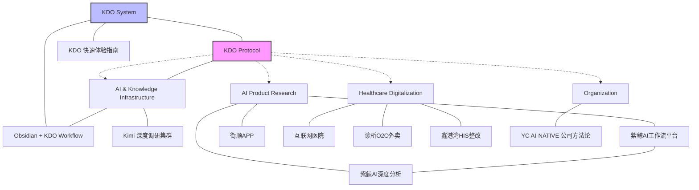

# Wiki Index

_The canonical entrypoint to the compiled knowledge layer._

_Last updated: 2026-05-02_

---

## Active Context

Current operational focus areas:

1. **Multi-device Obsidian sync conflict resolution** — `.gitignore` + protocol hardened
2. **KDO Protocol design** — `90_control/PROTOCOL.md` + `schemas/concept.yaml` drafted
3. **AI-workflow integration** — translating "一堂 course" insights into KDO capabilities

---

## Concept Network

### Hub Nodes (High Connectivity)

These pages are referenced by multiple concepts and serve as structural anchors:

| Hub | Type | Links | Status |
|-----|------|-------|--------|
| [[Obsidian + KDO 内容产出工作流 — 产品设计大纲]] | concept | → KDO, AI workflow, delivery | stable |
| [[紫鲸AI智能体工作流平台]] | entity | → 紫鲸AI分析版, AI agent ecosystem | stable |
| [[KDO Protocol]] | system | → all wiki pages | draft |

### Knowledge Domains

#### AI & Knowledge Infrastructure

The foundational layer — how knowledge is captured, compiled, and delivered.

- [[KDO Protocol]] — *Machine-readable operating contract for AI agents*
- [[Knowledge Delivery OS 快速体验指南 - 飞书云文档]] — *KDO system overview*
- [[Obsidian + KDO 内容产出工作流 — 产品设计大纲]] — *Product design for content pipeline*
- [[Kimi 深度调研集群方法论 (Deep-Research-Swarm)]] — *Research methodology using AI swarms*

#### AI Product Research

Deep-dive investigations into specific AI products and platforms.

- [[紫鲸AI智能体工作流平台]] — *Platform overview*
- [[紫鲸AI_智能体工作流平台_深度分析与产品设计]] — *Deep analysis & design critique*
- [[街顺APP全面调研报告]] — *Local commerce O2O research*

#### Healthcare Digitalization

Industry-specific knowledge on medical/healthcare systems.

- [[互联网医院模式深度调研报告]] — *Internet hospital business model*
- [[诊所O2O外卖平台业务深度调研报告]] — *Clinic O2O + delivery platform*
- [[鑫港湾HIS系统分阶段整改报告]] — *HIS system overhaul plan*

#### Organizational Methodology

Operating systems for human-AI collaboration.

- [[YC 放出一套「AI-NATIVE 公司」组织方法论——直接把公司当操作系统来设计！中层管理变成了 MARKDOWN]] — *Company-as-OS thesis*

---

## Relationship Map



---

## Dynamic Views (Dataview)

> If Dataview plugin is installed, these queries auto-update.

### Recently Updated

```dataview
TABLE type, status, updated_at
FROM "30_wiki/concepts" OR "30_wiki/entities" OR "30_wiki/systems"
SORT updated_at DESC
LIMIT 10
```

### By Status

```dataview
TABLE rows.file.link AS Pages, length(rows) AS Count
FROM "30_wiki"
WHERE status
GROUP BY status
```

### Drafts / Needs Review (Knowledge Gaps)

```dataview
TABLE type, updated_at
FROM "30_wiki"
WHERE status = "draft" OR status = "needs-review"
SORT updated_at DESC
```

### Orphan Pages (No Incoming Links)

```dataview
TABLE type, updated_at
FROM "30_wiki"
WHERE length(file.inlinks) = 0
SORT file.name ASC
```

---

## Statistics

| Metric | Count |
|--------|-------|
| **Total Concepts** | 12 |
| **Stable** | 8 |
| **Draft** | 3 |
| **Needs Review** | 1 |
| **Sources Linked** | 10 |
| **Orphan Pages** | 1 (诊所O2O — missing source_ref) |

---

## Knowledge Gaps

1. **诊所O2O外卖平台业务深度调研报告** — `status: draft`, missing `source_refs`
2. **KDO Protocol** — `status: draft`, needs review after implementation
3. **Graph RAG integration** — no dedicated concept page yet (derived from 一堂 course)
4. **Multi-device sync protocol** — documented in practice, not yet formalized as concept card

---

## Changelog

| Date | Change |
|------|--------|
| 2026-05-02 | Rebuilt as knowledge graph entrypoint with domains, hub nodes, Mermaid map, Dataview queries |
| 2026-05-01 | Initial flat index |
