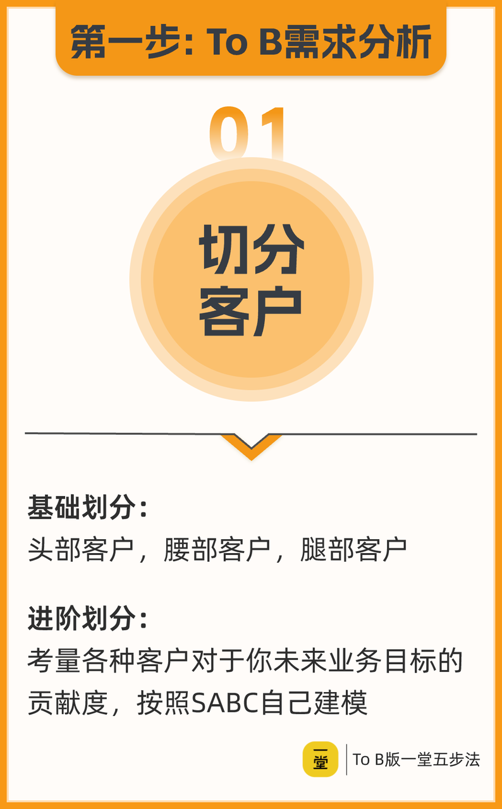

---

id: yt-tob-customer-sabc
title: To B 客户 SABC 自定义切分法
type: tool
status: enriched
domain:
- src_unknown
- src_unknown
- src_unknown
- src_unknown
source_refs:
  - pending_archive:source material not yet ingested
tags:
- src_unknown
- src_unknown
- src_unknown
- src_unknown
- src_unknown
created_at: '2026-06-16'
updated_at: '2026-06-17'
author: 徐剑
reviewed_by: 老顽童
review_date: '2026-06-16'
confidence: 0.78
trust_level: medium
related:
  - [[tool-sabc-tier-modeling]]
  - [[tool-纪浩-Problem与Question区分法]]
  - [[ocr-一堂-单元模型-单客户模型]]
  - [[tool-月白-普通人AI设计80分法则]]
  - [[tool-Truman-数学题与语文题区分法]]
diagnostic_signals:
- framework_lens: 客户分层没有与自身业务目标对齐，导致分层失去决策意义。
  follow_up_question: 如果明天必须砍掉一半客户资源，哪类客户对今年业务目标的贡献度最大？为什么？
- framework_lens: 忽略了行业集中度与自身业务属性的匹配；100 万家里能触达、能服务、愿付费的可能只有几十家。
  follow_up_question: 这 100 万家客户中，符合我当前产品/服务能力且行业集中度允许我切入的有多少？
- framework_lens: 业务目标（利润 vs 规模）与客户类型的匹配出现错配。
  follow_up_question: 我当前阶段到底是先要利润活下来，还是先要规模拿数据？哪类客户能同时满足这两个目标？
- framework_lens: 业务目标变化后，SABC 的权重与切分标准必须重建，不能沿用旧分层。
  follow_up_question: 如果明年目标从"新增 100 家客户"变成"毛利转正"，我的 S 类客户会变成哪一类？哪些旧 S 类需要降级或剥离？

---

# To B 客户 SABC 自定义切分法

> 头部/腰部/腿部只是极简经验模型，真正有效的客户分层必须基于**你自己的业务目标**和**客户所在行业的集中度**来自建 SABC。——徐剑《To B 五步法》

---

## 核心原则

1. **不套用固定标签**：SABC 的 S 到底是头部大客户、腰部行业客户，还是腿部海量小客户，取决于你的业务目标。
2. **业务目标决定客户优先级**：选择哪类客户，要看它们对你阶段性业务目标的贡献度。
3. **行业集中度是约束条件**：想做头部，行业必须足够集中；想做腿部，行业必须足够分散。
4. **同一通用能力可以切出不同策略**：同样的发票 SaaS，可以服务头部定制项目、腰部行业方案、腿部标准化 SaaS。

---

## 自建 SABC 的三步法

### 第一步：明确业务目标

业务目标 = 可服务客户数量 × 客户付费能力（加权）

| 目标导向 | 典型选择 | 原因 |
|---|---|---|
| 利润优先 | 头部客户 | 单客户毛利高，能覆盖高履约成本 |
| 规模优先 | 腿部客户 | 客户数量多，易标准化 |
| 行业打穿 | 腰部客户 | 先占据行业生态位，再向上下游迁移 |

### 第二步：评估客户对目标的贡献度

问自己三个问题：

1. 这类客户今年能贡献多少收入？
2. 获取和服务他们的成本是否可控？
3. 他们是否是我未来壁垒的组成部分？

贡献度最高的，就是你的 S 类。

### 第三步：用行业集中度修正分层

| 行业集中度 | 特征 | 适合策略 |
|---|---|---|
| 高集中度（CR4 接近 99%） | 运营商、航空、能源等 | 头部客户极少但巨大；入局门槛极高，巨头集采压价剧烈 |
| 中集中度 | 连锁品牌、区域龙头 | 腰部客户为主，可行业化复制 |
| 低集中度（百万级客户） | 医疗机构、夫妻店、小微企业 | 腿部客户海量，但履约和获客成本高 |

> 案例：中国医疗机构超过 100 万家，行业集中度极低。但莫非老师做的 ICU 解决方案，因为全国有重症监护病房的医院数量大幅减少，对她而言现阶段就是头部市场。

---

## SABC 的常用维度

| 维度 | S | A | B | C |
|---|---|---|---|---|
| 业务目标贡献度 | 最高 | 高 | 中 | 低 |
| 客户数量 | 极少 | 少 | 多 | 海量 |
| 单客户付费能力 | 最高 | 高 | 中 | 低 |
| 获取/履约成本 | 高 | 中高 | 中 | 需极致标准化 |
| 行业集中度要求 | 高/可进入 | 中 | 低 | 极低 |

---

## 业务目标变化后如何重建 SABC

SABC 不是一次性标签。当业务目标从"规模"转向"利润"、从"行业打穿"转向"多行业复制"时，原来的 S 类客户可能变成 A 甚至 B，必须重新切分并调整资源。

### 示例：发票 SaaS 从规模扩张期进入盈利期

| 阶段 | 业务目标 | S 类 | A 类 | B 类 | C 类 |
|---|---|---|---|---|---|
| 第 1 年：规模优先 | 快速获客、验证 PMF、建立数据壁垒 | 成长期企业（标准化 SaaS，获客成本低、上量快） | 腰部行业客户（行业套件复制） | 集团型客户（标杆案例） | 微型个体户（自然流量） |
| 第 2 年：利润优先 | 毛利转正、提升单客户毛利、减少低质履约 | 集团型客户（定制财税中台，高毛利） | 腰部行业客户（标准化+行业化，毛利可控） | 成长期企业（自助购买，降低服务成本） | 微型个体户（免费/极低服务，或剥离） |

**关键变化**：
1. S 类从"成长期企业"切换为"集团型客户"——因为后者单客户毛利高，能覆盖高履约成本。
2. 原 S 类"成长期企业"降级为 B 类——继续服务，但不再投入重销售资源。
3. C 类"微型个体户"从"流量池"变为"可剥离对象"——如果服务成本高于获客价值，应转为免费自助或停止投入。

### SABC 重建四步 checklist

1. **确认目标变化**：是收入→毛利、规模→利润、行业打穿→多行业复制，还是融资导向→现金流导向？
2. **重排客户贡献度**：用"单客户毛利 × 可服务数量 × 战略价值"重新排序，不要只看收入。
3. **校验行业集中度**：新目标对应的客户类型在行业里是否足够多、是否可触达？（例如利润导向选头部，但行业 CR4 已接近 100% 且巨头集采压价，则可能不成立。）
4. **调整资源配比**：销售、交付、产研、客服按新的 S/A/B/C 重新分配，避免旧 S 类继续占用重资源。

> 一句话：业务目标变了，SABC 必须跟着变；否则分层只是贴在墙上的标签，资源配置会告诉你真相。

---

## 可视化速查：来自 04 图「切分客户」

> 图源：徐剑 ToB 五步法课程图片 OCR。要点：
> - 基础划分：头部客户、腰部客户、腿部客户。
> - 进阶划分：按各类客户对业务目标的贡献度，自建 SABC 模型。

---

## Constraints & Boundaries

| 边界 | 说明 |
|---|---|
| ✅ 有明确业务目标 | SABC 必须在“今年要赚多少 / 要打哪个行业 / 要跑通哪种模式”清楚后再切 |
| ✅ 有行业集中度数据 | 至少能判断客户所在行业是集中还是分散 |
| ✅ 能算清客户贡献度 | 不仅看收入，还要看毛利、履约成本、战略价值 |
| ❌ 无目标就切分 | 会变成“我觉得他是头部”的争论 |
| ❌ 照搬别人分层 | 别人的 S 类可能是你的 C 类 |
| ❌ 只看客户规模 | 大客户不一定是大贡献；小客户可能才是规模化核心 |

---

## Common Failure Modes

| 模式 | 症状 | 修复 |
|---|---|---|
| **套用固定标签** | 团队对“谁是大客户”各执一词 | 回到业务目标，用“贡献度”重新定义 S/A/B/C |
| **忽视行业集中度** | 想做大客户，却发现行业极度分散；想做海量小客户，行业又已被巨头垄断 | 先用 CR4/CR10 判断行业结构，再选择客户类型 |
| **利润与规模错配** | 为了规模选腿部客户，履约成本压垮毛利；为了利润选头部客户，被集采压到亏损 | 明确阶段目标，用“单客户毛利 × 可服务数量”做敏感性测算 |
| **只看收入不看贡献** | 把营收最大的客户当 S 类，实际毛利为负 | 用“毛利贡献 = 收入 - 直接成本 - 分摊成本”重新排序 |
| **分层后没有资源倾斜** | S 类客户得不到更好服务，A/B/C 混同运营 | 分层必须匹配销售、交付、产研资源的差异化配置 |

---

## 使用示例

### 场景：发票 SaaS 的客户分层

| 客户类型 | 产品形态 | 策略 |
|---|---|---|
| S：集团型客户 | 定制财税中台 | 高客单价、重交付、树标杆 |
| A：腰部行业客户 | 行业套件 + 部分定制 | 标准化 + 行业化复制 |
| B：成长期企业 | 标准化 SaaS | 自助购买 + 轻服务 |
| C：微型个体户 | 基础版免费/低价 | 流量池，未来转化 |

同一能力，按客户目标和行业集中度切出四种打法。

---

## 与其他工具的关系

- src_unknown
- src_unknown
- src_unknown
- src_unknown
- src_unknown
- src_unknown
- src_unknown

---

## 置信度说明

- src_unknown
- src_unknown
- src_unknown

## 目的

> 待补充：这个工具解决什么问题？适用于什么场景？

## 操作步骤

1. **步骤一**：待补充
2. **步骤二**：待补充
3. **步骤三**：待补充

## 不要用的场景

> 待补充：什么情况下这个工具效果有限或不应该使用？

## 质疑

> 待补充：这个工具的内在局限是什么？外部反对者会怎么批评？
