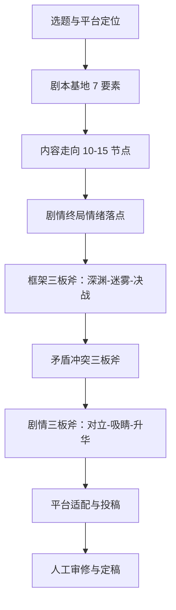

# AI 短剧创作技能包：从 0 到 1 的罗盘 + 三板斧工作法

skill_name: ai-short-drama-creation  
status: stable  
scope: Content Producer / 老顽童  
last_verified: 2026-06-14  
source_wiki:
  - "[[concepts/ai-short-drama-ice-fire-scripting-compass]]"
  - "[[frameworks/ai-short-drama-ice-fire-dissection-compass]]"
  - "[[tools/ai-short-drama-plot-three-axes]]"
  - "[[tools/ai-short-drama-script-planning-three-axes]]"
  - "[[tools/ai-short-drama-framework-three-axes]]"
  - "[[tools/ai-short-drama-conflict-three-axes]]"
  - "[[concepts/ai-short-drama-platform-policy-comparison]]"

---

## 技能定位

本技能包将代俊隆的 AI 短剧创作方法论转化为可直接执行的**提示词模板、检查清单和工作流**，帮助创作者用 AI 辅助完成从选题、策划、结构、冲突到平台适配的全流程。

核心公式：

> **专业编剧思维 + 精准 AI 提示词 + 人工审美把控 = 可投稿的短剧剧本**

---

## 适用场景

- 想用 AI 写一部 24-100 集竖屏短剧，但不知道从何开始
- 已有创意，但剧情平淡、结构松散、冲突单薄
- 需要针对不同平台（抖音/红果/快手/腾讯/爱奇艺/优酷/芒果）调整剧本
- 想拆解爆款短剧，提炼可复用的结构要素

---

## 完整工作流



---

## Step 1：选题与平台定位

### 决策表

| 你的资源/目标 | 推荐平台 | 推荐题材 |
|---|---|---|
| 个人/小团队首试 | 抖音/红果、快手 | 女频甜宠、都市逆袭、男频爽文 |
| 有成熟制作能力 | 腾讯视频、爱奇艺 | 悬疑、古装、高制作成本题材 |
| 能控成本、以小博大 | 优酷 | 女频甜宠 |
| 青春/悬疑、有定制需求 | 芒果 TV | 青春、悬疑 |

### Prompt

```
我计划创作一部[题材]短剧，目标平台是[平台]。
请基于「主流短剧平台政策对比」框架，回答：
1. 该平台的核心用户画像和题材偏好是什么？
2. 该平台推荐的集数、时长、钩子密度大概是多少？
3. 该平台的分成模式和投稿入口是什么？
4. 我的题材在该平台是否有风险或需要规避的审核点？
```

---

## Step 2：剧本基地 7 要素

### 检查清单

- [ ] 题材：具体类型 + 细分标签（如都市逆袭、女频甜宠、古风重生）
- [ ] 主角：身份、核心欲望、初始劣势
- [ ] 核心欲望：主角最想得到什么
- [ ] 核心阻碍：谁/什么在阻止主角
- [ ] 故事场景：主要发生在哪里
- [ ] 情绪价值：观众看完会获得什么
- [ ] 目标平台：抖音/红果/快手/腾讯/爱奇艺/优酷/芒果

### Prompt

```
请为一部[题材]短剧建立「剧本基地」，输出以下 7 个要素：
1. 题材：
2. 主角（身份、核心欲望、初始劣势）：
3. 核心欲望：
4. 核心阻碍：
5. 故事场景：
6. 情绪价值：
7. 目标平台：

要求：每个要素 1-2 句话，核心欲望与核心阻碍必须形成不可调和的对立。
```

---

## Step 3：内容走向 10-15 节点

### Prompt

```
基于以下剧本基地：
[粘贴剧本基地]

请生成 12 个关键剧情节点，按「起→承→转→合」分布：
1. 起（节点 1-3）：建立欲望与阻碍
2. 承（节点 4-7）：障碍升级，关系深化
3. 转（节点 8-10）：重大反转，主角被迫改变
4. 合（节点 11-12）：决战铺垫与结局收束

每个节点输出：节点编号、一句话剧情、功能（铺垫/冲突/反转/卡点/情绪峰值）。
```

---

## Step 4：剧情终局情绪落点

### Prompt

```
基于以上内容走向：
[粘贴内容走向]

请设计 3 种结局方案：
1. HE（圆满结局）：情绪落点是什么？价值主张是什么？
2. BE（悲剧结局）：情绪落点是什么？有什么遗憾或警示？
3. 开放式结局：留下什么悬念？适合续集吗？

最后推荐 1 种最适合目标平台的方案，并说明理由。
```

---

## Step 5：框架三板斧

### Prompt

```
基于以下剧本基地和内容走向：
[粘贴]

请用「框架三板斧」设计全剧结构：
1. 深渊入局（1-3 集）：触发事件、初始劣势、不可退的理由
2. 迷雾博弈（4-19 集）：4 个递进障碍，每个障碍的难度升级点
3. 决战收官（20-24 集）：最终 BOSS、关键选择、情绪落点

输出：分集标题 + 一句话剧情 + 每集钩子
```

---

## Step 6：矛盾冲突三板斧

### Prompt

```
请为以下短剧设计三层冲突：
[粘贴剧本基地和框架]

1. 外在阵营：列出主角、反派、第三方阵营，说明各自核心利益和不可调和点
2. 内在人际：列出主角与 3 个关键人物的情感债务，设计 1 处关系反转
3. 自我宿命：写出主角的内心缺口和最终必须做出的身份选择

输出：三层冲突清单 + 每层对应的 1 个高潮场景
```

---

## Step 7：剧情三板斧

### Prompt

```
请基于「剧情三板斧」检查以下短剧大纲：
[粘贴大纲]

1. 极致对立：主角与对手是否有身份/立场/价值观的根本对立？
2. 高能吸睛：第一集前 10 秒是否出现危机、悬念或强情绪？
3. 立意升华：结局是否传递了让观众共鸣的价值主张？

输出：问题清单 + 优化建议
```

---

## Step 8：单集剧本生成

### Prompt

```
基于以下剧本基地：
[粘贴剧本基地]

请生成第[集数]集剧本：
- 本集目标：
- 开场钩子（3 秒内抓住观众）：
- 核心冲突：
- 结尾卡点：
- 台词风格：
- 预计时长：1-2 分钟

要求：台词口语化、画面化、有张力，符合短剧竖屏观看习惯。
```

---

## Step 9：平台适配改写

### Prompt

```
以下是一份短剧策划：
[粘贴策划]

请针对[抖音/红果/快手/腾讯视频/爱奇艺/优酷/芒果TV]进行改写：
1. 调整题材侧重点以匹配平台用户偏好
2. 优化开头钩子以匹配平台观看习惯
3. 调整集数/时长/节奏
4. 给出投稿路径和分成策略建议
```

---

## 拆本学习工作流

### Prompt

```
请用「冰火拆本罗盘」拆解以下爆款短剧：
[粘贴短剧链接/剧本/剧情简介]

从五个维度分析：
1. 文本语言：旁白、字幕、台词是否画面化、口语化、有张力？
2. 核心角色：人设、动机、关系、情绪闭环、角色高光
3. 主题事件：主线、支线、冲突设计、节奏节点
4. 高潮反转：情绪拉升、打破预判、反转铺垫、多层高潮
5. 钩子密度：开篇钩子、中段钩子、片尾留存钩子的类型和频率

输出：拆本报告 + 可复用于同类题材创作的 3 个要点
```

---

## 常用检查清单

### 剧本基地检查

- [ ] 题材是否具体而非空泛？
- [ ] 主角是否有明确的初始劣势？
- [ ] 核心欲望与核心阻碍是否不可调和？
- [ ] 情绪价值是否能在 1 句话内说清？
- [ ] 目标平台是否与题材匹配？

### 剧情张力检查

- [ ] 是否有极致对立（身份/立场/价值观）？
- [ ] 前 3 秒是否有危机/悬念/强情绪？
- [ ] 结局是否有立意升华而非说教？

### 平台适配检查

- [ ] 目标平台是否接受该题材？
- [ ] 开头钩子是否符合该平台用户习惯？
- [ ] 集数/时长是否符合平台规格？
- [ ] 是否预留了广告分账所需的钩子密度？

---

## 常见错误与规避

| 错误 | 后果 | 规避方法 |
|---|---|---|
| 一次性把全部要求丢给 AI | 输出混乱、跑偏 | 按工作流分阶段投喂 |
| 只有外在阵营冲突 | 人物单薄、看完即忘 | 叠加内在人际和自我宿命 |
| 为了高能而制造虚假冲突 | 观众流失、口碑崩塌 | 冲突必须服务人物欲望和主题 |
| 一稿多投所有平台 | 平台匹配度低、转化差 | 每平台一版独立策划 |
| 忽略平台审核规则 | 无法过审或下架 | 投稿前查官方最新公告 |

---

## 下一步行动

1. 选择目标平台，确认题材偏好。
2. 用「剧本基地 Prompt」生成第一部短剧的基础设定。
3. 用「内容走向 Prompt」锁定 12 个关键节点。
4. 用「框架三板斧 Prompt」搭建 24 集结构。
5. 用「矛盾冲突三板斧 Prompt」设计立体冲突。
6. 用「剧情三板斧 Prompt」检查张力。
7. 分集生成剧本，人工审修后投稿。

---

## 参考链接

- [[concepts/ai-short-drama-ice-fire-scripting-compass]]
- [[frameworks/ai-short-drama-ice-fire-dissection-compass]]
- [[tools/ai-short-drama-plot-three-axes]]
- [[tools/ai-short-drama-script-planning-three-axes]]
- [[tools/ai-short-drama-framework-three-axes]]
- [[tools/ai-short-drama-conflict-three-axes]]
- [[concepts/ai-short-drama-platform-policy-comparison]]
