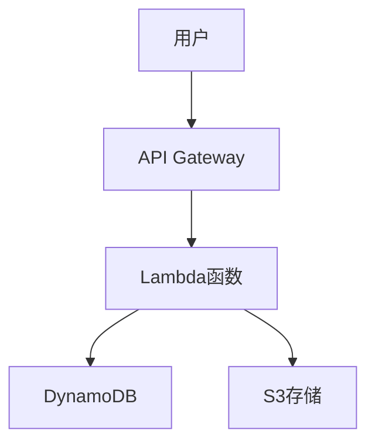

# Draw.io MCP — AI 图表生成

> "画架构图最烦的不是画，是画完又要改。Draw.io MCP 一句话出图，要改也是说话改——这叫打狗棒法，轻巧得很。" — 洪七公

## 定位

北丐图表武器的**专业升级**，比 excalidraw 更正式，比 architecture-diagram 更灵活：

| 维度 | excalidraw（旧） | architecture-diagram（旧） | Draw.io MCP（新） |
|:--|:--|:--|:--|
| 风格 | 手绘 | 暗黑SVG | 专业办公 |
| 编辑 | JSON手动 | 代码生成 | **自然语言+手动** |
| 输入 | Excalidraw JSON | SVG模板 | 文本/Mermaid/CSV/XML |
| 输出 | PNG/SVG | SVG | **PNG/SVG/PDF + 可编辑** |
| 复用 | 低 | 低 | 高（模板+AI修改） |
| 部署 | 本地 | 本地 | **云端托管/本地CLI** |

## 技术规格

| 维度 | 数值 |
|:--|:--|
| 开发者 | JGraph（draw.io / diagrams.net 官方） |
| 协议 | MCP（Model Context Protocol） |
| 托管端点 | `https://mcp.draw.io/mcp`（免费） |
| 本地CLI | `npx @drawio/mcp` |
| 输入格式 | 自然语言/Mermaid.js/CSV/XML |
| 输出格式 | 直接在 draw.io 编辑器打开 + PNG/SVG/PDF |
| 图表类型 | 架构图/流程图/UML/ER图/网络拓扑/组织架构 |
| 许可证 | 开源 |

## 安装

### 方式一：托管端点（推荐，零安装）

在 Hermes MCP 配置中添加：

```yaml
# ~/.hermes/profiles/beikai/config.yaml
mcp_servers:
  drawio:
    url: "https://mcp.draw.io/mcp"
    transport: "streamable-http"
```

### 方式二：本地 CLI

```bash
npx @drawio/mcp
# 或全局安装
npm install -g @drawio/mcp
drawio-mcp
```

## 使用方式

### 基础：自然语言生成图表

```
# 直接对话即可
"画一个 AWS 三层 Web 应用架构图，包含 ALB、ECS、RDS、ElastiCache"

# MCP 工具会自动调用 draw.io 工具
# 生成可在编辑器中打开的 .drawio 文件
```

### 用 Mermaid 描述生成

````
"用 Mermaid 描述这个流程，生成图表：

生成 draw.io 可编辑版本"
````

### 用 CSV 数据生成

```
"根据这个 CSV 生成组织架构图：
CEO,CTO,CFO
CTO,前端团队,后端团队,DevOps
CFO,财务部,HR
生成 draw.io 图表"
```

### 批量：从代码库生成文档图

```
"扫描项目目录结构，生成系统模块依赖图"
"把刚才的架构图导出为 SVG，放到 docs/ 目录"
```

## 与现有技能对比与配合

```
文章/文档
│
├── 需要手绘风格草图 → excalidraw（轻量、快速）
├── 需要暗黑风格SVG → architecture-diagram（程序化生成）
├── 需要专业可编辑图表 → ⭐ Draw.io MCP（自然语言+editor）
└── 需要信息图 → baoyu-infographic（数据可视化）
```

## 集成到北丐流水线

### 技术文档自动配图

```python
"""从 Markdown 文档自动生成架构图配图"""
import re

def extract_architecture_sections(md_content: str) -> list[dict]:
    """提取文档中的架构描述段落"""
    sections = []
    # 匹配 "架构" 关键词所在段落
    for m in re.finditer(r'#{2,4}\s*.*架构.*', md_content):
        # 取标题后 500 字作为上下文
        start = m.end()
        context = md_content[start:start+500]
        sections.append({"title": m.group(0), "context": context})
    return sections

# 使用示例
# 对每个架构段落 → Draw.io MCP 生成图表 → 插入回文档
```

### KDO 知识卡片配图

```
KDO 卡片内容
│
├── 文本部分 → Markdown
├── 架构概念 → ⭐ Draw.io MCP 生成架构图
├── 数据关系 → Mermaid.js → Draw.io MCP 渲染
└── 流程说明 → Draw.io MCP 生成流程图
```

## 支持的图表类型

| 图表类型 | 输入方式 | 示例 |
|:--|:--|:--|
| 云架构图 | 自然语言 | "AWS 微服务架构" |
| 流程图 | Mermaid/自然语言 | "用户登录流程" |
| UML 类图 | Mermaid classDiagram | "订单系统类图" |
| ER 图 | Mermaid erDiagram | "电商数据库关系" |
| 网络拓扑 | 自然语言 | "公司三层网络架构" |
| 组织架构图 | CSV | "部门人员结构" |
| 时序图 | Mermaid sequenceDiagram | "支付调用链" |
| 状态机图 | Mermaid stateDiagram | "订单状态流转" |

## 常见坑点

### Pitfall 1: MCP 连接失败
```bash
# 检查 MCP 端点可达
curl https://mcp.draw.io/mcp
# 如不可达，改用本地 CLI
npx @drawio/mcp
```

### Pitfall 2: 生成图表布局不佳
Draw.io MCP 生成的图表可能布局不理想。使用方式：
```
"先按这个描述生成图表，然后用更好的布局算法重新排列"
```

### Pitfall 3: 导出的 PNG 分辨率低
导出时显式指定参数：
```
"导出为 4K PNG，适合印刷"
```

### Pitfall 4: Mermaid 语法错误
先用 Mermaid Live Editor 验证语法，再传给 Draw.io MCP。

## 验证清单

- [ ] MCP 端点可连接
- [ ] 一句话"画个三层架构图"能生成
- [ ] 生成的图表可在 draw.io 编辑器中打开
- [ ] 支持导出 PNG/SVG/PDF
- [ ] Mermaid.js 输入能正确转换

## 参考资料

- GitHub: https://github.com/jgraph/drawio-mcp
- npm: https://www.npmjs.com/package/@drawio/mcp
- 文档: https://www.drawio.com/doc/faq/ai-drawio-generation
- MCP 市场: https://a2a-mcp.org/entry/drawio-mcp
